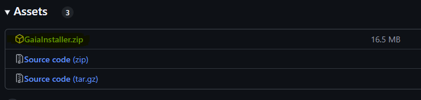
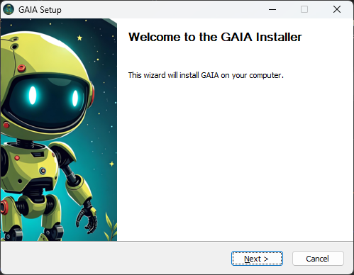

#### Copyright(C) 2024 Advanced Micro Devices, Inc. All rights reserved.
#### SPDX-License-Identifier: MIT

# GAIA: The GenAI Sandbox

Welcome to the GAIA (Generative AI Is Awesome!) project! This repository serves as a repository of AI PC demos. Primarily, it consists of local LLM chatbot and agent demos running on the RyzenAI platform. For more information on GAIA, see the [Frequently Asked Questions](docs/faq.md).

Currently, the following are supported:

| Use-Case Example   | Function                                 |
| ------------------ | ---------------------------------------- |
| No Agent           | Test LLM using completion                |
|   Chaty            | Vanilla LLM chatbot with message history |
|   Joker            | Simple RAG joke generator                |
|   Clip             | YouTube search and Q&A agent             |

LLMs supported:

| LLM                    | Checkpoint                                                            | Device   | Backend            | Data Type | GAIA Installer                              |
| -----------------------|-----------------------------------------------------------------------|----------|--------------------|-----------|---------------------------------------------|
| Phi-3.5 Mini Instruct  | amd/Phi-3.5-mini-instruct-awq-g128-int4-asym-fp16-onnx-hybrid         | Hybrid   | oga                | int4      | GAIA_Hybrid_Installer.exe                   |
| Phi-3 Mini Instruct    | amd/Phi-3-mini-4k-instruct-awq-g128-int4-asym-fp16-onnx-hybrid        | Hybrid   | oga                | int4      | GAIA_Hybrid_Installer.exe                   |
| Llama-2 7B Chat        | amd/Llama-2-7b-chat-hf-awq-g128-int4-asym-fp16-onnx-hybrid            | Hybrid   | oga                | int4      | GAIA_Hybrid_Installer.exe                   |
| Llama-3.2 1B Instruct  | amd/Llama-3.2-1B-Instruct-awq-g128-int4-asym-fp16-onnx-hybrid         | Hybrid   | oga                | int4      | GAIA_Hybrid_Installer.exe                   |
| Llama-3.2 3B Instruct  | amd/Llama-3.2-3B-Instruct-awq-g128-int4-asym-fp16-onnx-hybrid         | Hybrid   | oga                | int4      | GAIA_Hybrid_Installer.exe                   |
| Qwen 1.5 7B Chat       | amd/Qwen1.5-7B-Chat-awq-g128-int4-asym-fp16-onnx-hybrid               | Hybrid   | oga                | int4      | GAIA_Hybrid_Installer.exe                   |
| Mistral 7B Instruct    | amd/Mistral-7B-Instruct-v0.3-awq-g128-int4-asym-fp16-onnx-hybrid      | Hybrid   | oga                | int4      | GAIA_Hybrid_Installer.exe                   |
| Phi 3.5 Mini instruct  | amd/Phi-3.5-mini-instruct-awq-g128-int4-asym-fp32-onnx-ryzen-strix    | NPU      | oga                | int4      | GAIA_NPU_Installer.exe / GAIA_Installer.exe |
| Phi-3 Mini Instruct    | amd/Phi-3-mini-4k-instruct-awq-g128-int4-asym-fp32-onnx-ryzen-strix   | NPU      | oga                | int4      | GAIA_NPU_Installer.exe / GAIA_Installer.exe |
| Llama-2 7B Chat        | amd/Llama2-7b-chat-awq-g128-int4-asym-fp32-onnx-ryzen-strix           | NPU      | oga                | int4      | GAIA_NPU_Installer.exe / GAIA_Installer.exe |
| Mistral 7B Instruct    | amd/Mistral-7B-Instruct-v0.3-awq-g128-int4-asym-fp32-onnx-ryzen-strix | NPU      | oga                | int4      | GAIA_NPU_Installer.exe / GAIA_Installer.exe |
| Qwen-1.5 7B Chat       | amd/Qwen1.5-7B-Chat-awq-g128-int4-asym-fp32-onnx-ryzen-strix          | NPU      | oga                | int4      | GAIA_NPU_Installer.exe / GAIA_Installer.exe |
| Llama 3.2 1B           | llama3.2:1b                                                           | CPU/GPU  | ollama (llama.cpp) | Q8_0      | GAIA_Installer.exe                          |
| Llama 3.2 3B           | llama3.2:3b                                                           | CPU/GPU  | ollama (llama.cpp) | Q4_K_M    | GAIA_Installer.exe                          |
| Llama 3.1 8B           | llama3.2:8b                                                           | CPU/GPU  | ollama (llama.cpp) | Q4_0      | GAIA_Installer.exe                          |

* Hybrid - NPU+iGPU
* NPU - Neural Processing Unit
* oga - Onnx GenAI runtime

## Contents:
1. [Prerequisites](#prerequisites)
1. [Getting Started](#getting-started)
1. [Running the GAIA CLI](#running-the-gaia-cli)
1. [Contributing](#contributing)

# Prerequisites
GAIA has been tested on the following system, there are no guarantees that it will work on other systems:

- System: Asus ProArt PX13 and P16
- OS Name: Microsoft Windows 11 Pro
- Processor: AMD Ryzen AI 9 HX 370 w/ Radeon 890M, 2000 Mhz, 12 Core(s), 24 Logical Processor(s)
- Physical Memory: 32.0 GB
- AMD Radeon 890M iGPU driver: 32.0.12010.8007
- AMD NPU driver: 32.0.203.237 or 32.0.203.240

# Getting Started

For a quick and easy setup on a new machine, please install the latest version of the GAIA from the [releases page](https://github.com/aigdat/gaia/releases). The included installers install the GAIA app and handle all dependencies for the NPU, GPU, and Hybrid (NPU+iGPU) execution modes. There are three main installers available:
1. GAIA_NPU_Installer.exe - installs the GAIA app for running LLMs on the RyzenAI NPU.
1. GAIA_Hybrid_Installer.exe - installs the GAIA app for running LLMs on both RyzenAI NPU and iGPU.
1. GAIA_Installer.exe - installs the GAIA app for running LLMs on the RyzenAI NPU and a third party backend called ollama.

To install the GAIA app, please follow these steps:
1. Download the desired GAIA installer from the "Assets" section of the most recent release:
   

2. Unzip the downloaded file and run the installer by double-clicking the .exe file.

3. If you get a message "Microsoft Defender SmartScreen prevented an unrecognized app from starting. Running this app might put your PC at risk.", click on "More info" and then "Run anyway".

4. Follow the on-screen instructions to complete the installation:

   

5. Once installation is complete, a GAIA desktop icon will be created for easy access.

NOTE: The installation process may take 10-20 minutes, as it sets up all necessary components for a seamless GAIA experience.

## Building from source
To get started building from source, please follow the latest instructions [here](./docs/ort_genai.md). These instructions will setup the Onnx Runtime GenAI (ORT-GenAI) backend targeting the RyzenAI Neural Processing Unit (NPU). For legacy support, you can also use the Pytorch Eager Mode flow using the AMD transformers library described [here](./docs/ryzenai_npu.md).

NOTE: You may need to install ollama from [here](https://ollama.com/download) if you plan to run models with the ollama backend.

# Running the GAIA CLI
To quickly get started, you can try the GAIA CLI (`gaia-cli`) client using the following steps:
1. Follow the instructions outlined [here](./docs/ort_genai_npu.md) to install the GAIA app and the ORT-GenAI backend.
1. Open a command prompt and run `gaia-cli -h` to see the available commands.

A simple chat demo using `gaia-cli`:

1. Start the servers:
   ```
   gaia-cli start
   ```
   This command initializes the necessary servers with the default model using the default backend.

   ```
   (gaiaenv) C:\Users\kalin\Work\gaia>gaia-cli start
   [2024-10-14 18:34:09,556] | INFO | gaia.cli.start | cli.py:55 | Starting servers...
   ...
   [2024-10-14 18:34:23,769] | INFO | gaia.cli.wait_for_servers | cli.py:75 | All servers are ready.
   Servers started successfully.
   ```

2. Begin a chat session:
   ```
   gaia-cli chat
   ```
   This opens an interactive chat interface where you can converse with the AI.
   ```
   Starting chat with Chaty. Type 'exit' to quit, 'restart' to clear chat history.
   ```

3. During the chat:
   - Type your messages and press Enter to send.
   - Type `exit` to exit the chat session.
   ```
   You: who are you in one sentence?
   {"status": "Success", "response": "Yer lookin' fer me, matey? I be the swashbucklin' AI pirate bot, here to help ye with yer queries and share tales o' the seven seas!"}
   You: exit
   Chat session ended.
   ```

4. Terminate the servers when finished:
   ```
   gaia-cli stop
   ```
   This ensures all server processes are properly shut down.
   ```
   (gaiaenv) C:\Users\kalin\Work\gaia>gaia-cli stop
   [2024-10-14 18:36:55,218] | INFO | gaia.cli.stop | cli.py:204 | Stopping servers...
   ...
   [2024-10-14 18:36:55,341] | INFO | gaia.cli.stop | cli.py:233 | All servers stopped.
   Servers stopped successfully.
   ```

Note: You can customize the model and backend using different options. For example:
- To use a different model: `gaia-cli start --model mistral:7b`
- To switch to the Lemonade backend: `gaia-cli start --backend lemonade`

For more options and detailed usage, refer to `gaia-cli --help`.

# Contributing
This is a very new project whose codebase is under heavy development.  If you decide to contribute, please:
- do so via a pull request.
- write your code in keeping with the same style as the rest of this repo's code.

The best way to contribute is to add a new agent that covers a unique use-case. You can use any of the agents/bots under ./agents folder as a starting point.

## UI Development
If you're interested in contributing to GAIA's user interface, we provide a comprehensive guide for UI development using Qt Designer. This guide covers:
- Setting up the UI development environment
- Using Qt Designer to modify the interface
- Compiling and testing UI changes
- Working with assets and resources

For detailed instructions, please refer to our [UI Development Guide](docs/ui.md).

# License
This project is licensed under the terms of the MIT license. See LICENSE.md for details.