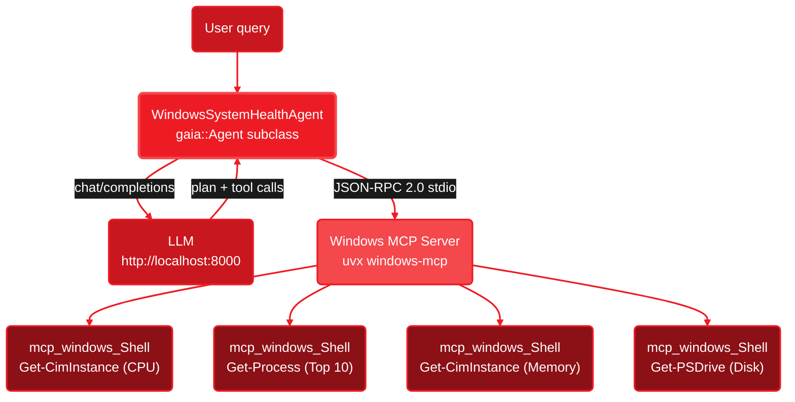

<Info>
  **Source Code:** [`cpp/examples/health_agent.cpp`](https://github.com/amd/gaia/blob/main/cpp/examples/health_agent.cpp) — single-file agent using MCP to run PowerShell diagnostics with a polished terminal UI.
</Info>

<Note>
**Platform:** Windows (requires the [Windows MCP server](https://pypi.org/project/windows-mcp/) and `uvx`).
**Prerequisite:** [Lemonade Server](https://lemonade-server.ai) running with a model loaded.
</Note>

---

## What This Agent Does

The System Health Agent is an **investigative AI agent** that diagnoses system problems by gathering data from multiple sources, correlating findings, and reasoning about root causes. When you ask *"Why is my system slow?"*, it doesn't just check one metric — it runs 4 PowerShell commands in sequence (CPU, processes, memory, disk), reasons about each result, and delivers a correlated diagnosis.

Key differences from the [Wi-Fi Troubleshooter](/cpp/wifi-agent):

- **MCP-based** — all tools come from the Windows MCP server, not registered C++ lambdas
- **Multi-tool investigations** — each query triggers 3-4 correlated tool calls with reasoning between each
- **Broader scope** — CPU, memory, disk, processes, network, battery, SMART, Windows Update, and more
- **Report generation** — full diagnostics can write a formatted report to Notepad

---

## Demo

<video
  controls
  autoPlay
  loop
  muted
  playsInline
  className="w-full rounded-lg"
  src="https://assets.amd-gaia.ai/videos/health-agent-cpp-gpu.webm"
/>

Full diagnostic run on a Ryzen AI PC: the agent gathers CPU, memory, disk, and process data via MCP, reasons about each result, and delivers a correlated diagnosis — all powered by a local LLM on the GPU.

---

## Quick Start

<Steps>
  <Step title="Build">
    <Tabs>
      <Tab title="Windows (MSVC)">
        ```bat
        cd cpp
        ```
        ```bat
        cmake -B build -G "Visual Studio 17 2022" -A x64
        ```
        ```bat
        cmake --build build --config Release
        ```
        Binary: `cpp\build\Release\health_agent.exe`
      </Tab>
      <Tab title="Windows (Ninja)">
        ```bat
        cd cpp
        ```
        ```bat
        cmake -B build -G Ninja -DCMAKE_BUILD_TYPE=Release
        ```
        ```bat
        cmake --build build
        ```
      </Tab>
    </Tabs>
  </Step>

  <Step title="Start Lemonade Server">
    ```bash
    lemonade-server serve
    ```
  </Step>

  <Step title="Run the agent">
    ```bat
    cpp\build\Release\health_agent.exe
    ```

    Select GPU or NPU backend, then choose from the investigation menu:
    ```
    [1] Why is my system slow?
    [2] Is my system secure and up to date?
    [3] Can I free up disk space?
    [4] Diagnose recent system errors
    [5] How's my battery holding up?
    [6] Full system health report
    ```

    Or type your own question — the agent will reason about what data to gather.
  </Step>
</Steps>

---

## Architecture



The agent subclasses `gaia::Agent` and connects to the Windows MCP server at construction time. Unlike the Wi-Fi agent (which registers tools as C++ lambdas), this agent gets all its tools from the MCP server — every diagnostic runs through `mcp_windows_Shell`.

---

## How It Works

The agent has no `registerTools()` override — all tools come from MCP. The system prompt teaches the LLM **investigation strategies**: which PowerShell commands to run for each query type, and how to correlate findings:

```cpp
class WindowsSystemHealthAgent : public gaia::Agent {
public:
    explicit WindowsSystemHealthAgent(const std::string& modelId)
        : Agent(makeConfig(modelId)) {
        setOutputHandler(std::make_unique<gaia::CleanConsole>());
        init();

        // All tools come from the Windows MCP server
        connectMcpServer("windows", {
            {"command", "uvx"},
            {"args", {"windows-mcp"}}
        });
    }

protected:
    std::string getSystemPrompt() const override {
        return R"(You are an expert Windows system administrator...
            // Investigation strategies per query type
            // PowerShell commands for memory, disk, CPU, processes, etc.
            // Reasoning protocol: FINDING/DECISION after each tool
        )";
    }

private:
    static gaia::AgentConfig makeConfig(const std::string& modelId) {
        gaia::AgentConfig config;
        config.maxSteps = 75;       // full diagnostics needs many tool calls
        config.modelId = modelId;
        config.contextSize = 32768; // 32K for 12+ tool calls with output
        return config;
    }
};
```

The system prompt contains **investigation strategies** — each query type maps to a specific sequence of PowerShell commands. The LLM follows the strategy, uses FINDING/DECISION reasoning after each tool result, and delivers a correlated conclusion.

---

## Investigations

Each menu option triggers a multi-tool investigation. The LLM gathers data, reasons about each result, and correlates findings before answering.

| Investigation | Tools Called | What It Checks |
|--------------|-------------|----------------|
| **Why is my system slow?** | 4 | CPU load, top processes, memory, disk space |
| **Is my system secure?** | 3 | Windows updates, system errors, startup programs |
| **Can I free up disk space?** | 3 | Drive usage, temp folder size, largest installed software |
| **Diagnose system errors** | 3 | Event log errors, disk SMART health, memory status |
| **Battery health** | 3 | Battery status, top CPU processes, CPU load |
| **Full health report** | 12+ | All metrics, then writes a report to Notepad |

---

## Available PowerShell Commands

The system prompt provides these commands for the LLM to use via `mcp_windows_Shell`:

| Category | PowerShell Command | Output |
|----------|-------------------|--------|
| Memory | `Get-CimInstance Win32_OperatingSystem` | Total/free RAM in GB |
| Disk | `Get-PSDrive -PSProvider FileSystem` | Used/free space per drive |
| CPU | `Get-CimInstance Win32_Processor` | Name, cores, load % |
| GPU | `Get-CimInstance Win32_VideoController` | Name, VRAM, driver version |
| Top Processes (CPU) | `Get-Process \| Sort-Object CPU` | Top 10 by CPU time |
| Top Processes (Memory) | `Get-Process \| Sort-Object WorkingSet64` | Top 10 by memory |
| Network | `Get-NetIPConfiguration` | IP, gateway, DNS per interface |
| Startup Programs | `Get-CimInstance Win32_StartupCommand` | Name, command, location |
| System Errors | `Get-WinEvent` (last 24h) | Time, event ID, message |
| Windows Update | `Get-HotFix` | Recent hotfixes with dates |
| Battery | `Get-CimInstance Win32_Battery` | Charge %, chemistry, status |
| Installed Software | Registry query | Top 20 by size or install date |
| Temp Folder | `Get-ChildItem $env:TEMP` | Total size and file count |
| Storage Health | `Get-PhysicalDisk` | SMART status per disk |

---

## MCP vs Registered Tools

This agent uses MCP while the [Wi-Fi Troubleshooter](/cpp/wifi-agent) uses registered C++ tools. The tradeoffs:

| | Health Agent (MCP) | Wi-Fi Agent (Registered Tools) |
|---|---|---|
| **Tool source** | Windows MCP server subprocess | C++ lambdas compiled into binary |
| **Dependencies** | Requires `uvx` + `windows-mcp` | Self-contained `.exe` |
| **Flexibility** | Any MCP server, any tool set | Fixed at compile time |
| **Latency** | JSON-RPC roundtrip per tool call | Direct function call |
| **Best for** | Broad system access, GUI automation | Focused single-purpose agents |

Choose MCP when you need access to a wide range of system capabilities. Choose registered tools when you want a self-contained binary with no runtime dependencies.

---

## Next Steps

<CardGroup cols={2}>
  <Card title="Wi-Fi Troubleshooter Agent" icon="wifi" href="/cpp/wifi-agent">
    Compare with the registered-tools approach for network diagnostics
  </Card>

  <Card title="Windows System Health Guide" icon="desktop" href="/guides/mcp/windows-system-health">
    Walkthrough of the MCP-based system health approach
  </Card>

  <Card title="Customizing Your Agent" icon="sliders" href="/cpp/custom-agent">
    Custom prompts, tools, MCP servers, and output capture
  </Card>

  <Card title="C++ Framework Overview" icon="code" href="/cpp/overview">
    Architecture, AgentConfig reference, and project structure
  </Card>
</CardGroup>

---

<small style="color: #666;">

**License**

Copyright(C) 2025-2026 Advanced Micro Devices, Inc. All rights reserved.

SPDX-License-Identifier: MIT

</small>
