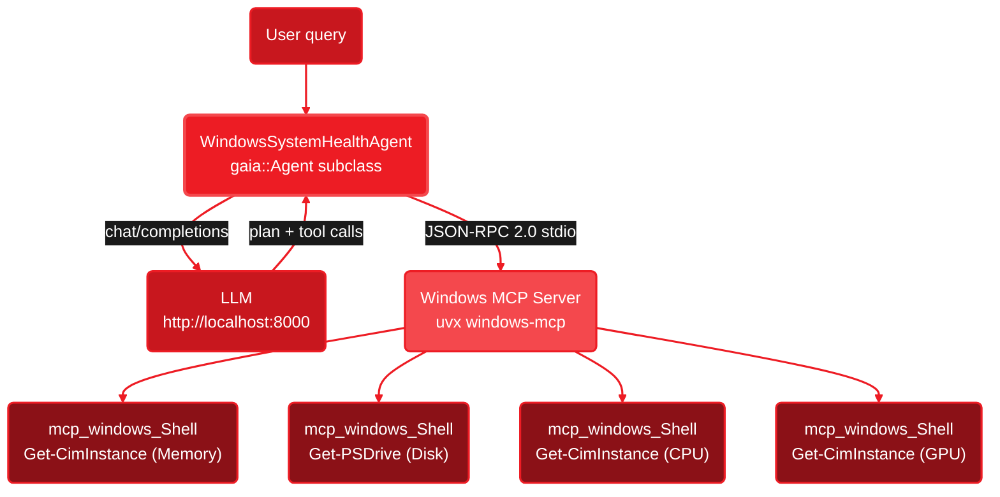

<Info>
  **Source Code:** [`cpp/examples/health_agent.cpp`](https://github.com/amd/gaia/blob/main/cpp/examples/health_agent.cpp) — single-file agent using MCP to run PowerShell diagnostics with a polished terminal UI.
</Info>

<Note>
**Platform:** Windows (requires the [Windows MCP server](https://github.com/nicholasxjy/windows-mcp) and `uvx`).
**Prerequisite:** [Lemonade Server](https://lemonade-server.ai) running with a model loaded.
</Note>

---

## What This Agent Does

The System Health Agent connects to the Windows MCP server via stdio, then uses PowerShell commands to gather system metrics and generate health reports. See the [Windows System Health guide](/guides/mcp/windows-system-health) for a walkthrough of the approach.

Key differences from the [Wi-Fi Troubleshooter](/cpp/wifi-agent):

- **MCP-based** — all tools come from the Windows MCP server, not registered C++ lambdas
- **Broader scope** — CPU, memory, disk, GPU, processes, network, battery, SMART, Windows Update, and more
- **Report generation** — can write formatted reports to temp files and open them in Notepad
- **LLM model recommendations** — analyzes hardware specs and suggests which models your system can run

---

## Architecture



The agent subclasses `gaia::Agent` and connects to the Windows MCP server at construction time. Unlike the Wi-Fi agent (which registers tools as C++ lambdas), this agent gets all its tools from the MCP server — every diagnostic runs through `mcp_windows_Shell`.

---

## How It Works

The agent has no `registerTools()` override — all tools come from MCP. The system prompt teaches the LLM which PowerShell commands to run for each type of query:

```cpp
class WindowsSystemHealthAgent : public gaia::Agent {
public:
    explicit WindowsSystemHealthAgent(const std::string& modelId)
        : Agent(makeConfig(modelId)) {
        setOutputHandler(std::make_unique<gaia::CleanConsole>());
        init();

        // All tools come from the Windows MCP server
        connectMcpServer("windows", {
            {"command", "uvx"},
            {"args", {"windows-mcp"}}
        });
    }

protected:
    std::string getSystemPrompt() const override {
        return R"(You are an expert Windows system administrator...
            // PowerShell commands for memory, disk, CPU, GPU, etc.
            // Query routing: "quick check" vs "full report"
            // LLM model recommendations by hardware tier
        )";
    }

private:
    static gaia::AgentConfig makeConfig(const std::string& modelId) {
        gaia::AgentConfig config;
        config.maxSteps = 75;       // full diagnostics needs many tool calls
        config.modelId = modelId;
        config.contextSize = 32768; // 32K for 12+ tool calls with output
        return config;
    }
};
```

The system prompt includes:
- **12 PowerShell command templates** — memory, disk, CPU, GPU, processes, network, startup programs, event logs, Windows Update, battery, installed software, SMART status
- **Query routing** — "quick health check" runs 4 core metrics; "full diagnostics" runs all 12 and generates a Notepad report
- **LLM model recommendations** — a hardware-to-model reference table so the agent can suggest which models your system can run

---

## Available Diagnostics

| Diagnostic | PowerShell Command | Output |
|-----------|-------------------|--------|
| Memory | `Get-CimInstance Win32_OperatingSystem` | Total/free RAM in GB |
| Disk | `Get-PSDrive -PSProvider FileSystem` | Used/free space per drive |
| CPU | `Get-CimInstance Win32_Processor` | Name, cores, load % |
| GPU | `Get-CimInstance Win32_VideoController` | Name, VRAM, driver version |
| Top Processes | `Get-Process \| Sort-Object CPU` | Top 10 by CPU time |
| Network | `Get-NetIPConfiguration` | IP, gateway, DNS per interface |
| Startup Programs | `Get-CimInstance Win32_StartupCommand` | Name, command, location |
| System Errors | `Get-WinEvent` (last 24h) | Time, event ID, message |
| Windows Update | `Get-HotFix` | Recent hotfixes with dates |
| Battery | `Get-CimInstance Win32_Battery` | Charge %, chemistry, status |
| Installed Software | Registry query | Top 20 by install date |
| Storage Health | `Get-PhysicalDisk` | SMART status per disk |

---

## Quick Start

<Steps>
  <Step title="Build">
    <Tabs>
      <Tab title="Windows (MSVC)">
        ```bat
        cd cpp
        ```
        ```bat
        cmake -B build -G "Visual Studio 17 2022" -A x64
        ```
        ```bat
        cmake --build build --config Release
        ```
        Binary: `cpp\build\Release\health_agent.exe`
      </Tab>
      <Tab title="Windows (Ninja)">
        ```bat
        cd cpp
        ```
        ```bat
        cmake -B build -G Ninja -DCMAKE_BUILD_TYPE=Release
        ```
        ```bat
        cmake --build build
        ```
      </Tab>
    </Tabs>
  </Step>

  <Step title="Start Lemonade Server">
    ```bash
    lemonade-server serve
    ```
  </Step>

  <Step title="Run the agent">
    ```bat
    cpp\build\Release\health_agent.exe
    ```

    Select GPU or NPU backend, then choose from the diagnostic menu:
    ```
     [1] Quick health check (console summary)
     [2] Check memory usage
     [3] Check disk space
     [4] Check CPU info
     [5] Check GPU info
     ...
    [14] What LLM models can my system run?
    [15] Run ALL diagnostics + generate report
    ```
  </Step>
</Steps>

---

## Sample Session

```
  ========================================================================================
   System Health Agent  |  GAIA C++ Agent Framework  |  Local Inference
  ========================================================================================

  Select inference backend:
  [1] GPU  - Qwen3-4B-Instruct-2507-GGUF
  [2] NPU  - Qwen3-4B-Instruct-2507-FLM

  > 1
  Using GPU backend: Qwen3-4B-Instruct-2507-GGUF
  Connecting to Windows MCP server...
  Connected to Windows MCP server

  Ready!

   [1] Quick health check (console summary)
   [2] Check memory usage
   ...

  > 1
  > Quick health check (console summary)

  [1/75] mcp_windows_Shell
      Command: Get-CimInstance Win32_OperatingSystem | ...
  Finding: 128 GB total RAM, 98 GB free (76% available).
  Decision: Memory healthy. Checking disk space next.

  [2/75] mcp_windows_Shell
      Command: Get-PSDrive -PSProvider FileSystem | ...
  Finding: C: drive has 412 GB free of 952 GB total.
  Decision: Disk OK. Checking CPU.

  [3/75] mcp_windows_Shell
      ...

  [4/75] mcp_windows_Shell
      ...

  ========================================================================================
   System Health Summary:
   - Memory: 128 GB total, 98 GB free
   - Disk: C: 412 GB free / 952 GB
   - CPU: AMD Ryzen AI MAX+ 395, 16 cores, 8% load
   - GPU: AMD Radeon 8060S, 32 GB VRAM
   Assessment: Excellent - can run 30B+ parameter models
  ========================================================================================
```

---

## MCP vs Registered Tools

This agent uses MCP while the [Wi-Fi Troubleshooter](/cpp/wifi-agent) uses registered C++ tools. The tradeoffs:

| | Health Agent (MCP) | Wi-Fi Agent (Registered Tools) |
|---|---|---|
| **Tool source** | Windows MCP server subprocess | C++ lambdas compiled into binary |
| **Dependencies** | Requires `uvx` + `windows-mcp` | Self-contained `.exe` |
| **Flexibility** | Any MCP server, any tool set | Fixed at compile time |
| **Latency** | JSON-RPC roundtrip per tool call | Direct function call |
| **Best for** | Broad system access, GUI automation | Focused single-purpose agents |

Choose MCP when you need access to a wide range of system capabilities. Choose registered tools when you want a self-contained binary with no runtime dependencies.

---

## Next Steps

<CardGroup cols={2}>
  <Card title="Wi-Fi Troubleshooter Agent" icon="wifi" href="/cpp/wifi-agent">
    Compare with the registered-tools approach for network diagnostics
  </Card>

  <Card title="Windows System Health Guide" icon="desktop" href="/guides/mcp/windows-system-health">
    Walkthrough of the MCP-based system health approach
  </Card>

  <Card title="Customizing Your Agent" icon="sliders" href="/cpp/custom-agent">
    Custom prompts, tools, MCP servers, and output capture
  </Card>

  <Card title="C++ Framework Overview" icon="code" href="/cpp/overview">
    Architecture, AgentConfig reference, and project structure
  </Card>
</CardGroup>

---

<small style="color: #666;">

**License**

Copyright(C) 2025-2026 Advanced Micro Devices, Inc. All rights reserved.

SPDX-License-Identifier: MIT

</small>
