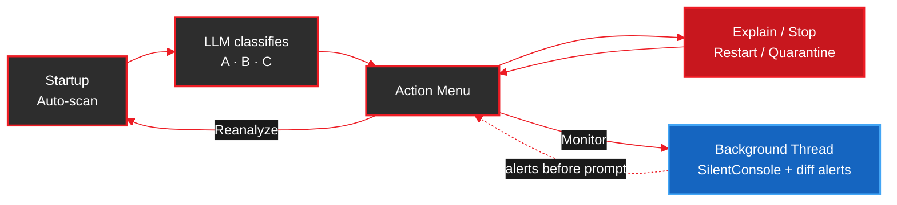
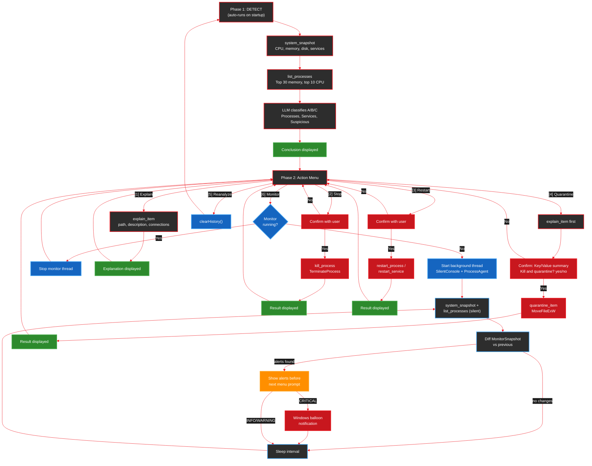

<Info>
  **Source Code:** [`cpp/examples/process_agent.cpp`](https://github.com/amd/gaia/blob/main/cpp/examples/process_agent.cpp) — single-file, self-contained agent (~2,100 lines including 7 tools, action menu, and decision support).
</Info>

<Note>
**Platform:** Windows (Win32 APIs + PowerShell). Compiles on Linux/macOS for CI but tools require Windows to return real data.
**Prerequisite:** Lemonade Server running with a model loaded.
**Recommended:** Run as Administrator for full process visibility and quarantine access.
</Note>

---

## What This Agent Does

The Process Analyst is an AI agent that makes sense of what's running on your PC. On startup it scans every process and service, classifies them by resource use and behavior, and shows you a plain-English summary. You can ask it to explain any task — what it is, what it does, and whether there's reason to be concerned — or take action directly.

Here's what makes it interesting:

- **It explains what's running** — every process gets a plain-English description: what it is, what it does, and whether it looks normal
- **Ask about any task** — describe an item from the summary and get a clear explanation without needing technical knowledge
- **Manage processes and services** — stop, restart, or quarantine items; the agent always asks before acting
- **Background monitoring** — toggle a background watcher that alerts you to memory spikes, new suspicious items, and health changes while you keep working
- **Everything is local** — no data leaves your machine

---

## See It In Action

<Note>
Video coming soon.
</Note>

The agent auto-runs a full system scan on startup, then waits for your input. You can ask about any item in plain English — or use the action menu to stop, restart, or quarantine it.

---

## Quick Start

<Steps>
  <Step title="Build">
    <Tabs>
      <Tab title="Windows (MSVC)">
        ```bat
        cd cpp
        ```
        ```bat
        cmake -B build -G "Visual Studio 17 2022" -A x64
        ```
        ```bat
        cmake --build build --config Release --target process_agent
        ```
        Binary: `cpp\build\Release\process_agent.exe`
      </Tab>
      <Tab title="Windows (Ninja)">
        ```bat
        cd cpp
        ```
        ```bat
        cmake -B build -G Ninja -DCMAKE_BUILD_TYPE=Release
        ```
        ```bat
        cmake --build build --target process_agent
        ```
      </Tab>
    </Tabs>
  </Step>

  <Step title="Start Lemonade Server">
    ```bash
    lemonade-server serve
    ```
    The agent connects to `http://localhost:8000/api/v1` by default.
  </Step>

  <Step title="Run the agent">
    ```bat
    cpp\build\Release\process_agent.exe
    ```

    The agent auto-analyzes on startup. After the scan completes, you'll see a summary followed by an action menu:

    ```
    A. Processes
    A1  msedge.exe (x28) - 2.1 GB RAM - Microsoft Edge [NORMAL]
    A2  Teams.exe (x8) - 1.4 GB RAM - Microsoft Teams [HIGH]
    A3  cpptools-srv.exe (x2) - 890 MB RAM - C/C++ IntelliSense [NORMAL]

    B. Services
    All services running normally

    C. Suspicious Items
    C1  unknown_app.exe - C:\Users\user\Downloads\unknown_app.exe
        flags: unknown_company, unknown_description, temp_path

    ──────────────────────────────────────────────────────────────
    Available Actions:

    [1] Explain    -- Get details on a process or service
    [2] Stop       -- Kill a process or stop a service
    [3] Restart    -- Restart an app or service
    [4] Quarantine -- Move a suspicious file to quarantine
    [5] Reanalyze  -- Run a fresh system analysis
    [6] Monitor    -- Toggle background health watcher

    Shortcuts: '1 A3' = Explain A3,  '2 B1' = Stop B1,  '4 C1' = Quarantine C1,  '6 5' = Monitor every 5 min

    >
    ```

    Each item gets a label (A1, A2, C1, etc.) you can use in any command:

    | What you type | What happens |
    |---|---|
    | `1` | Explain all items |
    | `1 A3` | Explain cpptools-srv.exe |
    | `2 A1` | Stop msedge.exe |
    | `4 C1` | Quarantine unknown_app.exe |
    | `5` | Reanalyze the system |
    | `6` | Toggle background monitor (default 2 min interval) |
    | `6 5` | Toggle monitor with 5-minute interval |
    | `What is svchost.exe?` | Ask a free-form question |

    <Note>
    For full process visibility and quarantine access, right-click your terminal and select **Run as administrator** before launching the agent.
    </Note>
  </Step>
</Steps>

---

## Architecture

The agent runs in two phases. On startup it auto-scans the system — no menu shown first. The LLM calls `system_snapshot` and `list_processes`, classifies everything into three labeled sections (A: Processes, B: Services, C: Suspicious Items), then presents an action menu.

Conversation history is preserved across all actions so the LLM can reference any labeled item without re-scanning. Only **Reanalyze** clears history, because the system state has genuinely changed.



---

## How It Works

The entire agent is a single `.cpp` file with six sections. Let's walk through each one.

1. **Shell Helper** — bridges C++ and PowerShell for command execution and validates inputs
2. **Win32 Process Intelligence** — native API for fast process snapshots with file version info
3. **Tool Registration** — 7 tools the LLM can call (3 read-only + 4 destructive)
4. **System Prompt** — teaches the LLM the A/B/C classification protocol
5. **ProcessConsole** — custom TUI that formats A/B/C sections with color coding
6. **Monitor Mode** — background thread that diffs snapshots and surfaces alerts

The agent subclasses `gaia::Agent` with three pieces: a config, registered tools, and a system prompt.

```cpp
class ProcessAnalystAgent : public gaia::Agent {
public:
    explicit ProcessAnalystAgent(const std::string& modelId)
        : Agent(makeConfig(modelId)) {
        setOutputHandler(std::make_unique<ProcessConsole>());  // custom TUI
        init();  // calls registerTools() + composes system prompt
    }

protected:
    std::string getSystemPrompt() const override {
        return R"(You are an expert Windows process analyst...
            // A/B/C classification protocol, action behavior, quarantine protocol
        )";
    }

    void registerTools() override {
        // 7 tools: 3 read-only + 4 destructive (see Tool Reference below)
        toolRegistry().registerTool("system_snapshot", ...);
        toolRegistry().registerTool("kill_process", ...);
        // ...
    }

private:
    static gaia::AgentConfig makeConfig(const std::string& modelId) {
        gaia::AgentConfig config;
        config.maxSteps = 20;
        config.modelId = modelId;
        return config;
    }
};
```

Each tool is a C++ lambda using Win32 APIs or PowerShell and returns a structured result:

```cpp
toolRegistry().registerTool(
    "kill_process",
    "Terminate a running process by name. ONLY use after explicit user confirmation.",
    [](const gaia::json& args) -> gaia::json {
        std::string name = args.value("name", "");
        if (name.empty())
            return {{"error", "Process name is required"}};

        KillResult kr = killProcessesByName(name);
        return {
            {"tool",               "kill_process"},
            {"terminated",         kr.terminated},
            {"memory_freed_human", formatBytes(kr.memoryFreed)},
            {"command",            "Win32 API: TerminateProcess(" + name + ")"},
            {"output",             "Found N instances, terminated N, freed X MB"}
        };
    },
    {{"name", gaia::ToolParamType::STRING, true, "Process name (e.g., 'chrome.exe')"}}
);
```

<Note>
All arguments from the LLM are validated before use — process names allow only alphanumeric characters plus `.`, `-`, and `_`. File paths for quarantine operations are validated separately for drive-letter format and shell metacharacters.
</Note>

---

## Tool Reference

The agent registers 7 tools in two categories:

### Analysis Tools (Read-Only)

These gather information without changing anything on the system.

| Tool | What It Uses | Parameters | What the LLM Learns |
|------|-------------|------------|---------------------|
| `system_snapshot` | Win32 API + PowerShell | none | CPU load, memory, disk, uptime, top 30 processes with flags, problematic services, connection count |
| `list_processes` | Win32 API + PowerShell | none | Top 30 by memory (with company, description, flags), top 10 by CPU, background count |
| `explain_item` | Win32 API + PowerShell | `name` (required) | Full details: path, what the file is, what it does, memory, CPU, start time, network connections |

### Action Tools (Destructive — require user confirmation)

These modify the system. The system prompt mandates user approval before the LLM calls any of them.

| Tool | What It Uses | Parameters | When to Use |
|------|-------------|------------|-------------|
| `kill_process` | `CreateToolhelp32Snapshot` + `TerminateProcess` | `name` (required) | Stop a resource hog or suspicious process |
| `restart_process` | `TerminateProcess` + `CreateProcessW` | `name` (required) | Restart a hung application from the same exe path |
| `restart_service` | PowerShell `Restart-Service` | `name` (required) | Restart a degraded Windows service |
| `quarantine_item` | `killProcessesByPath` + `MoveFileExW` | `path` (required) | Move suspicious exe to `C:\ProgramData\GAIA\quarantine\` |

---

## Monitor Mode: Background Health Watcher

The monitor is a background thread that periodically re-scans the system and compares consecutive snapshots to detect changes. It runs alongside the interactive agent — you can keep explaining, stopping, or restarting processes while the monitor watches for anomalies.

**Starting and stopping.** Monitor is a toggle on `[6]`. Press it once to start, again to stop. You can also specify an interval: `6 5` starts monitoring every 5 minutes. Typing `monitor` or `monitor N` at the prompt does the same thing. The default interval is 2 minutes.

**How it works internally.** When started, the agent spawns a second `ProcessAgent` on a dedicated thread. This background agent uses a `SilentConsole` — it runs the same `system_snapshot` and `list_processes` tools but produces no visible output. After each scan it builds a `MonitorSnapshot` (memory usage, top process list, suspicious items, health status) and diffs it against the previous snapshot. Any meaningful changes become alerts.

**Alert types and thresholds:**

| Alert | Trigger | Severity |
|-------|---------|----------|
| Memory spike | System memory use jumps >10 percentage points | WARNING (CRITICAL if >90%) |
| Per-process memory surge | A single process grows by >500 MB | WARNING |
| New process in top-20 | A process appears that was not in the previous top-20 | INFO |
| Process left top-20 | A process drops out of the previous top-20 | INFO |
| New suspicious item | LLM flags a new item in section C | CRITICAL |
| Health status change | Overall health classification changes | WARNING or CRITICAL |

**Alert delivery.** Pending alerts are displayed before the next menu prompt, so you see them naturally between actions. For CRITICAL and NEW_SUSPICIOUS alerts, the agent also sends a Windows notification so you get alerted even if the terminal is in the background.

**Design choices:**
- **Separate agent instance** — the monitor's `ProcessAgent` has its own conversation history and LLM connection. This avoids corrupting the interactive agent's context with monitoring chatter.
- **SilentConsole** — suppresses all tool output and conclusions from the background scan. Only the diff-based alerts reach the user.
- **Deterministic scans** — the monitor agent uses `temperature=0` for consistent health classifications across consecutive scans when system state hasn't changed.
- **Toggle, not a mode** — the interactive menu stays fully functional while the monitor runs. There is no "monitor mode" to enter or exit.
- **NPU-friendly** — background monitoring is an ideal workload for AMD Ryzen AI NPU inference. The monitor runs periodic scans without tying up the CPU or GPU, leaving them free for your other work.

---

## Diagnostics Flow



Diagnostic nodes (dark) gather data. Red nodes are destructive actions requiring confirmation. Blue nodes are the Reanalyze and Monitor paths. Orange is the alert display. Green nodes are conclusion displays where the user reads output.

---

## Sample Session

```
  ========================================================================================
   Process Analyst  |  GAIA C++ Agent Framework  |  Local Inference
  ========================================================================================

  Select inference backend:
  [1] GPU  - Qwen3-4B-Instruct-2507-GGUF
  [2] NPU  - Qwen3-4B-Instruct-2507-FLM

  > 1
  Using GPU backend: Qwen3-4B-Instruct-2507-GGUF

  Analyzing your system...

  [1/20] system_snapshot
      Command: Win32 API: memory, disk, processes + PowerShell: CPU, services, connections
      Output:
      .----
      | CPU: 12% load  |  AMD Ryzen 9 7940HS  |  3893 / 5200 MHz
      | Memory: 12.4 GB / 30.4 GB  (41% used)
      | Uptime: 48.3 hrs  |  Processes: 312  |  Connections: 87
      |
      | Disk:
      |   C:\  52% used  |  224.8 GB free of 476.3 GB
      |
      | Top 30 by memory:
      |   msedge.exe                  x28  2.1 GB   <- explorer.exe
      |   Teams.exe                   x8   1.4 GB   <- explorer.exe
      |   cpptools-srv.exe            x2   890 MB   <- vsls-agent.exe
      |   ...
      '----

  [2/20] list_processes
      Command: Win32 API: top 30 by memory + PowerShell: top 10 by CPU time
      ...

  ========================================================================================
  Conclusion
  ========================================================================================

  A. Processes
  Top resource consumers grouped by name, sorted by memory and CPU usage.

  A1  msedge.exe (x28) - 2.1 GB RAM - Microsoft Edge <- explorer.exe [NORMAL]
  A2  Teams.exe (x8) - 1.4 GB RAM - Microsoft Teams <- explorer.exe [HIGH]
  A3  cpptools-srv.exe (x2) - 890 MB RAM - C/C++ IntelliSense <- vsls-agent.exe [NORMAL]
  A4  SearchHost.exe - 456 MB RAM - Windows Search <- svchost.exe [NORMAL]
  A5  explorer.exe - 312 MB RAM - Windows Explorer <- userinit.exe [NORMAL]

  B. Services
  System services with high memory usage (>200 MB) or error/degraded status.

  All services running normally

  C. Suspicious Items
  Unsigned binaries, unknown publishers, or processes running from unexpected locations.

  C1  unknown_app.exe - C:\Users\user\Downloads\unknown_app.exe
      flags: unknown_company, unknown_description, temp_path

  System Health: Warning - One suspicious executable found in Downloads folder

  ========================================================================================

  ========================================================================================
  Available Actions:

  [1] Explain  -- Get details on a process or service
  [2] Stop     -- Kill a process or stop a service
  [3] Restart  -- Restart an app or service
  [4] Quarantine -- Move a suspicious file to quarantine
  [5] Reanalyze  -- Run a fresh system analysis
  [6] Monitor    -- Toggle background health watcher
  ========================================================================================
  Shortcuts: '1 A3' = Explain A3,  '2 B1' = Stop B1,  '4 C1' = Quarantine C1,  '6 5' = Monitor every 5 min

  > 4 C1

  [3/20] explain_item
      Command: Win32 API + PowerShell: explain unknown_app.exe
      Output:
      .----
      | unknown_app.exe  (PID 14228, 1 instance)
      |   Path:        C:\Users\user\Downloads\unknown_app.exe
      |   Parent:      explorer.exe
      |   Memory:      45.2 MB
      |   CPU time:    2.3 sec
      |   Network:     no active connections
      '----

  ========================================================================================
  Conclusion
  ========================================================================================

  Process: unknown_app.exe
  Path: C:\Users\user\Downloads\unknown_app.exe
  Memory: 45.2 MB
  Publisher: Unknown
  Signature: Unsigned
  Reason: Unknown publisher, no description, running from Downloads folder

  Kill unknown_app.exe and quarantine this file? This will terminate the process
  immediately and move the file to C:\ProgramData\GAIA\quarantine\. (yes / no)

  ========================================================================================
  [1] Yes
  [2] No

  > 1

  [4/20] quarantine_item
      Command: Win32 API: TerminateProcess + MoveFileExW(... -> C:\ProgramData\GAIA\quarantine\...)
      Output:
      .----
      | Killed:      unknown_app.exe (1 instance, 45.2 MB freed)
      | Quarantined: C:\Users\user\Downloads\unknown_app.exe
      | Moved to:    C:\ProgramData\GAIA\quarantine\unknown_app.exe.20260309.quarantined
      | File size:   2.8 MB
      '----

  ========================================================================================
  Conclusion
  ========================================================================================

  Action: Quarantine
  Target: unknown_app.exe
  Result: Success

  Terminated 1 instance of unknown_app.exe, freed 45.2 MB. File moved to
  C:\ProgramData\GAIA\quarantine\unknown_app.exe.20260309.quarantined

  ========================================================================================
```

---

## Extending the Agent

Want to add your own tools? The pattern is straightforward. Here's an example that lists Windows startup items:

```cpp
// Add this inside registerTools()
toolRegistry().registerTool(
    "check_startup_items",
    "List programs that run at Windows startup — registry Run keys and Startup folder.",
    [](const gaia::json& /*args*/) -> gaia::json {
        std::string output = runShell(
            "Get-CimInstance Win32_StartupCommand "
            "| Select-Object Name, Command, Location "
            "| ConvertTo-Json -Depth 2"
        );
        return {{"tool", "check_startup_items"},
                {"command", "PowerShell: Get-CimInstance Win32_StartupCommand"},
                {"output", output}};
    },
    {}
);
```

The framework automatically appends registered tools to the system prompt — the new tool is available to the LLM immediately. Optionally, add an `ActionEntry` to `kActions[]` if you want a new numbered menu item (e.g., `[7] Startup Items`).

---

## Next Steps

<CardGroup cols={2}>
  <Card title="C++ Framework Overview" icon="code" href="/cpp/overview">
    AgentConfig reference, project structure, and how the agent loop works
  </Card>

  <Card title="Customizing Your Agent" icon="sliders" href="/cpp/custom-agent">
    Custom prompts, typed tools, MCP servers, output capture, and tuning
  </Card>

  <Card title="Integration Guide" icon="puzzle-piece" href="/cpp/integration">
    Use gaia_core in your own CMake project via FetchContent or find_package
  </Card>

  <Card title="Wi-Fi Troubleshooter Agent" icon="wifi" href="/cpp/wifi-agent">
    Single-phase diagnostic agent with registered C++ tools
  </Card>
</CardGroup>

---

<small style="color: #666;">

**License**

Copyright(C) 2025-2026 Advanced Micro Devices, Inc. All rights reserved.

SPDX-License-Identifier: MIT

</small>
