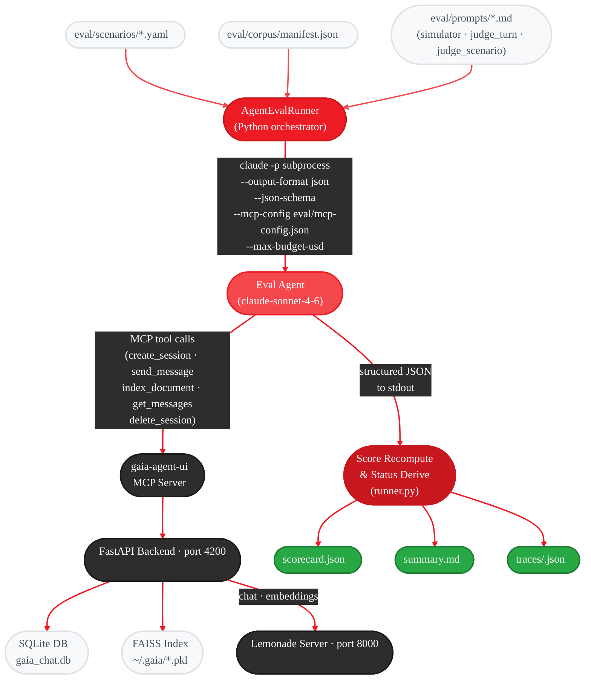
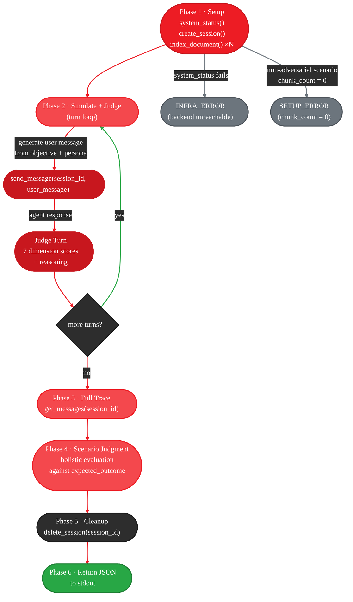
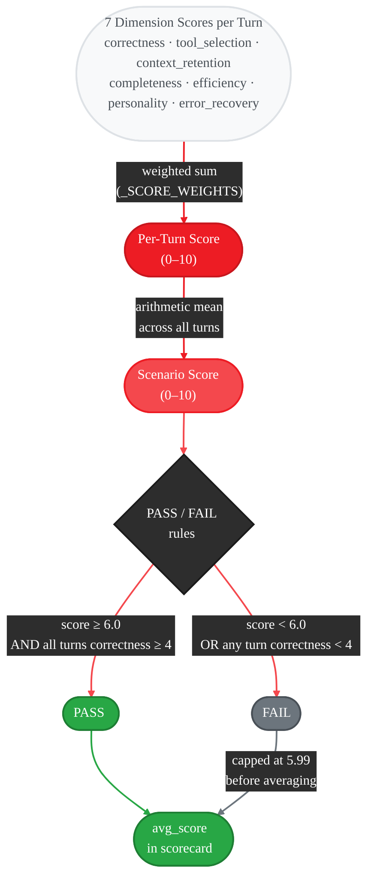
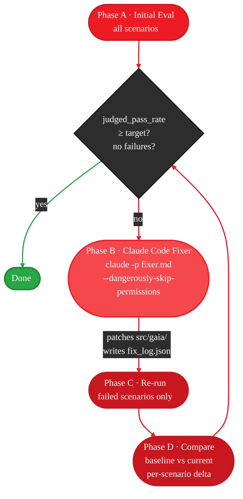

<Info>
  **Source Code:** [`src/gaia/eval/`](https://github.com/amd/gaia/tree/main/src/gaia/eval)
</Info>

<Note>
  **This is not the general evaluation framework.** This page covers `gaia eval agent` -- the scenario-based benchmark that stress-tests the live Agent UI end-to-end. For batch experiments and ground-truth generation, see the [Evaluation Framework](/reference/eval).
</Note>

---

## Overview

The Agent Eval Benchmark drives the live Agent UI through multi-turn conversations, then judges every response with an LLM (claude-sonnet-4-6 by default). Each scenario creates a real Agent UI session via MCP, sends user messages, captures the full transcript, and produces a scored evaluation.

54 YAML scenario files span 10 categories covering RAG quality, context retention, tool selection, error recovery, hallucination resistance, adversarial inputs, personality compliance, vision capabilities, web/system tools, and real-world documents.

**Why this matters:** Unlike the general eval framework (which compares isolated model outputs), the Agent Eval Benchmark tests the **full system end-to-end** -- RAG indexing, tool dispatch, context window management, multi-turn state, and hallucination resistance -- through the same Agent UI that real users interact with.

**Key Features:**
- Multi-turn scenario simulation with persona-driven user messages
- 7-dimension scoring rubric with deterministic weighted aggregation
- Automated fix mode that invokes Claude Code to repair failures and re-evaluate
- Regression testing with baseline comparison and per-scenario deltas
- Architecture audit mode (no LLM calls) to detect structural limitations
- CI/CD integration with budget and timeout controls

---

## Architecture

The benchmark runs as **two distinct processes** connected over MCP: a Python orchestrator (`AgentEvalRunner`) that manages scenarios, timeouts, and scoring; and a `claude -p` subprocess per scenario that acts as both user simulator and LLM judge. The system under test — the Agent UI and its Lemonade backend — runs independently and is treated as a black box.

### System Overview



**Key design decisions:**

| Decision | Rationale |
|----------|-----------|
| One `claude -p` subprocess per scenario | Isolates eval agent state — no cross-scenario memory leakage. API cost is bounded per scenario by `--max-budget-usd`, not per run |
| `--output-format json --json-schema` | Forces the eval agent to emit a machine-parseable result dict. The runner never parses free-form text |
| Prompts inlined into system prompt at runtime | The `claude -p` subprocess has no file-read tools. `simulator.md`, `judge_turn.md`, and `judge_scenario.md` are read by the runner and concatenated into the `-p` prompt string |
| Score recomputed deterministically | The runner overwrites the eval agent's arithmetic using `_SCORE_WEIGHTS` — consistent results regardless of which model judges |
| Progress tracking via `.progress.json` | Interrupted runs resume from the last completed scenario; corrupt or missing traces are re-run automatically |

---

### Eval Agent Lifecycle (per-scenario subprocess)

Each `claude -p` subprocess runs a 6-phase protocol. The eval agent has access to the Agent UI MCP server tools and uses them to drive a real session:



**Phase 2 detail:** The eval agent generates natural language user messages from the turn's `objective` and `persona` — not verbatim copies. It calls `send_message()` and waits for the full agent response before scoring. It does not retry on poor responses; it scores and moves to the next turn regardless.

**Error short-circuits and skips:**

| Condition | Status | Subprocess invoked? |
|-----------|--------|---------------------|
| Corpus file not on disk | `SKIPPED_NO_DOCUMENT` | No — runner skips entirely |
| `system_status()` HTTP error | `INFRA_ERROR` | Yes — exits Phase 1 early |
| `index_document()` returns 0 chunks (non-adversarial) | `SETUP_ERROR` | Yes — exits Phase 1 early |
| Subprocess wall-clock timeout | `TIMEOUT` | Yes — killed by runner |
| Claude API budget cap hit | `BUDGET_EXCEEDED` | Yes — Claude returns `error_max_budget_usd` |

**Timeout scaling** — the runner computes an effective timeout per scenario to account for document indexing and turn count:

```
effective_timeout = max(base_timeout,
                        120s startup overhead
                        + num_docs × 90s
                        + num_turns × 200s)
                    capped at 7200s
```

---

### Score Computation Pipeline

After each subprocess returns its JSON result, the runner validates and deterministically overwrites the eval agent's arithmetic before writing the trace file:



The recomputation applies in three passes:

1. **Per-turn**: `recompute_turn_score(scores_dict)` applies `_SCORE_WEIGHTS`. If the recomputed value differs from the eval agent's reported value by more than 0.25, the discrepancy is logged and the recomputed value wins. The per-turn `pass` flag is also recalculated (`correctness ≥ 4 AND computed ≥ 6.0`).

2. **Scenario-level**: `overall_score` is recomputed as the arithmetic mean of recomputed per-turn scores, replacing the eval agent's scenario-level value entirely.

3. **Status re-derivation**: The runner applies the rubric rules to recomputed values. An eval-agent-reported PASS can be overridden to FAIL (if any turn has `correctness < 4` or `overall_score < 6.0`), and a reported FAIL can be upgraded to PASS (if all turns satisfy both criteria). Infrastructure statuses (`BLOCKED_BY_ARCHITECTURE`, `TIMEOUT`, `BUDGET_EXCEEDED`, etc.) are never overridden. A `BLOCKED_BY_ARCHITECTURE` that passes all rubric criteria triggers a warning for human review, not an automatic upgrade.

4. **Average score integrity**: In `scorecard.json`, FAIL scenario scores are capped at 5.99 before computing `avg_score`. A scenario can score 9.8/10 on five of seven dimensions and still FAIL on hallucination — that 9.8 would inflate the benchmark's quality signal if included raw.

---

### Fix Mode Loop

When `--fix` is passed, the runner repeats a diagnose-repair-retest cycle:



The fixer subprocess (`claude -p fixer.md`) receives the `scorecard.json` path, `summary.md` path, and a JSON list of failing scenario IDs with their `root_cause` and `recommended_fix` fields. It patches files in `src/gaia/` and writes a `fix_log.json` documenting each change. The loop exits early if `judged_pass_rate ≥ --target-pass-rate` or all scenarios pass.

---

## Prerequisites

<Steps>
  <Step title="Install eval dependencies">
    ```bash
    uv pip install -e ".[eval]"
    ```
  </Step>

  <Step title="Set up the judge model API key">
    The benchmark uses Claude as the judge model. Export your API key:

    ```bash
    export ANTHROPIC_API_KEY=sk-ant-...
    ```
  </Step>

  <Step title="Start the LLM backend">
    Lemonade server provides the local LLM and embeddings for the Agent UI:

    ```bash
    lemonade-server serve
    ```
  </Step>

  <Step title="Start the Agent UI backend">
    <Tabs>
      <Tab title="CLI">
        ```bash
        gaia chat --ui
        ```
      </Tab>
      <Tab title="Direct">
        ```bash
        uv run python -m gaia.ui.server
        ```
      </Tab>
    </Tabs>
  </Step>

  <Step title="Verify Claude Code CLI">
    The runner invokes scenarios via `claude -p` subprocess:

    ```bash
    claude --version
    ```

    If not installed, see [Claude Code installation](https://docs.anthropic.com/en/docs/claude-code).
  </Step>
</Steps>

---

## Quick Start

```bash
# Run the full benchmark (all 54 scenarios)
gaia eval agent

# Run a single scenario by ID
gaia eval agent --scenario simple_factual_rag

# Run all scenarios in a category
gaia eval agent --category rag_quality

# Architecture audit only (no LLM calls, no cost)
gaia eval agent --audit-only
```

Results are written to `eval/results/<run_id>/`.

---

## Scenario Categories

| Category | Scenarios | What It Tests |
|----------|:---------:|---------------|
| `rag_quality` | 7 | Factual extraction, hallucination resistance, negation handling, table/CSV data, cross-section synthesis, budget queries |
| `context_retention` | 4 | Pronoun resolution, cross-turn file recall, multi-document context, conversation summary |
| `tool_selection` | 4 | Choosing the right tool, smart discovery (no docs indexed -- find and index), multi-step planning, no-tool-needed detection |
| `error_recovery` | 3 | File-not-found graceful handling, empty search fallback, vague request clarification |
| `adversarial` | 3 | Empty file, large document (>100k tokens), topic switching |
| `personality` | 3 | Concise responses, no sycophancy, honest limitation acknowledgement |
| `vision` | 3 | Screenshot capture, VLM graceful degradation, SD graceful degradation |
| `real_world` | 19 | Real PDFs, XLSX, specs (10-K filings, GDPR articles, RFC specs, technical datasheets, license texts, government data) |
| `web_system` | 6 | Clipboard tools, desktop notifications, webpage fetching, window listing, system info, text-to-speech |
| `captured` | 2 | Golden-path replays from real Agent UI sessions |

---

## Scoring System

The judge evaluates each turn across 7 dimensions with fixed weights:

| Dimension | Weight | What It Measures |
|-----------|:------:|-----------------|
| Correctness | 25% | Factual accuracy against ground truth |
| Tool Selection | 20% | Chose the right tools; did not over-use or skip tools |
| Context Retention | 20% | Remembered prior turns; resolved pronouns; no re-indexing needed |
| Completeness | 15% | Answered all parts of the question |
| Efficiency | 10% | Did not make unnecessary tool calls or ask redundant clarifications |
| Personality | 5% | Tone, conciseness, avoiding sycophancy |
| Error Recovery | 5% | Gracefully handled missing files, empty results, ambiguous queries |

**Per-turn score** is the weighted sum of all 7 dimensions (0–10 scale). The runner recomputes this deterministically from dimension scores rather than trusting the LLM's arithmetic — ensuring consistent results regardless of which model is used as judge.

**Scenario-level score** is the mean of all per-turn scores. FAIL scores are capped at 5.99 in the average so a single perfect FAIL cannot inflate the benchmark's overall quality signal.

### Pass / Fail Rules

- **PASS**: `overall_score >= 6.0` AND no turn has `correctness < 4`
- **FAIL**: `overall_score < 6.0` OR any turn has `correctness < 4`

### Severity Levels

- **`critical`** -- Automatic FAIL if the agent hallucinates, invents facts, or fails the primary objective. Scenarios like `hallucination_resistance`, `cross_turn_file_recall`, and `smart_discovery` use this level.
- **`standard`** -- Scored purely on the numeric threshold.

### Status Legend

| Status | Meaning |
|--------|---------|
| PASS | Scenario passed all criteria |
| FAIL | Score below threshold or critical failure |
| BLOCKED_BY_ARCHITECTURE | Agent UI architecture prevents success (e.g., history window too small) |
| TIMEOUT | Scenario exceeded time limit |
| BUDGET_EXCEEDED | Claude API budget cap hit before completion |
| INFRA_ERROR | Agent UI backend unreachable or MCP failure |
| SETUP_ERROR | Document indexing failed (0 chunks) |
| SKIPPED_NO_DOCUMENT | Corpus file not present on disk (e.g., real-world docs not committed) |

---

## Test Corpus

The benchmark ships with a synthetic corpus in `eval/corpus/documents/` with ground truth facts defined in `eval/corpus/manifest.json`.

| File | Format | Domain | Sample Facts |
|------|--------|--------|--------------|
| `acme_q3_report.md` | Markdown | Finance | Q3 revenue: $14.2M; CEO Q4 outlook: 15--18% growth |
| `employee_handbook.md` | Markdown | HR Policy | PTO (first year): 15 days; Remote work: up to 3 days/week |
| `sales_data_2025.csv` | CSV | Sales | Top salesperson: Sarah Chen $70,000; Q1 total: $340,000 |
| `product_comparison.html` | HTML | Product | StreamLine: $49/mo, 4.2 stars; ProFlow: $79/mo, 4.7 stars |
| `api_reference.py` | Python | Technical | Auth: Bearer token via Authorization header |
| `meeting_notes_q3.txt` | Text | General | Next meeting: October 15, 2025 at 2:00 PM |
| `budget_2025.md` | Markdown | Finance | Total budget: $4.2M; Engineering: $1.3M; CFO approval threshold: $50K |
| `large_report.md` | Markdown | Compliance | Section 52 finding (adversarial: >100k tokens) |
| `sample_chart.png` | Image | Test | 1x1 pixel test image for vision scenarios |

The manifest also defines adversarial documents (`empty.txt`, `unicode_test.txt`, `duplicate_sections.md`) used by the adversarial category.

<Warning>
  **RAG cache freshness** -- If you see cached documents showing "1 chunk, 0B", clear the RAG cache before running:

  <Tabs>
    <Tab title="Linux/macOS">
      ```bash
      rm ~/.gaia/*.pkl
      ```
    </Tab>
    <Tab title="Windows">
      ```powershell
      Remove-Item "$env:USERPROFILE\.gaia\*.pkl"
      ```
    </Tab>
  </Tabs>

  Stale caches can contain synthesized summaries instead of verbatim document content, causing false failures.
</Warning>

---

## CLI Reference

| Flag | Default | Description |
|------|---------|-------------|
| `--scenario ID` | -- | Run one scenario by ID |
| `--category NAME` | -- | Run all scenarios in a category |
| `--audit-only` | `false` | Check architecture constraints without running LLM calls |
| `--generate-corpus` | `false` | Regenerate corpus documents and validate `manifest.json` |
| `--backend URL` | `http://localhost:4200` | Agent UI backend URL |
| `--model MODEL` | `claude-sonnet-4-6` | Judge model |
| `--budget USD` | `2.00` | Max spend per scenario |
| `--timeout SECS` | `900` | Per-scenario timeout (auto-scaled for large-doc and multi-turn scenarios) |
| `--fix` | `false` | Auto-invoke Claude Code to repair failures, then re-eval |
| `--max-fix-iterations N` | `3` | Max repair cycles in `--fix` mode |
| `--target-pass-rate N` | `0.90` | Stop fixing early when pass rate reaches this threshold |
| `--compare PATH...` | -- | Compare two `scorecard.json` files or compare against saved baseline |
| `--save-baseline` | `false` | Save this run's scorecard as `eval/results/baseline.json` |
| `--capture-session UUID` | -- | Convert a live Agent UI session into a YAML scenario |

---

## Fix Mode

Fix mode automates the repair loop: evaluate, diagnose failures, patch source code, and re-evaluate.

**Phases:**

1. **Phase A: Full eval run** -- All scenarios (or filtered set) execute normally
2. **Phase B: Diagnose + repair** -- Claude Code reads failing scenario transcripts and patches Agent UI source files
3. **Phase C: Re-run failures** -- Only the previously failed scenarios are re-evaluated
4. **Phase D: Diff scorecard** -- Produces a comparison showing regressions and improvements

```bash
# Fix all failures, up to 3 iterations
gaia eval agent --fix

# Fix rag_quality failures only, with tighter budget
gaia eval agent --category rag_quality --fix --max-fix-iterations 5 --target-pass-rate 0.95
```

The fixer prioritizes repairs in this order:
1. **Critical severity** scenarios first
2. **Architecture fixes** (in `_chat_helpers.py`, base agent classes) before prompt fixes
3. **Multi-scenario failures** before single-scenario issues

<Note>
  Fix mode uses Claude Code to patch `src/gaia/` source files. Review diffs before committing. Always run `python util/lint.py --all --fix` after fix iterations.
</Note>

---

## Regression Testing

```bash
# Save current run as the new baseline
gaia eval agent --save-baseline

# Compare latest run against saved baseline (auto-detects eval/results/baseline.json)
gaia eval agent --compare eval/results/latest/scorecard.json

# Explicit two-file comparison
gaia eval agent --compare eval/results/run_20250320/scorecard.json eval/results/run_20250322/scorecard.json
```

**Comparison output includes:**
- Per-scenario delta: PASS to FAIL regressions (highlighted), FAIL to PASS improvements
- Category-level pass rate change
- Score delta per scenario (warns when score drops by more than 2.0 points within the same status)

---

## Writing Custom Scenarios

Scenario YAML files live under `eval/scenarios/<category>/`. The runner discovers them automatically via recursive glob.

### Full Schema Example

```yaml
id: my_custom_scenario           # unique identifier (snake_case)
name: "My Custom Scenario"        # human-readable name
category: rag_quality             # one of the 10 categories
severity: critical                # critical | standard
description: |
  What this scenario tests and why.

persona: data_analyst             # casual_user | data_analyst | power_user | confused_user | adversarial_user

setup:
  index_documents:
    - corpus_doc: acme_q3_report   # references manifest.json document id
      path: "eval/corpus/documents/acme_q3_report.md"

turns:
  - turn: 1
    objective: "Ask about Q3 revenue"
    ground_truth:
      doc_id: acme_q3_report
      fact_id: q3_revenue          # references manifest.json fact id
      expected_answer: "$14.2 million"
    success_criteria: "Agent correctly states $14.2 million"

  - turn: 2
    objective: "Ask a follow-up that must NOT be answered"
    ground_truth:
      doc_id: acme_q3_report
      fact_id: cfo_name
      expected_answer: null        # null = agent must say it doesn't know
      note: "NOT in document"
    success_criteria: "Agent admits it doesn't know. FAIL if agent invents a name."

expected_outcome: |
  One-sentence summary of what a passing run looks like.
```

<Note>
  Each turn needs at least one of `ground_truth` (non-null dict) or `success_criteria` (non-empty string) — providing both gives maximum judging precision. Valid personas: `casual_user`, `data_analyst`, `power_user`, `confused_user`, `adversarial_user`.
</Note>

Place your YAML file under `eval/scenarios/<category>/` and it will be picked up automatically on the next run.

---

## Capturing Real Sessions

```bash
# Convert a live Agent UI conversation to a scenario YAML
gaia eval agent --capture-session 29c211c7-31b5-4084-bb3f-1825c0210942
```

This reads the session from the Agent UI database (`~/.gaia/chat/gaia_chat.db`), extracts turns and indexed documents, and writes a scenario YAML to `eval/scenarios/captured/`.

After capture, you must review and edit the generated file to add proper `ground_truth` and `success_criteria` fields -- the capture tool populates the structure but cannot infer expected answers.

---

## Architecture Audit

```bash
gaia eval agent --audit-only
```

Runs a static analysis of the Agent UI's internal constraints without making any LLM calls:

- **History window size** (`_MAX_HISTORY_PAIRS` in `_chat_helpers.py`)
- **Message truncation limits** (`_MAX_MSG_CHARS`)
- **Tool result persistence** in conversation history
- **Agent persistence model** (stateless per-message vs. persistent)

The audit flags which scenarios will be automatically `BLOCKED_BY_ARCHITECTURE` and provides recommendations (e.g., "increase `_MAX_HISTORY_PAIRS` to 10+"). Run this before the full benchmark to understand expected failures due to architecture limits rather than AI quality.

---

## Output Files

After a run, results are written to `eval/results/<run_id>/`:

| File | Description |
|------|-------------|
| `scorecard.json` | Machine-readable results with per-scenario details, scores, and cost |
| `summary.md` | Human-readable pass/fail report with emoji status icons |
| `traces/<scenario_id>.json` | Full per-scenario trace (turns, dimension scores, reasoning) |
| `fix_log.json` | Written by `--fix` mode: list of files changed and rationale per fix |
| `eval/results/baseline.json` | Saved baseline (written by `--save-baseline`) |

### Sample `summary.md` Output

```markdown
# GAIA Agent Eval — run_20250322_143000
**Date:** 2026-03-22T14:30:00+00:00
**Model:** claude-sonnet-4-6

## Summary
- **Total:** 54 scenarios
- **Passed:** 34 ✅
- **Failed:** 4 ❌
- **Blocked:** 2 🚫
- **Timeout:** 0 ⏱
- **Budget exceeded:** 0 💸
- **Infra error:** 0 🔧
- **Skipped (no doc):** 14 ⏭
- **Errored:** 0 ⚠️
- **Pass rate (all):** 63%
- **Pass rate (judged):** 85%
- **Avg score (judged):** 7.4/10

## By Category
| Category | Pass | Fail | Blocked | Infra | Skipped | Avg Score |
|----------|------|------|---------|-------|---------|-----------|
| rag_quality | 5 | 1 | 0 | 0 | 1 | 7.2 |
| context_retention | 3 | 1 | 0 | 0 | 0 | 6.8 |

## Scenarios
- ✅ **simple_factual_rag** — PASS (8.2/10)
- ✅ **hallucination_resistance** — PASS (9.1/10)
- ❌ **cross_turn_file_recall** — FAIL (4.8/10)
  - Root cause: History window too small to retain document context
- 🚫 **conversation_summary** — BLOCKED_BY_ARCHITECTURE (n/a)

**Cost:** $0.1240
```

---

## CI/CD Integration

```yaml
- name: Run Agent Eval Benchmark
  env:
    ANTHROPIC_API_KEY: ${{ secrets.ANTHROPIC_API_KEY }}
  run: |
    gaia eval agent --category rag_quality --budget 1.00 --timeout 300
```

<Tip>
  Use `--category` to limit CI costs. The `rag_quality` and `context_retention` categories cover the highest-impact tests and typically complete in under 10 minutes.
</Tip>

The benchmark includes a GitHub Actions workflow at `.github/workflows/test_eval.yml` that runs structural validation (scenario YAML parsing, manifest integrity, scorecard generation) on every push to `main` or PR targeting `main`. Full LLM-driven eval runs are triggered via `workflow_dispatch` or scheduled separately.

---

## Next Steps

<CardGroup cols={2}>
  <Card title="Evaluation Framework" icon="flask-vial" href="/reference/eval">
    Batch experiments, ground truth generation, and model comparison
  </Card>

  <Card title="Agent UI Guide" icon="desktop" href="/guides/agent-ui">
    The desktop chat application that the benchmark tests
  </Card>

  <Card title="RAG SDK" icon="magnifying-glass" href="/sdk/sdks/rag">
    Document indexing and retrieval under the hood
  </Card>

  <Card title="Agent System" icon="robot" href="/sdk/core/agent-system">
    Base Agent class, tools, and state management
  </Card>
</CardGroup>

