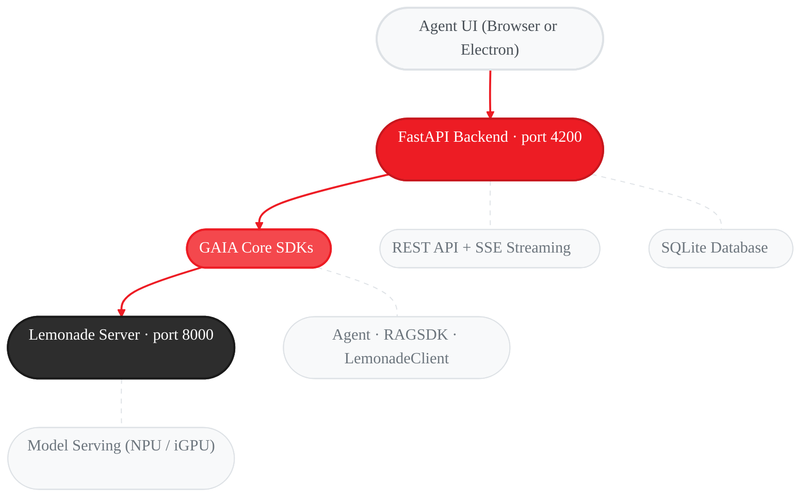

GAIA Agent UI is a desktop interface for running AI agents **100% locally** on your AMD hardware. Use agents to analyze documents, generate code, answer questions, and accomplish tasks on your PC — all without sending data to the cloud.

<Info>
  **Ready to install?** See the [Quickstart](/quickstart#agent-ui-fastest) for installation instructions.
</Info>

<Warning>
  **Requirements:** The Agent UI is currently supported on **Windows only** (Linux/macOS coming soon) and requires one of the following to run large language models locally:

  - **AMD Ryzen AI Max (Strix Halo)** — unified HBM memory (e.g. Ryzen AI MAX+ 395)
  - **AMD Radeon discrete GPU** with **≥ 24 GB VRAM** (e.g. RX 7900 XTX, Radeon Pro W7900)

  If your device is not supported, a banner will appear in the UI. You can dismiss it and continue, connect to a remote Lemonade server (`gaia --ui --base-url <url>`), or [request support on GitHub](https://github.com/amd/gaia/issues/new?template=feature_request.md&title=[Feature]%20Support%20Agent%20UI%20on%20additional%20devices&labels=enhancement,agent-ui). See the Troubleshooting section below for details.
</Warning>

---

## Before You Start

The Agent UI requires three things to be in place before you can chat. Run these steps once in order:

<Steps>
  <Step title="Install dependencies">
    Install GAIA with Agent UI support:
    ```bash
    pip install amd-gaia[ui]
    ```
    Or if developing locally:
    ```bash
    uv pip install -e ".[ui]"
    ```
  </Step>
  <Step title="Download models (first time only, ~25 GB)">
    This downloads Lemonade Server and the AI models needed for the Agent UI. Only required once:
    ```bash
    gaia init --profile chat
    ```
    The `chat` profile downloads a large language model, an embedding model for document Q&A, and a vision model for PDF image extraction — everything the Agent UI needs.
    <Note>
      Model downloads are large (~25 GB). Ensure you have at least **30 GB of free disk space** before running this command. Download time varies by internet speed (typically 15–60 minutes).
    </Note>
  </Step>
  <Step title="Start the LLM server">
    In a separate terminal, start Lemonade Server (must remain running while using the UI):
    ```bash
    lemonade-server serve
    ```
  </Step>
  <Step title="Launch the Agent UI">
    ```bash
    gaia chat --ui
    ```
    Then open [http://localhost:4200](http://localhost:4200) in your browser.
  </Step>
</Steps>

If any of these steps are incomplete, the Agent UI will display a banner explaining what needs to be fixed.

---

## What You Can Do

### Search and Browse Files

The agent has access to your local file system. Ask it to find files, explore directories, or locate specific content across your projects — no manual browsing required.

### Analyze Documents

Once the agent finds files — or you drag them into a session — it can index and analyze their content. Ask it to summarize, compare, extract data, or answer questions about any supported format:

- **Documents:** PDF, Word, PowerPoint, Excel, TXT, Markdown, CSV, JSON, HTML, XML, YAML
- **Code:** Python, JavaScript, TypeScript, Java, C/C++, Go, Rust, Ruby, Shell
- **Config:** INI, CFG, TOML, YAML, JSON, XML

### Session Management

Create, rename, search, export (Markdown/JSON), and delete sessions. Sessions persist across the CLI (`gaia chat`) and the Agent UI.

---

## Keyboard Shortcuts

| Shortcut | Action |
|----------|--------|
| `Enter` | Send task / message |
| `Shift+Enter` | New line |
| `Escape` | Stop agent response |
| `Ctrl+K` | Focus sidebar search |

---

## MCP Server

The Agent UI includes a built-in **MCP (Model Context Protocol) server** that exposes the full Agent UI as a set of tools. This lets external AI assistants — like **Claude Code**, **Cursor**, or any MCP-compatible client — interact with GAIA agents through the same backend that powers the web UI.

Conversations initiated via MCP appear in the browser UI in real time, so you can watch tool execution and agent activity as it happens.

The MCP server provides 15 tools for managing sessions, sending messages, indexing documents, browsing files, and more.

See the [Agent UI MCP Server guide](/guides/mcp/agent-ui) for setup instructions and usage examples.

---

## Troubleshooting

<AccordionGroup>
  <Accordion title="Lemonade Server not running">
    ```bash
    lemonade-server serve
    ```

    If not installed, run `gaia init --profile minimal` or follow the [Setup Guide](/setup).
  </Accordion>

  <Accordion title="No model loaded">
    Run `gaia init --profile chat` to download models and configure Lemonade Server in one step (~25 GB, required once):
    ```bash
    gaia init --profile chat
    ```
    If you've already run `gaia init` but need to re-download a specific agent's models:
    ```bash
    gaia download --agent chat
    ```
  </Accordion>

  <Accordion title="Port 4200 already in use">
    ```bash
    gaia --ui --ui-port 8080
    ```
  </Accordion>

  <Accordion title="Unsupported device warning banner">
    The Agent UI is currently supported on **Windows only** (Linux/macOS coming soon) and requires an AMD Ryzen AI Max (Strix Halo) or an AMD Radeon GPU with ≥ 24 GB VRAM to run large language models locally.

    If your device does not meet these requirements, a warning banner appears at the top of the UI. You can **dismiss it and continue** (the UI is fully functional — you may just hit memory limits depending on the model), or use one of these options:

    **Connect to a remote Lemonade server** — inference runs there; no local hardware requirements:
    ```bash
    gaia --ui --base-url https://your-server:8000/api/v1
    ```

    **Suppress the banner entirely** (environment variable):
    ```bash
    set GAIA_SKIP_DEVICE_CHECK=1 && gaia --ui
    ```

    To request support for your device, [open a GitHub issue](https://github.com/amd/gaia/issues/new?template=feature_request.md&title=[Feature]%20Support%20Agent%20UI%20on%20additional%20devices&labels=enhancement,agent-ui).
  </Accordion>

  <Accordion title="Database locked error">
    Close any other GAIA Agent UI or CLI instances. Only one writer at a time is supported.
  </Accordion>

  <Accordion title="Document indexing fails">
    - Ensure the file is a supported format and not password-protected
    - Keep file size under 100MB
    - For PDF image extraction, download the VLM model: `gaia download --agent chat`
  </Accordion>
</AccordionGroup>

---

## Architecture



For the REST API reference and backend classes, see the [Agent UI SDK Reference](/sdk/sdks/agent-ui).

---

## Next Steps

<CardGroup cols={2}>
  <Card title="Agent UI SDK Reference" icon="code" href="/sdk/sdks/agent-ui">
    REST endpoints, database schema, and Python backend API
  </Card>

  <Card title="Document Q&A Agent" icon="file-lines" href="/guides/chat">
    CLI-based document agent with RAG, debug mode, and chunking strategies
  </Card>

  <Card title="Build Your First Agent" icon="rocket" href="/quickstart#build-your-first-agent">
    Create a custom agent with tools in minutes
  </Card>

  <Card title="MCP Server" icon="plug" href="/guides/mcp/agent-ui">
    Connect Claude Code, Cursor, or any MCP client to the Agent UI
  </Card>
</CardGroup>

---

<small style="color: #666;">

**License**

Copyright(C) 2024-2026 Advanced Micro Devices, Inc. All rights reserved.

SPDX-License-Identifier: MIT

</small>
