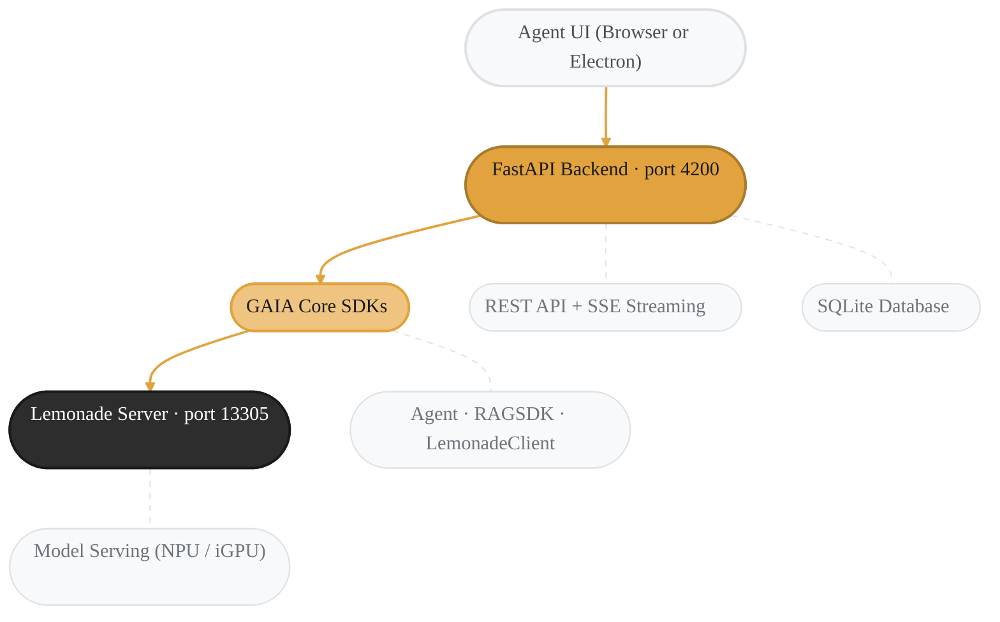

Ask your PC to find that contract you downloaded last month. Drop in a spreadsheet and get an instant analysis. Search across thousands of files in seconds. GAIA Agent UI puts a local AI agent in your browser — one that sees your files, understands your documents, and never sends a byte to the cloud.

<Info>
  New to GAIA? Start with the [Quickstart](/quickstart) for first-time setup, then come back here.
</Info>

{/* TODO: once the demo asset is uploaded to assets.amd-gaia.ai, replace this
    placeholder with a <video> element pointing at the gaia-agent-ui-demo.webm
    asset (full URL omitted here so the docs link checker doesn't 404 on the
    not-yet-uploaded path).
*/}

**Two commands to get started:**

```bash
npm install -g @amd-gaia/agent-ui
gaia-ui
```

Everything installs automatically — Python, the AI model, the backend. No accounts, no API keys, no cloud. Just your machine.

---

## What You Can Do

### Find Anything on Your PC

Ask the agent to locate files across your drives — by name, type, content, or recency. No more digging through folder trees.

> *"Find all Python files in my Downloads folder"*
>
> *"Show me the largest files on my Desktop"*
>
> *"Search my project for files that import pandas"*

The agent searches your common folders first, then offers a deep search across all drives if nothing turns up.

### Analyze Any Document

Drag files into the chat — or just ask the agent to find them. It indexes the content and lets you ask questions, extract data, compare sections, or get summaries. Works with:

| Category | Formats |
|----------|---------|
| **Documents** | PDF, Word, PowerPoint, Excel, TXT, Markdown |
| **Data** | CSV, JSON, XML, YAML, HTML |
| **Code** | Python, JavaScript, TypeScript, Java, C/C++, Go, Rust, Ruby, Shell |
| **Config** | INI, CFG, TOML |

> *"Summarize this PDF in 3 bullet points"*
>
> *"Compare these two contracts and list the differences"*
>
> *"What's the total spend in this expense report?"*

---

## Install

Pick the install path that fits you best:

<Tabs>
  <Tab title="Desktop installer (easiest)">
    Prebuilt desktop installers are published on the
    [GitHub Releases page](https://github.com/amd/gaia/releases) alongside
    each tagged release. They bundle the Electron shell; Lemonade Server and
    the default model are downloaded automatically on first launch. This is
    the simplest path for non-developer end users.

    **Artifact naming** (`electron-builder.yml`):
    `gaia-agent-ui-<version>-<arch>-setup.<ext>` — e.g. `gaia-agent-ui-0.17.2-x64-setup.exe`
    and `gaia-agent-ui-0.17.2-amd64.deb`.

    **Windows (.exe):**
    1. Download `gaia-agent-ui-<version>-x64-setup.exe` from [Releases](https://github.com/amd/gaia/releases).
    2. Double-click to install, then launch "GAIA" from the Start Menu (binary: `gaia-desktop`).
    3. Update by downloading and running the newer installer.
    4. Uninstall via Windows Settings → Apps → Installed apps → GAIA.

    **Ubuntu (.deb):**
    ```bash
    sudo apt install ./gaia-agent-ui-<version>-amd64.deb
    gaia-desktop
    # Update: apt install the newer .deb the same way.
    # Uninstall (apt package name is `gaia-desktop`):
    sudo apt remove gaia-desktop
    ```

    See the [Packaging & Distribution](/deployment/ui) page for more detail on
    the installers, supported platforms, and signing.
  </Tab>

  <Tab title="npm">
    The npm package handles everything — on first run it auto-installs Python, the GAIA backend, Lemonade Server, and a minimal model.

    **Requires:** [Node.js 20+](https://nodejs.org) (`winget install OpenJS.NodeJS.LTS` on Windows, `brew install node@20` on macOS)

    ```bash
    npm install -g @amd-gaia/agent-ui
    gaia-ui
    ```

    The Agent UI opens automatically at [http://127.0.0.1:4200](http://127.0.0.1:4200).

    | Flag | Description |
    |------|-------------|
    | `gaia-ui --port 8080` | Custom port |
    | `gaia-ui --no-open` | Don't auto-open the browser |
    | `gaia-ui --serve` | Serve frontend only (Node.js static server) |
    | `gaia-ui --version` | Show version |

    **Update:**

    ```bash
    npm install -g @amd-gaia/agent-ui@latest
    ```
  </Tab>

  <Tab title="Python CLI">
    If you already have GAIA installed via pip/uv:

    ```bash
    gaia --ui
    ```

    Or equivalently: `gaia chat --ui`

    The Agent UI starts on [http://127.0.0.1:4200](http://127.0.0.1:4200).

    | Flag | Description |
    |------|-------------|
    | `gaia --ui --ui-port 8080` | Custom port |
    | `gaia --ui --base-url http://192.168.1.100:13305/api/v1` | Connect to Lemonade on another machine |

    <Note>
      **Source/dev installs:** The frontend is built during `gaia init`. If you see a JSON response instead of the UI, run `gaia init` or manually build (from the repo root):

      ```bash
      cd src/gaia/apps/webui && npm install && npm run build
      ```
    </Note>

    <Note>
      If you see a missing dependencies error, install the UI extras:

      ```bash
      uv pip install "amd-gaia[ui]"
      ```
    </Note>

    **Prerequisites (Python path only):**

    The Python CLI path requires you to set up the backend manually:

    ```bash
    gaia init --profile chat    # Downloads Lemonade Server + model (~25 GB)
    lemonade-server serve       # Start the LLM server
    ```

    Use `--profile minimal` for a smaller download (~400 MB).
  </Tab>
</Tabs>

### Uninstall

<Tabs>
  <Tab title="npm">
    ```bash
    npm uninstall -g @amd-gaia/agent-ui
    ```

    To also remove all GAIA data (sessions, config, downloaded models):

    ```bash
    # macOS / Linux
    rm -rf ~/.gaia

    # Windows (PowerShell)
    Remove-Item -Recurse -Force "$env:USERPROFILE\.gaia"
    ```
  </Tab>

  <Tab title="Python CLI">
    ```bash
    uv pip uninstall amd-gaia
    ```

    To also remove all GAIA data:

    ```bash
    # macOS / Linux
    rm -rf ~/.gaia

    # Windows (PowerShell)
    Remove-Item -Recurse -Force "$env:USERPROFILE\.gaia"
    ```
  </Tab>
</Tabs>

---

## Roll back to a previous version

If an update introduces a regression, you can roll back to a specific earlier release directly from the app — no need to hunt down an old installer on GitHub.

**How to roll back (desktop installer only):**

1. Open **Settings → About**.
2. Click **"Roll back to a previous version"**.
3. The app fetches the list of published releases from GitHub and shows them newest-first, with your currently installed version marked.
4. Click an older release to open a confirmation step.
5. Confirm — the app downloads the selected version and shows a native "Restart now?" prompt when ready. Click Restart and the older version launches.

**Version pinning (AC2):** After a manual rollback, auto-update is automatically paused. The About section shows "Auto-update paused (pinned to vX.Y.Z)" so you know it's held. Click **Resume updates** in the same section to re-enable normal auto-updates.

### Platform support

| Platform | Rollback support |
|----------|-----------------|
| Windows (NSIS installer) | Full — download + reinstall works end-to-end |
| macOS (DMG/ZIP, signed builds) | Works on signed release builds; unsigned dev builds download but cannot apply the update |
| Linux AppImage | Supported (self-replacing) |
| Linux .deb | Not supported via in-app rollback — use `sudo apt install ./gaia-agent-ui-<version>-amd64.deb` from [Releases](https://github.com/amd/gaia/releases) |

<Note>
The rollback list only shows releases that have an installer for your current platform. Releases without a matching artifact are filtered out automatically.
</Note>

---

## Sessions and Shortcuts

Sessions let you organize conversations by topic. They sync between the CLI (`gaia chat`) and the Agent UI — start in one, pick up in the other. Export any session as Markdown or JSON from the session menu.

| Shortcut | Action |
|----------|--------|
| `Enter` | Send message |
| `Shift+Enter` | New line |
| `Escape` | Stop agent response |
| `Ctrl+K` | Search across sessions |

---

## Memory

The agent can remember facts, preferences, and decisions across sessions. Memory is **opt-in (beta)** and disabled by default — see the [Agent Memory guide](/guides/memory) to enable it and learn what the **Brain** icon's dashboard exposes.

---

## Scheduled Tasks

Run a prompt on a recurring schedule — "every morning at 9, summarize my inbox" — without leaving the UI. Click the **Clock** icon in the sidebar to open the Schedule Manager.

Describe the schedule in natural language; the parser previews the interpretation live before you create it:

| Input | Meaning |
|-------|---------|
| `every 30m` | Every 30 minutes |
| `every 6 hours` | Every 6 hours |
| `daily at 9pm` | Once a day at 21:00 |
| `every monday at 8am` | Weekly on Mondays at 08:00 |
| `every hour from 8am to 6pm` | Hourly inside a time window |

Each schedule runs in its own chat session, so the full history of runs (prompt + response per run) is one click away via the session list. Pause, resume, or delete schedules from the panel; run counts and the next-run countdown update live.

Behavior notes:

- Scheduled runs execute through the local LLM — nothing leaves your machine.
- Runs are **suspended while mobile access (tunnel) is active**, matching the autonomous agent loop's security posture. Set `GAIA_AUTONOMOUS_ALLOW_TUNNEL=1` to override.
- One run executes at a time; overlapping schedules queue.
- Per-run timeout defaults to 300 s; override with `GAIA_SCHEDULE_TIMEOUT`.

The REST API lives at `/api/schedules` (create/list/get), `/api/schedules/{name}` (pause/resume/cancel via `PUT`, delete via `DELETE`), `/api/schedules/{name}/results` (run history), and `/api/schedules/parse` (natural-language preview).

---

## Policy Alerts and Receipts

When a governance-enabled agent blocks a tool call, the Agent UI shows a
non-actionable policy alert instead of an approval prompt. Policy blocks appear
as inline **Policy Shield** activity cards, critical notifications, and a toast
with a **View receipt** link when a receipt ID is available.

Policy alerts are durable session history. If you reload the UI or reconnect
after a blocked request with no assistant text, the block reason, rule IDs,
policy version, and receipt ID remain attached to the assistant message.

---

## Extend with MCP

The agent supports the **Model Context Protocol** in both directions — connect external tools to expand what the agent can do, or expose the Agent UI itself so other AI tools can drive it.

<CardGroup cols={2}>
  <Card title="Add Tools to the Agent" icon="plug" href="/guides/mcp/client">
    Connect GitHub, Slack, databases, and more via MCP servers
  </Card>

  <Card title="Expose Agent UI to Other Tools" icon="server" href="/guides/mcp/agent-ui">
    Let Claude Code, Cursor, or any MCP client control GAIA agents
  </Card>
</CardGroup>

<Warning>
  Misconfigured MCP servers can cause slow responses. If you experience timeouts, check `~/.gaia/mcp_servers.json` and remove any servers you don't need. See [Troubleshooting](#llm-response-times-out-or-fails) for details.
</Warning>

---

## Troubleshooting

<AccordionGroup>
  <Accordion title="Lemonade Server not running">
    ```bash
    lemonade-server serve
    ```

    If not installed, run `gaia init --profile minimal` or follow the [Setup Guide](/setup).
  </Accordion>

  <Accordion title="No model loaded">
    ```bash
    gaia download --agent chat
    ```
  </Accordion>

  <Accordion title="Port 4200 already in use">
    ```bash
    # npm CLI
    gaia-ui --port 8080

    # Python CLI
    gaia --ui --ui-port 8080
    ```
  </Accordion>

  <Accordion title="Database locked error">
    Close any other GAIA Agent UI or CLI instances. Only one writer at a time is supported.
  </Accordion>

  <Accordion title="Document indexing fails">
    - Ensure the file is a supported format and not password-protected
    - Keep file size under 100MB
    - For PDF image extraction, download the VLM model: `gaia download --agent chat`
  </Accordion>

  <Accordion title="First-run network egress to huggingface.co">
    The first time you index a document, Lemonade Server pulls the embedding
    model (`user.embeddinggemma-300m-GGUF`, ~334 MB) from `huggingface.co`,
    cached under `~/.cache/huggingface/hub/`. Subsequent runs are offline.
    (Agent memory adds a small cross-encoder reranker,
    `cross-encoder/ms-marco-MiniLM-L-6-v2` (~22 MB), fetched via
    `sentence-transformers` on first hybrid search.)

    If your environment blocks `huggingface.co`, pre-seed the cache on a
    machine with internet access and copy it to the target machine, or set
    `HF_HOME` to point at a pre-populated cache directory before launching
    the UI.
  </Accordion>

  <Accordion title="Frontend shows JSON instead of the UI">
    The Agent UI frontend has not been built.

    **npm install (`gaia-ui`):** This is handled automatically — `gaia-ui` tells the Python server where to find the pre-built frontend. If you still see this error, try reinstalling: `npm install -g @amd-gaia/agent-ui@latest` Then restart with `gaia-ui`.

    **Source/dev installs (git clone):** Run `gaia init` to build it automatically, or manually (from the repo root):

    ```bash
    cd src/gaia/apps/webui && npm install && npm run build
    ```

    Then restart `gaia chat --ui`.

    **pip/PyPI installs (without gaia-ui):** Use the [npm install path](#install) — the pip package does not include frontend source files.
  </Accordion>

  <Accordion title="LLM response times out or fails">
    If you see "I wasn't able to generate a response" errors, check your MCP server configuration. Misconfigured or unreachable MCP servers cause the agent to wait up to 10 seconds per server before responding.

    Check your config:

    ```bash
    # macOS / Linux
    cat ~/.gaia/mcp_servers.json

    # Windows (PowerShell)
    Get-Content "$env:USERPROFILE\.gaia\mcp_servers.json"
    ```

    If it contains servers you don't recognize or aren't running, either remove them or reset the file:

    ```json
    { "mcpServers": {} }
    ```

    You can also manage MCP servers through the Agent UI settings panel or with the CLI:

    ```bash
    gaia mcp status
    ```
  </Accordion>
</AccordionGroup>

---

## Architecture



For the REST API reference and backend classes, see the [Agent UI SDK Reference](/sdk/sdks/agent-ui).

---

## Next Steps

<CardGroup cols={2}>
  <Card title="Agent UI SDK Reference" icon="code" href="/sdk/sdks/agent-ui">
    REST endpoints, database schema, and Python backend API
  </Card>

  <Card title="Document Q&A Agent" icon="file-lines" href="/guides/chat">
    CLI-based document agent with RAG, debug mode, and chunking strategies
  </Card>

  <Card title="Build Your First Agent" icon="rocket" href="/quickstart#build-your-first-agent">
    Create a custom agent with tools in minutes
  </Card>

  <Card title="MCP Server" icon="plug" href="/guides/mcp/agent-ui">
    Connect Claude Code, Cursor, or any MCP client to the Agent UI
  </Card>
</CardGroup>

---

<Note>
  **Hardware:** Tested on AMD Ryzen AI MAX+ 395 with Qwen3.5-35B-A3B-GGUF via Lemonade Server. Other configurations may work — [report issues here](https://github.com/amd/gaia/issues/new).
</Note>

<small style="color: #666;">

**License**

Copyright(C) 2024-2026 Advanced Micro Devices, Inc. All rights reserved.

SPDX-License-Identifier: MIT

</small>
