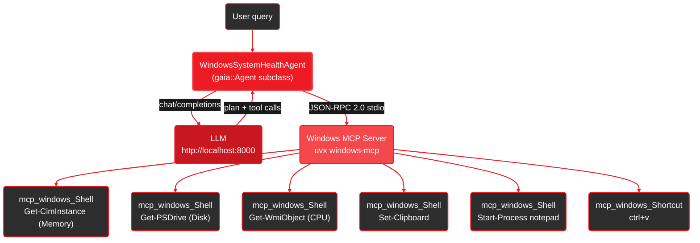
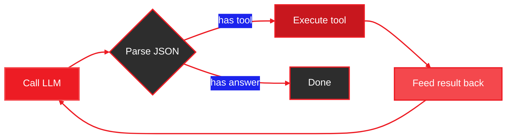

**A C++17 port of the GAIA base agent framework.** Drop AI agent capabilities into any C++ project — three lines of CMake, zero manual dependencies, any OpenAI-compatible LLM backend.

- **Native performance** — compiled binary, no interpreter overhead, no Python runtime
- **Easy integration** — add to any CMake project via FetchContent, git submodule, or find_package ([Integration Guide](/guides/cpp/integration))
- **Any LLM backend** — works with Lemonade, llama.cpp, Ollama, vLLM, OpenAI, or any OpenAI-compatible server ([details](/guides/cpp/integration#using-alternative-llm-backends))
- **Full MCP support** — connects to any MCP server via stdio transport
- **Same agent loop** — planning, tool execution, error recovery, multi-step plans

<Info>
**Source Code:** [`cpp/`](https://github.com/amd/gaia/tree/main/cpp) — lives alongside the Python package in this repository.
</Info>

<Note>
The C++ framework targets the base agent only. Specialized agents (Code, Docker, Jira, etc.), the REST API server, RAG, and audio are Python-only. See the [Python quickstart](/quickstart) for the full feature set.
</Note>

## Use in Your Project

Add `gaia_core` to any C++ project with three lines of CMake:

```cmake
FetchContent_Declare(gaia GIT_REPOSITORY https://github.com/amd/gaia.git GIT_TAG main SOURCE_SUBDIR cpp)
FetchContent_MakeAvailable(gaia)
target_link_libraries(my_app PRIVATE gaia::gaia_core)
```

All dependencies are resolved automatically. See the [Integration Guide](/guides/cpp/integration) for git submodule, find_package, and shared library methods.

## Quick Start

<Steps>
  <Step title="Install prerequisites">
    Install [Visual Studio 2022](https://visualstudio.microsoft.com/) (Desktop C++ workload) and [CMake 3.14+](https://cmake.org/download/). Git must be on your PATH (required by CMake FetchContent).

    Also install `uv` for the Windows MCP server:
    ```bash
    pip install uv
    ```
  </Step>

  <Step title="Build">
    From the repository root:

    <Tabs>
      <Tab title="Windows (MSVC)">
        ```bat
        cd cpp
        cmake -B build -G "Visual Studio 17 2022" -A x64
        cmake --build build --config Release
        ```
        Binaries land in `cpp\build\Release\`.
      </Tab>
      <Tab title="Windows (Ninja)">
        ```bat
        cd cpp
        cmake -B build -G Ninja -DCMAKE_BUILD_TYPE=Release
        cmake --build build
        ```
      </Tab>
      <Tab title="Linux / macOS">
        ```bash
        cd cpp
        cmake -B build -DCMAKE_BUILD_TYPE=Release
        cmake --build build
        ```
      </Tab>
    </Tabs>

    All dependencies (nlohmann/json, cpp-httplib, Google Test) are fetched automatically — no manual installs.
  </Step>

  <Step title="Start Lemonade Server">
    The agent connects to an OpenAI-compatible LLM at `http://localhost:8000/api/v1` by default.

    ```bash
    lemonade-server serve
    ```

    See [Setup Guide](/setup) to install Lemonade and download a model.
  </Step>

  <Step title="Run a demo">
    **Option A: Windows CUA demo** (requires MCP server + `uv`):
    ```bat
    cpp\build\Release\simple_agent.exe
    ```
    The agent connects to the Windows MCP server, gathers CPU/memory/disk metrics via PowerShell, and pastes a formatted report into Notepad.

    **Option B: Wi-Fi Troubleshooter** (no dependencies, run as admin for fix tools):
    ```bat
    cpp\build\Release\wifi_agent.exe
    ```
    Select GPU or NPU backend, then try "Full network diagnostic" or ask a specific question. The agent reasons about each result and adapts its approach in real-time.

    Type `quit` to exit either demo.
  </Step>
</Steps>

## How It Works

The `simple_agent` demo is a C++ port of the [Windows System Health Agent](/guides/mcp/windows-system-health). It subclasses `gaia::Agent`, connects to the Windows MCP server on startup, then enters the same planning loop as the Python version.



**Execution flow:**
1. User query enters `agent.processQuery()`
2. Agent composes a system prompt (tool list + response format) and calls the LLM
3. LLM returns structured JSON with reasoning and a tool call
4. Agent executes the tool (via MCP or registered callback) and feeds the result back
5. LLM reasons about the result, decides the next action, and the loop continues
6. When the LLM has enough information, it provides a final answer

## Wi-Fi Troubleshooter Demo

The `wifi_agent` demonstrates **adaptive reasoning** without MCP — all tools are registered directly in C++ as PowerShell commands. This showcases how an agent differs from a script: it reasons about each result, skips irrelevant steps, applies fixes, and verifies outcomes.

**Key features:**
- **Structured reasoning** — LLM outputs `FINDING:` and `DECISION:` prefixes, displayed with color-coded labels in the TUI
- **Adaptive behavior** — skips downstream checks if adapter is disconnected, adds fix/verify steps when issues are found
- **Real tools** — all diagnostics (`netsh`, `ipconfig`, `Test-NetConnection`) and fixes (`flush DNS`, `toggle Wi-Fi radio`, `restart adapter`) execute real PowerShell commands
- **GPU/NPU selection** — choose between GGUF (GPU) and FLM (NPU) model backends at startup
- **Admin detection** — warns on startup if fix tools won't work without elevation

## Under the Hood

### Reactive Agent Loop

The agent is **not a script**. After every tool execution, the LLM is called again with the full conversation so far — including the tool's output. This lets the model reason about results and change course.



Each loop iteration: **LLM reasons → agent executes → result fed back → LLM reasons again**. The LLM can skip steps, add new ones, or pivot strategy at any point.

### How Tools Are Implemented

Tools are C++ lambdas registered with `ToolRegistry`. The Wi-Fi agent's tools wrap PowerShell commands via a `runShell()` helper that uses `_popen()` to spawn a PowerShell subprocess:

```cpp
// Simplified — each tool follows this pattern:
toolRegistry().registerTool(
    "check_adapter",                          // name the LLM sees
    "Check Wi-Fi adapter status and signal",  // description the LLM reads
    [](const gaia::json& args) -> gaia::json {
        std::string output = runShell("netsh wlan show interfaces");
        return {{"tool", "check_adapter"}, {"output", output}};
    },
    {}  // parameter schema
);
```

The agent itself is pure C++. PowerShell is just the shell subprocess that executes system commands (`netsh`, `ipconfig`, `Test-NetConnection`). For complex operations like the WinRT Radio API, the tool writes a temporary `.ps1` script and runs it via `powershell -File`.

### Structured Reasoning Display

The system prompt instructs the LLM to prefix its reasoning with `FINDING:` and `DECISION:`. The custom `CleanConsole` output handler parses these and displays them with color-coded labels:

- **Finding** (green) — what the diagnostic data shows
- **Decision** (yellow) — what the agent will do next and *why*

This is what distinguishes an agent from a script: the decision points are visible. When the agent skips a step ("adapter is disconnected — IP checks would fail"), applies a fix, or re-runs a diagnostic to verify, you can see the reasoning that drove that choice.

## Writing Your Own Agent

Subclass `gaia::Agent`, override `getSystemPrompt()` and optionally `registerTools()`, then call `init()` at the end of your constructor:

```cpp
#include <gaia/agent.h>

class MyAgent : public gaia::Agent {
public:
    MyAgent() : Agent(makeConfig()) {
        init();  // registers tools and composes system prompt
    }

protected:
    std::string getSystemPrompt() const override {
        return "You are a helpful assistant. Use tools to answer questions.";
    }

    void registerTools() override {
        toolRegistry().registerTool(
            "get_time",
            "Return the current UTC time.",
            [](const gaia::json&) -> gaia::json {
                return {{"time", "2026-02-24T00:00:00Z"}};
            },
            {}  // no parameters
        );
    }

private:
    static gaia::AgentConfig makeConfig() {
        gaia::AgentConfig cfg;
        cfg.baseUrl = "http://localhost:8000/api/v1";
        cfg.modelId = "Qwen3-4B-GGUF";  // or any model on your server
        cfg.maxSteps = 20;
        return cfg;
    }
};

int main() {
    MyAgent agent;
    auto result = agent.processQuery("What time is it?");
    std::cout << result["result"].get<std::string>() << std::endl;
}
```

To connect an MCP server and auto-register its tools:

```cpp
agent.connectMcpServer("my_server", {
    {"command", "uvx"},
    {"args", {"my-mcp-package"}}
});
// Tools are now available as mcp_my_server_<tool_name>
```

## AgentConfig Reference

| Field | Default | Description |
|-------|---------|-------------|
| `baseUrl` | `http://localhost:8000/api/v1` | LLM server endpoint (any OpenAI-compatible server) |
| `modelId` | `Qwen3-4B-GGUF` | Model identifier sent to the server |
| `maxSteps` | `20` | Maximum agent loop iterations per query |
| `maxPlanIterations` | `3` | Maximum plan/replan cycles before forcing completion |
| `maxConsecutiveRepeats` | `4` | Consecutive identical responses before loop-detection triggers |
| `maxHistoryMessages` | `40` | Max messages kept between queries (0 = unlimited) |
| `contextSize` | `16384` | LLM context window size in tokens (`n_ctx`) |
| `debug` | `false` | Enable verbose debug logging to stdout |
| `showPrompts` | `false` | Print full system prompts and LLM responses |
| `streaming` | `false` | Enable streaming responses from the LLM |
| `silentMode` | `false` | Suppress all console output (use `SilentConsole`) |

## Running Tests

```bat
cd cpp\build
ctest -C Release --output-on-failure
```

Or directly:

```bat
cpp\build\Release\gaia_tests.exe --gtest_color=yes
```

The test suite covers all six modules: agent loop, tool registry, JSON utilities, MCP client, console output, and types.

## Comparison with Python GAIA

| Feature | Python | C++ |
|---------|--------|-----|
| Agent loop (plan → tool → answer) | ✓ | ✓ |
| Tool registration | ✓ | ✓ |
| MCP client (stdio) | ✓ | ✓ |
| JSON parsing with fallbacks | ✓ | ✓ |
| OpenAI-compatible LLM backend | ✓ | ✓ |
| Multiple LLM providers (Claude, OpenAI) | ✓ | planned |
| Specialized agents (Code, Docker, Jira…) | ✓ | not ported |
| REST API server | ✓ | not ported |
| Audio / RAG / Stable Diffusion | ✓ | not ported |

## Next Steps

<CardGroup cols={2}>
  <Card title="Integration Guide" icon="puzzle-piece" href="/guides/cpp/integration">
    FetchContent, git submodule, find_package, shared library — plus alternative LLM backends
  </Card>

  <Card title="Customizing Your Agent" icon="sliders" href="/guides/cpp/custom-agent">
    Custom prompts, typed tools, MCP servers, output capture, and AgentConfig tuning
  </Card>

  <Card title="Wi-Fi Troubleshooter Agent" icon="wifi" href="/guides/cpp/wifi-agent">
    Full network diagnostic and auto-fix using only registered C++ tools
  </Card>

  <Card title="C++ Source Code" icon="code" href="https://github.com/amd/gaia/tree/main/cpp">
    Browse the full C++ implementation on GitHub
  </Card>
</CardGroup>

---

<small style="color: #666;">

**License**

Copyright(C) 2025-2026 Advanced Micro Devices, Inc. All rights reserved.

SPDX-License-Identifier: MIT

</small>
