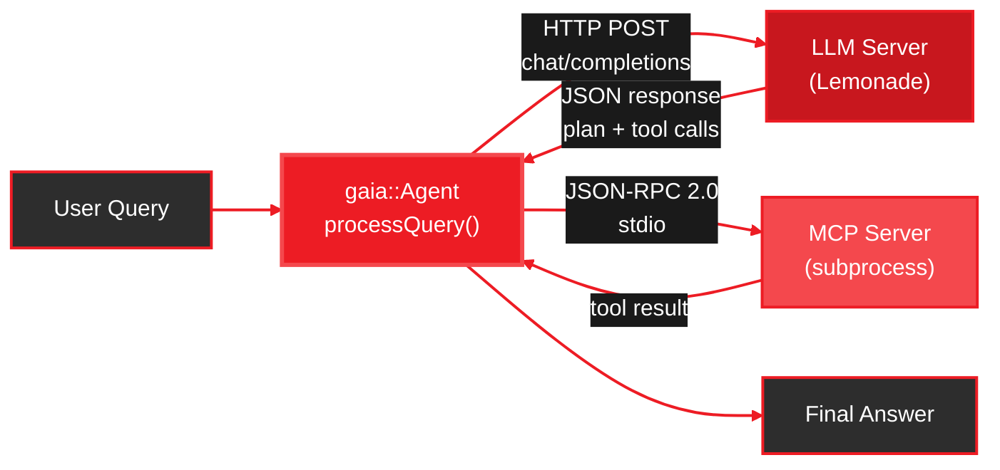

<Info>
  **Source Code:** [`cpp/`](https://github.com/amd/gaia/tree/main/cpp) -- lives alongside the Python package in the GAIA repository.
</Info>

<Note>
**Component:** `gaia::Agent` base class and supporting libraries
**Language:** C++17
**Build system:** CMake 3.14+
**Dependencies:** nlohmann/json, cpp-httplib, Google Test (all fetched automatically)
</Note>

---

## Overview

The GAIA C++ framework is a native C++17 port of the Python base agent (`src/gaia/agents/base/agent.py`). It compiles to a standalone binary with no Python runtime, interpreter overhead, or pip dependencies at runtime.

**What it implements:**

- Agent execution loop with state machine (planning, tool execution, error recovery, completion)
- Tool registry with explicit `registerTool()` calls (C++ equivalent of the Python `@tool` decorator)
- MCP client with cross-platform stdio transport (Win32 `CreateProcess`/pipes on Windows, `fork`/`exec`/pipes on POSIX)
- JSON response parsing with multi-strategy fallback (code-block extraction, bracket matching, syntax fixing)
- Console output with ANSI colors (`TerminalConsole`) and silent mode (`SilentConsole`)

**What it does NOT port:**

Specialized agents (Code, Docker, Jira, Blender), the REST API server, RAG, audio (ASR/TTS), and Stable Diffusion remain Python-only. See the [Python quickstart](/quickstart) for the full feature set.

---

## Agent Execution Flow



1. User query enters `agent.processQuery()`
2. Agent composes a system prompt (tool descriptions + response format) and sends it to the LLM via HTTP
3. LLM returns a JSON plan with tool calls
4. Agent executes each tool -- either a locally registered C++ callback or a remote MCP tool via JSON-RPC 2.0 over stdio
5. Tool results feed back to the LLM for further reasoning
6. Loop repeats until the LLM produces a final answer or the step limit is reached

---

## Quick Start

### Prerequisites

| Tool | Minimum Version | Notes |
|------|----------------|-------|
| CMake | 3.14+ | `cmake --version` |
| C++ Compiler | C++17 | MSVC 2019+, GCC 9+, or Clang 10+ |
| Git | any | Required by CMake FetchContent |
| Lemonade Server | latest | OpenAI-compatible LLM backend |

<Info>
  **First time here?** Complete the [Setup](/setup) guide first to install Lemonade Server and download a model.
</Info>

### Build

<Steps>
  <Step title="Clone the repository">
    ```bash
    git clone https://github.com/amd/gaia.git
    cd gaia
    ```
  </Step>

  <Step title="Configure and build">
    <Tabs>
      <Tab title="Windows (MSVC)">
        ```bat
        cd cpp
        cmake -B build -G "Visual Studio 17 2022" -A x64
        cmake --build build --config Release
        ```
        Binaries land in `cpp\build\Release\`.
      </Tab>
      <Tab title="Windows (Ninja)">
        ```bat
        cd cpp
        cmake -B build -G Ninja -DCMAKE_BUILD_TYPE=Release
        cmake --build build
        ```
      </Tab>
      <Tab title="Linux / macOS">
        ```bash
        cd cpp
        cmake -B build -DCMAKE_BUILD_TYPE=Release
        cmake --build build
        ```
        Binaries land in `cpp/build/`.
      </Tab>
    </Tabs>

    All dependencies (nlohmann/json, cpp-httplib, Google Test) are fetched automatically by CMake -- no manual installs required.
  </Step>

  <Step title="Start Lemonade Server">
    The agent connects to an OpenAI-compatible LLM at `http://localhost:8000/api/v1` by default.

    ```bash
    lemonade-server serve
    ```
  </Step>

  <Step title="Run the demo agent">
    <Tabs>
      <Tab title="Windows">
        ```bat
        cpp\build\Release\simple_agent.exe
        ```
      </Tab>
      <Tab title="Linux / macOS">
        ```bash
        ./cpp/build/simple_agent
        ```
      </Tab>
    </Tabs>

    Then try:
    ```
    You: Run a full system health analysis.
    ```

    The agent connects to the Windows MCP server, gathers CPU/memory/disk metrics via PowerShell, and pastes a formatted report into Notepad. Type `quit` to exit.
  </Step>
</Steps>

---

## AgentConfig Reference

All fields have sensible defaults. Override only what you need:

```cpp
gaia::AgentConfig config;
config.baseUrl = "http://localhost:8000/api/v1";
config.maxSteps = 30;
config.debug = true;
```

| Field | Type | Default | Description |
|-------|------|---------|-------------|
| `baseUrl` | `std::string` | `"http://localhost:8000/api/v1"` | LLM server endpoint (OpenAI-compatible) |
| `modelId` | `std::string` | `"Qwen3-4B-GGUF"` | Model identifier sent to the server |
| `maxSteps` | `int` | `20` | Maximum agent loop iterations per query |
| `maxPlanIterations` | `int` | `3` | Maximum plan/replan cycles before forcing completion |
| `maxConsecutiveRepeats` | `int` | `4` | Consecutive identical responses before loop-detection triggers |
| `debug` | `bool` | `false` | Enable verbose debug logging to stdout |
| `showPrompts` | `bool` | `false` | Print full system prompts and LLM responses |
| `silentMode` | `bool` | `false` | Suppress all console output (use `SilentConsole`) |
| `streaming` | `bool` | `false` | Enable streaming responses from the LLM |

---

## Writing Your Own Agent

Subclass `gaia::Agent`, override `getSystemPrompt()` and optionally `registerTools()`, then call `init()` at the end of your constructor:

```cpp
#include <gaia/agent.h>

class MyAgent : public gaia::Agent {
public:
    MyAgent() : Agent(makeConfig()) {
        init();  // registers tools and composes system prompt
    }

protected:
    std::string getSystemPrompt() const override {
        return "You are a helpful assistant. Use tools to answer questions.";
    }

    void registerTools() override {
        toolRegistry().registerTool(
            "get_time",
            "Return the current UTC time.",
            [](const gaia::json&) -> gaia::json {
                return {{"time", "2026-02-24T00:00:00Z"}};
            },
            {}  // no parameters
        );
    }

private:
    static gaia::AgentConfig makeConfig() {
        gaia::AgentConfig cfg;
        cfg.maxSteps = 20;
        return cfg;
    }
};

int main() {
    MyAgent agent;
    auto result = agent.processQuery("What time is it?");
    std::cout << result["result"].get<std::string>() << std::endl;
}
```

<Note>
**Why `init()` in the constructor?** C++ virtual dispatch does not work from base-class constructors. Calling `init()` at the end of your subclass constructor ensures `registerTools()` and `getSystemPrompt()` resolve to your overrides.
</Note>

### Connecting MCP Servers

Register all tools exposed by an MCP server with a single call:

```cpp
agent.connectMcpServer("my_server", {
    {"command", "uvx"},
    {"args", {"my-mcp-package"}}
});
// Tools are available as mcp_my_server_<tool_name>
```

---

## Project Structure

```
cpp/
  CMakeLists.txt            # Build config (fetches all dependencies)
  include/gaia/
    agent.h                 # Core Agent class (processQuery, MCP connect)
    types.h                 # AgentConfig, Message, ToolInfo, ParsedResponse
    tool_registry.h         # Tool registration and execution
    mcp_client.h            # MCP JSON-RPC client (stdio transport)
    json_utils.h            # JSON extraction with multi-strategy fallback
    console.h               # TerminalConsole / SilentConsole output handlers
  src/
    agent.cpp               # Agent loop state machine
    tool_registry.cpp
    mcp_client.cpp          # Cross-platform subprocess + pipes
    json_utils.cpp
    console.cpp
  examples/
    simple_agent.cpp        # Windows System Health Agent (CUA demo)
  tests/
    test_agent.cpp
    test_tool_registry.cpp
    test_json_utils.cpp
    test_mcp_client.cpp
    test_console.cpp
    test_types.cpp
```

---

## Comparison with Python GAIA

| Feature | Python | C++ |
|---------|--------|-----|
| Agent loop (plan, tool, answer) | Yes | Yes |
| Tool registration | Yes | Yes |
| MCP client (stdio) | Yes | Yes |
| JSON parsing with fallbacks | Yes | Yes |
| OpenAI-compatible LLM backend | Yes | Yes |
| Multiple LLM providers (Claude, OpenAI) | Yes | Planned |
| Specialized agents (Code, Docker, Jira) | Yes | Not ported |
| REST API server | Yes | Not ported |
| Audio / RAG / Stable Diffusion | Yes | Not ported |

---

## Running Tests

```bat
cd cpp/build
ctest -C Release --output-on-failure
```

Or run the test binary directly:

<Tabs>
  <Tab title="Windows">
    ```bat
    cpp\build\Release\gaia_tests.exe --gtest_color=yes
    ```
  </Tab>
  <Tab title="Linux / macOS">
    ```bash
    ./cpp/build/gaia_tests --gtest_color=yes
    ```
  </Tab>
</Tabs>

The test suite covers all six modules: agent loop, tool registry, JSON utilities, MCP client, console output, and types.

---

## Next Steps

<CardGroup cols={2}>
  <Card title="Integration Guide" icon="puzzle-piece" href="/guides/cpp/integration">
    Consume gaia_core in your own CMake project via FetchContent, find_package, or shared library
  </Card>

  <Card title="Customizing Your Agent" icon="sliders" href="/guides/cpp/custom-agent">
    Step-by-step: custom prompts, typed tools, MCP servers, output capture, and AgentConfig tuning
  </Card>

  <Card title="Windows System Health Agent" icon="desktop" href="/guides/mcp/windows-system-health">
    The Python version of the same demo -- compare the two implementations
  </Card>

  <Card title="MCP Client Guide" icon="plug" href="/guides/mcp/client">
    How MCP client-server integration works in GAIA
  </Card>

  <Card title="SDK Core Concepts" icon="book" href="/sdk/core/agent-system">
    Understand the Python agent loop that the C++ port mirrors
  </Card>
</CardGroup>

---

<small style="color: #666;">

**License**

Copyright(C) 2025-2026 Advanced Micro Devices, Inc. All rights reserved.

SPDX-License-Identifier: MIT

</small>
