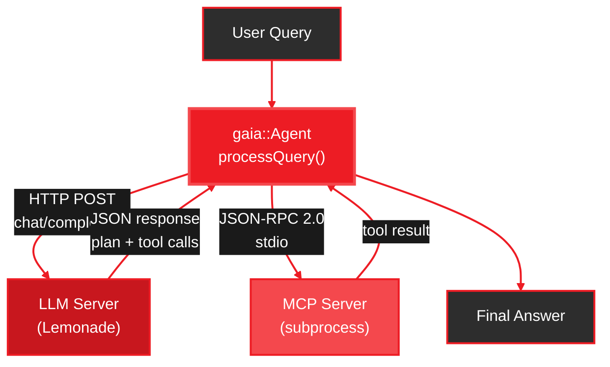
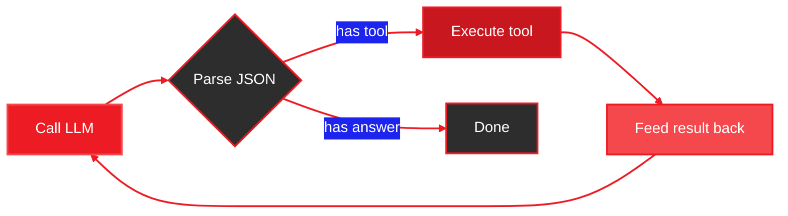
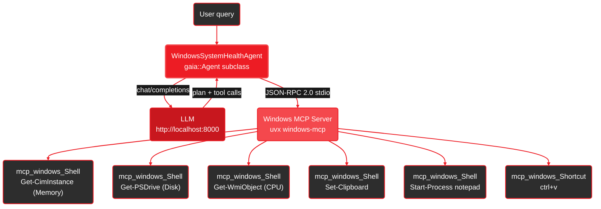

<Info>
  **Source Code:** [`cpp/`](https://github.com/amd/gaia/tree/main/cpp) — lives alongside the Python package in the GAIA repository.
</Info>

<Note>
**Component:** `gaia::Agent` base class and supporting libraries
**Language:** C++17
**Build system:** CMake 3.14+
**Dependencies:** nlohmann/json, cpp-httplib, Google Test (all fetched automatically)
</Note>

---

## Overview

The GAIA C++ framework is a native C++17 port of the Python base agent (`src/gaia/agents/base/agent.py`). It compiles to a standalone binary with no Python runtime, interpreter overhead, or pip dependencies at runtime.

**What it implements:**

- Agent execution loop with state machine (planning, tool execution, error recovery, completion)
- Tool registry with explicit `registerTool()` calls (C++ equivalent of the Python `@tool` decorator)
- MCP client with cross-platform stdio transport (Win32 `CreateProcess`/pipes on Windows, `fork`/`exec`/pipes on POSIX)
- JSON response parsing with multi-strategy fallback (code-block extraction, bracket matching, syntax fixing)
- Console output with ANSI colors (`TerminalConsole`) and silent mode (`SilentConsole`)

**What it does NOT port:**

Specialized agents (Code, Docker, Jira, Blender), the REST API server, RAG, audio (ASR/TTS), and Stable Diffusion remain Python-only. See the [Python quickstart](/quickstart) for the full feature set.

---

## Agent Execution Flow


```mermaid
%%{init: {'theme':'base', 'themeVariables': { 'primaryColor':'#ED1C24', 'fontSize':'16px', 'lineColor':'#ED1C24', 'primaryTextColor':'#fff', 'edgeLabelBackground':'#1a1a1a'}, 'flowchart': {'curve': 'basis'}}}%%
flowchart TD
    A["User Query"] --> B["gaia::Agent<br/>processQuery()"]
    B -->|"HTTP POST<br/>chat/completions"| C["LLM Server<br/>(Lemonade)"]
    C -->|"JSON response<br/>plan + tool calls"| B
    B -->|"JSON-RPC 2.0<br/>stdio"| D["MCP Server<br/>(subprocess)"]
    D -->|"tool result"| B
    B --> E["Final Answer"]

    style A fill:#2d2d2d,stroke:#ED1C24,stroke-width:2px,color:#fff
    style B fill:#ED1C24,stroke:#F4484D,stroke-width:3px,color:#fff
    style C fill:#C8171E,stroke:#ED1C24,stroke-width:2px,color:#fff
    style D fill:#F4484D,stroke:#ED1C24,stroke-width:2px,color:#fff
    style E fill:#2d2d2d,stroke:#ED1C24,stroke-width:2px,color:#fff
    linkStyle default stroke:#ED1C24,stroke-width:2px
```

1. User query enters `agent.processQuery()`
2. Agent composes a system prompt (tool descriptions + response format) and sends it to the LLM via HTTP
3. LLM returns a JSON plan with tool calls
4. Agent executes each tool — either a locally registered C++ callback or a remote MCP tool via JSON-RPC 2.0 over stdio
5. Tool results feed back to the LLM for further reasoning
6. Loop repeats until the LLM produces a final answer or the step limit is reached

### Reactive Agent Loop

The agent is **not a script**. After every tool execution, the LLM is called again with the full conversation so far — including the tool's output. This lets the model reason about results and change course.


```mermaid
%%{init: {'theme':'base', 'themeVariables': { 'primaryColor':'#ED1C24', 'fontSize':'16px', 'lineColor':'#ED1C24', 'primaryTextColor':'#fff'}, 'flowchart': {'curve': 'basis'}}}%%
graph LR
    A["Call LLM"] --> B{"Parse JSON"}
    B -->|"has tool"| C["Execute tool"]
    C --> D["Feed result back"]
    D --> A
    B -->|"has answer"| E["Done"]

    style A fill:#ED1C24,stroke:#F4484D,stroke-width:2px,color:#fff
    style B fill:#2d2d2d,stroke:#ED1C24,stroke-width:2px,color:#fff
    style C fill:#C8171E,stroke:#ED1C24,stroke-width:2px,color:#fff
    style D fill:#F4484D,stroke:#ED1C24,stroke-width:2px,color:#fff
    style E fill:#2d2d2d,stroke:#ED1C24,stroke-width:2px,color:#fff
    linkStyle default stroke:#ED1C24,stroke-width:2px
```

Each loop iteration: **LLM reasons → agent executes → result fed back → LLM reasons again**. The LLM can skip steps, add new ones, or pivot strategy at any point.

---

## How It Works

The `simple_agent` demo is a C++ port of the [Windows System Health Agent](/guides/mcp/windows-system-health). It subclasses `gaia::Agent`, connects to the Windows MCP server on startup, then enters the same planning loop as the Python version.


```mermaid
%%{init: {'theme':'base', 'themeVariables': { 'primaryColor':'#ED1C24', 'fontSize':'18px', 'lineColor':'#ED1C24', 'primaryTextColor':'#fff', 'edgeLabelBackground':'#1a1a1a'}, 'flowchart': {'curve': 'basis'}}}%%
graph TB
    User("User query")
    Agent("WindowsSystemHealthAgent<br/>gaia::Agent subclass")
    LLM("LLM<br/>http://localhost:8000")
    MCP("Windows MCP Server<br/>uvx windows-mcp")

    User --> Agent
    Agent -->|"chat/completions"| LLM
    LLM -->|"plan + tool calls"| Agent
    Agent -->|"JSON-RPC 2.0 stdio"| MCP

    MCP --> Shell1("mcp_windows_Shell<br/>Get-CimInstance (Memory)")
    MCP --> Shell2("mcp_windows_Shell<br/>Get-PSDrive (Disk)")
    MCP --> Shell3("mcp_windows_Shell<br/>Get-WmiObject (CPU)")
    MCP --> Clipboard("mcp_windows_Shell<br/>Set-Clipboard")
    MCP --> Notepad("mcp_windows_Shell<br/>Start-Process notepad")
    MCP --> Paste("mcp_windows_Shortcut<br/>ctrl+v")

    style User fill:#2d2d2d,stroke:#ED1C24,stroke-width:2px,color:#fff
    style Agent fill:#ED1C24,stroke:#F4484D,stroke-width:3px,color:#fff
    style LLM fill:#C8171E,stroke:#ED1C24,stroke-width:2px,color:#fff
    style MCP fill:#F4484D,stroke:#ED1C24,stroke-width:2px,color:#fff
    style Shell1 fill:#2d2d2d,stroke:#ED1C24,stroke-width:2px,color:#fff
    style Shell2 fill:#2d2d2d,stroke:#ED1C24,stroke-width:2px,color:#fff
    style Shell3 fill:#2d2d2d,stroke:#ED1C24,stroke-width:2px,color:#fff
    style Clipboard fill:#2d2d2d,stroke:#ED1C24,stroke-width:2px,color:#fff
    style Notepad fill:#2d2d2d,stroke:#ED1C24,stroke-width:2px,color:#fff
    style Paste fill:#2d2d2d,stroke:#ED1C24,stroke-width:2px,color:#fff

    linkStyle default stroke:#ED1C24,stroke-width:2px
```

### Wi-Fi Troubleshooter Demo

The `wifi_agent` demonstrates **adaptive reasoning** without MCP — all tools are registered directly in C++ as PowerShell commands. This showcases how an agent differs from a script: it reasons about each result, skips irrelevant steps, applies fixes, and verifies outcomes.

**Key features:**
- **Structured reasoning** — LLM outputs `FINDING:` and `DECISION:` prefixes, displayed with color-coded labels in the TUI
- **Adaptive behavior** — skips downstream checks if adapter is disconnected, adds fix/verify steps when issues are found
- **Real tools** — all diagnostics (`netsh`, `ipconfig`, `Test-NetConnection`) and fixes (`flush DNS`, `toggle Wi-Fi radio`, `restart adapter`) execute real PowerShell commands
- **GPU/NPU selection** — choose between GGUF (GPU) and FLM (NPU) model backends at startup
- **Admin detection** — warns on startup if fix tools won't work without elevation

See the [Wi-Fi Troubleshooter Agent guide](/guides/cpp/wifi-agent) for a full walkthrough.

### How Tools Are Implemented

Tools are C++ lambdas registered with `ToolRegistry`. The Wi-Fi agent's tools wrap PowerShell commands via a `runShell()` helper that uses `_popen()` to spawn a PowerShell subprocess:

```cpp
// Simplified — each tool follows this pattern:
toolRegistry().registerTool(
    "check_adapter",                          // name the LLM sees
    "Check Wi-Fi adapter status and signal",  // description the LLM reads
    [](const gaia::json& args) -> gaia::json {
        std::string output = runShell("netsh wlan show interfaces");
        return {{"tool", "check_adapter"}, {"output", output}};
    },
    {}  // parameter schema
);
```

The agent itself is pure C++. PowerShell is just the shell subprocess that executes system commands (`netsh`, `ipconfig`, `Test-NetConnection`). For complex operations like the WinRT Radio API, the tool writes a temporary `.ps1` script and runs it via `powershell -File`.

### Structured Reasoning Display

The system prompt instructs the LLM to prefix its reasoning with `FINDING:` and `DECISION:`. The custom `CleanConsole` output handler parses these and displays them with color-coded labels:

- **Finding** (green) — what the diagnostic data shows
- **Decision** (yellow) — what the agent will do next and *why*

This is what distinguishes an agent from a script: the decision points are visible. When the agent skips a step ("adapter is disconnected — IP checks would fail"), applies a fix, or re-runs a diagnostic to verify, you can see the reasoning that drove that choice.

---

## Writing Your Own Agent

Subclass `gaia::Agent`, override `getSystemPrompt()` and optionally `registerTools()`, then call `init()` at the end of your constructor:

```cpp
#include <gaia/agent.h>

class MyAgent : public gaia::Agent {
public:
    MyAgent() : Agent(makeConfig()) {
        init();  // registers tools and composes system prompt
    }

protected:
    std::string getSystemPrompt() const override {
        return "You are a helpful assistant. Use tools to answer questions.";
    }

    void registerTools() override {
        toolRegistry().registerTool(
            "get_time",
            "Return the current UTC time.",
            [](const gaia::json&) -> gaia::json {
                return {{"time", "2026-02-24T00:00:00Z"}};
            },
            {}  // no parameters
        );
    }

private:
    static gaia::AgentConfig makeConfig() {
        gaia::AgentConfig cfg;
        cfg.maxSteps = 20;
        return cfg;
    }
};

int main() {
    MyAgent agent;
    auto result = agent.processQuery("What time is it?");
    std::cout << result["result"].get<std::string>() << std::endl;
}
```

<Note>
**Why `init()` in the constructor?** C++ virtual dispatch does not work from base-class constructors. Calling `init()` at the end of your subclass constructor ensures `registerTools()` and `getSystemPrompt()` resolve to your overrides.
</Note>

### Connecting MCP Servers

Register all tools exposed by an MCP server with a single call:

```cpp
agent.connectMcpServer("my_server", {
    {"command", "uvx"},
    {"args", {"my-mcp-package"}}
});
// Tools are available as mcp_my_server_<tool_name>
```

---

## AgentConfig Reference

All fields have sensible defaults. Override only what you need:

```cpp
gaia::AgentConfig config;
config.baseUrl = "http://localhost:8000/api/v1";
config.maxSteps = 30;
config.debug = true;
```

| Field | Type | Default | Description |
|-------|------|---------|-------------|
| `baseUrl` | `std::string` | `"http://localhost:8000/api/v1"` | LLM server endpoint (any OpenAI-compatible server) |
| `modelId` | `std::string` | `"Qwen3-4B-GGUF"` | Model identifier sent to the server |
| `maxSteps` | `int` | `20` | Maximum agent loop iterations per query |
| `maxPlanIterations` | `int` | `3` | Maximum plan/replan cycles before forcing completion |
| `maxConsecutiveRepeats` | `int` | `4` | Consecutive identical responses before loop-detection triggers |
| `maxHistoryMessages` | `int` | `40` | Max messages kept between queries (0 = unlimited) |
| `contextSize` | `int` | `16384` | LLM context window size in tokens (`n_ctx`) |
| `debug` | `bool` | `false` | Enable verbose debug logging to stdout |
| `showPrompts` | `bool` | `false` | Print full system prompts and LLM responses |
| `silentMode` | `bool` | `false` | Suppress all console output (use `SilentConsole`) |
| `streaming` | `bool` | `false` | Enable streaming responses from the LLM (planned -- not yet implemented) |

---

## Project Structure

```
cpp/
  CMakeLists.txt            # Build config (fetches all dependencies)
  include/gaia/
    agent.h                 # Core Agent class (processQuery, MCP connect)
    types.h                 # AgentConfig, Message, ToolInfo, ParsedResponse
    tool_registry.h         # Tool registration and execution
    mcp_client.h            # MCP JSON-RPC client (stdio transport)
    json_utils.h            # JSON extraction with multi-strategy fallback
    console.h               # TerminalConsole / SilentConsole output handlers
  src/
    agent.cpp               # Agent loop state machine
    tool_registry.cpp
    mcp_client.cpp          # Cross-platform subprocess + pipes
    json_utils.cpp
    console.cpp
  examples/
    simple_agent.cpp        # Windows System Health Agent (CUA demo)
    wifi_agent.cpp          # Wi-Fi Troubleshooter Agent (registered tools)
  tests/
    test_agent.cpp
    test_tool_registry.cpp
    test_json_utils.cpp
    test_mcp_client.cpp
    test_console.cpp
    test_types.cpp
```

---

## Comparison with Python GAIA

| Feature | Python | C++ |
|---------|--------|-----|
| Agent loop (plan, tool, answer) | Yes | Yes |
| Tool registration | Yes | Yes |
| MCP client (stdio) | Yes | Yes |
| JSON parsing with fallbacks | Yes | Yes |
| OpenAI-compatible LLM backend | Yes | Yes |
| Multiple LLM providers (Claude, OpenAI) | Yes | Planned |
| Specialized agents (Code, Docker, Jira) | Yes | Not ported |
| REST API server | Yes | Not ported |
| Audio / RAG / Stable Diffusion | Yes | Not ported |

---

## Error Handling & Recovery

The framework handles failures at every layer — LLM connection, JSON parsing, and tool execution — so your agent doesn't crash on transient errors.

### LLM Connection Failures

If the LLM server is unreachable or returns an error, the agent **retries once automatically**, then exits gracefully:

```
Call LLM → fails → retry once → fails again → return error result
```

The return value on LLM failure:
```json
{
  "result": "Unable to complete task due to LLM error: Connection refused",
  "steps_taken": 1,
  "steps_limit": 20
}
```

Your application should check the `result` field — there is no exception to catch. HTTP timeouts: 30s connection, 120s read.

### Malformed JSON Recovery

Local LLMs often return imperfect JSON. The parser applies **six extraction strategies** in sequence:

1. Direct JSON parse
2. Extract from markdown code blocks (`` ```json ... ``` ``)
3. Bracket-matching — find first complete `{...}` in mixed text
4. Fix common syntax errors (trailing commas, single quotes, missing brackets)
5. Regex extraction of individual fields (`"thought"`, `"tool"`, `"answer"`)
6. Treat entire response as a plain-text conversational answer

This means the agent recovers from most LLM formatting errors without any intervention.

### Tool Execution Errors

When a tool callback throws an exception or returns `{"status": "error", ...}`, the agent enters **error recovery mode**:

1. The error is captured (exceptions are caught, not propagated)
2. The error context is sent back to the LLM: *"Tool execution failed. Please try an alternative approach."*
3. The LLM reasons about the error and may try a different tool or strategy
4. If the LLM cannot recover within `maxSteps`, the agent returns the last error as the result

Tool errors never crash the agent. The error flow:

```cpp
try {
    result = tool->callback(args);
} catch (const std::exception& e) {
    result = {{"status", "error"}, {"error", "Tool execution failed: " + e.what()}};
}
// → error context sent to LLM → LLM adapts → loop continues
```

### MCP Auto-Reconnect

If an MCP server disconnects mid-session (process crash, timeout), the agent **reconnects automatically**:

```
MCP tool call → fails → reconnect to server → retry tool call → success or return error
```

The subprocess is re-launched and re-initialized. If reconnection fails, the tool call returns an error and the LLM is notified.

### Loop Detection

The agent detects **infinite tool call loops** — when the LLM calls the same tool with the same arguments 4+ times in a row. When detected, the agent stops and returns:

```
"Task stopped due to repeated tool call loop."
```

---

## Thread Safety

### Blocking Semantics

**`processQuery()` is fully blocking.** It runs the complete agent loop (LLM calls, tool executions, history management) on the calling thread and returns only when a final answer is produced or the step limit is reached.

This means:
- Do **not** call `processQuery()` from a UI thread — it will freeze the UI for the duration of the agent run
- Use a background thread or async wrapper for GUI integration

### Concurrent Agent Instances

**Different `Agent` instances are fully independent** and can run in parallel on separate threads. Each agent owns its own conversation history, tool registry, MCP connections, and output handler.

```cpp
// SAFE — separate instances on separate threads
Agent agent1(config1);
Agent agent2(config2);

std::thread t1([&] { agent1.processQuery("query 1"); });
std::thread t2([&] { agent2.processQuery("query 2"); });
t1.join();
t2.join();
```

### Single-Agent Rules

**Do NOT call `processQuery()` concurrently on the same agent instance.** There are no internal locks — concurrent calls will corrupt conversation history and produce undefined behavior.

```cpp
// NOT SAFE — same instance, two threads
Agent agent(config);
std::thread t1([&] { agent.processQuery("query 1"); });  // race condition
std::thread t2([&] { agent.processQuery("query 2"); });  // race condition
```

Similarly, do not call `connectMcpServer()` or `disconnectMcpServer()` while `processQuery()` is running.

---

## Security Model

### Tool Registration Is Explicit

Only tools registered via `registerTool()` or discovered from a connected MCP server are available. There is no reflection, auto-discovery, or dynamic code execution. The LLM can only call tools that your code has explicitly registered.

### Tool Callback Responsibility

The framework **does not validate tool arguments** before passing them to your callback. Each tool is responsible for:

- Validating its input parameters (types, ranges, formats)
- Sanitizing paths and shell arguments
- Rejecting unexpected or dangerous inputs

Example — a safe file-reading tool:

```cpp
toolRegistry().registerTool("read_file", "Read a text file",
    [](const gaia::json& args) -> gaia::json {
        std::string path = args.value("path", "");

        // Validate: reject path traversal
        if (path.find("..") != std::string::npos) {
            return {{"status", "error"}, {"error", "Path traversal not allowed"}};
        }

        // Validate: restrict to allowed directory
        if (path.find("/allowed/dir/") != 0) {
            return {{"status", "error"}, {"error", "Access denied"}};
        }

        // Safe to read
        std::ifstream f(path);
        std::string content((std::istreambuf_iterator<char>(f)),
                             std::istreambuf_iterator<char>());
        return {{"content", content}};
    },
    {{"path", gaia::ToolParamType::STRING, true, "File path to read"}}
);
```

### MCP Server Trust

MCP servers are **trusted implicitly** — all tools they expose are registered without review. Only connect to MCP servers you control. In production, audit the tool list returned by each server before deployment.

### Prompt Injection

The LLM decides which tool to call based on user input and conversation history. A malicious user could craft input that causes the LLM to misuse a tool. Mitigations:

- **Validate in the tool callback** — don't trust the LLM's argument choices blindly
- **Use restrictive tool descriptions** — describe exactly what the tool does and what arguments it accepts
- **Limit tool scope** — register only the tools needed for your use case
- **Consider confirmation flows** — for destructive operations, require user confirmation before executing

### Conversation History

Conversation history persists between `processQuery()` calls on the same agent. Previous queries and tool results are visible to subsequent LLM calls. For multi-user scenarios, create a new `Agent` instance per user session to prevent data leakage.

---

## Production Deployment

### Binary Sizes

Measured with MSVC 2022 Release build (x64):

| Artifact | Size | Notes |
|----------|------|-------|
| `gaia_core.lib` (static) | ~18 MB | Includes statically linked nlohmann_json and cpp-httplib |
| Example executable | ~400-440 KB | Linked against static library |
| Shared library (DLL) | Smaller | Build with `-DBUILD_SHARED_LIBS=ON` — ships only framework code |

The static library is large because it bundles all dependencies. When building as a shared library (DLL), the binary is significantly smaller since dependencies are linked dynamically.

### DLL / Shared Library

The framework supports both static and shared library builds. DLL export macros (`GAIA_API`) are already applied to all public classes:

```bash
# Build as shared library (DLL on Windows, .so on Linux)
cmake -B build -DBUILD_SHARED_LIBS=ON -DCMAKE_BUILD_TYPE=Release
cmake --build build --config Release
```

When consuming the DLL, the `GAIA_API` macro automatically switches from `__declspec(dllexport)` to `__declspec(dllimport)`.

### Install Targets

The CMake install target produces a complete SDK package:

```bash
cmake --install build --prefix /path/to/install
```

This creates:
```
/path/to/install/
  include/gaia/          # All public headers
  lib/gaia_core.lib      # Library (static or import lib)
  lib/cmake/gaia_core/   # CMake config for find_package()
  bin/gaia_core.dll      # DLL (shared builds only)
```

Consumers use `find_package(gaia_core)` to link against the installed SDK.

### Runtime Configuration

The LLM endpoint can be configured at runtime via environment variable — no recompilation needed:

```bash
# Override the default LLM server URL
set LEMONADE_BASE_URL=http://my-server:8080/api/v1
my_agent.exe
```

All other `AgentConfig` fields are set at construction time. For dynamic configuration, read from a config file or registry in your `makeConfig()` function.

### HTTPS Support

HTTPS is supported via OpenSSL (enabled by default with `GAIA_ENABLE_SSL=ON`). For local-only deployments where the LLM runs on `localhost`, you can disable SSL to remove the OpenSSL dependency:

```bash
cmake -B build -DGAIA_ENABLE_SSL=OFF
```

---

## API Quick Reference

### Agent

```cpp
class Agent {
public:
    explicit Agent(const AgentConfig& config = {});
    virtual ~Agent();

    // Main execution — blocking, returns {"result": "...", "steps_taken": N}
    json processQuery(const std::string& userInput, int maxSteps = 0);

    // MCP server management
    bool connectMcpServer(const std::string& name, const json& config);
    void disconnectMcpServer(const std::string& name);
    void disconnectAllMcp();

    // Output handler (for custom UI integration)
    OutputHandler& console();
    void setOutputHandler(std::unique_ptr<OutputHandler> handler);

    // Tool registry access
    const ToolRegistry& tools() const;
    ToolRegistry& toolRegistry();

    // System prompt
    std::string systemPrompt() const;
    void rebuildSystemPrompt();  // call after adding tools dynamically

protected:
    virtual void registerTools() {}           // override to register domain tools
    virtual std::string getSystemPrompt() const;  // override for agent-specific instructions
    void init();  // call at end of subclass constructor
};
```

### ToolRegistry

```cpp
class ToolRegistry {
public:
    void registerTool(const std::string& name, const std::string& description,
                      ToolCallback callback, std::vector<ToolParameter> params = {},
                      bool atomic = false);

    json executeTool(const std::string& name, const json& args) const;

    const ToolInfo* findTool(const std::string& name) const;
    bool hasTool(const std::string& name) const;
    bool removeTool(const std::string& name);
    size_t size() const;
    void clear();
};
```

### OutputHandler

Subclass to integrate agent output with your own UI. All methods are virtual:

```cpp
class OutputHandler {
public:
    virtual void printProcessingStart(const std::string& query, int maxSteps,
                                      const std::string& modelId = "") = 0;
    virtual void printStepHeader(int stepNum, int stepLimit) = 0;
    virtual void printThought(const std::string& thought) = 0;
    virtual void printGoal(const std::string& goal) = 0;
    virtual void printToolUsage(const std::string& toolName) = 0;
    virtual void printToolComplete() = 0;
    virtual void prettyPrintJson(const json& data, const std::string& title = "") = 0;
    virtual void printError(const std::string& message) = 0;
    virtual void printWarning(const std::string& message) = 0;
    virtual void printInfo(const std::string& message) = 0;
    virtual void printFinalAnswer(const std::string& answer) = 0;
    virtual void printCompletion(int stepsTaken, int stepsLimit) = 0;
    // ... plus progress indicators, debug methods
};
```

See the [Customizing Your Agent](/guides/cpp/custom-agent) guide for full OutputHandler examples including headless/embedded usage.

### MCPClient

```cpp
class MCPClient {
public:
    static MCPClient fromConfig(const std::string& name, const json& config,
                                int timeout = 30, bool debug = false);

    bool connect();
    void disconnect();
    bool isConnected() const;

    std::vector<MCPToolSchema> listTools(bool refresh = false);
    json callTool(const std::string& toolName, const json& arguments);
};
```

---

## Next Steps

<CardGroup cols={2}>
  <Card title="Quick Start" icon="rocket" href="/guides/cpp/quickstart">
    Prerequisites, build steps, and running your first demo agent
  </Card>

  <Card title="Integration Guide" icon="puzzle-piece" href="/guides/cpp/integration">
    Consume gaia_core in your own CMake project via FetchContent, find_package, or shared library
  </Card>

  <Card title="Customizing Your Agent" icon="sliders" href="/guides/cpp/custom-agent">
    Step-by-step: custom prompts, typed tools, MCP servers, output capture, and AgentConfig tuning
  </Card>

  <Card title="Wi-Fi Troubleshooter Agent" icon="wifi" href="/guides/cpp/wifi-agent">
    Full network diagnostic and auto-fix using only registered C++ tools — no Python, no MCP
  </Card>

  <Card title="Windows System Health Agent" icon="desktop" href="/guides/mcp/windows-system-health">
    The Python version of the same demo — compare the two implementations
  </Card>

  <Card title="SDK Core Concepts" icon="book" href="/sdk/core/agent-system">
    Understand the Python agent loop that the C++ port mirrors
  </Card>
</CardGroup>

---

<small style="color: #666;">

**License**

Copyright(C) 2025-2026 Advanced Micro Devices, Inc. All rights reserved.

SPDX-License-Identifier: MIT

</small>
