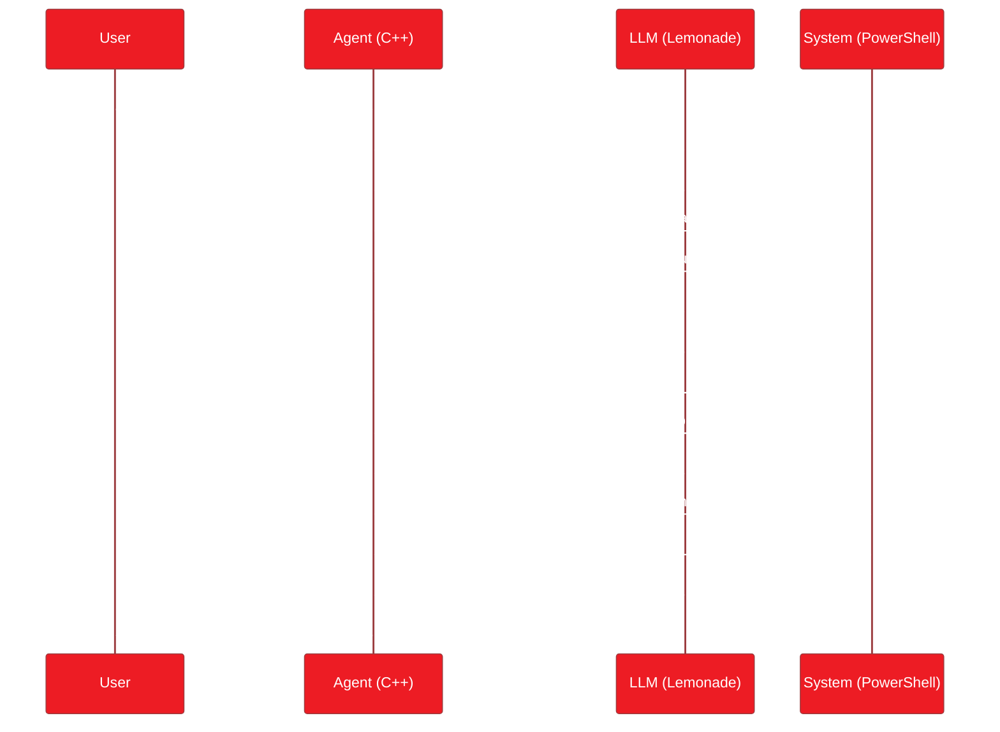
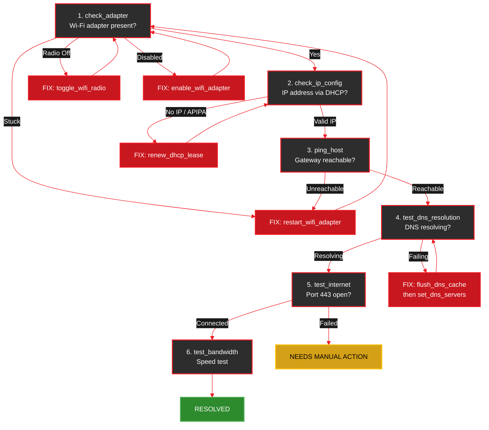

<Info>
  **Source Code:** [`cpp/examples/wifi_agent.cpp`](https://github.com/amd/gaia/blob/main/cpp/examples/wifi_agent.cpp) — single-file, self-contained agent (~1,100 lines including 13 tools and a custom TUI).
</Info>

<Note>
**Platform:** Windows (PowerShell network commands). Compiles on Linux/macOS for CI but tools require Windows to return real data.
**Prerequisite:** [Lemonade Server](/setup) running with a model loaded.
</Note>

---

## What This Agent Does

The Wi-Fi Troubleshooter is an AI agent that acts like an IT support specialist. When a user says *"my internet isn't working"*, it doesn't just guess — it runs a systematic diagnostic chain, reads the real output from your machine, reasons about what's wrong, and applies fixes automatically.

Here's what makes it interesting:

1. **It runs real commands** — not simulated. Every tool executes an actual PowerShell command on your machine and returns the real output.
2. **The LLM decides what to do** — the agent doesn't follow a hardcoded if/else tree. The LLM reads each tool's output, reasons about it, and decides the next step.
3. **It's pure C++** — no Python interpreter, no MCP server subprocess, no external dependencies. Just a compiled binary talking to a local LLM.
4. **Everything is local** — the LLM runs on your AMD hardware via Lemonade Server. No data leaves your machine.

---

## See It In Action

<video
  controls
  autoPlay
  loop
  muted
  playsInline
  className="w-full rounded-lg"
  src="https://assets.amd-gaia.ai/videos/wifi-agent-cpp-npu.webm"
/>

Full diagnostic run on a Ryzen AI PC: the agent calls 5 tools in sequence, reads real network output, and reports status — all powered by a local LLM on the NPU.

---

## Architecture: How an Agent Thinks

Before diving into the code, let's understand how a GAIA agent works at a high level. The agent loop is a conversation between your code and the LLM:



The key insight: **your C++ code provides the tools (what the agent *can* do), and the system prompt provides the strategy (what it *should* do). The LLM connects the two.**

---

## The Four Building Blocks

The entire agent is a single `.cpp` file with four sections. Let's walk through each one.

1. **Shell Helper** — bridges C++ and PowerShell for command execution
2. **Tool Registration** — 13 tools the LLM can call (7 diagnostic + 6 fix)
3. **System Prompt** — teaches the LLM the diagnostic strategy
4. **CleanConsole** — custom TUI that color-codes the LLM's structured reasoning (FINDING/DECISION labels)

### 1. The Shell Helper: Bridging C++ and PowerShell

Every tool needs to run a command and capture its output. The `runShell()` function handles this:

```cpp
static std::string runShell(const std::string& command) {
    std::string fullCmd;
#ifdef _WIN32
    fullCmd = "powershell -NoProfile -NonInteractive -Command \"& { "
              + command + " }\" 2>&1";
#else
    fullCmd = command + " 2>&1";
#endif

    std::string result;
    std::array<char, 4096> buffer;

#ifdef _WIN32
    std::unique_ptr<FILE, decltype(&_pclose)> pipe(
        _popen(fullCmd.c_str(), "r"), _pclose);
#else
    std::unique_ptr<FILE, decltype(&pclose)> pipe(
        popen(fullCmd.c_str(), "r"), pclose);
#endif

    if (!pipe) {
        return "{\"error\": \"Failed to execute command\"}";
    }

    while (fgets(buffer.data(), static_cast<int>(buffer.size()),
                 pipe.get()) != nullptr) {
        result += buffer.data();
    }

    return result.empty()
        ? "{\"status\": \"completed\", \"output\": \"(no output)\"}"
        : result;
}
```

**Why wrap in `& { ... }`?** Without the script block wrapper, `cmd.exe` tries to parse PowerShell pipe characters (`|`) and semicolons (`;`) before PowerShell sees them. The `& { }` wrapper tells PowerShell to treat the entire string as a single script block.

**Why `_popen` / `popen`?** These are the C runtime functions for spawning a child process and reading its stdout as a file stream. The `#ifdef _WIN32` blocks keep the code cross-platform — it compiles on Linux for CI, even though the PowerShell commands only work on Windows.

**Why `std::unique_ptr` with a custom deleter?** This ensures the pipe is always closed properly, even if an exception occurs. The deleter (`_pclose` or `pclose`) runs automatically when the `unique_ptr` goes out of scope.

---

### 2. Tool Registration: Teaching the Agent What It Can Do

Tools are the agent's hands. Each tool is registered with a name, description, callback function, and typed parameter list. The framework automatically includes these in the system prompt sent to the LLM, so the model knows exactly what tools are available and how to call them.

#### Anatomy of a Tool

Here's the simplest tool — no parameters, just run a command and return the output:

```cpp
toolRegistry().registerTool(
    "check_adapter",                          // name (LLM uses this to call it)
    "Show Wi-Fi adapter status including "    // description (LLM reads this to
    "SSID, signal strength, radio type, "     // decide when to use the tool)
    "and connection state.",
    [](const gaia::json& /*args*/) -> gaia::json {    // callback
        std::string output = runShell("netsh wlan show interfaces");
        return {{"tool", "check_adapter"}, {"output", output}};
    },
    {}  // no parameters
);
```

The LLM sees this description in its system prompt and learns: *"If I need to check the Wi-Fi adapter, I should call `check_adapter`."*

#### Tools with Parameters

Some tools need input from the LLM. Parameters are declared with a type, required flag, and description:

```cpp
toolRegistry().registerTool(
    "ping_host",
    "Ping a specific host and return connection status, "
    "latency, and resolved address as JSON.",
    [](const gaia::json& args) -> gaia::json {
        std::string host = args.value("host", "");  // extract from LLM's call
        if (host.empty()) {
            return {{"error", "host parameter is required"}};
        }
        std::string cmd =
            "Test-NetConnection -ComputerName " + host
            + " | Select-Object ComputerName, RemoteAddress, "
            "PingSucceeded, PingReplyDetails"
            + " | ConvertTo-Json";
        std::string output = runShell(cmd);
        return {{"tool", "ping_host"}, {"host", host}, {"output", output}};
    },
    {
        {"host", gaia::ToolParamType::STRING, /*required=*/true,
         "The hostname or IP address to ping"}
    }
);
```

When the LLM decides to ping the gateway, it generates something like:
```json
{"tool": "ping_host", "args": {"host": "192.168.1.1"}}
```

The framework parses this, calls your lambda with `args = {"host": "192.168.1.1"}`, and feeds the result back to the LLM.

#### Tools with Multiple Parameters (Including Optional)

The `set_dns_servers` tool shows how to handle required and optional parameters:

```cpp
toolRegistry().registerTool(
    "set_dns_servers",
    "Set custom DNS server addresses for a network adapter.",
    [](const gaia::json& args) -> gaia::json {
        std::string adapter   = args.value("adapter_name", "");   // required
        std::string primary   = args.value("primary_dns", "");    // required
        std::string secondary = args.value("secondary_dns", "");  // optional

        if (adapter.empty() || primary.empty()) {
            return {{"error", "adapter_name and primary_dns are required"}};
        }

        std::string cmd = "Set-DnsClientServerAddress -InterfaceAlias '"
            + adapter + "' -ServerAddresses ";
        if (secondary.empty()) {
            cmd += "'" + primary + "'";
        } else {
            cmd += "('" + primary + "','" + secondary + "')";
        }

        std::string output = runShell(cmd);
        return {{"tool", "set_dns_servers"}, {"status", "completed"},
                {"output", output}};
    },
    {
        {"adapter_name",  gaia::ToolParamType::STRING, true,
         "The network adapter name (e.g. 'Wi-Fi')"},
        {"primary_dns",   gaia::ToolParamType::STRING, true,
         "Primary DNS server IP (e.g. '8.8.8.8')"},
        {"secondary_dns", gaia::ToolParamType::STRING, false,
         "Secondary DNS server IP (e.g. '8.8.4.4')"}
    }
);
```

**Pattern:** Use `args.value("key", "")` from nlohmann/json — it returns the default if the key is missing, which handles optional parameters cleanly.

---

### 3. The System Prompt: Teaching the Agent How to Think

The system prompt is where you define the agent's behavior. Without it, the LLM has tools but no strategy. With it, the LLM follows a structured diagnostic protocol:

```cpp
std::string getSystemPrompt() const override {
    return R"(You are an expert Windows network troubleshooter...

## DIAGNOSTIC PROTOCOL (follow this order)

1. **Adapter Check** — call `check_adapter`
2. **IP Configuration** — call `check_ip_config`
3. **Gateway Ping** — call `ping_host` with the gateway IP from step 2
4. **DNS Resolution** — call `test_dns_resolution`
5. **Internet Connectivity** — call `test_internet`

## FIX PROTOCOL (apply only if diagnostics reveal issues)

- **No IP / DHCP failure** → call `renew_dhcp_lease`
- **DNS failure** → call `flush_dns_cache`, re-test; if still failing,
  call `set_dns_servers` with Google DNS (8.8.8.8 / 8.8.4.4)
- **Adapter disconnected** → call `restart_wifi_adapter`
- After any fix, re-run the relevant diagnostic to confirm

## OUTPUT FORMAT

End every response with one of:
- **RESOLVED** — all diagnostics pass or issue was fixed
- **PARTIALLY RESOLVED** — some issues fixed but others remain
- **NEEDS MANUAL ACTION** — requires user intervention
...)";
}
```

**Why is the prompt so structured?** Small local LLMs (4B parameters) perform dramatically better with explicit step-by-step instructions. Without the ordered protocol, the model might skip steps or try fixes before diagnosing. The numbered steps and bold tool names act as a checklist the model follows.

**Why three status levels?** This teaches the LLM to be honest about outcomes. Without explicit status categories, models tend to say *"everything should be fine now"* even when issues remain.

---

## The Complete Tool Set

The agent registers 13 tools in two categories:

### Diagnostic Tools (Read-Only)

These gather information without changing anything on the system.

| Tool | What It Runs | Parameters | What the LLM Learns |
|------|-------------|------------|---------------------|
| `check_adapter` | `netsh wlan show interfaces` | none | Is Wi-Fi adapter present? Connected? Signal strength? |
| `check_wifi_drivers` | `netsh wlan show drivers` | none | Driver name, version, vendor, supported radio types |
| `check_ip_config` | `ipconfig /all` | none | IP address, subnet, gateway, DNS servers, DHCP status |
| `test_dns_resolution` | `Resolve-DnsName` | `hostname` (optional) | Can DNS resolve names to IPs? |
| `test_internet` | `Test-NetConnection 8.8.8.8 -Port 443` | none | Can we reach the internet on HTTPS? |
| `test_bandwidth` | Cloudflare CDN parallel download/upload | none | Download and upload speed in Mbps |
| `ping_host` | `Test-NetConnection <host>` | `host` (required) | Is a specific host reachable? Latency? |

### Fix Tools (Write Operations)

These actively modify network configuration to resolve issues.

| Tool | What It Runs | Parameters | When to Use |
|------|-------------|------------|-------------|
| `flush_dns_cache` | `Clear-DnsClientCache` | none | Stale DNS entries causing resolution failures |
| `set_dns_servers` | `Set-DnsClientServerAddress` | `adapter_name`, `primary_dns`, `secondary_dns` | Default DNS servers not responding |
| `renew_dhcp_lease` | `ipconfig /release` + `/renew` | none | No IP address or APIPA (169.254.x.x) address |
| `toggle_wifi_radio` | Windows Radio Management API | `state` (optional: "on"/"off") | Adapter shows "Software Off" — `Enable-NetAdapter` alone won't turn on the radio |
| `enable_wifi_adapter` | `Enable-NetAdapter` | `adapter_name` | Adapter is administratively disabled but hardware radio is on |
| `restart_wifi_adapter` | `Disable-NetAdapter` + `Enable-NetAdapter` | `adapter_name` | Adapter stuck in bad state, needs full disable/enable cycle |

---

## Diagnostic Flow

The system prompt instructs the LLM to follow this decision tree. The LLM doesn't execute it mechanically — it reads each tool's output and reasons about the next step:



Each fix loops back to re-verify, because the LLM knows to *confirm the fix worked* before declaring success.

---

## The Agent Class: Putting It Together

Here's how the three sections fit into the GAIA framework:

```cpp
class WiFiTroubleshooterAgent : public gaia::Agent {
public:
    explicit WiFiTroubleshooterAgent(const std::string& modelId)
        : Agent(makeConfig(modelId)) {
        setOutputHandler(std::make_unique<CleanConsole>());  // custom TUI
        init();  // calls registerTools() + composes system prompt
    }

protected:
    std::string getSystemPrompt() const override {
        return R"(... diagnostic protocol ...)";
    }

    void registerTools() override {
        toolRegistry().registerTool("check_adapter", ...);
        toolRegistry().registerTool("check_ip_config", ...);
        // ... 11 more tools (13 total) ...
    }

private:
    static gaia::AgentConfig makeConfig(const std::string& modelId) {
        gaia::AgentConfig config;
        config.maxSteps = 20;   // up to 20 tool calls per query
        config.modelId = modelId;
        return config;
    }
};
```

**Why `maxSteps = 20`?** A full diagnostic is 5 tool calls. If the agent finds and fixes 2-3 issues (each requiring a fix + re-verification), that's roughly 12-15 steps. 20 gives headroom without letting the agent run forever.

**Why `init()` in the constructor?** C++ virtual dispatch doesn't work from base class constructors. Calling `init()` at the end of your subclass constructor ensures `registerTools()` and `getSystemPrompt()` resolve to *your* overrides, not the base class defaults.

---

## The Interactive Loop

The `main()` function follows the same pattern as the `simple_agent` example:

```cpp
int main() {
    try {
        // Model selection: GPU (GGUF) or NPU (FLM)
        std::string modelId = "Qwen3-4B-Instruct-2507-GGUF";  // default GPU
        // ... interactive selection menu chooses between GPU/NPU ...

        WiFiTroubleshooterAgent agent(modelId);

        // Interactive loop with diagnostic menu
        std::string userInput;
        while (true) {
            // Show numbered menu: [1] Full diagnostic, [2] Check adapter, ...
            printDiagnosticMenu();
            std::cout << "  > " << std::flush;
            std::getline(std::cin, userInput);

            if (userInput == "quit" || userInput == "exit" || userInput == "q") break;

            // Map numbered selection to pre-written prompt, or use free-text
            std::string query = mapMenuSelection(userInput);
            auto result = agent.processQuery(query);
            // Final answer is printed by CleanConsole::printFinalAnswer()
            (void)result;
        }
    } catch (const std::exception& e) {
        std::cerr << "Fatal error: " << e.what() << std::endl;
        return 1;
    }
    return 0;
}
```

`processQuery()` handles the entire agent loop internally — sending messages to the LLM, parsing tool calls, executing them, feeding results back, and repeating until the LLM produces a final answer.

---

## Quick Start

<Steps>
  <Step title="Build">
    <Tabs>
      <Tab title="Windows (MSVC)">
        ```bat
        cd cpp
        cmake -B build -G "Visual Studio 17 2022" -A x64
        cmake --build build --config Release
        ```
        Binary: `cpp\build\Release\wifi_agent.exe`
      </Tab>
      <Tab title="Windows (Ninja)">
        ```bat
        cd cpp
        cmake -B build -G Ninja -DCMAKE_BUILD_TYPE=Release
        cmake --build build
        ```
      </Tab>
      <Tab title="Linux / macOS">
        ```bash
        cd cpp
        cmake -B build -DCMAKE_BUILD_TYPE=Release
        cmake --build build
        ```
        <Note>
        Compiles on Linux/macOS for CI purposes, but the PowerShell-based tools require Windows to return meaningful results.
        </Note>
      </Tab>
    </Tabs>
  </Step>

  <Step title="Start Lemonade Server">
    ```bash
    lemonade-server serve
    ```
    The agent connects to `http://localhost:8000/api/v1` by default.
  </Step>

  <Step title="Run the agent">
    ```bat
    cpp\build\Release\wifi_agent.exe
    ```

    Try these prompts:
    ```
    You: Run a full network diagnostic.
    You: My Wi-Fi is connected but I can't browse the web.
    You: Check if DNS is working and fix it if not.
    ```
  </Step>
</Steps>

---

## Sample Session

```
  ========================================================================================
   Wi-Fi Troubleshooter  |  GAIA C++ Agent Framework  |  Local Inference
  ========================================================================================

  Select inference backend:
  [1] GPU  - Qwen3-4B-Instruct-2507-GGUF
  [2] NPU  - Qwen3-4B-Instruct-2507-FLM

  > 1
  Using GPU backend: Qwen3-4B-Instruct-2507-GGUF

  Ready!

  [1] Full network diagnostic
  [2] Check Wi-Fi adapter
  ...
  Or type your own question. Type 'quit' to exit.

  > 1
  > Full network diagnostic

  [1/20] check_adapter
      Command: netsh wlan show interfaces
      Output:
      .----
      | State          : connected
      | SSID           : HomeNetwork
      | Signal         : 92%
      | Radio type     : 802.11ac
      '----
  Finding: Wi-Fi adapter is connected to "HomeNetwork" with 92% signal.
  Decision: Adapter OK. Proceeding with IP configuration check.

  [2/20] check_ip_config
      Command: ipconfig /all
      ...
  Finding: Valid IP 192.168.1.105 via DHCP. Gateway: 192.168.1.1.
  Decision: IP configuration looks healthy. Testing gateway reachability.

  [3/20] ping_host
      ...

  [4/20] test_dns_resolution
      ...

  [5/20] test_internet
      ...

  ========================================================================================
   RESOLVED - All diagnostics passed. Network connection is healthy.
  ========================================================================================
```

---

## Design Decisions Worth Understanding

### Why registered tools instead of MCP?

The `simple_agent` example uses MCP — it connects to `uvx windows-mcp` which runs as a separate subprocess and exposes PowerShell as an MCP tool. That works, but adds a dependency on `uvx`, Python, and the MCP server package.

The Wi-Fi agent takes the opposite approach: every tool is a C++ lambda registered directly with the agent. The PowerShell commands are hardcoded strings. This means:

- **Fewer moving parts** — no subprocess to manage, no JSON-RPC protocol overhead
- **Faster tool calls** — direct `_popen()` vs. MCP JSON-RPC roundtrip
- **Self-contained binary** — the `.exe` has no runtime dependencies beyond the OS

The tradeoff is flexibility: MCP tools can be swapped without recompiling. Choose the approach that fits your use case.

### Why return raw command output instead of parsing it?

You might expect the tools to parse `ipconfig /all` output into structured JSON. Instead, they return the raw text and let the LLM interpret it. This works because:

1. **LLMs are excellent at reading command output** — they've seen millions of examples in training
2. **Parsing is fragile** — `ipconfig` output format varies across Windows versions and locales
3. **Less code to maintain** — no regex or string parsing in C++

Some tools (like `test_dns_resolution`) do pipe through `ConvertTo-Json` on the PowerShell side. This is a compromise — structured JSON is easier for the LLM to extract specific values from (like an IP address it needs to pass to `ping_host`).

### Why a strict diagnostic order in the prompt?

Network issues are hierarchical: if the adapter is disconnected, there's no point testing DNS. The ordered protocol prevents the LLM from wasting steps on tests that can't succeed. This is especially important with small models (4B parameters) that may not infer the optimal diagnostic order on their own.

---

## Extending the Agent

Want to add your own tools? The pattern is straightforward:

```cpp
// Add this inside registerTools()
toolRegistry().registerTool(
    "check_firewall",
    "Check if Windows Firewall is blocking outbound connections.",
    [](const gaia::json& /*args*/) -> gaia::json {
        std::string output = runShell(
            "Get-NetFirewallProfile | Select-Object Name, Enabled "
            "| ConvertTo-Json"
        );
        return {{"tool", "check_firewall"}, {"output", output}};
    },
    {}
);
```

Then update the system prompt to mention when the LLM should use it:

```
6. **Firewall Check** — if internet test fails but gateway is reachable,
   call `check_firewall` to rule out firewall blocking
```

The framework handles everything else — the new tool appears in the LLM's system prompt automatically.

---

## Next Steps

<CardGroup cols={2}>
  <Card title="C++ Framework Overview" icon="code" href="/guides/cpp/overview">
    AgentConfig reference, project structure, and how the agent loop works
  </Card>

  <Card title="Customizing Your Agent" icon="sliders" href="/guides/cpp/custom-agent">
    Custom prompts, typed tools, MCP servers, output capture, and tuning
  </Card>

  <Card title="Integration Guide" icon="puzzle-piece" href="/guides/cpp/integration">
    Use gaia_core in your own CMake project via FetchContent or find_package
  </Card>

  <Card title="Windows System Health Agent" icon="desktop" href="/guides/mcp/windows-system-health">
    Compare with the MCP-based approach for system monitoring
  </Card>
</CardGroup>

---

<small style="color: #666;">

**License**

Copyright(C) 2025-2026 Advanced Micro Devices, Inc. All rights reserved.

SPDX-License-Identifier: MIT

</small>
