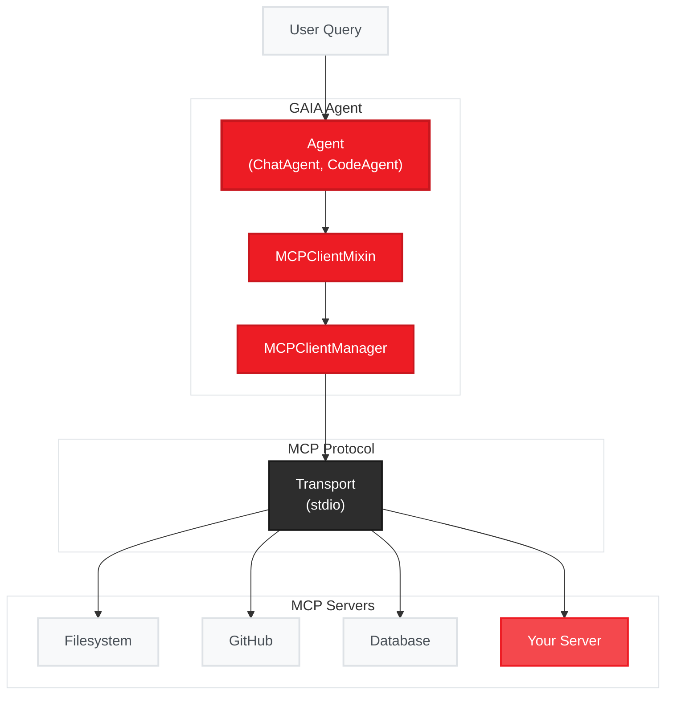

{/* Video placeholder - replace with actual demo when available */}
<Frame>
  
</Frame>

**Connect your GAIA agent to any tool ecosystem with a single line of code.**

- 🔌 **Universal tool integration** - Filesystem, GitHub, databases, and hundreds more
- ⚡ **Zero code required** - Configure once, tools auto-register
- 🌍 **Industry standard** - Built on [Model Context Protocol](https://modelcontextprotocol.io/)
- 🔍 **Auto-discovery** - Tools document themselves to your agent

<Info>
  **Examples:**
  - [`examples/mcp_time_server_agent.py`](https://github.com/amd/gaia/blob/main/examples/mcp_time_server_agent.py) - Simple Python server example
  - [`examples/mcp_config_based_agent.py`](https://github.com/amd/gaia/blob/main/examples/mcp_config_based_agent.py) - Config file-based loading
</Info>

<Note>
**See Also:**
- [SDK Reference](/sdk/sdks/mcp) - Quick code snippets
- [Full Specification](/spec/mcp-client) - Complete API documentation and implementation details
</Note>

## What is MCP?

### The Problem

Building AI agents that interact with external tools is hard. Every service has its own API, authentication method, and data format. Want your agent to read files, create GitHub issues, AND query a database? That's three separate integrations to build and maintain.

### The Solution

**MCP (Model Context Protocol)** is like USB for AI - a universal connector that lets any AI application talk to any tool. Just as USB eliminated the need for custom cables, MCP eliminates the need for custom integrations.

```
Before MCP:  Agent → Custom Code → GitHub API
             Agent → Custom Code → Filesystem API
             Agent → Custom Code → Database API

With MCP:    Agent → MCP → Any Tool
```

<Tip>
**Learn More:** MCP is an open standard created by Anthropic. Visit [modelcontextprotocol.io](https://modelcontextprotocol.io/) for the full specification and ecosystem.
</Tip>

### How GAIA Uses MCP

GAIA agents act as **MCP clients** that connect to **MCP servers**. Each server exposes tools (like "read_file" or "create_issue") that your agent can call. The protocol handles all the communication details - you just connect and use the tools.

## See It In Action

Try it now - this single command connects to multiple MCP servers and uses their tools:

```bash
python examples/mcp_config_based_agent.py
```

Output:
```
Connected: memory, thinking, time

Agent: The current time in Tokyo is 11:59 PM on Wednesday, January 28, 2026, Japan Standard Time (JST).
```

That's it. Three MCP servers connected, tools auto-discovered, and the agent uses them naturally.

<Warning>
**Note:** User experience may vary depending on the MCP server implementation.
Some servers may have different response times, error handling, or feature
availability. Always test servers before production use.
</Warning>

## Quick Start

<Steps>
  <Step title="Initialize MCP configuration">
    ```bash
    gaia init --profile mcp
    ```
    This creates `~/.gaia/mcp_servers.json` with an empty configuration.
  </Step>

  <Step title="Add an MCP server">
    Add the official [MCP Time Server](https://github.com/modelcontextprotocol/servers/tree/main/src/time):
    ```bash
    gaia mcp add time '{"command": "uvx", "args": ["mcp-server-time"]}'
    ```
    Or edit `~/.gaia/mcp_servers.json` directly:
    ```json
    {
      "mcpServers": {
        "time": {
          "command": "uvx",
          "args": ["mcp-server-time"]
        }
      }
    }
    ```
  </Step>

  <Step title="Use in your agent">
    ```python
    from gaia.agents.chat import ChatAgent

    agent = ChatAgent()
    agent.load_mcp_servers_from_config()
    response = agent.prompt("What time is it in Tokyo?")
    ```
  </Step>
</Steps>

## How It Works



1. **Your Agent** uses the `MCPClientMixin` to gain MCP capabilities
2. **MCPClientManager** handles connections to multiple servers
3. **Transport Layer** communicates via stdio (subprocess) or HTTP
4. **MCP Servers** expose tools that become available to your agent

## Configuration

### Config File Locations

GAIA looks for `mcp_servers.json` in two locations (in order):

1. **Project directory** - `./mcp_servers.json` in current working directory
2. **Global config** - `~/.gaia/mcp_servers.json` in user's home directory

This allows project-specific MCP server configurations while maintaining a global default.

### Config File Format

```json
{
  "mcpServers": {
    "filesystem": {
      "command": "npx",
      "args": ["-y", "@modelcontextprotocol/server-filesystem", "/home/user/documents"]
    },
    "memory": {
      "command": "npx",
      "args": ["-y", "@modelcontextprotocol/server-memory"]
    },
    "github": {
      "command": "npx",
      "args": ["-y", "@modelcontextprotocol/server-github"],
      "env": {
        "GITHUB_TOKEN": "ghp_xxx"
      }
    }
  }
}
```

<Note>
This format is compatible with Claude Desktop and other Anthropic tools. The `mcpServers` key, separate `command`/`args` fields, and `env` support are standard across the ecosystem.
</Note>

### Connecting to Servers

<Tabs>
  <Tab title="From Config File">
    ```python
    # Load all servers from mcp_servers.json
    count = agent.load_mcp_servers_from_config()
    print(f"Loaded {count} servers")
    ```
  </Tab>

  <Tab title="Programmatically">
    ```python
    # Connect to individual servers in code
    agent.connect_mcp_server("filesystem", {
        "command": "npx",
        "args": ["-y", "@modelcontextprotocol/server-filesystem", "/tmp"]
    })
    ```
  </Tab>

  <Tab title="Via CLI">
    ```bash
    # Add server to config
    gaia mcp add filesystem '{"command": "npx", "args": ["-y", "@modelcontextprotocol/server-filesystem", "/tmp"]}'

    # List configured servers
    gaia mcp list
    ```
  </Tab>
</Tabs>

### Popular MCP Servers

<Tabs>
  <Tab title="Filesystem">
    ```python
    agent.connect_mcp_server("filesystem", {
        "command": "npx",
        "args": ["-y", "@modelcontextprotocol/server-filesystem", "/path/to/directory"]
    })
    ```
  </Tab>

  <Tab title="GitHub">
    ```python
    agent.connect_mcp_server("github", {
        "command": "npx",
        "args": ["-y", "@modelcontextprotocol/server-github"],
        "env": {"GITHUB_TOKEN": "ghp_your_token_here"}
    })
    ```
  </Tab>

  <Tab title="Python Servers">
    ```python
    # Python-based MCP servers (via uvx)
    agent.connect_mcp_server("time", {
        "command": "uvx",
        "args": ["mcp-server-time"]
    })
    ```
  </Tab>
</Tabs>

## Complete Examples

Working examples are available in the GAIA repository:

<CardGroup cols={2}>
  <Card title="Time Server Agent" icon="clock" href="https://github.com/amd/gaia/blob/main/examples/mcp_time_server_agent.py">
    Simple example connecting to a Python MCP server via `uvx`
  </Card>

  <Card title="Config-Based Agent" icon="file-code" href="https://github.com/amd/gaia/blob/main/examples/mcp_config_based_agent.py">
    Load servers from `mcp_servers.json` - recommended for production
  </Card>
</CardGroup>

For detailed API usage and patterns, see the [SDK Reference](/sdk/sdks/mcp).

## Under the Hood

<AccordionGroup>
  <Accordion title="CLI Commands">
    GAIA provides CLI commands for managing MCP server configurations without writing code.

    <Card title="MCP CLI Reference" icon="terminal" href="/reference/cli#mcp-client">
      Complete documentation of all MCP CLI commands: `add`, `list`, `tools`, `test-client`, `remove`
    </Card>

    **Quick reference:**
    ```bash
    gaia mcp add <name> "<command>"     # Add server to config
    gaia mcp list                        # List configured servers
    gaia mcp tools <name>                # List tools from server
    gaia mcp test-client <name>          # Test connection
    gaia mcp remove <name>               # Remove server
    ```

    For detailed usage, parameters, and output examples, see the [CLI Reference](/reference/cli#mcp-client).
  </Accordion>

  <Accordion title="Best Practices">
    <CardGroup cols={2}>
      <Card title="Error Handling" icon="shield-check">
        Always handle connection failures gracefully:

        ```python
        success = agent.connect_mcp_server("server", {
            "command": "npx",
            "args": ["-y", "@mcp/server"]
        })
        if not success:
            print("Failed to connect, using fallback tools")
        ```
      </Card>

      <Card title="Resource Cleanup" icon="broom">
        Disconnect servers when done:

        ```python
        def __del__(self):
            for server in self.list_mcp_servers():
                self.disconnect_mcp_server(server)
        ```
      </Card>

      <Card title="Tool Discovery" icon="magnifying-glass">
        Cache tool lists instead of fetching repeatedly:

        ```python
        tools = client.list_tools()  # Cached by default
        tools = client.list_tools(refresh=True)  # Force refresh
        ```
      </Card>

      <Card title="Debug Mode" icon="bug">
        Enable debug logging during development:

        ```python
        client = MCPClient.from_config(
            "server",
            {"command": "npx", "args": ["-y", "@mcp/server"]},
            debug=True  # Shows detailed logs
        )
        ```
      </Card>
    </CardGroup>
  </Accordion>

  <Accordion title="Prerequisites">
    <CardGroup cols={2}>
      <Card title="GAIA Installation" icon="download">
        Initialize MCP configuration:
        ```bash
        gaia init --profile mcp
        ```
        For development with MCP extras:
        ```bash
        uv pip install -e ".[mcp,dev]"
        ```
      </Card>

      <Card title="Node.js (Optional)" icon="node-js">
        Required only for npm-based MCP servers, e.g.:
        ```bash
        npx -y @modelcontextprotocol/server-memory
        ```
        See [Setup Guide](/setup) for NVM installation instructions.
      </Card>
    </CardGroup>
  </Accordion>
</AccordionGroup>

## Troubleshooting

<AccordionGroup>
  <Accordion title="Connection fails with 'command not found'">
    **Problem:** The MCP server command (like `npx` or `uvx`) isn't in your PATH.

    **Solution:**
    ```bash
    # Check if npx is available
    which npx

    # If not, install Node.js or ensure it's in your PATH
    # On macOS with nvm:
    source ~/.nvm/nvm.sh
    ```
  </Accordion>

  <Accordion title="Config file not found">
    **Problem:** `load_mcp_servers_from_config()` returns 0 servers.

    **Solution:** GAIA looks for `mcp_servers.json` in:
    1. Current working directory (`./mcp_servers.json`)
    2. Home directory (`~/.gaia/mcp_servers.json`)

    Verify the file exists and contains valid JSON:
    ```bash
    cat ./mcp_servers.json
    # or
    cat ~/.gaia/mcp_servers.json
    ```
  </Accordion>

  <Accordion title="Tools not appearing in agent">
    **Problem:** Connected to server but tools aren't being used.

    **Solution:**
    1. Verify connection succeeded:
       ```python
       print(agent.list_mcp_servers())  # Should show server name
       ```
    2. List available tools:
       ```bash
       gaia mcp tools <server-name>
       ```
    3. Enable debug mode to see tool registration:
       ```python
       import logging
       logging.basicConfig(level=logging.DEBUG)
       ```
  </Accordion>

  <Accordion title="Server process hangs or times out">
    **Problem:** Connection hangs during startup.

    **Solution:**
    - Some servers need initialization time. Try increasing timeout:
      ```python
      agent.connect_mcp_server("server", config, timeout=30)
      ```
    - Test the server directly:
      ```bash
      gaia mcp test-client <server-name>
      ```
  </Accordion>
</AccordionGroup>

## Next Steps

<CardGroup cols={2}>
  <Card title="Browse Community Servers" icon="globe" href="https://github.com/punkpeye/awesome-mcp-servers">
    Curated list of MCP server implementations from the community
  </Card>

  <Card title="Build a Custom Agent" icon="robot" href="/guides/code">
    Learn how to create agents that leverage MCP tools
  </Card>

  <Card title="MCP Server List" icon="server" href="https://github.com/modelcontextprotocol/servers">
    Browse official MCP servers from Anthropic
  </Card>

  <Card title="Create MCP Server" icon="code" href="/sdk/infrastructure/mcp">
    Build your own MCP server to expose custom tools
  </Card>

  <Card title="API Reference" icon="book" href="/sdk/sdks/mcp">
    Detailed API documentation for MCP Client
  </Card>
</CardGroup>

---

<small style="color: #666;">

**License**

Copyright(C) 2024-2025 Advanced Micro Devices, Inc. All rights reserved.

SPDX-License-Identifier: MIT

</small>
