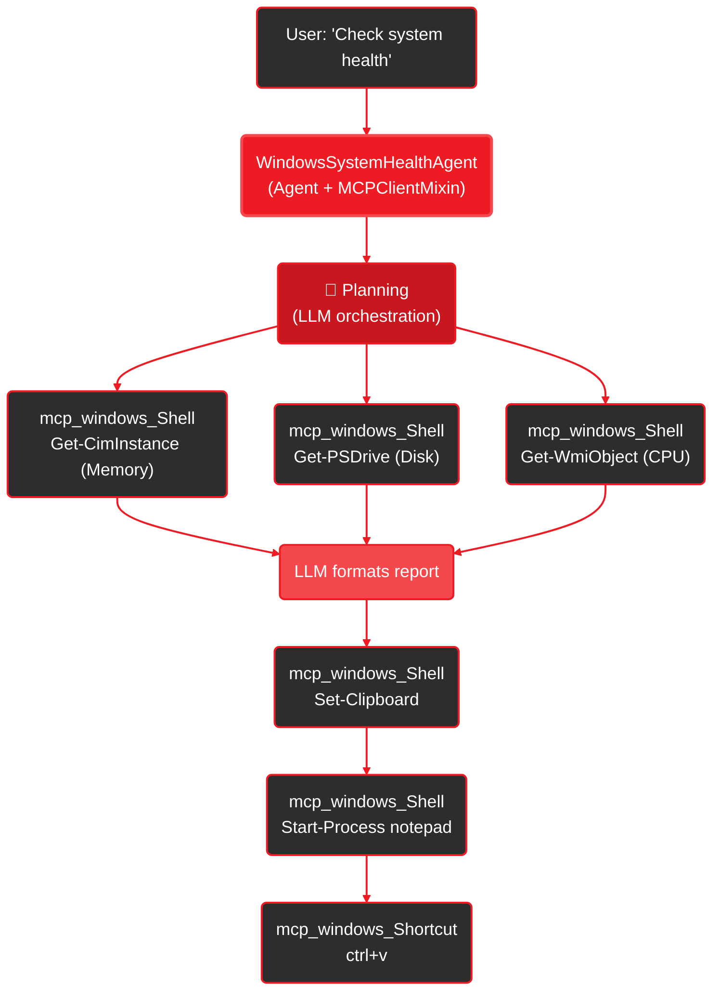

**Agent-driven Windows system health check with GUI output.**

- 🖥️ **Full system analysis** - CPU, memory, and disk metrics via PowerShell
- 🤖 **LLM-powered reasoning** - Agent decides what data to collect and how to present it
- 📋 **GUI automation** - Outputs formatted report directly into Notepad
- 🔌 **MCP-powered** - All operations go through the [Windows MCP server](https://github.com/CursorTouch/Windows-MCP)

<Info>
**Source Code:** [`examples/mcp_windows_system_health_agent.py`](https://github.com/amd/gaia/blob/main/examples/mcp_windows_system_health_agent.py)
</Info>

<Note>
**First time?** See [Setup Guide](/setup) to install GAIA, Python, and Lemonade Server.
</Note>

## See It In Action

```bash
uv run examples/mcp_windows_system_health_agent.py
```

```
Connecting to Windows MCP server...
  Connected to Windows MCP server
Windows System Health Agent ready! Type 'quit' to exit.

You: Check my system health and show in Notepad

Agent: I've collected your system metrics and pasted the health report into Notepad.
Your system has 64GB RAM, 45% disk usage on C:, and CPU load at 12%.
Assessment: Excellent - can run large models (30B+ parameters) with GAIA/Lemonade.
```

The agent gathers metrics via PowerShell, formats a report, and pastes it into Notepad automatically.

## Quick Start

<Steps>
  <Step title="Start Lemonade Server">
    ```bash
    lemonade-server serve
    ```
  </Step>

  <Step title="Run the agent">
    ```bash
    uv run examples/mcp_windows_system_health_agent.py
    ```
    The agent auto-installs the Windows MCP server via `uvx` on first run.
  </Step>

  <Step title="Ask about your system">
    ```
    You: Check my Windows system health and type the report into Notepad
    ```
    The agent collects CPU, memory, and disk data, then outputs a formatted report to Notepad.
  </Step>
</Steps>

## How It Works



**Execution Flow:**
1. **Agent** receives query and plans tool calls
2. **mcp_windows_Shell** executes PowerShell commands for CPU, memory, disk
3. **LLM** analyzes metrics and formats a plain-text health report
4. **mcp_windows_Shell** copies report to clipboard (Set-Clipboard)
5. **mcp_windows_Shell** opens Notepad (Start-Process)
6. **mcp_windows_Shortcut** pastes with ctrl+v

All reasoning and tool selection is handled by the LLM — the agent decides what to collect and how to present it.

## Security Considerations

<Warning>
**Vet MCP servers before connecting.** Each MCP server runs as a subprocess with access to your system. The Windows MCP server can execute arbitrary PowerShell commands and automate GUI interactions.
</Warning>

Before using MCP servers:

1. **Review the source** — Only use servers from trusted sources with public repositories
2. **Check permissions** — Understand what system access the server requires
3. **Limit scope** — Be aware that Windows MCP has full shell and GUI access
4. **Audit environment variables** — Never pass secrets to servers you haven't reviewed

## Where to Get More Servers

<CardGroup cols={2}>
  <Card title="MCP Server Hub" icon="globe" href="https://glama.ai/mcp/servers">
    Browse and discover MCP servers with install commands and tool listings
  </Card>

  <Card title="Official MCP Servers" icon="server" href="https://github.com/modelcontextprotocol/servers">
    Browse official MCP servers from Anthropic
  </Card>
</CardGroup>

## Next Steps

<CardGroup cols={2}>
  <Card title="MCP Client Guide" icon="plug" href="/guides/mcp/client">
    Learn how to connect agents to any MCP server
  </Card>

  <Card title="MCP SDK Reference" icon="book" href="/sdk/sdks/mcp">
    API documentation for MCPClientMixin
  </Card>

  <Card title="Windows MCP Server" icon="windows" href="https://github.com/nicholasxjy/windows-mcp">
    Source code and documentation for the Windows MCP server
  </Card>
</CardGroup>

---

<small style="color: #666;">

**License**

Copyright(C) 2024-2026 Advanced Micro Devices, Inc. All rights reserved.

SPDX-License-Identifier: MIT

</small>
