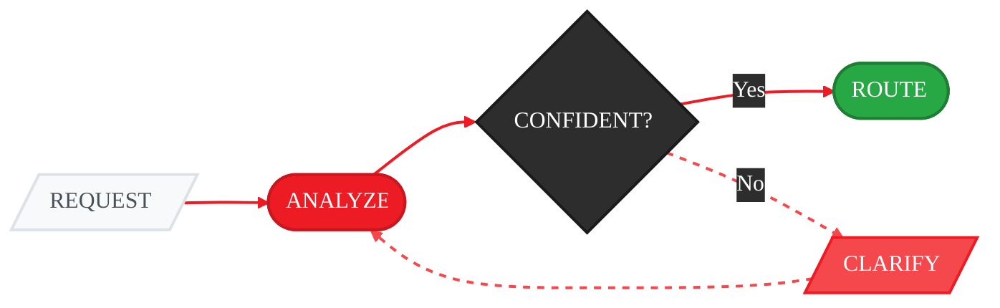

<Info>
  **Source Code:** [`src/gaia/agents/routing/agent.py`](https://github.com/amd/gaia/blob/main/src/gaia/agents/routing/agent.py) · [`src/gaia/agents/routing/system_prompt.py`](https://github.com/amd/gaia/blob/main/src/gaia/agents/routing/system_prompt.py)
</Info>

## Overview

The GAIA Routing Agent provides intelligent request analysis and agent selection through conversational disambiguation. When you make a request like "Create a todo backend app," the routing agent analyzes your query, detects the target programming language and project type, and routes you to the appropriate specialized agent with the correct configuration.

**Key Features:**
- **Intelligent Language Detection**: Automatically identifies TypeScript, Python, and other languages from framework mentions
- **Conversational Disambiguation**: Asks clarifying questions when the request is ambiguous
- **Context-Aware Analysis**: Maintains conversation history across disambiguation rounds
- **High-Confidence Routing**: Only proceeds when confident about the detected configuration

## Why We Built the Routing Agent

Before the routing agent, GAIA agents would attempt to detect language and project type internally, often leading to:

1. **Incorrect Language Selection**: Generic requests like "Create a REST API" would default to Python, even when the user wanted TypeScript/Express
2. **Guessing Behavior**: Agents would make assumptions based on "commonly used" frameworks rather than asking for clarification
3. **Poor User Experience**: Users had to be very specific with framework names to get the right agent configuration

The routing agent solves these problems by:
- Separating routing concerns from agent logic
- Using LLM-powered analysis to detect language/framework from natural language
- Asking users for clarification when uncertain, rather than guessing
- Providing a consistent routing experience across all agents (currently used for `gaia-code`, with plans to expand)

## How It Works



| Step | Description | Example |
|------|-------------|---------|
| **REQUEST** | User submits a natural language request | `"Create a todo backend app"` |
| **ANALYZE** | LLM detects language (TypeScript, Python) and project type (frontend, backend, fullstack) | Detects: backend project, needs framework clarification |
| **CONFIDENT?** | Checks if confidence ≥ 0.9 to proceed | Confidence: 0.6 → too low, needs clarification |
| **CLARIFY** | Asks user for missing information, then re-analyzes with enriched context | `"What framework? (Express, Django, FastAPI)"` |
| **ROUTE** | Creates specialized agent with the detected configuration | `CodeAgent(language=TypeScript, project_type=backend)` |

<Note>
The **CLARIFY → ANALYZE** loop can repeat multiple times until the agent reaches high confidence. Each user response is incorporated into the conversation history before re-analysis.
</Note>

## Quick Start

The routing agent is automatically used when you run certain GAIA commands:

```bash
# Routing happens automatically
gaia-code "Create a REST API with Express and SQLite"
# → Detected: TypeScript backend → Creates TypeScript CodeAgent

# If ambiguous, you'll be prompted
gaia-code "Create a todo backend app"
# → What language/framework would you like to use for your backend project?
# → (e.g., 'Express', 'Django', 'React', 'FastAPI')
# User: Express
# → Detected: TypeScript backend → Creates TypeScript CodeAgent
```

## Language Detection Rules

The routing agent uses the following rules for language detection:

**TypeScript Indicators:**
- Express, NestJS, Koa, Fastify
- MongoDB, Mongoose (with Express/Node.js context) - routes to Express + SQLite template
- React, Vue, Angular, Svelte, Next.js
- Node.js, Vite, Webpack

**Note:** MongoDB/Mongoose mentions route to the Express + SQLite template. GAIA uses SQLite by default for zero-installation development experience.

**Python Indicators:**
- Django, Flask, FastAPI
- Pandas, NumPy, SciPy

**Unknown (triggers disambiguation):**
- Generic terms without framework: "API", "backend", "REST", "todo", "CRUD"
- Confidence level below 0.9 (LLM is uncertain)

## Project Type Detection

**Frontend:**
- React, Vue, Angular components
- Dashboard, UI, webpage, website

**Backend:**
- Express, API, REST endpoints
- Backend, server, database operations

**Fullstack:**
- Both frontend and backend mentioned

**Script:**
- CLI tool, calculator, utility script

## Example Interactions

### High-Confidence Detection (No Questions)

```bash
$ gaia-code "Create an Express API with SQLite"
[2025-11-18 10:08:03] | INFO | Analysis result: {
    'language': 'typescript',
    'project_type': 'backend',
    'confidence': 0.95
}
[2025-11-18 10:08:03] | INFO | Creating CodeAgent with language=typescript, project_type=backend
```

### Conversational Disambiguation

```bash
$ gaia-code "Build me a todo backend app"

What language/framework would you like to use for your backend project?
(e.g., 'Express', 'Django', 'React', 'FastAPI')
> Express

[2025-11-18 10:20:09] | INFO | Analysis result: {
    'language': 'typescript',
    'project_type': 'backend',
    'confidence': 0.95,
    'reasoning': "User specified 'Express' which is a Node.js/TypeScript framework"
}
[2025-11-18 10:20:09] | INFO | Creating CodeAgent with language=typescript, project_type=backend
```

### Multiple Disambiguation Rounds

```bash
$ gaia-code "Create an app"

What kind of application would you like to build?
(e.g., 'React web app', 'Python CLI tool', 'Express API', 'Django backend')
> REST API

What language/framework would you like to use for your backend project?
(e.g., 'Express', 'Django', 'React', 'FastAPI')
> Django

[INFO] Creating CodeAgent with language=python, project_type=backend
```

## Configuration

The routing agent can be configured via environment variables:

```bash
# Model used for routing analysis (default: Qwen3-Coder-30B-A3B-Instruct-GGUF)
export AGENT_ROUTING_MODEL=Qwen3-Coder-30B-A3B-Instruct-GGUF

# Lemonade server URL (default: http://localhost:8000/api/v1)
export LEMONADE_BASE_URL=http://localhost:8000/api/v1
```

Add these to your `.env` file for persistent configuration.

## Current Usage

The routing agent is currently integrated with:

- **`gaia-code`**: Intelligently routes to Python or TypeScript CodeAgent based on framework detection

**Future Integration Plans:**
- `gaia docker`: Route to appropriate containerization strategy
- `gaia jira`: Route to different Jira workflows based on request type
- Other agents as needed

## Troubleshooting

### Routing to Wrong Language

**Issue**: The routing agent detects the wrong language/framework.

**Solution**:
- Be more specific in your request: "Create an **Express** API" instead of "Create an API"
- When prompted, provide clear framework names: "Express", "Django", "React"
- Check that you're using recognized framework names (see [Language Detection Rules](#language-detection-rules))

### Too Many Questions

**Issue**: The routing agent asks too many clarifying questions.

**Solution**:
- Include framework/language in your initial request
- Use specific terms like "Express backend" or "React dashboard"
- Example: "Create a **Django** REST API" (no questions needed)

### Routing Agent Not Working

**Issue**: Routing agent errors or skips detection.

**Solution**:
```bash
# Verify Lemonade server is running with the coding model
lemonade-server serve --ctx-size 32768

# Check environment variables
echo $AGENT_ROUTING_MODEL
echo $LEMONADE_BASE_URL

# Test with a clear request
gaia-code "Create an Express API with SQLite"
```

### Low Confidence / Always Asks Questions

**Issue**: Even with specific frameworks, routing agent asks for clarification.

**Solution**:
- Check the routing model is loaded: `AGENT_ROUTING_MODEL=Qwen3-Coder-30B-A3B-Instruct-GGUF`
- Verify Lemonade server has sufficient context size: `--ctx-size 32768`
- Ensure the coding model is available in Lemonade's model list

## Technical Details

For implementation details, see:
- Source code: `src/gaia/agents/routing/agent.py`
- System prompt: `src/gaia/agents/routing/system_prompt.py`
- CLI integration: `src/gaia/cli.py` (search for "RoutingAgent")

## See Also

- [Code Agent Documentation](/guides/code) - Autonomous Python/TypeScript development
- [CLI Guide](/reference/cli) - Command line interface reference
- [API Server Documentation](/reference/api) - OpenAI-compatible API with routing
- [Development Guide](/reference/dev) - Setup and contribution guidelines

---

<small style="color: #666;">

**License**

Copyright(C) 2024-2025 Advanced Micro Devices, Inc. All rights reserved.

SPDX-License-Identifier: MIT

</small>
