<Info>
  **CLI Command:** `gaia sd` - AI-enhanced image generation on Ryzen AI
</Info>

# The Magic: From "a robot" to Professional Images

The `gaia sd` command uses **AI-powered prompt enhancement** to transform simple descriptions into professional-quality images. An LLM analyzes your request, adds technical keywords, and optimizes settings—all automatically.

<Warning>
**This is NOT just a CLI wrapper!** Unlike traditional SD tools that pass your prompt through unchanged, `gaia sd` uses **agent-based AI reasoning** to enhance every prompt before generation.
</Warning>

---

## How It Works (The Secret Sauce)

```mermaid
%%{init: {'theme':'base', 'themeVariables': { 'primaryColor':'#ED1C24', 'primaryTextColor':'#fff', 'primaryBorderColor':'#C8171E', 'lineColor':'#F4484D', 'secondaryColor':'#2d2d2d', 'tertiaryColor':'#f5f5f5', 'fontSize':'14px', 'fontFamily': 'system-ui, -apple-system, sans-serif'}}}%%
graph LR
    A["You Type:<br/>'a robot'"] --> B["SD Agent<br/>(LLM Brain)"]

    B --> C["Analyzes Intent<br/>🧠"]
    C --> D["Enhances Prompt<br/>✨"]

    D --> E["Enhanced:<br/>'futuristic robot assistant,<br/>metallic chrome finish,<br/>studio lighting with rim lights,<br/>sci-fi aesthetic,<br/>highly detailed, 8K'"]

    E --> F["Stable Diffusion<br/>on Ryzen AI<br/>🖼️"]

    F --> G["Professional<br/>Image"]

    style A fill:#2d2d2d,stroke:#1a1a1a,stroke-width:2px,color:#fff
    style B fill:#ED1C24,stroke:#C8171E,stroke-width:3px,color:#fff
    style C fill:#F4484D,stroke:#ED1C24,stroke-width:2px,color:#fff
    style D fill:#F4484D,stroke:#ED1C24,stroke-width:2px,color:#fff
    style E fill:#6c757d,stroke:#495057,stroke-width:2px,color:#fff
    style F fill:#C8171E,stroke:#C8171E,stroke-width:2px,color:#fff
    style G fill:#ED1C24,stroke:#C8171E,stroke-width:3px,color:#fff

    linkStyle 0,1,2,3,4,5 stroke:#ED1C24,stroke-width:2px
```



### The Enhancement Pipeline

When you type `gaia sd "a robot"`, here's what happens behind the scenes:

**Step 1: Intent Analysis**
The LLM reads your input and understands: *"User wants a robot image"*

**Step 2: Intelligent Enhancement**
Based on SD research and the selected model, it adds:
- **Quality modifiers:** "highly detailed, 8K, sharp focus"
- **Lighting setup:** "studio lighting with rim lights"
- **Style keywords:** "futuristic, sci-fi aesthetic"
- **Material details:** "metallic chrome finish"
- **Technical specs:** Optimizes steps, CFG scale, size

**Step 3: Professional Generation**
The enhanced prompt hits Stable Diffusion → Professional-quality image

**Result:** You type 2 words, get a prompt worth 20+ keywords! 🎯

---

## Quick Start

<Steps>
  <Step title="Start Lemonade Server">
    ```bash
    lemonade-server serve
    ```
  </Step>

  <Step title="Pull SD model (first time)">
    ```bash
    lemonade-server pull SD-Turbo
    ```
  </Step>

  <Step title="Generate with simple prompt">
    ```bash
    gaia sd "a robot"
    ```

    Watch the magic:
    - 🧠 LLM analyzes your intent
    - ✨ Enhances prompt with 15+ keywords
    - 🖼️ Generates professional image
    - 📊 Shows you what it did

    Image saved to: `.gaia/cache/sd/images/`
  </Step>
</Steps>

---

## The Transformation (Before vs After)

See what the LLM does to your prompts:

<CodeGroup>
```txt You Type
a cat
```

```txt Agent Enhances
fluffy orange tabby cat sitting on windowsill,
soft natural lighting filtering through curtains,
detailed fur texture with individual hairs visible,
whiskers sharp and defined,
photorealistic,
shallow depth of field with bokeh background,
DSLR-quality photograph,
8K resolution
```
</CodeGroup>

<CodeGroup>
```txt You Type
sunset
```

```txt Agent Enhances
vibrant sunset over calm ocean,
golden hour lighting casting warm orange and purple hues
across dramatic cumulus clouds,
sun partially visible on horizon with god rays,
wide angle seascape composition,
landscape photography,
highly detailed atmospheric effects,
volumetric lighting through clouds,
4K cinematic quality
```
</CodeGroup>

<CodeGroup>
```txt You Type
robot with AMD logo
```

```txt Agent Enhances
futuristic humanoid robot assistant with AMD logo prominently displayed on chest,
sleek metallic chrome finish with brushed metal texture,
glowing blue LED accents and circuits,
professional studio lighting setup with rim lights highlighting edges,
sci-fi aesthetic with modern design elements,
digital concept art style,
sharp focus on mechanical details,
highly detailed circuitry and joints,
8K render quality
```
</CodeGroup>

**Why this matters:** Professional results from casual descriptions! No need to learn SD prompt syntax.

---

## Models (Auto-Optimized)

Each model has tailored enhancement strategies:

| Model | Speed | Quality | Agent Optimization |
|-------|-------|---------|-------------------|
| **SD-Turbo** (default) | ~13s | ⭐⭐ | Concise prompts, key elements only |
| **SDXL-Turbo** | ~17s | ⭐⭐⭐ | Artistic style, detailed lighting |
| **SD-1.5** | ~88s | ⭐⭐⭐ | Balanced keywords, traditional approach |
| **SDXL-Base-1.0** | ~9min | ⭐⭐⭐⭐⭐ | Natural language, photorealistic focus, keyword weights |

<Accordion title="How does model-specific optimization work?">
**SD-Turbo:** Agent knows this model prefers concise prompts, focuses on main subject + 2-3 key visual elements. Best for speed.

**SDXL-Turbo:** Agent adds artistic style keywords (digital art, concept art), detailed lighting scenarios (volumetric, dramatic). Optimizes for 512x512 per HuggingFace research.

**SDXL-Base-1.0:** Agent uses natural language descriptions (SDXL "understands" sentences), emphasizes photorealistic keywords, includes comprehensive environmental details, can use keyword weights like (keyword: 1.1).

**SD-1.5:** Agent applies traditional keyword-based approach with quality modifiers.
</Accordion>

---

## Examples

### Fast Generation (Default)
```bash
gaia sd "a robot assistant"
```

**What happens:**
- 🧠 Agent analyzes: "User wants robot imagery"
- ✨ Enhances: Adds "futuristic", "metallic finish", "studio lighting", "detailed", "8K"
- 🖼️ Generates: Professional robot image in ~13s

### Better Quality
```bash
gaia sd "cyberpunk city at night" --sd-model SDXL-Turbo
```

**What happens:**
- 🧠 Analyzes: "Urban sci-fi scene, nighttime mood"
- ✨ Enhances: Adds "neon lights", "rain-slicked streets", "volumetric fog", "cinematic"
- 🖼️ Generates: High-quality stylized cityscape in ~17s

### Photorealistic (Slow)
```bash
gaia sd "mountain landscape" --sd-model SDXL-Base-1.0
```

**What happens:**
- 🧠 Analyzes: "Natural landscape, realism needed"
- ✨ Enhances: Adds "photorealistic", "DSLR-quality", "golden hour sunlight", "atmospheric perspective"
- 🖼️ Generates: Photo-quality landscape in ~9min

### With Seed (Reproducible)
```bash
gaia sd "cute robot mascot" --seed 42
```

Same seed = same enhancement + same image (useful for iterations)

### Interactive Mode
```bash
gaia sd -i
```

Keep chatting with the agent:
```
You: a dragon
Agent: [enhances] → generates professional dragon
You: make it blue
Agent: [enhances] → generates blue dragon variant
You: add fire effects
Agent: [enhances] → adds fire elements
```

### For Automation (No Prompts)
```bash
gaia sd "product mockup" --no-open
```

Skips interactive prompts for scripting/CI.

---

## What You See (Step by Step)

When you run `gaia sd "a cube"`:

```
🤖 Processing: 'a cube'

📝 Step 1: Thinking...
🧠 Thought: Enhancing simple 'cube' prompt with geometric precision,
           lighting, and style for compelling visual result
🎯 Goal: Generate high-quality cube image with SD-Turbo

📋 Plan:
  1. ► generate_image with enhanced prompt ◄

📝 Step 2: Executing...

┌─── ℹ️  Info ───┐
│ Prompt: geometric transparent cube with sharp edges, floating in │
│         dark space, dramatic volumetric lighting, studio setup,  │
│         minimalist aesthetic, highly detailed, 8K                │
│ Model: SD-Turbo • Size: 512x512                                  │
│ Settings: 4 steps, CFG 1.0                                       │
│ Estimated time: ~15 seconds                                      │
└─────────────────┘

⠋ Generating image (4 steps)... (5s)

[IMAGE PREVIEW IN TERMINAL]

┌─── ✅ Success ───┐
│ Image generated in 13.8s                                         │
│ Enhanced prompt: "geometric transparent cube..."                 │
│ Saved: C:\Users\...\cube_SD-Turbo_20260129.png                  │
└──────────────────┘

Open image in default viewer? [Y/n]:
```

**You see the agent thinking, planning, and executing!** This transparency helps you understand what keywords work.

---

## Options

| Option | Default | Description |
|--------|---------|-------------|
| `--sd-model` | SD-Turbo | Model: SD-Turbo (fast), SDXL-Turbo (better), SDXL-Base-1.0 (photo), SD-1.5 |
| `--size` | auto | Image size: 512x512, 768x768, 1024x1024 (auto-selected per model) |
| `--steps` | auto | Inference steps (agent optimizes: 4 for Turbo, 20 for Base) |
| `--cfg-scale` | auto | CFG scale (agent optimizes: 1.0 for Turbo, 7.5 for Base) |
| `--seed` | random | Fixed seed for reproducibility |
| `--output-dir` | .gaia/cache/sd/images | Where to save images |
| `-i, --interactive` | - | Chat with the agent for multiple images |
| `--no-open` | - | Skip viewer prompt (for automation) |
| `--max-steps` | 5 | Limit agent reasoning steps |
| `--stats` | - | Show performance statistics |

---

## Pro Tips from the LLM

The agent has learned these patterns from research:

### Quality Boost
Add specific materials: "brushed metal", "soft fabric", "rough stone texture"

### Lighting Mastery
- **Golden hour:** "warm orange sunlight, long shadows"
- **Studio:** "three-point lighting setup, rim lights, soft box diffusion"
- **Dramatic:** "volumetric god rays, atmospheric haze, deep shadows"

### Style Control
- **Photorealistic:** "DSLR photograph, natural lighting, shallow depth of field"
- **Digital Art:** "concept art, ArtStation trending, highly detailed render"
- **Anime:** "anime style, cel shading, vibrant colors, studio ghibli aesthetic"

### Composition
- **Portrait:** "rule of thirds, bokeh background, shallow depth of field"
- **Landscape:** "wide angle, atmospheric perspective, leading lines"
- **Product:** "centered, clean background, professional product photography"

**The agent knows all this!** Just describe what you want, it handles the technical details.

---

## Research-Backed Enhancement

The agent's enhancement strategies are based on 2026 prompt engineering research:

<CardGroup cols={2}>
  <Card title="Quality Keywords" icon="gem" href="https://stable-diffusion-art.com/prompt-guide/">
    Stable Diffusion Art guide on quality modifiers and technical keywords
  </Card>

  <Card title="Lighting Techniques" icon="lightbulb" href="https://filmora.wondershare.com/ai-prompt/stable-diffusion-lighting-prompts.html">
    2026 SD Lighting Guide for cinematic results
  </Card>

  <Card title="SDXL Best Practices" icon="book" href="https://huggingface.co/docs/diffusers/en/using-diffusers/sdxl_turbo">
    HuggingFace official SDXL-Turbo optimization guide
  </Card>

  <Card title="Prompt Engineering" icon="brain" href="https://www.ibm.com/think/prompt-engineering">
    IBM's 2026 guide to effective AI prompting
  </Card>
</CardGroup>

---

## Troubleshooting

<AccordionGroup>
  <Accordion title="Error: Cannot connect to Lemonade Server">
    **Solution:**
    ```bash
    # Start the server
    lemonade-server serve

    # Pull SD model
    lemonade-server pull SD-Turbo
    ```

    Verify server is running:
    ```bash
    lemonade-server status
    ```
  </Accordion>

  <Accordion title="Slow generation times">
    **SDXL-Base-1.0 at 1024x1024 takes ~9 minutes** (20 steps, photorealistic quality).

    For faster results:
    - Use `--sd-model SDXL-Turbo` (~17s)
    - Use `--sd-model SD-Turbo` (~13s, default)
    - Use smaller size: `--size 512x512`

    **The LLM enhancement takes <1 second** - generation time is the bottleneck.
  </Accordion>

  <Accordion title="Want to see the original prompt?">
    The agent shows you the enhanced prompt in the success message.

    **Learning opportunity:** See what keywords the LLM added to improve your image. Use those patterns in future prompts.
  </Accordion>

  <Accordion title="Low quality images with SD-Turbo">
    **SD-Turbo** is optimized for speed (4 steps), not quality.

    For better quality:
    - Use `--sd-model SDXL-Turbo` (better, still fast ~17s)
    - Use `--sd-model SDXL-Base-1.0` (photorealistic, slow ~9min)

    **The agent optimizes the prompt**, but model quality limits still apply.
  </Accordion>

  <Accordion title="Want manual control (no LLM)?">
    The agent is designed to enhance automatically.

    For direct control without LLM enhancement:
    - Use the [SDToolsMixin](/playbooks/sd-agent/index) programmatically
    - Call `mixin._generate_image(prompt)` directly
    - Your prompt goes through unchanged
  </Accordion>
</AccordionGroup>

---

## Next Steps

<CardGroup cols={2}>
  <Card title="Build Your Own SD Agent" icon="robot" href="/playbooks/sd-agent/index">
    Learn how to build custom image agents with SDToolsMixin - brand-specific enhancement, multi-size generation, database integration
  </Card>

  <Card title="Full SD Agent Plan" icon="map" href="/plans/image-agent">
    Roadmap: VLM evaluation, iterative refinement, task queue, quality scoring
  </Card>

  <Card title="CLI Reference" icon="terminal" href="/reference/cli#sd-command">
    Complete reference for all `gaia sd` options and flags
  </Card>

  <Card title="Tool Mixins" icon="puzzle-piece" href="/sdk/mixins/tool-mixins">
    Learn about combining mixins: SD + Database, SD + RAG, SD + Jira
  </Card>
</CardGroup>

---

## Why This Matters

**Traditional SD workflow:**
```
You: "a robot"
SD: [generates basic stick figure robot]
You: "ugh, let me try again with better keywords..."
You: "a futuristic robot assistant with metallic chrome finish..."
SD: [generates decent robot]
You: "needs better lighting, let me add..."
You: "a futuristic robot assistant with metallic chrome finish, studio lighting..."
SD: [finally acceptable]
```
**Time:** Multiple iterations, manual keyword research

**With gaia sd:**
```
You: "a robot"
Agent: [analyzes intent, adds keywords, optimizes settings]
SD: [generates professional image]
```
**Time:** One command, instant professional results

**The secret:** The LLM has learned from thousands of successful SD prompts and applies best practices automatically.

---

## Technical Details

<Accordion title="What LLM does the enhancement?">
By default, uses Qwen2.5-0.5B (fast, local). You can override:

```bash
# Use Claude for enhancement
gaia sd "a robot" --use-claude

# Use ChatGPT for enhancement
gaia sd "a robot" --use-chatgpt

# Use specific local model
gaia sd "a robot" --model Qwen3-Coder-30B
```

The LLM only enhances the prompt (<1s), actual generation time depends on SD model.
</Accordion>

<Accordion title="Can I see the system prompts?">
Yes! Source code: `src/gaia/agents/sd/agent.py`

Each SD model has a tailored system prompt with:
- Model-specific best practices
- Optimal parameter recommendations
- Example enhancement patterns
- Research citations

The prompts are based on:
- [Stable Diffusion Art](https://stable-diffusion-art.com/prompt-guide/)
- [SD Lighting Guide 2026](https://filmora.wondershare.com/ai-prompt/stable-diffusion-lighting-prompts.html)
- [SDXL HuggingFace Docs](https://huggingface.co/docs/diffusers/en/using-diffusers/sdxl_turbo)
- [IBM Prompt Engineering](https://www.ibm.com/think/prompt-engineering)
</Accordion>

<Accordion title="What about privacy?">
**Everything runs locally on Ryzen AI:**
- LLM runs on your machine (Lemonade Server)
- SD runs on your machine (Ryzen AI hardware)
- Prompts never leave your computer
- Images generated and stored locally

Only if you use `--use-claude` or `--use-chatgpt` does data go to cloud APIs.
</Accordion>

---

## Advanced Usage

### Brand-Focused Generation

The agent can learn brand guidelines:

```python
# In your own script
from gaia.agents.sd import SDAgent, SDAgentConfig

config = SDAgentConfig(
    sd_model="SDXL-Turbo",
    # Agent automatically adds AMD branding from prompt
)
agent = SDAgent(config)

# Simple branded request
agent.process_query("product showcase")
# Agent enhances with professional, brand-appropriate keywords
```

### Batch Generation

```bash
# Generate multiple variations
for i in {1..5}; do
  gaia sd "robot mascot" --seed $i --no-open
done
```

Each gets a different seed, but same LLM enhancement pattern.

### Custom System Prompts

Build your own agent with specialized enhancement ([see playbook](/playbooks/sd-agent/index)):

```python
class ArtDirectorAgent(Agent, SDToolsMixin):
    def _get_system_prompt(self):
        return """You are an art director for technical documentation.

All images must be:
- Clean, minimal backgrounds
- Professional lighting
- Technical illustration style
- Consistent color palette: blue, gray, white
- Optimized for print (300 DPI equivalent)

Enhance prompts to match this style guide."""
```

---

## Fun Experiments

Try these to see the enhancement in action:

```bash
# Minimalist challenge (how good from 1 word?)
gaia sd "cat"
gaia sd "sunset"
gaia sd "robot"

# Brand challenge (AMD-specific)
gaia sd "AI chip"
gaia sd "gaming laptop"
gaia sd "data center"

# Style test (agent picks appropriate aesthetic)
gaia sd "fantasy castle"  # → likely adds "medieval", "dramatic"
gaia sd "office building" # → likely adds "modern", "glass", "professional"
gaia sd "alien creature"  # → likely adds "sci-fi", "biomechanical"
```

Watch what keywords the agent chooses for each theme!

---

## What's Next?

**You've discovered AI-enhanced image generation!** 🎉

Ready to build your own smart image agents?

→ **[Start the Image Generation Agent Playbook](/playbooks/sd-agent/index)**

Learn to:
- Build custom prompt enhancement agents
- Combine with databases for image catalogs
- Create brand-specific agents
- Batch process with quality validation
- Deploy as MCP servers for Claude/ChatGPT integration
