<Info>
  **CLI Command:** `gaia sd` - Image generation with built-in prompt enhancement on Ryzen AI
</Info>

# Generate Images with AI-Enhanced Prompts

The `gaia sd` command demonstrates GAIA's new SDToolsMixin by using an LLM agent to automatically enhance prompts before image generation. This shows how easy it is to build agents with image creation capabilities.

<Note>
**100% Local & Easy:** Everything runs on your machine - the LLM enhancement and Stable Diffusion generation both happen locally on Ryzen AI. No cloud APIs, no data leaving your computer. Just type a simple description and the agent handles the technical details.
</Note>

**What the agent does:**
- Analyzes your input ("robot kitten")
- Adds useful keywords (lighting, style, detail, quality)
- Generates image with Stable Diffusion

**Result:** Better images from simple prompts, without learning SD syntax.

---

## Demo: Watch the Agent Work

<video
  autoPlay
  loop
  muted
  playsInline
  className="w-full rounded-lg"
  src="https://assets.amd-gaia.ai/videos/gaia-sdxl-agent.webm"
/>

See the agent enhance "cute robot kitten" with lighting and detail keywords, then generate the image—all running locally on your machine in ~17 seconds.

---

## How the Enhancement Works

```mermaid
%%{init: {'theme':'base', 'themeVariables': { 'primaryColor':'#ED1C24', 'primaryTextColor':'#fff', 'primaryBorderColor':'#C8171E', 'lineColor':'#F4484D', 'secondaryColor':'#2d2d2d', 'tertiaryColor':'#f5f5f5', 'fontSize':'16px', 'fontFamily': 'system-ui, -apple-system, sans-serif'}}}%%
graph LR
    A["You Type:<br/><b>'robot kitten'</b>"] --> B["🧠 Agent<br/><small>Analyzes</small>"]

    B --> C["✨ Enhances<br/><small>Adds Keywords</small>"]

    C --> D["Enhanced:<br/><i>'robotic kitten,<br/>LED eyes,<br/>soft lighting,<br/>detailed'</i>"]

    D --> E["🖼️ SD<br/><small>Ryzen AI</small>"]

    E --> F["Image"]

    style A fill:#2d2d2d,stroke:#1a1a1a,stroke-width:3px,color:#fff
    style B fill:#ED1C24,stroke:#C8171E,stroke-width:4px,color:#fff
    style C fill:#F4484D,stroke:#ED1C24,stroke-width:3px,color:#fff
    style D fill:#6c757d,stroke:#495057,stroke-width:2px,color:#fff
    style E fill:#C8171E,stroke:#C8171E,stroke-width:3px,color:#fff
    style F fill:#ED1C24,stroke:#C8171E,stroke-width:3px,color:#fff

    linkStyle 0,1,2,3,4 stroke:#ED1C24,stroke-width:3px
```



**What happens:**
1. **Agent analyzes** your input (locally on Ryzen AI)
2. **Adds helpful keywords** for lighting, style, quality
3. **Generates image** with Stable Diffusion (locally)

Everything runs on your machine - the LLM and Stable Diffusion both use Ryzen AI hardware. No cloud calls needed.

---

## Quick Start

<Steps>
  <Step title="Start Lemonade Server">
    ```bash
    lemonade-server serve
    ```
  </Step>

  <Step title="Pull SD model (first time)">
    ```bash
    lemonade-server pull SDXL-Turbo
    ```
  </Step>

  <Step title="Generate with prompt enhancement">
    ```bash
    gaia sd "cute robot kitten"
    ```

    The agent enhances your prompt and generates the image.

    Output: `.gaia/cache/sd/images/`
  </Step>
</Steps>

---

## What You'll See

The agent shows its work as it processes your request:

```
🤖 Processing: 'cute robot kitten'

📝 Step 1: Thinking...
🧠 Thought: Enhancing with lighting and detail keywords
🎯 Goal: Generate robot kitten image

📋 Plan: Call generate_image with enhanced prompt

📝 Step 2: Executing...

┌─── ℹ️  Info ───┐
│ Prompt: adorable robotic kitten, glowing cyan LED eyes,        │
│         metallic whiskers, soft lighting, detailed, 4K        │
│ Model: SDXL-Turbo • Size: 512x512                            │
│ Settings: 4 steps, CFG 1.0                                   │
│ Estimated time: ~20 seconds                                  │
└──────────────┘

⠋ Generating image (4 steps)... (8s)

[IMAGE PREVIEW IN TERMINAL]

┌─── ✅ Success ───┐
│ Image generated in 17.2s                                      │
│ Enhanced prompt: "adorable robotic kitten..."                 │
│ Saved: C:\Users\...\robot_kitten_SDXL-Turbo_20260129.png    │
└──────────────────┘

Open image in default viewer? [Y/n]:
```

You see the agent's reasoning and the enhanced prompt it created.

---

## Enhancement Examples

See what the agent adds to simple prompts:

<CodeGroup>
```txt You Type
robot kitten
```

```txt Agent Enhances
adorable robotic kitten with metallic silver body and glowing cyan LED eyes,
playful pose with raised paw,
soft studio lighting with rim lights,
smooth brushed metal texture with cute details,
whiskers made of fine metallic wires,
mechanical joints visible but adorable,
digital art style,
highly detailed,
warm color palette,
4K quality
```
</CodeGroup>

<CodeGroup>
```txt You Type
sunset
```

```txt Agent Enhances
vibrant sunset over calm ocean,
golden hour lighting with warm orange and purple hues,
dramatic cumulus clouds,
wide angle seascape composition,
highly detailed atmospheric effects,
volumetric lighting,
4K cinematic quality
```
</CodeGroup>

<CodeGroup>
```txt You Type
robot owl
```

```txt Agent Enhances
futuristic robotic owl perched on branch,
large mechanical eyes with glowing amber LED pupils,
intricate metallic feather details,
bronze and copper finish,
soft dramatic lighting,
steampunk aesthetic,
highly detailed gears and mechanisms visible,
digital concept art,
8K render
```
</CodeGroup>

The agent adds ~10-15 keywords automatically based on what works well with Stable Diffusion.

---

## Available Models

The agent optimizes its enhancement strategy for each model:

| Model | Speed | Quality | How Agent Enhances |
|-------|-------|---------|-------------------|
| **SDXL-Turbo** (default) | ~17s | ⭐⭐⭐ | Adds artistic style, detailed lighting scenarios |
| **SD-Turbo** | ~13s | ⭐⭐ | Keeps it concise, focuses on key elements |
| **SD-1.5** | ~88s | ⭐⭐⭐ | Balanced keyword approach |
| **SDXL-Base-1.0** | ~9min | ⭐⭐⭐⭐⭐ | Adds camera settings, photorealistic focus |

```bash
# Default (good balance of speed/quality)
gaia sd "robot kitten"

# Faster but simpler
gaia sd "test concept" --sd-model SD-Turbo

# Photorealistic (much slower)
gaia sd "robot kitten, photorealistic" --sd-model SDXL-Base-1.0
```

---

## Examples

### Interactive Mode
```bash
gaia sd -i
```

Have a conversation with the agent:

```
You: robot kitten
Agent: [enhances] → Generates adorable robotic kitten

You: make it playful
Agent: [enhances with "playful pose, paw raised"] → Playful version

You: add glowing eyes
Agent: [enhances with "bright cyan LED eyes"] → Glowing eyes added
```

The agent builds on context from previous exchanges.

### Try Different Robot Animals
```bash
# Cute robot animals
gaia sd "robot kitten"    # → adorable, glowing eyes, playful
gaia sd "robot puppy"     # → friendly, metallic fur
gaia sd "robot owl"       # → mechanical feathers, amber eyes
gaia sd "robot bunny"     # → floppy ears, soft lighting

# Different styles
gaia sd "steampunk robot fox"       # → Victorian aesthetic, gears
gaia sd "cyberpunk robot wolf"      # → neon, chrome, urban
gaia sd "friendly robot hamster"    # → cute, small, detailed
```

### Reproducible Results
```bash
gaia sd "robot kitten" --seed 42
```

Same seed = same enhancement + same random seed for SD = identical image (useful for iterations).

### For Automation
```bash
gaia sd "product mockup" --no-open
```

Skips the interactive "Open in viewer?" prompt.

---

## Options

| Option | Default | Description |
|--------|---------|-------------|
| `--sd-model` | SDXL-Turbo | Model: SDXL-Turbo, SD-Turbo, SDXL-Base-1.0, SD-1.5 |
| `--size` | auto | Image size (auto-selected per model) |
| `--steps` | auto | Inference steps (auto-selected per model) |
| `--cfg-scale` | auto | CFG scale (auto-selected per model) |
| `--seed` | random | Fixed seed for reproducibility |
| `--output-dir` | .gaia/cache/sd/images | Where to save images |
| `-i, --interactive` | - | Run in interactive mode |
| `--no-open` | - | Skip viewer prompt (for scripts) |

---

## Troubleshooting

<AccordionGroup>
  <Accordion title="Error: Cannot connect to Lemonade Server">
    **Solution:**
    ```bash
    # Start the server
    lemonade-server serve

    # Pull an SD model
    lemonade-server pull SDXL-Turbo
    ```

    Verify: `lemonade-server status`
  </Accordion>

  <Accordion title="Generation is slow">
    **SDXL-Base-1.0 takes ~9 minutes** (20 steps for photorealistic quality).

    For faster results:
    - Use `--sd-model SDXL-Turbo` (~17s, default)
    - Use `--sd-model SD-Turbo` (~13s, lower quality)

    The LLM enhancement itself is very fast (under 1 second).
  </Accordion>

  <Accordion title="Can I see the original prompt?">
    Yes! The enhanced prompt is shown in the info panel during generation and in the success message.

    This helps you learn what keywords work well with SD.
  </Accordion>

  <Accordion title="Can I control the enhancement?">
    The agent decides which keywords to add based on the model and your input.

    For manual control:
    - Be more specific in your prompt ("robot kitten, steampunk style")
    - Or use SDToolsMixin directly in code ([see playbook](/playbooks/sd-agent/index))
  </Accordion>
</AccordionGroup>

---

## Learn More

<CardGroup cols={2}>
  <Card title="Build Your Own Agent" icon="robot" href="/playbooks/sd-agent/index">
    20-minute tutorial on building image agents with SDToolsMixin
  </Card>

  <Card title="CLI Reference" icon="terminal" href="/reference/cli#sd-command">
    Complete option reference
  </Card>
</CardGroup>

**Try it:**
```bash
gaia sd "cute robot kitten"
```

See the agent enhance your prompt automatically! 🐱✨
