<Info>
  **CLI Command:** `gaia sd` - Your AI assistant for professional-quality images on Ryzen AI
</Info>

# From "a cute robot kitten" to Masterpiece in 17 Seconds

The `gaia sd` command is **not just another Stable Diffusion wrapper**. It's an AI-powered prompt enhancement engine that transforms casual descriptions into professional-quality images.

<Warning>
**The Secret:** An LLM analyzes your request, adds 15+ technical keywords (lighting, style, quality), and optimizes settings—all automatically. You get pro results without learning SD prompt engineering.
</Warning>

---

## See It In Action

<video
  autoPlay
  loop
  muted
  playsInline
  className="w-full rounded-lg"
  src="https://assets.amd-gaia.ai/videos/gaia-sdxl-agent.webm"
/>

Watch the LLM analyze "cute robot kitten", enhance the prompt with technical keywords, and generate an adorable image in ~17 seconds!

---

## How It Works: The Enhancement Pipeline

```mermaid
%%{init: {'theme':'base', 'themeVariables': { 'primaryColor':'#ED1C24', 'primaryTextColor':'#fff', 'primaryBorderColor':'#C8171E', 'lineColor':'#F4484D', 'secondaryColor':'#2d2d2d', 'tertiaryColor':'#f5f5f5', 'fontSize':'16px', 'fontFamily': 'system-ui, -apple-system, sans-serif'}}}%%
graph LR
    A["You Type:<br/><b>'robot kitten'</b>"] --> B["🧠 LLM Brain<br/><small>Analyzes Intent</small>"]

    B --> C["✨ Enhancer<br/><small>Adds Keywords</small>"]

    C --> D["Enhanced Prompt:<br/><i>'cute robotic kitten,<br/>glowing LED eyes,<br/>soft lighting,<br/>detailed, 4K'</i>"]

    D --> E["🖼️ Stable Diffusion<br/><small>on Ryzen AI</small>"]

    E --> F["🎯 Professional<br/><b>Image</b>"]

    style A fill:#2d2d2d,stroke:#1a1a1a,stroke-width:3px,color:#fff
    style B fill:#ED1C24,stroke:#C8171E,stroke-width:4px,color:#fff
    style C fill:#F4484D,stroke:#ED1C24,stroke-width:3px,color:#fff
    style D fill:#6c757d,stroke:#495057,stroke-width:2px,color:#fff
    style E fill:#C8171E,stroke:#C8171E,stroke-width:3px,color:#fff
    style F fill:#ED1C24,stroke:#C8171E,stroke-width:4px,color:#fff

    linkStyle 0,1,2,3,4 stroke:#ED1C24,stroke-width:3px
```



**The 3-Second Story:**
1. 🧠 LLM analyzes "robot kitten" → understands cute + robotic theme
2. ✨ Adds keywords: glowing LED eyes, metallic fur texture, soft lighting, detailed
3. 🖼️ SD generates professional-quality robot kitten

**Result:** Simple idea → Enhanced prompt → Adorable high-quality image

---

## See It In Action

<CodeGroup>
```bash Simple Input
gaia sd "a cat"
```

```txt What You See
🤖 Processing: 'a cat'

🧠 Thought: Enhancing for quality and detail
🎯 Goal: Generate professional cat image

✨ Enhanced Prompt:
"fluffy orange tabby cat sitting on windowsill,
soft natural lighting, detailed fur texture,
photorealistic, shallow depth of field, 8K"

⠋ Generating image (4 steps)... (5s)

✅ Image generated in 13.2s!
   Saved: cat_SD-Turbo_20260129.png
```
</CodeGroup>

**You type "robot kitten", the LLM adds lighting, materials, details!** No SD expertise needed.

---

## Quick Start (30 Seconds to First Image)

<Steps>
  <Step title="Start Lemonade">
    ```bash
    lemonade-server serve
    lemonade-server pull SD-Turbo
    ```
  </Step>

  <Step title="Generate!">
    ```bash
    gaia sd "cute robot kitten"
    ```

    Watch the LLM enhance your prompt and SD generate an adorable robot animal!
  </Step>
</Steps>

---

## The Transformation (Before → After)

| You Type | LLM Enhances To | Result |
|----------|----------------|--------|
| **"robot kitten"** | "adorable robotic kitten, glowing cyan LED eyes, metallic whiskers, soft lighting, playful, detailed, 4K" | Adorable robot animal |
| **"robot puppy"** | "cute robotic puppy, glowing blue LED eyes, metallic fur, playful pose, detailed, 4K" | Playful robot companion |
| **"robot owl"** | "mechanical owl, glowing amber eyes, bronze feathers, steampunk, detailed gears, 8K" | Majestic robot bird |

**Pattern:** Simple → Professional in every case.

---

## 4 Models, Each Optimized Differently

The LLM knows how each model works best:

| Model | Speed | What LLM Does |
|-------|-------|---------------|
| **SDXL-Turbo** (default) | ~17s | Adds artistic style keywords, detailed lighting, best balance |
| **SD-Turbo** | ~13s | Focuses on key elements only, concise enhancement |
| **SD-1.5** | ~88s | Balanced traditional approach |
| **SDXL-Base-1.0** | ~9min | Natural language, photorealistic focus, keyword weights |

```bash
# Default (good quality, fast)
gaia sd "robot puppy"

# Even faster (lower quality)
gaia sd "quick test" --sd-model SD-Turbo

# Photorealistic (slow)
gaia sd "robot kitten, photorealistic" --sd-model SDXL-Base-1.0
```

**The LLM adjusts its strategy based on which model you pick!**

---

## Interactive Mode: Chat with the AI

```bash
gaia sd -i
```

Have a conversation about your image:

```
You: robot kitten
Agent: [enhances] → Generates adorable robotic kitten

You: make it playful
Agent: [enhances with "playful pose, paw raised"] → Playful robot kitten

You: add glowing eyes
Agent: [enhances with "bright cyan LED eyes, glowing"] → Glowing-eyed version

You: more futuristic
Agent: [enhances with "holographic elements, sleek"] → Futuristic design
```

The agent remembers context and refines based on feedback!

---

## What You'll See

Real terminal output:

```
🤖 Processing: 'cute robot'

📝 Step 1: Thinking...
🧠 Thought: User wants cute robot imagery. I'll enhance with...

📋 Plan: Use generate_image with enhanced prompt

📝 Step 2: Executing...
┌─── ℹ️  Info ───┐
│ Prompt: cute friendly robot assistant, chibi style...  │
│ Model: SD-Turbo • Size: 512x512                       │
└───────────────────┘

⠋ Generating (4 steps)... (7s)

[IMAGE PREVIEW]

✅ Success! Image generated in 13.5s
   Enhanced: "cute friendly robot assistant, chibi style..."
   Saved: C:\...\robot_SD-Turbo_20260129.png
```

You see **exactly** what the LLM is thinking and doing. Learn from it!

---

## Why This Is Different

**Most SD tools:**
- You type: "robot" → Get stick figure
- You learn keywords → Type 50 words → Get decent image
- **Learning curve:** Weeks of trial and error

**With gaia sd:**
- You type: "robot" → LLM adds keywords → Get professional image
- **Learning curve:** Instant, watch what the LLM does

**The agent teaches you** by showing its enhanced prompts. Copy successful patterns!

---

## Research-Powered

The LLM's enhancement strategies come from:

- [Stable Diffusion Art Guide](https://stable-diffusion-art.com/prompt-guide/)
- [SD Lighting Techniques 2026](https://filmora.wondershare.com/ai-prompt/stable-diffusion-lighting-prompts.html)
- [SDXL Official Docs](https://huggingface.co/docs/diffusers/en/using-diffusers/sdxl_turbo)
- [IBM Prompt Engineering](https://www.ibm.com/think/prompt-engineering)

Peer-reviewed best practices, automatically applied to your prompts.

---

## Common Questions

<AccordionGroup>
  <Accordion title="Is my prompt sent to the cloud?">
    **No!** Everything runs locally on Ryzen AI:
    - LLM enhancement on your machine
    - SD generation on your machine
    - Prompts never leave your computer

    Only if you use `--use-claude` or `--use-chatgpt` does data go to APIs.
  </Accordion>

  <Accordion title="Can I turn off enhancement?">
    The CLI is designed for enhancement (that's its value).

    For direct control, use [SDToolsMixin programmatically](/playbooks/sd-agent/index) and call `_generate_image()` directly.
  </Accordion>

  <Accordion title="Why is enhancement sometimes slow?">
    LLM enhancement takes less than 1 second usually. If slow:
    - First run loads the LLM model (~5-10s)
    - After that, enhancement is nearly instant
    - **Image generation** is the slow part (13s-9min depending on model)
  </Accordion>

  <Accordion title="What if I disagree with the enhancement?">
    Watch what the LLM adds (shown in info panel). You can:
    - Override with more specific prompts
    - Specify style: "anime style robot", "photorealistic robot"
    - See the enhanced prompt and learn from it
    - Build your own agent with custom enhancement rules ([playbook](/playbooks/sd-agent/index))
  </Accordion>
</AccordionGroup>

---

## Next Steps

<CardGroup cols={2}>
  <Card title="Build Your Own Agent" icon="rocket" href="/playbooks/sd-agent/index">
    20-minute playbook: Create custom prompt enhancers, brand-specific agents, multi-model pipelines
  </Card>

  <Card title="CLI Reference" icon="terminal" href="/reference/cli#sd-command">
    Complete option reference for power users
  </Card>
</CardGroup>

**Try it now:**
```bash
gaia sd "cute robot kitten"
```

Watch the LLM transform it into an adorable robotic companion! 🤖🐱✨
