<Info>
  **CLI Command:** `gaia sd` - Demonstrates multi-modal agents with SDToolsMixin + VLMToolsMixin

  **SDK Reference:** [SDToolsMixin API](/sdk/mixins/tool-mixins#9-5-stable-diffusion-mixin) • [VLMToolsMixin API](/sdk/mixins/tool-mixins#9-6-vision-language-model-mixin)
</Info>

# What It Is

The `gaia sd` command demonstrates GAIA's multi-modal agent architecture through a practical example: generating images with AI-enhanced prompts and automatic story creation.

**Three AI models working together (all local on Ryzen AI):**
- 🧠 **LLM** (Qwen3-8B) - Analyzes your input, plans workflow, adds quality keywords
- 🖼️ **Stable Diffusion** - Generates images from enhanced prompts
- 👁️ **VLM** (Qwen3-VL-4B) - Analyzes images and creates creative stories

Type "robot kitten" → Get image + 2-3 paragraph story about the character

---

## See It In Action

<video
  controls
  autoPlay
  loop
  muted
  playsInline
  className="w-full rounded-lg"
  src="https://assets.amd-gaia.ai/videos/gaia-sdxl-agent.webm"
/>

Complete multi-modal workflow: Prompt enhancement → Image generation → VLM analysis → Story creation (all in ~35 seconds)

```bash
gaia sd "create a cute robot kitten and tell me a short story about it"
```

---

## Quick Start

<Note>
**First time?** See [Setup Guide](/setup) to install GAIA and Lemonade Server.
</Note>

<Steps>
  <Step title="Initialize GAIA (first time only)">
    ```bash
    gaia init --profile sd
    ```

    This installs Lemonade Server and downloads all required models (~15GB):
    - SDXL-Turbo (image generation - 6.5GB)
    - Qwen3-8B-GGUF (agentic reasoning + prompt enhancement - 5GB)
    - Qwen3-VL-4B-Instruct-GGUF (vision + stories - 3.2GB)

    **Already installed a different profile?** Run this to add the SD models to your existing setup.
  </Step>

  <Step title="Generate image with story">
    ```bash
    gaia sd "create a cute robot kitten and tell me a short story about it"
    ```

    LLM enhances prompt → SD generates image (~17s) → VLM creates story (~17s)

    Output:
    - Images: `.gaia/cache/sd/images/robot_kitten.png`
    - Stories: `.gaia/cache/sd/images/robot_kitten_story.txt` (auto-generated)

    The story file includes both the VLM-generated narrative and image description.
  </Step>
</Steps>

<Accordion title="What models are needed?">
The agent uses three models (auto-downloaded on first use):
- **SDXL-Turbo** (6.5GB) - Image generation
- **Qwen3-8B-GGUF** (5.0GB) - Agentic reasoning and prompt enhancement
- **Qwen3-VL-4B-Instruct-GGUF** (3.2GB) - Vision analysis and stories

Total: ~15GB for the complete multi-modal experience.

**Why 8B LLM?** Complex agentic tasks (planning, tool calling, prompt enhancement) benefit from stronger instruction following.

**Already have them?** The agent will use what's available.
</Accordion>

---

## How It Works

### Multi-Modal Agent Architecture

```mermaid
%%{init: {'theme':'base', 'themeVariables': { 'primaryColor':'#ED1C24', 'fontSize':'18px', 'lineColor':'#ED1C24', 'primaryTextColor':'#fff', 'edgeLabelBackground':'#1a1a1a'}, 'flowchart': {'curve': 'basis'}}}%%
graph TB
    User("User: 'create robot kitten with story'")
    Agent("SDAgent<br/>(Agent + SDToolsMixin + VLMToolsMixin)")
    Plan("🧠 Planning<br/>(LLM orchestration)")

    User --> Agent
    Agent --> Plan

    Plan --> SDTools("SD Tools")
    SDTools --> GenImg("generate_image()<br/>→ SDXL-Turbo")
    GenImg --> Output("🖼️ Image + metadata")

    Plan --> VLMTools("VLM Tools")
    VLMTools --> Analyze("analyze_image()<br/>→ Qwen3-VL-4B")
    Analyze --> Output2("📝 VLM description")

    VLMTools --> Story("create_story_from_image()<br/>→ Qwen3-VL-4B")
    Story --> Output3("📖 Creative story")

    style User fill:#2d2d2d,stroke:#ED1C24,stroke-width:2px,color:#fff
    style Agent fill:#ED1C24,stroke:#F4484D,stroke-width:3px,color:#fff
    style Plan fill:#C8171E,stroke:#ED1C24,stroke-width:2px,color:#fff
    style SDTools fill:#F4484D,stroke:#ED1C24,stroke-width:2px,color:#fff
    style VLMTools fill:#F4484D,stroke:#ED1C24,stroke-width:2px,color:#fff
    style GenImg fill:#2d2d2d,stroke:#ED1C24,stroke-width:2px,color:#fff
    style Analyze fill:#2d2d2d,stroke:#ED1C24,stroke-width:2px,color:#fff
    style Story fill:#2d2d2d,stroke:#ED1C24,stroke-width:2px,color:#fff
    style Output fill:#2d2d2d,stroke:#ED1C24,stroke-width:2px,color:#fff
    style Output2 fill:#2d2d2d,stroke:#ED1C24,stroke-width:2px,color:#fff
    style Output3 fill:#2d2d2d,stroke:#ED1C24,stroke-width:2px,color:#fff

    linkStyle default stroke:#ED1C24,stroke-width:2px
```



**Execution Flow:**
1. **Agent** plans which tools to call based on request
2. **generate_image()** → LLM enhances prompt → SDXL-Turbo generates (~17s)
3. **analyze_image()** → Qwen3-VL-4B describes the image
4. **create_story_from_image()** → Qwen3-VL-4B writes creative story (~17s)

All models run locally on Ryzen AI. Agent orchestrates the multi-modal workflow.

---

## Example Output

What you see when you run `gaia sd "create a cute robot kitten and tell me a short story about it"`:

```
🤖 Processing: 'create a cute robot kitten and tell me a short story about it'

📝 Step 1: Generating image...
🎨 Enhanced: "adorable robotic kitten, glowing LED eyes, soft lighting..."
⠋ Generating (4 steps)... (17s)

[IMAGE PREVIEW]

📝 Step 2: Analyzing with VLM...
👁️ "A captivating robotic kitten with chrome body, amber eyes..."

📝 Step 3: Creating story...
📖 Story: "In Cyber-Cat City, Whiskers the robot kitten..."

✅ Complete! Image + Story created in 35 seconds

Open image? [Y/n]:
```

---

## Different Use Cases

The agent adapts to what you ask for:

```bash
# Just an image (no story)
gaia sd "robot kitten"

# Image with story (automatic)
gaia sd "create a cute robot kitten and tell me a short story about it"

# Multiple images
gaia sd "create 3 robot kittens"

# Analyze existing image
gaia sd "tell me about .gaia/cache/sd/images/robot.png"
```

The agent plans flexibly based on your request.

---

## Models

| Model | Speed | Quality | What Agent Adds |
|-------|-------|---------|----------------|
| **SDXL-Turbo** (default) | ~17s | ⭐⭐⭐ | Artistic style, detailed lighting, Cinematic/Photographic keywords |
| **SD-Turbo** | ~13s | ⭐⭐ | Concise enhancement, key elements only |
| **SDXL-Base-1.0** | ~9min | ⭐⭐⭐⭐⭐ | Camera settings (f/2.8, ISO 500), photorealistic focus |
| **SD-1.5** | ~88s | ⭐⭐⭐ | Balanced traditional keywords |

**Plus VLM:** +17s for story creation (optional, based on request)

<Note>
**Performance benchmarks** measured on AMD Ryzen AI MAX+ 395 with Radeon 8060S (16 cores, 32 threads @ 3.0 GHz). Your performance may vary based on hardware configuration.
</Note>

---

## Under the Hood: Architecture

### Multi-Modal Agent Design

The SD Agent combines three mixins:

```python
from gaia.agents.base import Agent
from gaia.sd import SDToolsMixin
from gaia.vlm import VLMToolsMixin

class SDAgent(Agent, SDToolsMixin, VLMToolsMixin):
    def __init__(self, config):
        # Initialize Agent base with LLM config
        super().__init__(
            model_id=config.model_id,  # Qwen3-8B for agentic reasoning
            max_steps=config.max_steps,
            min_context_size=8192,  # 8K sufficient for SD
        )

        # Initialize SD tools (auto-registers generate_image, list_sd_models, etc.)
        self.init_sd(
            output_dir=config.output_dir,
            default_model=config.sd_model,  # SDXL-Turbo
        )

        # Initialize VLM tools (auto-registers analyze_image, create_story_from_image, etc.)
        self.init_vlm(model="Qwen3-VL-4B-Instruct-GGUF")
```

**Available tools:**
- `generate_image(prompt, model, size, steps, cfg_scale)` - Generate with SD
- `analyze_image(image_path, focus)` - VLM description
- `create_story_from_image(image_path, story_style)` - VLM narrative
- `create_story_from_last_image()` - SD-specific wrapper (finds last image)
- `list_sd_models()` - Show available models
- `get_generation_history()` - See generated images

### Tool Composition Example

SD-specific convenience tool registered in the agent (not in the mixin):

```python
# In SDAgent._register_tools()
@tool(
    atomic=True,  # Single-step execution (no multi-step planning)
    name="create_story_from_last_image",
    description="Analyze last SD image and create story",
)
def create_story_from_last_image():
    """SD-specific wrapper - no need to specify image path."""
    last_image = self.sd_generations[-1]["image_path"]

    # Calls generic VLM tool
    return self._create_story_from_image(last_image, story_style="whimsical")

# The @tool decorator automatically registers it - no need to call register_tool()
```

**Why `atomic=True`?** This tool wraps multiple VLM calls internally (analyze + story). Marking it atomic tells the agent to execute it as a single step without trying to break it down further. The agent can call this tool in one step instead of planning multiple sub-steps.

This demonstrates how agents can add custom tools that compose mixin functionality.

### Agent Orchestration & Planning

The agent uses a **plan-execute-reflect** cycle powered by the LLM:

1. **Planning Phase** - LLM analyzes user request and creates a plan
   - Examines available tools in the registry
   - Decides which tools to call and in what order
   - Can create multi-step plans: `[generate_image, analyze_image, create_story_from_image]`

2. **Execution Phase** - Agent executes tools sequentially
   - Calls each tool with generated parameters
   - Captures results and errors
   - Maintains state in `self.sd_generations` list

3. **Reflection Phase** - LLM examines results
   - Checks if goal achieved
   - Decides whether to continue or provide final answer
   - Can replan if errors occur (max 10 steps by default)

**Example Planning:**
```
User: "create a robot kitten and tell me a story"

LLM Planning:
{
  "thought": "Need to generate image first, then create story",
  "plan": [
    {"tool": "generate_image", "tool_args": {"prompt": "enhanced..."}},
    {"tool": "create_story_from_last_image", "tool_args": {}}
  ]
}
```

### Tool Discovery & Registration

Tools are discovered through a global registry pattern:

```python
# 1. Mixin tools registered during init
@tool(atomic=True, name="generate_image")
def generate_image(prompt, model, size, steps, cfg_scale):
    ...

# 2. Agent-specific tools registered in _register_tools()
@tool(atomic=True, name="create_story_from_last_image")
def create_story_from_last_image():
    ...

# 3. LLM sees all registered tools in system prompt
_TOOL_REGISTRY = {
    "generate_image": {...},
    "analyze_image": {...},
    "create_story_from_image": {...},
    "create_story_from_last_image": {...},  # Custom SD tool
}
```

The LLM receives tool descriptions in its system prompt and decides which to call based on the user's request.

### State Management

The agent tracks generation history for session context:

```python
self.sd_generations = [
    {
        "image_path": ".gaia/cache/sd/images/robot_kitten_abc123.png",
        "prompt": "enhanced prompt with quality keywords",
        "model": "SDXL-Turbo",
        "size": "512x512",
        "steps": 4,
        "seed": 42,
        "generation_time_s": 17.0,
        "image_hash": "a1b2c3d4...",  # For deduplication
    },
    # ... more generations
]
```

This enables:
- `create_story_from_last_image()` to find the most recent image
- `get_generation_history()` to show what was created
- Session continuity ("create another one" references previous)

### Multi-Model Coordination

Three models collaborate with different roles:

| Model | Role | Context Size | When Used |
|-------|------|--------------|-----------|
| **Qwen3-8B** (LLM) | Orchestration & Enhancement | 8K | Every request - plans workflow, enhances prompts |
| **SDXL-Turbo** (SD) | Image Generation | N/A | When `generate_image` tool called |
| **Qwen3-VL-4B** (VLM) | Vision & Stories | 8K | When VLM tools called (analyze/story) |

**Communication Flow:**
```
User Request
    ↓
Qwen3-8B (LLM) - Decides: "Need image + story"
    ↓
Calls: generate_image(enhanced_prompt)
    ↓
SDXL-Turbo - Generates image → Returns image_path
    ↓
Qwen3-8B (LLM) - Decides: "Now create story"
    ↓
Calls: create_story_from_last_image()
    ↓
Qwen3-VL-4B (VLM) - Analyzes image → Creates story
    ↓
Qwen3-8B (LLM) - Formats final response
    ↓
User receives: Enhanced prompt + Image + Story
```

Each model is loaded on-demand and cached by Lemonade Server.

### System Prompt Intelligence

The agent's system prompt encodes **research-backed prompt engineering** strategies tailored to each SD model. The LLM learns these patterns and applies them automatically.

**Research Sources (2026):**
- [SDXL Best Practices](https://neurocanvas.net/blog/sdxl-best-practices-guide/)
- [Photorealistic Guide](https://blog.segmind.com/generating-photographic-images-with-stable-diffusion/)
- [SDXL Prompts](https://stable-diffusion-art.com/sdxl-prompts/)
- [HuggingFace SDXL](https://huggingface.co/docs/diffusers/en/using-diffusers/sdxl_turbo)

**Enhancement Strategy:**

<Accordion title="SDXL-Turbo (fast, 4 steps, 512x512)">
```python
# Model-specific guidance in system prompt
"""
SDXL-Turbo prefers:
- Sentence-style prompts over comma-separated tags
- Proven modifiers: "8K", "Aqua Vista" (depth), "masterpiece"
- Style keywords: "Photographic" (faces), "Cinematic" (texture)
- Lighting specifics: volumetric fog, rim lights, soft diffused
- Keyword weights: (subject: 1.1) for 10% emphasis

ENHANCEMENT PATTERN:
[Subject with materials] + [descriptive action/pose] +
[lighting scenario] + [style: Cinematic/Photographic] +
[quality: 8K, Aqua Vista, sharp focus]

EXAMPLE:
Input: "robot kitten"
Output: "adorable robotic kitten with large expressive LED eyes
        and metallic silver body, sitting in playful pose with
        tilted head, soft studio lighting with rim lights
        highlighting metallic surfaces, digital art style,
        Cinematic aesthetic, highly detailed mechanical joints,
        sharp focus, 8K quality"
"""
```
**Parameters:** `size="512x512", steps=4, cfg_scale=1.0`
</Accordion>

<Accordion title="SDXL-Base-1.0 (photorealistic, 20 steps, 1024x1024)">
```python
# Model-specific guidance in system prompt
"""
SDXL-Base-1.0 excels at:
- Full descriptive sentences (natural language)
- Camera settings: "35mm lens", "f/2.8 aperture", "ISO 500"
- Style: ALWAYS "Photographic" or "Cinematic" for realism
- Lighting: "golden hour", "studio three-point", "soft box"
- Materials: "brushed metal", "soft fabric", "rough stone"
- Quality: "8K", "DSLR photograph", "professional photography"
- Composition: "rule of thirds", "bokeh", "shallow depth of field"

AVOID for photorealism:
- "illustration", "anime", "CGI", "3D render"

PHOTOREALISTIC PATTERN:
[Subject with specific materials] + [natural language description] +
[camera settings: lens, aperture, ISO] + [lighting scenario] +
[style: Photographic] + [quality: 8K, DSLR photograph]

EXAMPLE:
Input: "portrait"
Output: "portrait of person with expressive eyes, natural skin
        texture and pores visible, captured with 50mm lens at
        f/2.8 aperture and ISO 320, soft diffused studio lighting
        from left, Photographic style, professional DSLR photograph,
        highly detailed, 8K quality"
"""
```
**Parameters:** `size="1024x1024", steps=20, cfg_scale=7.5`
</Accordion>

**Why This Works:**

The LLM learns patterns from the system prompt's examples and applies them contextually:
- Sees user input: "robot kitten"
- Matches to enhancement pattern for current model
- Generates: enhanced prompt with quality keywords
- Calls: `generate_image(enhanced_prompt, size=512x512, steps=4, cfg_scale=1.0)`

This approach is more flexible than hardcoded templates - the LLM can adapt enhancements based on user intent while following proven guidelines.

---

## Options

| Option | Default | Description |
|--------|---------|-------------|
| `--sd-model` | SDXL-Turbo | SD model for generation |
| `--size` | auto | Image size (auto per model) |
| `--steps` | auto | Inference steps (auto per model) |
| `--cfg-scale` | auto | CFG scale (auto per model) |
| `--seed` | random | Reproducible results |
| `--no-open` | - | Skip viewer prompt |
| `-i, --interactive` | - | Chat mode |
| `--max-steps` | 10 | Limit agent planning |

---

## Troubleshooting

<AccordionGroup>
  <Accordion title="Missing VLM stories">
    If you only see image generation without story, the agent chose not to create one based on your request.

    **To explicitly request story:**
    ```bash
    gaia sd "robot kitten with a story"
    ```

    Or ask for it separately:
    ```bash
    gaia sd "analyze that image and create a story"
    ```
  </Accordion>

  <Accordion title="Slow story creation">
    VLM analysis + story creation takes ~17 seconds total (two VLM calls).

    **To skip stories** (faster):
    ```bash
    gaia sd "robot kitten"  # Agent may skip story if not requested
    ```

    The agent decides based on your phrasing.
  </Accordion>

  <Accordion title="Context size warnings">
    Qwen3-8B-GGUF needs 8K context. Start Lemonade with:
    ```bash
    lemonade-server serve --ctx-size 8192
    ```

    This is sufficient for prompt enhancement (doesn't need 32K).
  </Accordion>
</AccordionGroup>

---

## Under the Hood: Composable System Prompts

The SD Agent uses GAIA's **composable system prompt** pattern introduced in the playbook.

### How It Works

`SDToolsMixin` provides prompt engineering guidelines automatically:

```python
# Mixin provides static base + instance-specific prompts
class SDToolsMixin:
    @staticmethod
    def get_base_sd_guidelines() -> str:
        """Research-backed SD prompt engineering (static)."""
        return BASE_GUIDELINES + WORKFLOW_INSTRUCTIONS

    def get_sd_system_prompt(self) -> str:
        """Base + model-specific enhancements."""
        base = self.get_base_sd_guidelines()
        if hasattr(self, 'sd_default_model'):
            # Add model-specific parts (SDXL-Turbo vs SDXL-Base, etc.)
            return base + MODEL_SPECIFIC_PROMPTS[self.sd_default_model]
        return base
```

Agents automatically inherit this knowledge through mixin composition.

### Debugging Prompts

To see what prompt the agent uses:

```bash
# Print final system prompt
python -c "from gaia.agents.sd import SDAgent; agent = SDAgent(); print(agent.system_prompt)"

# View just SD guidelines
python -c "from gaia.sd import SDToolsMixin; print(SDToolsMixin.get_base_sd_guidelines())"
```

See the [playbook Part 2](/playbooks/sd-agent/part-2-architecture#debugging-and-observing-system-prompts) for 5 debugging methods.

---

## Random Seeds for Variety

By default, each generation uses a **random seed** for unique results:

```bash
gaia sd "robot kitten"  # Different image each time
```

For reproducible results, specify a seed:

```bash
gaia sd "robot kitten" --seed 42  # Same image every time with seed 42
```

The agent returns the seed used in the response, so you can reproduce any image.

---

## Hardware Acceleration

**Current implementation:**

| Component | Format | Hardware | Performance |
|-----------|--------|----------|-------------|
| **Qwen3-8B-GGUF** | GGUF (quantized) | iGPU (Radeon) | Fast reasoning |
| **SDXL-Turbo** | Safetensors | CPU | ~17s per image |
| **Qwen3-VL-4B-GGUF** | GGUF (quantized) | iGPU (Radeon) | Fast vision |

GGUF models run on integrated GPU via Vulkan. SD currently runs on CPU (GPU acceleration planned).

---

## Next Steps

<CardGroup cols={2}>
  <Card title="Build Your Own Agent" icon="robot" href="/playbooks/sd-agent/index">
    3-part playbook: Build (25min) → Architecture (20min) → Variations (20min)
  </Card>

  <Card title="CLI Reference" icon="terminal" href="/reference/cli#sd-command">
    Complete option reference
  </Card>
</CardGroup>
