<Info>
  **CLI Command:** `gaia sd` - Demonstrates multi-modal agents with SDToolsMixin + VLMToolsMixin
</Info>

# What It Is

The `gaia sd` command demonstrates GAIA's multi-modal agent architecture through a practical example: generating images with AI-enhanced prompts and automatic story creation.

**Three AI models working together (all local on Ryzen AI):**
- 🧠 **LLM** (Qwen3-4B) - Analyzes your input and adds quality keywords
- 🖼️ **Stable Diffusion** - Generates images from enhanced prompts
- 👁️ **VLM** (Qwen3-VL-4B) - Analyzes images and creates creative stories

Type "robot kitten" → Get image + 2-3 paragraph story about the character

---

## See It In Action

<video
  autoPlay
  loop
  muted
  playsInline
  className="w-full rounded-lg"
  src="https://assets.amd-gaia.ai/videos/gaia-sdxl-agent.webm"
/>

Complete multi-modal workflow: Prompt enhancement → Image generation → VLM analysis → Story creation (all in ~35 seconds)

---

## Quick Start

<Note>
**First time?** See [Setup Guide](/setup) to install GAIA and Lemonade Server.
</Note>

<Steps>
  <Step title="Initialize GAIA (first time only)">
    ```bash
    gaia init --profile sd
    ```

    This installs Lemonade Server and downloads all required models:
    - SDXL-Turbo (image generation)
    - Qwen3-4B-GGUF (prompt enhancement)
    - Qwen3-VL-4B-Instruct-GGUF (vision + stories)

    **Already installed a different profile?** Run this to add the SD models to your existing setup.
  </Step>

  <Step title="Generate image with story">
    ```bash
    gaia sd "create a cute robot kitten and tell me a short story about it"
    ```

    LLM enhances prompt → SD generates image (~17s) → VLM creates story (~17s)

    Output: `.gaia/cache/sd/images/`
  </Step>
</Steps>

<Accordion title="What models are needed?">
The agent uses three models (auto-downloaded on first use):
- **SDXL-Turbo** (~2.6GB) - Image generation
- **Qwen3-4B-GGUF** (~2.5GB) - Prompt enhancement
- **Qwen3-VL-4B-Instruct-GGUF** (~3.3GB) - Vision analysis and stories

Total: ~8.4GB for the complete multi-modal experience.

**Already have them?** The agent will use what's available.
</Accordion>

---

## How It Works

### Multi-Modal Agent Architecture

```mermaid
%%{init: {'theme':'base', 'themeVariables': { 'primaryColor':'#ED1C24', 'fontSize':'18px', 'lineColor':'#ED1C24', 'primaryTextColor':'#fff', 'edgeLabelBackground':'#1a1a1a'}, 'flowchart': {'curve': 'basis'}}}%%
graph TB
    User("User: 'create robot kitten with story'") --> Agent("SDAgent<br/>(Agent + SDToolsMixin + VLMToolsMixin)")

    Agent --> Plan("🧠 Planning<br/>(LLM orchestration)")

    Plan --> SDTools("SD Tools")
    Plan --> VLMTools("VLM Tools")

    SDTools --> GenImg("generate_image()<br/>→ SDXL-Turbo")
    SDTools --> ListModels("list_sd_models()")
    SDTools --> History("get_generation_history()")

    VLMTools --> Analyze("analyze_image()<br/>→ Qwen3-VL-4B")
    VLMTools --> Story("create_story_from_image()<br/>→ Qwen3-VL-4B")
    VLMTools --> StoryLast("create_story_from_last_image()<br/>(SD-specific wrapper)")

    GenImg --> Output("🖼️ Image + metadata")
    Analyze --> Output2("📝 VLM description")
    Story --> Output3("📖 Creative story")

    style User fill:#2d2d2d,stroke:#ED1C24,stroke-width:2px,color:#fff
    style Agent fill:#ED1C24,stroke:#F4484D,stroke-width:3px,color:#fff
    style Plan fill:#C8171E,stroke:#ED1C24,stroke-width:2px,color:#fff
    style SDTools fill:#F4484D,stroke:#ED1C24,stroke-width:2px,color:#fff
    style VLMTools fill:#F4484D,stroke:#ED1C24,stroke-width:2px,color:#fff
    style GenImg fill:#2d2d2d,stroke:#ED1C24,stroke-width:2px,color:#fff
    style Analyze fill:#2d2d2d,stroke:#ED1C24,stroke-width:2px,color:#fff
    style Story fill:#2d2d2d,stroke:#ED1C24,stroke-width:2px,color:#fff

    linkStyle default stroke:#ED1C24,stroke-width:2px
```



**Execution Flow:**
1. **Agent** plans which tools to call based on request
2. **generate_image()** → LLM enhances prompt → SDXL-Turbo generates (~17s)
3. **analyze_image()** → Qwen3-VL-4B describes the image
4. **create_story_from_image()** → Qwen3-VL-4B writes creative story (~17s)

All models run locally on Ryzen AI. Agent orchestrates the multi-modal workflow.

---

## Example Output

What you see when you run `gaia sd "create a cute robot kitten and tell me a short story about it"`:

```
🤖 Processing: 'create a cute robot kitten and tell me a short story about it'

📝 Step 1: Generating image...
🎨 Enhanced: "adorable robotic kitten, glowing LED eyes, soft lighting..."
⠋ Generating (4 steps)... (17s)

[IMAGE PREVIEW]

📝 Step 2: Analyzing with VLM...
👁️ "A captivating robotic kitten with chrome body, amber eyes..."

📝 Step 3: Creating story...
📖 Story: "In Cyber-Cat City, Whiskers the robot kitten..."

✅ Complete! Image + Story created in 35 seconds

Open image? [Y/n]:
```

---

## Different Use Cases

The agent adapts to what you ask for:

```bash
# Just an image (no story)
gaia sd "robot kitten"

# Image with story (automatic)
gaia sd "create a cute robot kitten and tell me a short story about it"

# Multiple images
gaia sd "create 3 robot kittens"

# Analyze existing image
gaia sd "tell me about .gaia/cache/sd/images/robot.png"
```

The agent plans flexibly based on your request.

---

## Models

| Model | Speed | Quality | What Agent Adds |
|-------|-------|---------|----------------|
| **SDXL-Turbo** (default) | ~17s | ⭐⭐⭐ | Artistic style, detailed lighting, Cinematic/Photographic keywords |
| **SD-Turbo** | ~13s | ⭐⭐ | Concise enhancement, key elements only |
| **SDXL-Base-1.0** | ~9min | ⭐⭐⭐⭐⭐ | Camera settings (f/2.8, ISO 500), photorealistic focus |
| **SD-1.5** | ~88s | ⭐⭐⭐ | Balanced traditional keywords |

**Plus VLM:** +17s for story creation (optional, based on request)

---

## Under the Hood: Architecture

### Multi-Modal Agent Design

The SD Agent combines three mixins:

```python
from gaia.agents.base import Agent
from gaia.agents.sd import SDToolsMixin
from gaia.vlm import VLMToolsMixin

class SDAgent(Agent, SDToolsMixin, VLMToolsMixin):
    def __init__(self, config):
        super().__init__()  # Agent orchestration

        self.init_sd()   # SD tools: generate_image, list_sd_models
        self.register_sd_tools()

        self.init_vlm()  # VLM tools: analyze_image, create_story
        self.register_vlm_tools()
```

**Available tools:**
- `generate_image(prompt, model, size, steps, cfg_scale)` - Generate with SD
- `analyze_image(image_path, focus)` - VLM description
- `create_story_from_image(image_path, story_style)` - VLM narrative
- `create_story_from_last_image()` - SD-specific wrapper (finds last image)
- `list_sd_models()` - Show available models
- `get_generation_history()` - See generated images

### Tool Composition Example

SD-specific convenience tool that wraps generic VLM tools:

```python
# In SDToolsMixin
def create_story_from_last_image():
    """SD-specific wrapper - no need to specify image path."""
    last_image = sd_generations[-1]["image_path"]

    # Calls generic VLM tool
    return _create_story_from_image(last_image, style="whimsical")
```

This demonstrates how domain-specific tools can leverage generic capabilities.

### System Prompt Intelligence

The agent uses research-backed enhancement strategies per model:

**For SDXL-Turbo:**
- Adds: "Cinematic aesthetic", "Aqua Vista depth", "8K quality"
- Parameters: `size="512x512", steps=4, cfg_scale=1.0`

**For SDXL-Base-1.0:**
- Adds: "35mm lens f/2.8", "DSLR photograph", "Photographic style"
- Parameters: `size="1024x1024", steps=20, cfg_scale=7.5`

The LLM learns from [research sources](https://stable-diffusion-art.com/sdxl-prompts/) and applies best practices automatically.

---

## Options

| Option | Default | Description |
|--------|---------|-------------|
| `--sd-model` | SDXL-Turbo | SD model for generation |
| `--size` | auto | Image size (auto per model) |
| `--steps` | auto | Inference steps (auto per model) |
| `--cfg-scale` | auto | CFG scale (auto per model) |
| `--seed` | random | Reproducible results |
| `--no-open` | - | Skip viewer prompt |
| `-i, --interactive` | - | Chat mode |
| `--max-steps` | 5 | Limit agent planning |

---

## Troubleshooting

<AccordionGroup>
  <Accordion title="Missing VLM stories">
    If you only see image generation without story, the agent chose not to create one based on your request.

    **To explicitly request story:**
    ```bash
    gaia sd "robot kitten with a story"
    ```

    Or ask for it separately:
    ```bash
    gaia sd "analyze that image and create a story"
    ```
  </Accordion>

  <Accordion title="Slow story creation">
    VLM analysis + story creation takes ~17 seconds total (two VLM calls).

    **To skip stories** (faster):
    ```bash
    gaia sd "robot kitten"  # Agent may skip story if not requested
    ```

    The agent decides based on your phrasing.
  </Accordion>

  <Accordion title="Context size warnings">
    Qwen3-4B-GGUF needs 8K context. Start Lemonade with:
    ```bash
    lemonade-server serve --ctx-size 8192
    ```

    This is sufficient for prompt enhancement (doesn't need 32K).
  </Accordion>
</AccordionGroup>

---

## Next Steps

<CardGroup cols={2}>
  <Card title="Build Your Own Agent" icon="robot" href="/playbooks/sd-agent/index">
    Deep-dive tutorial on building multi-modal agents with SD + VLM capabilities
  </Card>

  <Card title="CLI Reference" icon="terminal" href="/reference/cli#sd-command">
    Complete option reference
  </Card>
</CardGroup>

**Try the full experience:**
```bash
gaia sd "create a cute robot kitten and tell me a short story about it"
```

Get image + creative narrative in ~35 seconds! 🐱📖✨
