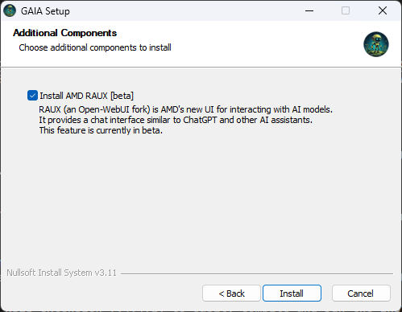

# GAIA Installer Guide

## Installation Modes

GAIA supports three installation modes, each optimized for different use cases:

1. **Hybrid Mode**: Best overall performance
   - Combines NPU and GPU capabilities
   - Recommended for most users with supported hardware
   - Requires Ryzen AI driver

2. **NPU Mode**: Best power efficiency
   - Optimized for AMD NPU hardware acceleration
   - Ideal for laptop users prioritizing battery life
   - Requires Ryzen AI driver

3. **Generic Mode** (Default): Most compatible
   - Standard GPU/CPU implementation
   - Works on any system
   - Uses Ollama for LLM support
   - No special hardware requirements

## Prerequisites

### Required Components

1. **Conda Environment** (All Modes)
   - Miniconda will be automatically installed if missing
   - Creates Python 3.10 environment named 'gaia_env'

2. **Ryzen AI Driver** (NPU/Hybrid Modes Only)
   - Required version: ${NPU_DRIVER_VERSION}
   - Will be automatically downloaded and installed if needed
   - Installer checks current version and offers updates

3. **Ollama** (Generic Mode Only)
   - Must be installed manually before installation
   - Download from [ollama.com](https://ollama.com)

## Installation Process

### 1. Pre-Installation Checks
- Verifies system requirements
- Checks for existing GAIA installation
- Removes previous versions if found
- Initializes installation logging

### 2. Environment Setup
The installer automatically:
- Checks for and installs Miniconda if needed
- Creates dedicated conda environment: gaia_env
- Configures Python 3.10
- Sets required environment variables
- Creates activation scripts

### 3. GAIA Installation

The installation process varies by mode:

**Hybrid Mode** (Best Performance)
- Installs core GAIA components
- Includes hybrid processing capabilities
- Adds CLIP and Joker examples

**NPU Mode** (Power Efficient)
- Installs core GAIA components
- Includes NPU-optimized processing
- Adds CLIP and Joker examples

**Generic Mode** (Most Compatible)
- Installs core GAIA components
- Includes DirectML acceleration support
- Adds CLIP and Joker examples

### 4. Additional Components

- Downloads mode-specific LLM artifacts
- For NPU/Hybrid modes:
  - Checks Ryzen AI driver version
  - Offers automatic driver updates
  - Installs Ryzen AI wheel packages
- Configures settings.json based on selected mode

### 5. AMD RAUX (Beta)

During installation, you can choose to install AMD RAUX (beta), AMD's new UI for interacting with AI models:
- RAUX (an Open-WebUI fork) is AMD's new UI for interacting with AI models
- Provides a chat interface similar to ChatGPT and other AI assistants
- Offers a modern, intuitive interface for conversational AI interactions
- Installed separately from the main GAIA application
- Creates its own desktop shortcut for easy access

To launch RAUX after installation:
- Click the RAUX desktop shortcut created during installation
- The application will open in your default web browser
- For technical support with RAUX, contact support@amd.com

### 6. Final Setup
- Creates desktop shortcuts
- Sets up launch configuration
- Validates installation

## Running the Installer

To run the installer, simply:
* Install [NSIS 3.10](https://prdownloads.sourceforge.net/nsis/nsis-3.10-setup.exe?download)
* Run `"C:\Program Files (x86)\NSIS\makensis.exe" Installer.nsi` to compile the installer with all features
* Open the exe

## Debugging

Debugging the installer could be tricky on a workflow since NSIS does not log anything that happens inside an `execWait` when running on a GitHub Workflow. To go around that, simply run the installer locally. To debug locally you have two options:

### Option 1: GUI installation
* Change all `ExecWait`s inside `Installer.nsi` to `Exec`. This will make sure terminals are not closed once something fails.
* Compile and run normally

### Option 2: Silent mode through terminal
* From a `Command Prompt` console, run `Gaia_Installer.exe /S`. All logs will be shown on the screen.

 ⚠️ NOTE: Optionally install the NSIS extension (v4.4.1) to easily compile and run the installer from within VSCode.

## Running the NPU Installer

To manually compile the installer for the NPU version, you need to set the `OGA_TOKEN` environment variable to your GitHub token with access to the `oga-npu` repository. This is used to automatically download the NPU dependencies. You also need to set the `HF_TOKEN` environment variable to your Hugging Face token.

This is all done automatically and securely by our workflow and should ideally not be done manually. However, if you need to, here's how:

`"C:\Program Files (x86)\NSIS\makensis.exe" /DOGA_TOKEN=<token> /DHF_TOKEN=<token> /DMODE=NPU Installer.nsi`

## Troubleshooting

If you encounter installation issues:
1. Check the installation logs at `$INSTDIR/install_log.txt`
2. Verify system requirements for your chosen mode
4. For Generic mode, verify Ollama is installed manually and running. You can download it from [ollama.com](https://ollama.com)

# Contact
Contact [GAIA team](mailto:gaia@amd.com) for any questions, feature requests, access or troubleshooting issues.

# License

[MIT License](../LICENSE.md)

Copyright(C) 2024-2025 Advanced Micro Devices, Inc. All rights reserved.
SPDX-License-Identifier: MIT