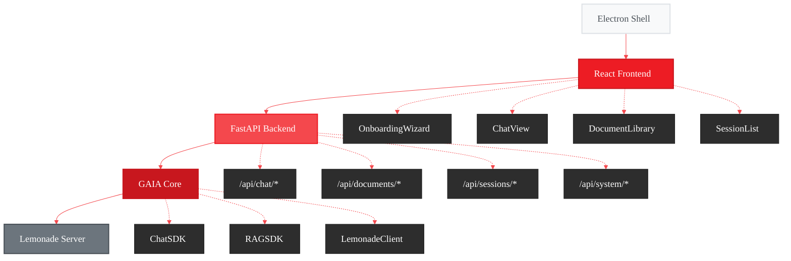

# GAIA Chat UI - Implementation Plan

<Info>
**Status:** Active Development
**Priority:** High
[View full plan on GitHub](https://github.com/amd/gaia/blob/main/docs/plans/chat-ui.md)
</Info>

## Executive Summary

Build **GAIA Chat** - a privacy-first desktop chat application for AI PCs that runs **100% locally** on AMD Ryzen AI hardware. Unlike cloud-based alternatives, your conversations and documents never leave your machine.

### Core Value Proposition

| Feature | Benefit |
|---------|---------|
| **Private** | Your data stays on YOUR device |
| **Fast** | AMD Ryzen AI NPU acceleration |
| **Smart** | RAG-powered document Q&A |
| **Free** | No API costs, no subscriptions |

> "ChatGPT for your private documents, running entirely on your AMD AI PC. No cloud, no subscription, no compromises."

---

## Key Features

### Document Support

The RAG SDK already supports **50+ formats**:

<Tabs>
  <Tab title="Documents">
    - PDF (with VLM for images)
    - TXT, LOG
    - Markdown (.md, .markdown)
    - CSV, JSON
    - ReStructuredText (.rst)
  </Tab>
  <Tab title="Code">
    - Python, Java, C++, Go, Rust, Ruby, PHP
    - JavaScript, TypeScript, JSX, TSX
    - Vue, Svelte, Astro
    - HTML, CSS, SCSS
    - SQL, YAML, XML, TOML
  </Tab>
</Tabs>

### Session Management

- **Global Document Library** - Index once, use everywhere
- **Per-Session Attachments** - Choose which docs to use per conversation
- **Shared CLI/UI State** - Start in terminal, continue in desktop app

### Privacy-First Design

- Visual "🔒 Local" indicator always visible
- Network monitor showing no outbound connections
- Data location display in settings
- One-click export and secure deletion
- No telemetry by default (opt-in only)

---

## Architecture

---

## Milestones

<Steps>
  <Step title="Foundation">
    Project structure, database schema, basic FastAPI server, CLI `gaia chat init`
  </Step>
  <Step title="Core Chat">
    Chat API endpoints, React UI, SSE streaming, message persistence
  </Step>
  <Step title="Documents">
    Document upload, RAG integration, library UI, source citations
  </Step>
  <Step title="Onboarding">
    System state detection, setup wizard, model download progress, error states
  </Step>
  <Step title="Polish">
    Privacy indicators, settings panel, export, keyboard shortcuts
  </Step>
  <Step title="Distribution">
    Electron packaging, installer integration, documentation
  </Step>
</Steps>

---

## Success Metrics

| Metric | Target |
|--------|--------|
| Time to first chat (new user) | < 5 minutes |
| Time to first chat (returning) | < 10 seconds |
| Document indexing | < 5 seconds per MB |
| Streaming latency | < 200ms first token |
| Error recovery rate | > 90% |

---

## Related

- [Roadmap](/roadmap) - High-level feature timeline
- [Installer Plan](/plans/installer) - Distribution strategy
- [Chat SDK Reference](/sdk/sdks/chat) - Underlying SDK documentation
- [RAG SDK Reference](/sdk/sdks/rag) - Document Q&A SDK

<Card title="Full Implementation Plan" icon="github" href="https://github.com/amd/gaia/blob/main/docs/plans/chat-ui.md">
  View the complete technical specification on GitHub
</Card>
