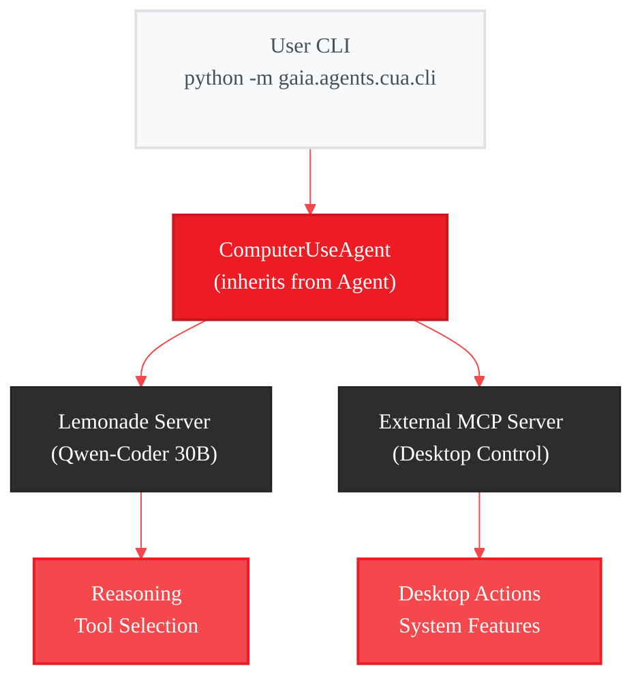
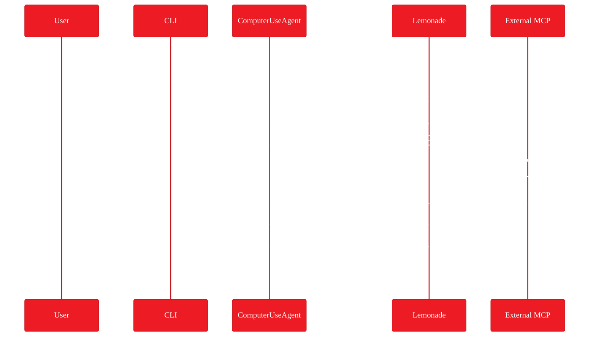
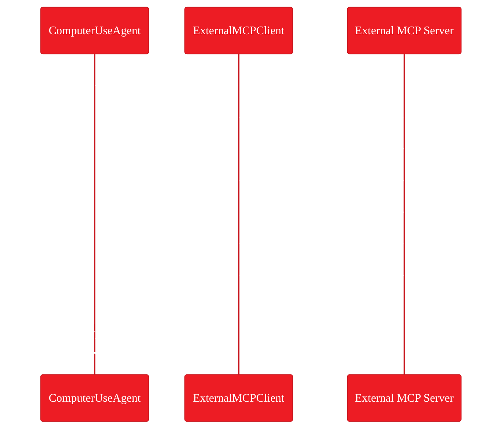
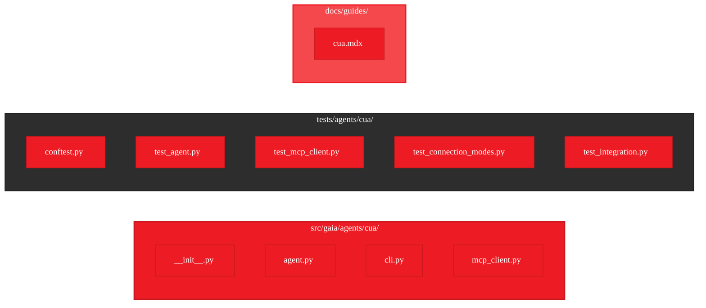

# Computer Use Agent (CUA) - Implementation Plan

<Info>
**Status:** Planning
**Priority:** High
**Target:** January 30, 2026
[Vote with 👍](https://github.com/amd/gaia/issues/224)
</Info>

## Executive Summary

Build a **Computer Use Agent (CUA)** that wraps external MCP servers and enables AI-powered desktop control through natural language commands. The agent dynamically discovers tools from the external MCP server and registers them locally, using Lemonade (Qwen-Coder 30B) for intelligent reasoning about which actions to take.

**Goal:** Let GAIA automate desktop features and system settings through natural language commands.

---

## Requirements

### Prerequisites

- GAIA SDK v0.16+
- Python 3.10+
- Lemonade Server running with Qwen-Coder 30B
- External MCP server for desktop control (user-provided)

### External MCP Server Requirements

External MCP servers must support the [MCP Protocol](https://modelcontextprotocol.io/):
- One of: stdio or HTTP transport
- `initialize` handshake
- `tools/list` capability
- `tools/call` for tool execution

---

## The Problem

GAIA agents currently cannot interact with desktop features and system settings. When agents need to:

- Adjust system settings and preferences
- Control hardware features and utilities
- Query device status and capabilities
- Automate repetitive system tasks

...they have no way to do so.

| Current Limitation | Impact |
|-------------------|--------|
| No desktop automation | Can't build end-to-end workflow agents |
| No system control | Can't adjust settings or features |
| No device queries | Can't check status or capabilities |
| Isolated from OS | Limited to file/code operations only |

Meanwhile, external MCP servers already provide desktop automation capabilities. GAIA just needs a way to connect to them.

---

## The Solution

A **Computer Use Agent** that connects to external MCP servers and exposes their tools to Lemonade:

```bash
# Single command execution
python -m gaia.agents.cua.cli "turn on dark mode"

# List available tools from external server
python -m gaia.agents.cua.cli --list-tools
```

<CardGroup cols={3}>
  <Card title="Desktop Automation" icon="desktop">
    System settings, features, utilities
    Automate any supported function
  </Card>
  <Card title="Natural Language" icon="message">
    Describe tasks in plain English
    AI figures out the steps
  </Card>
  <Card title="Tool-Agnostic" icon="puzzle-piece">
    Works with any MCP server
    No hardcoded tool definitions
  </Card>
</CardGroup>

---

## Architecture



### Key Design Decisions

| Decision | Choice | Rationale |
|----------|--------|-----------|
| **Base Class** | `Agent` (not `MCPAgent`) | CLI-first, no MCP server exposure needed |
| **Connection Modes** | stdio + HTTP | Flexibility for different external servers |
| **Tool Discovery** | Dynamic via `tools/list` | No hardcoded tool definitions |
| **Error Handling** | User-friendly + verbose flag | Clean UX by default |

### What This Agent Does NOT Do

- Does NOT expose itself as an MCP server
- Does NOT manage the external MCP server process
- Future UI integration will use OpenAI-compatible API (out of scope)

---

## Components

| Component | Purpose | Implementation |
|-----------|---------|----------------|
| **ComputerUseAgent** | Main agent class | Inherits from `Agent`, registers external tools |
| **ExternalMCPClient** | Protocol handler | JSON-RPC 2.0 over stdio or HTTP |
| **CLI** | User interface | Single command execution, tool listing |
| **Tool Registry Bridge** | Tool integration | Dynamically registers MCP tools with `@tool` system |

---

## Data Flow

### Tool Execution Flow



### Connection Flow



---

## CLI Commands

### Execute Commands

```bash
# Single command (primary use case)
python -m gaia.agents.cua.cli "turn on dark mode"

# With verbose output
python -m gaia.agents.cua.cli "check my battery status" --verbose

# Silent mode (no step output)
python -m gaia.agents.cua.cli "enable power saver" --silent

# Show execution trace
python -m gaia.agents.cua.cli "what features does my laptop support" --trace
```

### Tool Discovery

```bash
# List available tools from external server
python -m gaia.agents.cua.cli --list-tools

# List tools with verbose connection info
python -m gaia.agents.cua.cli --list-tools --verbose
```

### Configuration Options

```bash
# Specify external MCP server URL
python -m gaia.agents.cua.cli --mcp-server-url http://localhost:9000 "enable dark mode"

# Use specific LLM model
python -m gaia.agents.cua.cli --model Qwen3-Coder-30B "check storage status"
```

---

## Configuration

### Environment Variables

| Variable | Default | Description |
|----------|---------|-------------|
| `GAIA_CUA_MCP_URL` | `stdio` | External MCP server URL or "stdio" |

### Connection Modes

<Tabs>
  <Tab title="stdio (Default)">
    ```bash
    export GAIA_CUA_MCP_URL=stdio
    python -m gaia.agents.cua.cli "turn on dark mode"
    ```
  </Tab>
  <Tab title="HTTP">
    ```bash
    export GAIA_CUA_MCP_URL=http://localhost:9000
    python -m gaia.agents.cua.cli "turn on dark mode"
    ```
  </Tab>
</Tabs>

### Multi-Agent Future Architecture

The design supports future expansion with namespaced environment variables:

```bash
GAIA_CUA_MCP_URL          # Computer Use Agent
GAIA_BROWSER_MCP_URL      # Future: Browser Agent
GAIA_FILESYSTEM_MCP_URL   # Future: File System Agent
```

---

## Implementation Plan

<Steps>
  <Step title="MCP Client Layer (TDD)">
    `ExternalMCPClient` class with stdio and HTTP transport, JSON-RPC 2.0 protocol, connection handling
  </Step>
  <Step title="Agent Implementation (TDD)">
    `ComputerUseAgent` inheriting from `Agent`, dynamic tool registration, Lemonade integration
  </Step>
  <Step title="Standalone CLI">
    Command parsing, single-command execution, `--list-tools` mode, error handling
  </Step>
  <Step title="Integration Tests">
    Real external server tests, Lemonade integration tests, connection mode tests
  </Step>
  <Step title="Documentation">
    User guide (`docs/guides/cua.mdx`), API reference, troubleshooting guide
  </Step>
  <Step title="Code Review & Coverage">
    Lint check, >90% test coverage, final review
  </Step>
</Steps>

---

## Project Structure



| File | Purpose |
|------|---------|
| `agent.py` | ComputerUseAgent class |
| `cli.py` | Standalone CLI entry point |
| `mcp_client.py` | JSON-RPC client for external server |
| `test_agent.py` | Unit tests (mocked) |
| `test_mcp_client.py` | MCP client unit tests |
| `test_connection_modes.py` | stdio vs HTTP mode tests |
| `test_integration.py` | Real server integration tests |

---

## Success Metrics

| Metric | Target |
|--------|--------|
| External server connection time (stdio) | < 2 seconds |
| External server connection time (HTTP) | < 500ms |
| Tool call latency overhead | < 50ms |
| Supported connection modes | stdio, HTTP |
| Test coverage | > 90% |
| Graceful degradation | Agent usable when server unavailable |

---

## Comparison

| Feature | Direct Implementation | CUA Agent |
|---------|----------------------|-----------|
| Desktop automation | Custom integration code | Use any MCP server |
| Tool discovery | Hardcoded definitions | Dynamic via tools/list |
| LLM reasoning | Manual prompt engineering | Lemonade handles it |
| Error handling | Custom per-tool | Standardized, user-friendly |
| Future MCP servers | Rewrite everything | Just change URL |

---

## Error Handling

The agent provides user-friendly error messages by default, with technical details available via `--verbose`:

```bash
# Default: user-friendly message
$ python -m gaia.agents.cua.cli "turn on dark mode"
Error: External MCP server is not available.
Please ensure the server is running and try again.

# Verbose: includes technical details
$ python -m gaia.agents.cua.cli "turn on dark mode" --verbose
Error: External MCP server is not available.
Please ensure the server is running and try again.
Detail: Connection refused to stdio
```

---

## Security Considerations

- **Process isolation**: External MCP server runs as separate process
- **No credential storage**: Connection URLs configured via environment variables
- **Audit logging**: All tool calls can be logged with `--trace` flag
- **Graceful degradation**: Agent doesn't crash when server unavailable

---

## Relationship to MCP Client Mixin

This agent is a **specific implementation** of the [MCP Client Mixin](/plans/mcp-client) pattern:

| Component | MCP Client Mixin | CUA Agent |
|-----------|-----------------|-----------|
| Scope | General-purpose mixin | Desktop automation agent |
| Usage | Inherit in custom agents | Ready-to-use CLI |
| Configuration | Programmatic | Environment variables |
| Target | SDK developers | End users |

The CUA agent validates the MCP Client Mixin architecture and provides a reference implementation.

---

## Related

- [Roadmap](/roadmap) - High-level feature timeline
- [MCP Client Mixin Plan](/plans/mcp-client) - General MCP client architecture
- [MCP Integration Guide](/sdk/infrastructure/mcp) - MCP protocol documentation
- [Docker Agent Guide](/guides/docker) - Similar CLI-first agent pattern

<Card title="Vote on GitHub" icon="github" href="https://github.com/amd/gaia/issues/224">
  React with 👍 to help prioritize this feature
</Card>