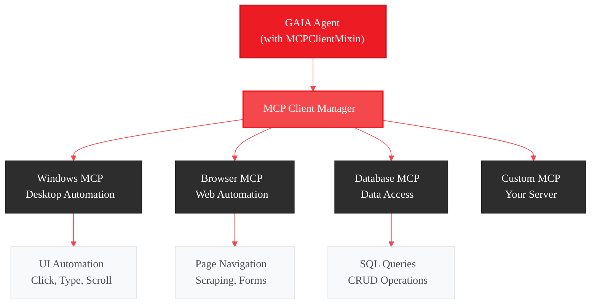
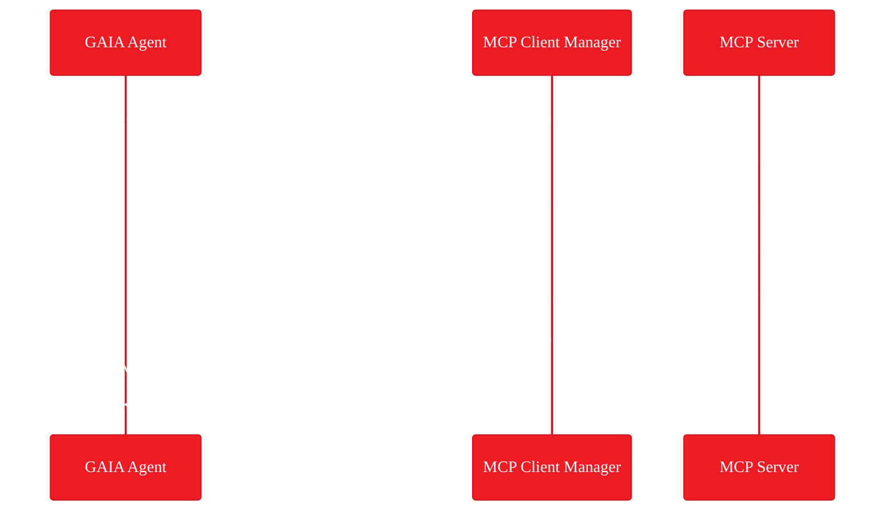
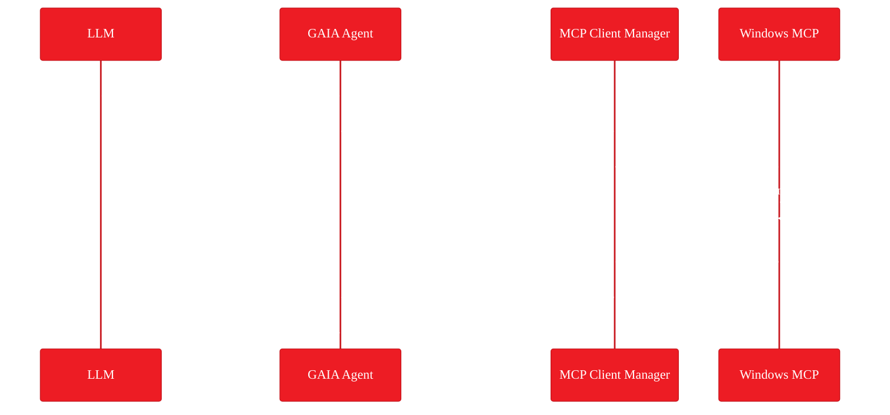

# GAIA MCP Client Mixin - Implementation Plan

<Info>
**Status:** Planning
**Priority:** High
[Vote with 👍](https://github.com/amd/gaia/issues/203)
</Info>

## Executive Summary

Create an **MCP Client Mixin** that enables GAIA agents to connect to and use tools from external MCP servers. This transforms GAIA agents into **Computer Use Agents (CUA)** that can control desktop applications, automate UI interactions, and integrate with the broader MCP ecosystem.

**Goal:** Let GAIA agents use any MCP-compatible tool - from Windows automation to browser control to database access.

---

## Requirements

### Prerequisites

- GAIA SDK v0.16+
- Python 3.10+
- MCP servers installed separately (e.g., `uvx install windows-mcp`)

### MCP Server Requirements

MCP servers must support the [MCP Protocol](https://modelcontextprotocol.io/):
- One of: stdio, HTTP, or WebSocket transport
- `initialize` handshake
- `tools/list` capability
- `tools/call` for tool execution

Most community MCP servers meet these requirements out of the box.

---

## The Problem

GAIA agents currently operate in isolation. When agents need to:

- Control desktop applications (click buttons, fill forms)
- Automate browser interactions
- Access external databases or APIs
- Interact with the file system through specialized tools

...they must implement everything from scratch.

| Current Limitation | Impact |
|-------------------|--------|
| No desktop automation | Can't build end-to-end workflow agents |
| No browser control | Can't automate web-based tasks |
| No MCP ecosystem access | Missing 100+ available MCP servers |
| Reinventing the wheel | Duplicated effort across projects |

Meanwhile, the MCP ecosystem offers ready-to-use servers for:

- **Windows automation** ([Windows-MCP](https://github.com/CursorTouch/Windows-MCP))
- **Browser control** (Puppeteer MCP, Playwright MCP)
- **File operations** (Filesystem MCP)
- **Database access** (SQLite MCP, PostgreSQL MCP)
- **And many more...**

---

## The Solution

An `MCPClientMixin` that agents can inherit to connect to external MCP servers:

```python
from gaia.agents.base import Agent, MCPClientMixin
from gaia.agents.base.tools import tool

class DesktopAutomationAgent(MCPClientMixin, Agent):
    """Agent that can control the Windows desktop."""

    def __init__(self):
        super().__init__()
        # Connect to Windows MCP server
        self.connect_mcp_server("windows", "uvx windows-mcp")

    @tool
    def open_app_and_click(self, app_name: str, button_text: str) -> str:
        """Open an application and click a button."""
        # Launch the application
        self.mcp_call("windows", "app-tool", {"action": "launch", "app": app_name})
        # Get current UI state to find the button
        state = self.mcp_call("windows", "state-tool", {})
        # Find button coordinates from UI tree
        coords = self._find_element_by_text(state["ui_tree"], button_text)
        # Click the button
        self.mcp_call("windows", "click-tool", {"x": coords[0], "y": coords[1]})
        return f"Launched {app_name} and clicked '{button_text}'"
```

<CardGroup cols={3}>
  <Card title="Desktop Automation" icon="desktop">
    Control Windows apps, click buttons, fill forms
    via Windows MCP
  </Card>
  <Card title="Browser Control" icon="globe">
    Navigate pages, scrape data, automate web tasks
    via Puppeteer MCP
  </Card>
  <Card title="MCP Ecosystem" icon="puzzle-piece">
    Access 100+ MCP servers
    Filesystem, databases, APIs
  </Card>
</CardGroup>

---

## Use Cases

### Computer Use Agent (CUA)

The primary use case: agents that can see and interact with the desktop.

```python
from gaia.agents.base import Agent, MCPClientMixin
from gaia.agents.base.tools import tool

class ComputerUseAgent(MCPClientMixin, Agent):
    """Agent that can control the computer like a human."""

    def __init__(self):
        super().__init__()
        self.connect_mcp_server("windows", "uvx windows-mcp")

    @tool
    def take_screenshot_and_analyze(self) -> str:
        """Capture the screen and describe what's visible."""
        state = self.mcp_call("windows", "state-tool", {"screenshot": True})
        # Use VLM to analyze the screenshot
        return self.analyze_image(state["screenshot"])

    @tool
    def click_element(self, description: str) -> str:
        """Click on an element matching the description."""
        state = self.mcp_call("windows", "state-tool", {})
        # Find element coordinates from UI tree
        coords = self.find_element(state["ui_tree"], description)
        self.mcp_call("windows", "click-tool", {"x": coords[0], "y": coords[1]})
        return f"Clicked on {description}"

    @tool
    def type_text(self, text: str) -> str:
        """Type text into the focused element."""
        self.mcp_call("windows", "type-tool", {"text": text})
        return f"Typed: {text}"
```

### Multi-MCP Orchestration

Agents can connect to multiple MCP servers simultaneously:

```python
from gaia.agents.base import Agent, MCPClientMixin
from gaia.agents.base.tools import tool

class FullStackAgent(MCPClientMixin, Agent):
    """Agent that combines multiple MCP capabilities."""

    def __init__(self):
        super().__init__()
        # Connect to multiple MCP servers
        self.connect_mcp_server("windows", "uvx windows-mcp")
        self.connect_mcp_server("browser", "npx @anthropic/puppeteer-mcp")
        self.connect_mcp_server("db", "uvx sqlite-mcp")

    @tool
    def end_to_end_workflow(self, task: str) -> str:
        """Execute a workflow spanning desktop, browser, and database."""
        # Open browser via Windows MCP
        self.mcp_call("windows", "app-tool", {"action": "launch", "app": "chrome"})
        # Navigate via Puppeteer MCP
        self.mcp_call("browser", "navigate", {"url": "https://example.com"})
        # Store results via SQLite MCP
        self.mcp_call("db", "query", {"sql": "INSERT INTO logs ..."})
        return f"Completed workflow: {task}"
```

### Additional Use Cases

The MCP ecosystem supports many integration patterns:

| Use Case | MCP Server | Example |
|----------|------------|---------|
| **Filesystem** | Filesystem MCP | Read/write files, watch directories |
| **Database** | SQLite/PostgreSQL MCP | Query data, manage schemas |
| **GitHub** | GitHub MCP | Create issues, manage PRs, search repos |
| **Web Search** | Brave/Google MCP | Search the web, fetch results |
| **Slack/Discord** | Chat platform MCPs | Send messages, read channels |
| **Calendar** | Google Calendar MCP | Create events, check availability |

```python
# Example: GitHub automation agent
class GitHubAgent(MCPClientMixin, Agent):
    def __init__(self):
        super().__init__()
        self.connect_mcp_server("github", url="http://localhost:8080", transport="http")

    @tool
    def create_issue(self, repo: str, title: str, body: str) -> str:
        result = self.mcp_call("github", "create-issue", {
            "repo": repo, "title": title, "body": body
        })
        return f"Created issue #{result['number']}"
```

---

## MCP Client Mixin API

### Core Methods

```python
from typing import Any, Dict, List, Optional

class MCPClientMixin:
    """Mixin for agents that consume external MCP servers."""

    def connect_mcp_server(
        self,
        name: str,
        command: Optional[str] = None,
        url: Optional[str] = None,
        transport: str = "stdio",
        env: Optional[Dict[str, str]] = None,
        working_dir: Optional[str] = None,
        auto_register: bool = False,
        tool_prefix: Optional[str] = None
    ) -> None:
        """
        Connect to an MCP server.

        Args:
            name: Unique identifier for this connection
            command: Command to start the MCP server (for stdio transport)
            url: URL of the MCP server (for http/websocket transport)
            transport: Transport type - "stdio", "http", or "websocket"
            env: Environment variables for the server process
            working_dir: Working directory for the server
            auto_register: If True, register MCP tools as agent tools
            tool_prefix: Prefix for auto-registered tool names (e.g., "win_")

        Raises:
            MCPConnectionError: If server fails to start or initialize
            MCPTimeoutError: If connection times out

        Example:
            # stdio transport (local subprocess)
            self.connect_mcp_server("windows", command="uvx windows-mcp")

            # HTTP transport (remote server)
            self.connect_mcp_server("api", url="http://localhost:8080", transport="http")

            # WebSocket transport (persistent connection)
            self.connect_mcp_server("realtime", url="ws://localhost:9000", transport="websocket")

            # With auto-registration
            self.connect_mcp_server("win", command="uvx windows-mcp", auto_register=True, tool_prefix="win_")
        """

    def disconnect_mcp_server(self, name: str) -> None:
        """Disconnect from an MCP server and clean up resources."""

    def list_mcp_tools(self, server_name: str) -> List[Dict]:
        """
        List available tools from an MCP server.

        Returns:
            List of tool definitions with name, description, and inputSchema

        Raises:
            MCPNotConnectedError: If server is not connected
        """

    def mcp_call(
        self,
        server_name: str,
        tool_name: str,
        arguments: Dict[str, Any]
    ) -> Dict[str, Any]:
        """
        Call a tool on an MCP server.

        Args:
            server_name: Name of the connected server
            tool_name: Name of the tool to call
            arguments: Tool arguments

        Returns:
            Tool execution result

        Raises:
            MCPNotConnectedError: If server is not connected
            MCPToolError: If tool execution fails

        Example:
            result = self.mcp_call("windows", "click-tool", {"x": 100, "y": 200})
        """

    def get_mcp_resources(self, server_name: str) -> List[Dict]:
        """List resources available from an MCP server."""

    def read_mcp_resource(self, server_name: str, uri: str) -> Any:
        """Read a resource from an MCP server."""
```

### Error Handling

```python
from gaia.mcp.exceptions import MCPConnectionError, MCPToolError, MCPNotConnectedError

class MyAgent(MCPClientMixin, Agent):
    @tool
    def safe_click(self, x: int, y: int) -> str:
        """Click with error handling."""
        try:
            self.mcp_call("windows", "click-tool", {"x": x, "y": y})
            return f"Clicked at ({x}, {y})"
        except MCPNotConnectedError:
            return "Error: Windows MCP server not connected"
        except MCPToolError as e:
            return f"Click failed: {e}"
```

### Auto-Registration of MCP Tools

The mixin can automatically register external MCP tools as agent tools, making them directly callable by the LLM:

```python
from gaia.agents.base import Agent, MCPClientMixin

class SmartAgent(MCPClientMixin, Agent):
    def __init__(self):
        super().__init__()
        # Connect and auto-register tools with prefix
        self.connect_mcp_server(
            name="windows",
            command="uvx windows-mcp",
            auto_register=True,  # Register as agent tools
            tool_prefix="win_"   # Prefix for tool names
        )

        # Now the LLM can directly call these tools:
        # - win_click_tool(x, y)
        # - win_type_tool(text)
        # - win_state_tool()
        # - win_app_tool(action, app)
        # etc.
```

Without `auto_register`, you must wrap MCP calls in your own `@tool` methods (as shown in earlier examples). With `auto_register=True`, the LLM gains direct access to all MCP server tools.

---

## Architecture



### Components

| Component | Purpose | Implementation |
|-----------|---------|----------------|
| **MCPClientMixin** | Base mixin class | Inherit to add MCP client capabilities |
| **MCPClient** | Protocol handler | MCP message serialization/deserialization |
| **MCPClientManager** | Connection orchestrator | Manage multiple server connections |
| **StdioTransport** | Local subprocess | Pipe-based communication |
| **HTTPTransport** | Remote HTTP servers | Request/response pattern |
| **WebSocketTransport** | Persistent connections | Bidirectional streaming |
| **Tool Registry Bridge** | Tool integration | Auto-register MCP tools as agent tools |

---

## Windows MCP Integration

The primary CUA target. [Windows-MCP](https://github.com/CursorTouch/Windows-MCP) provides:

### Available Tools

| Tool | Description | Use Case |
|------|-------------|----------|
| `click-tool` | Click at coordinates | Button clicks, selections |
| `type-tool` | Enter text | Form filling, typing |
| `scroll-tool` | Scroll viewport | Navigate long pages |
| `drag-tool` | Drag between points | Move elements, resize |
| `move-tool` | Move mouse pointer | Hover effects, positioning |
| `shortcut-tool` | Keyboard shortcuts | Ctrl+C, Alt+Tab, etc. |
| `wait-tool` | Pause execution | Wait for UI to load |
| `state-tool` | Capture screen state | Get UI tree, screenshots |
| `app-tool` | Application control | Launch, resize, switch apps |
| `shell-tool` | PowerShell commands | System automation |
| `scrape-tool` | Web page extraction | Browser content |

### Example: Automated Form Filling

```python
from typing import Dict
from gaia.agents.base import Agent, MCPClientMixin
from gaia.agents.base.tools import tool

class FormFillerAgent(MCPClientMixin, Agent):
    """Fill out forms in any Windows application."""

    def __init__(self):
        super().__init__()
        self.connect_mcp_server("windows", "uvx windows-mcp")

    @tool
    def fill_form(self, app_name: str, form_data: Dict[str, str]) -> str:
        """Open an app and fill out a form with the provided data."""
        # Launch application
        self.mcp_call("windows", "app-tool", {
            "action": "launch",
            "app": app_name
        })

        # Wait for app to load
        self.mcp_call("windows", "wait-tool", {"seconds": 2})

        # Get current UI state
        state = self.mcp_call("windows", "state-tool", {})

        # Fill each field
        for field_name, value in form_data.items():
            # Find field (using UI tree or coordinates)
            coords = self._find_field(state, field_name)
            self.mcp_call("windows", "click-tool", {"x": coords[0], "y": coords[1]})
            self.mcp_call("windows", "type-tool", {"text": value, "clear": True})
            self.mcp_call("windows", "shortcut-tool", {"keys": ["tab"]})

        return f"Filled {len(form_data)} fields in {app_name}"
```

---

## CLI Commands

### Start MCP Client Agent

```bash
# Run a CUA session
gaia cua

# Run with specific MCP servers
gaia cua --mcp windows --mcp browser

# Interactive mode with Windows automation
gaia cua --mcp windows --task "Open Calculator and compute 2+2"
```

### MCP Server Management

```bash
# Add an MCP server to config
gaia mcp add windows --command "uvx windows-mcp"
gaia mcp add github --url "http://localhost:8080" --transport http

# List configured MCP servers
gaia mcp list

# Test MCP server connection
gaia mcp test windows

# Show tools from an MCP server
gaia mcp tools windows

# Remove an MCP server from config
gaia mcp remove windows
```

---

## Data Flow

### Connection Flow



### Tool Execution Flow



---

## Implementation Plan

<Steps>
  <Step title="Foundation">
    MCPClientMixin base class, MCPClient protocol handler, MCPClientManager
  </Step>
  <Step title="Transports">
    StdioTransport (subprocess), HTTPTransport, WebSocketTransport
  </Step>
  <Step title="Protocol">
    MCP protocol implementation (initialize, tools/list, tools/call)
  </Step>
  <Step title="Tool Bridge">
    Auto-registration of MCP tools as agent tools, tool prefix support
  </Step>
  <Step title="CLI">
    `gaia mcp add/list/test/tools/remove`, `gaia cua` commands
  </Step>
  <Step title="Integration">
    Windows MCP integration, example CUA agent, documentation
  </Step>
</Steps>

---

## Configuration

### Agent Configuration

```python
# In your agent
class MyAgent(MCPClientMixin, Agent):
    MCP_SERVERS = {
        # stdio transport (default)
        "windows": {
            "command": "uvx windows-mcp",
            "transport": "stdio",
            "auto_register": True,
            "tool_prefix": "win_"
        },
        # HTTP transport
        "github": {
            "url": "http://localhost:8080",
            "transport": "http",
            "auto_register": True,
            "tool_prefix": "gh_"
        },
        # WebSocket transport
        "realtime": {
            "url": "ws://localhost:9000",
            "transport": "websocket"
        }
    }
```

### Global Configuration

```yaml
# ~/.gaia/config.yaml
mcp:
  servers:
    # stdio transport (local subprocess)
    windows:
      command: uvx windows-mcp
      transport: stdio
      enabled: true
      auto_register: true
      tool_prefix: win_

    # HTTP transport (remote server)
    github:
      url: http://localhost:8080
      transport: http
      enabled: true

    # WebSocket transport (persistent connection)
    realtime:
      url: ws://localhost:9000
      transport: websocket
      enabled: false
```

---

## Success Metrics

| Metric | Target |
|--------|--------|
| MCP server connection time (stdio) | < 2 seconds |
| MCP server connection time (HTTP/WS) | < 500ms |
| Tool call latency overhead | < 50ms |
| Supported transports | stdio, HTTP, WebSocket |
| Supported MCP protocol version | 2024-11-05 |
| Windows MCP tool coverage | 100% (all 11 tools) |
| Example agents | 3+ (CUA, GitHub, multi-MCP) |

---

## Comparison

| Feature | Direct Implementation | MCP Client Mixin |
|---------|----------------------|------------------|
| Desktop automation | Custom pyautogui code | Use Windows MCP |
| Browser control | Custom Selenium/Playwright | Use Puppeteer MCP |
| Database access | Custom connectors | Use SQLite/Postgres MCP |
| Development time | Weeks per integration | Hours |
| Maintenance | Own all code | Community maintained |
| Ecosystem access | None | 100+ MCP servers |

---

## Security Considerations

- **Process isolation**: MCP servers run as separate processes
- **Permission scoping**: Configure which tools agents can access
- **Audit logging**: Log all MCP tool calls for review
- **Sandboxing**: Optional restricted execution environment

---

## Relationship to MCPAgent

GAIA's MCP support has two complementary directions:

| Mixin | Direction | Purpose |
|-------|-----------|---------|
| **MCPAgent** (existing) | GAIA → External | Expose GAIA agents AS MCP servers for external tools |
| **MCPClientMixin** (this plan) | External → GAIA | Let GAIA agents USE external MCP servers |

An agent can use both mixins simultaneously:

```python
class FullyConnectedAgent(MCPClientMixin, MCPAgent, Agent):
    """Agent that both exposes and consumes MCP tools."""

    # Can be called by Claude Code, Cursor, etc.
    def get_mcp_tool_definitions(self):
        return [...]

    # Can call Windows MCP, browser MCP, etc.
    def __init__(self):
        super().__init__()
        self.connect_mcp_server("windows", "uvx windows-mcp")
```

---

## Related

- [Roadmap](/roadmap) - High-level feature timeline
- [MCP Integration Guide](/sdk/infrastructure/mcp) - Current MCP server support
- [MCPAgent Specification](/spec/mcp-agent) - Server-side MCP implementation
- [Windows MCP](https://github.com/CursorTouch/Windows-MCP) - Desktop automation server

<Card title="Vote on GitHub" icon="github" href="https://github.com/amd/gaia/issues/203">
  React with 👍 to help prioritize this feature
</Card>
