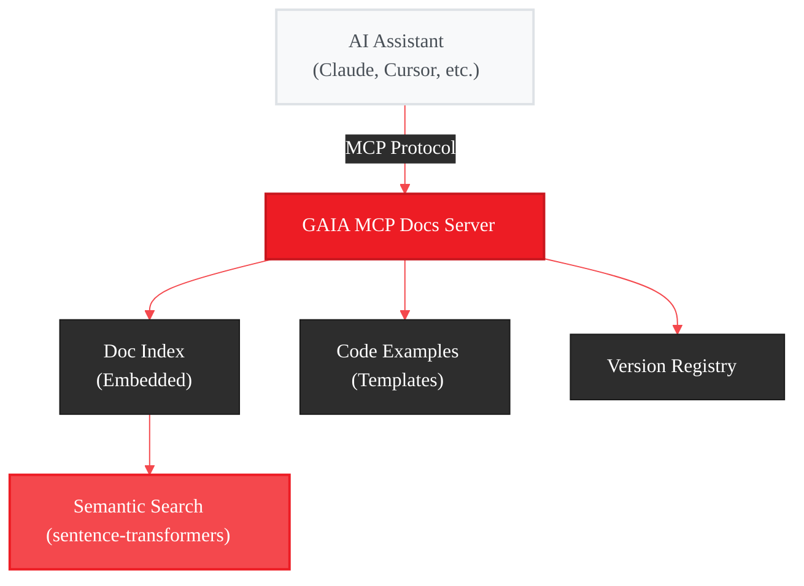
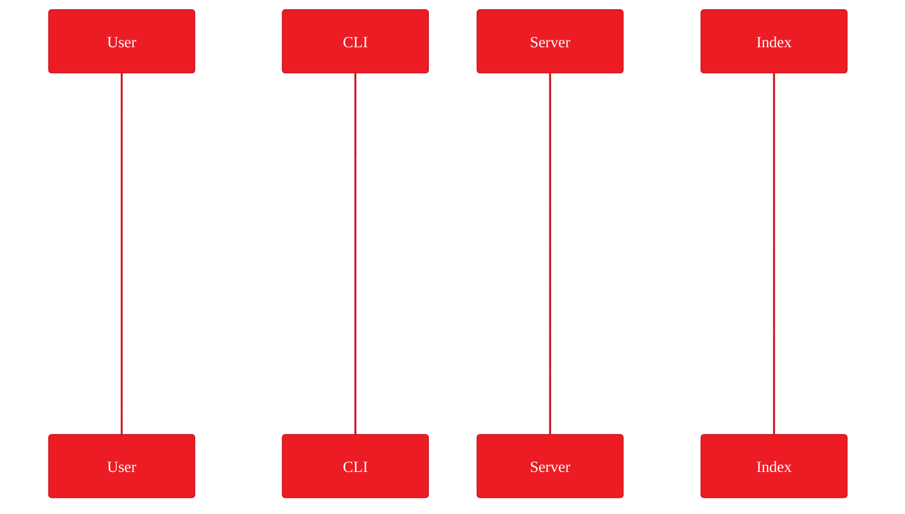
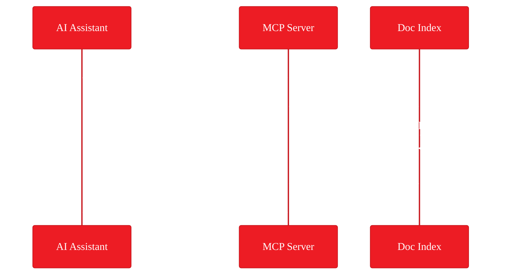

# GAIA MCP Docs Server - Implementation Plan

<Info>
**Status:** Planning
**Priority:** Medium
[View full plan on GitHub](https://github.com/amd/gaia/blob/main/docs/plans/mcp-docs.md) • [Vote with 👍](https://github.com/amd/gaia/issues/201)
</Info>

## Executive Summary

Create an **MCP Documentation Server** that gives AI coding assistants (Claude Code, Cursor, GitHub Copilot, etc.) intelligent access to GAIA SDK documentation. Instead of web fetches or static context files, the MCP server provides semantic search, code examples on demand, and version-aware documentation.

**Goal:** Make AI assistants expert GAIA developers out of the box.

---

## The Problem

When developers use AI coding assistants to build GAIA agents, the AI lacks context about:

- SDK patterns and best practices
- Available tools, mixins, and base classes
- Correct usage examples
- Version-specific APIs

Current workarounds are suboptimal:

| Approach | Limitation |
|----------|------------|
| Web fetch | Slow, one page at a time, requires network |
| Static CLAUDE.md | Gets outdated, limited coverage |
| Copy-paste docs | Manual, context window bloat |

---

## The Solution

An MCP server that exposes GAIA documentation as **tools** that AI assistants can call:

```
gaia mcp docs start
```

<CardGroup cols={3}>
  <Card title="Semantic Search" icon="magnifying-glass">
    Find relevant docs across all pages
    "How do I handle errors in tools?"
  </Card>
  <Card title="Code Examples" icon="code">
    Get working snippets for any pattern
    "Show me MCPAgent usage"
  </Card>
  <Card title="Version Aware" icon="tag">
    Returns docs matching installed version
    Compatible with GAIA 0.15+
  </Card>
</CardGroup>

---

## MCP Tools

### `search_docs`

Semantic search across all GAIA documentation.

```json
{
  "name": "search_docs",
  "description": "Search GAIA SDK documentation",
  "inputSchema": {
    "type": "object",
    "properties": {
      "query": {
        "type": "string",
        "description": "Natural language search query"
      },
      "category": {
        "type": "string",
        "enum": ["all", "sdk", "guides", "spec", "examples"],
        "default": "all"
      },
      "limit": {
        "type": "integer",
        "default": 5
      }
    },
    "required": ["query"]
  }
}
```

**Example:**
```
Input: {"query": "how to add tools to an agent", "limit": 3}

Output: [
  {"title": "Tool Decorator", "path": "/sdk/core/tools", "snippet": "Use @tool decorator..."},
  {"title": "Agent System", "path": "/sdk/core/agent-system", "snippet": "_register_tools() method..."},
  {"title": "Quickstart", "path": "/quickstart", "snippet": "Define tools inside your agent..."}
]
```

### `get_page`

Retrieve a specific documentation page.

```json
{
  "name": "get_page",
  "description": "Get full content of a documentation page",
  "inputSchema": {
    "type": "object",
    "properties": {
      "path": {
        "type": "string",
        "description": "Documentation path (e.g., /sdk/core/tools)"
      },
      "section": {
        "type": "string",
        "description": "Optional: specific section heading to extract"
      }
    },
    "required": ["path"]
  }
}
```

### `get_code_example`

Get working code examples for specific patterns.

```json
{
  "name": "get_code_example",
  "description": "Get code examples for GAIA SDK patterns",
  "inputSchema": {
    "type": "object",
    "properties": {
      "pattern": {
        "type": "string",
        "description": "Pattern name (e.g., 'basic-agent', 'tool-with-error-handling', 'mcp-agent')"
      },
      "language": {
        "type": "string",
        "default": "python"
      }
    },
    "required": ["pattern"]
  }
}
```

**Available patterns:**
- `basic-agent` - Minimal agent with one tool
- `tool-decorator` - @tool usage with parameters
- `tool-error-handling` - Error return patterns
- `llm-client-local` - Lemonade client setup
- `llm-client-claude` - Claude API setup
- `llm-client-openai` - OpenAI API setup
- `mcp-agent` - MCPAgent mixin usage
- `api-agent` - ApiAgent mixin usage
- `rag-basic` - RAG SDK initialization
- `rag-query` - Document querying

### `list_components`

List available GAIA components with descriptions.

```json
{
  "name": "list_components",
  "description": "List GAIA SDK components",
  "inputSchema": {
    "type": "object",
    "properties": {
      "category": {
        "type": "string",
        "enum": ["agents", "mixins", "tools", "sdks", "all"],
        "default": "all"
      }
    }
  }
}
```

---

## Architecture



### Components

| Component | Purpose | Implementation |
|-----------|---------|----------------|
| **Doc Index** | Preprocessed docs for fast search | MDX files → JSON chunks at build time |
| **Embedding Store** | Semantic similarity search | sentence-transformers + FAISS |
| **Code Templates** | Working examples | Jinja2 templates with version tags |
| **Version Registry** | API compatibility | Semver matching |

---

## Integration

### Claude Code

Add to `~/.claude/claude_code_config.json`:

```json
{
  "mcpServers": {
    "gaia-docs": {
      "command": "gaia",
      "args": ["mcp", "docs", "start"]
    }
  }
}
```

### VSCode (with MCP extension)

Add to `.vscode/settings.json`:

```json
{
  "mcp.servers": {
    "gaia-docs": {
      "command": "gaia mcp docs start"
    }
  }
}
```

### Cursor

Add to Cursor MCP settings:

```json
{
  "gaia-docs": {
    "command": "gaia mcp docs start"
  }
}
```

---

## CLI Commands

### Start the docs server

```bash
# Start MCP docs server
gaia mcp docs start

# Start with custom port
gaia mcp docs start --port 8081

# Start in background
gaia mcp docs start --background
```

### Manage the index

```bash
# Rebuild doc index (after GAIA update)
gaia mcp docs index

# Check index status
gaia mcp docs status

# Clear cached embeddings
gaia mcp docs clear-cache
```

---

## Data Flow

### On First Run



### On Query



---

## Implementation Plan

<Steps>
  <Step title="Foundation">
    MCP server skeleton, CLI commands (`gaia mcp docs start/status`), stdio transport
  </Step>
  <Step title="Doc Processing">
    MDX parser, chunk extraction, JSON index builder, bundled with package
  </Step>
  <Step title="Search">
    Embedding generation, FAISS index, `search_docs` tool implementation
  </Step>
  <Step title="Tools">
    `get_page`, `get_code_example`, `list_components` implementations
  </Step>
  <Step title="Templates">
    Code example templates, version tagging, Jinja2 rendering
  </Step>
  <Step title="Integration">
    Claude Code config generator, VSCode setup, Cursor setup, documentation
  </Step>
</Steps>

---

## Success Metrics

| Metric | Target |
|--------|--------|
| Search latency | < 100ms |
| Index build time | < 30 seconds |
| Index size | < 50 MB |
| Query relevance (top-3 hit rate) | > 80% |
| Code example accuracy | 100% (validated at build) |

---

## Comparison

| Feature | WebFetch | Static CLAUDE.md | MCP Docs Server |
|---------|----------|------------------|-----------------|
| Setup required | None | Download file | Start server |
| Search capability | Single page | None | Semantic across all |
| Speed | Slow (network) | Instant | Fast (local) |
| Offline support | No | Yes | Yes |
| Always current | Yes | No | Yes (with gaia update) |
| Code examples | Manual extraction | Limited | On-demand |
| Version aware | No | No | Yes |

---

## Why Q2 2026?

This milestone is timed to follow the Lightweight Installer and Chat Desktop UI:

1. **Foundation ready** - By Q2, GAIA will have stable installation and core UI, making it easier for new developers to get started
2. **Documentation mature** - The SDK docs will be comprehensive and battle-tested
3. **AI assistants mainstream** - Claude Code, Cursor, and GitHub Copilot adoption continues to grow
4. **MCP ecosystem expanding** - More tools supporting MCP means broader reach

Building the MCP Docs Server after the core experience is polished ensures we're helping developers with a stable, well-documented SDK.

---

## Future Enhancements

- **Source code search** - Search GAIA source, not just docs
- **Interactive examples** - Run code snippets and return results
- **Custom docs** - Index user's own agent documentation
- **Multi-language** - Support non-Python examples (TypeScript, etc.)

---

## Related

- [Roadmap](/roadmap) - High-level feature timeline
- [MCP Integration Guide](/sdk/infrastructure/mcp) - MCP protocol documentation
- [Claude Code Setup](/integrations/vscode) - IDE integration guides

<Card title="Full Implementation Plan" icon="github" href="https://github.com/amd/gaia/blob/main/docs/plans/mcp-docs.md">
  View the complete technical specification on GitHub
</Card>
