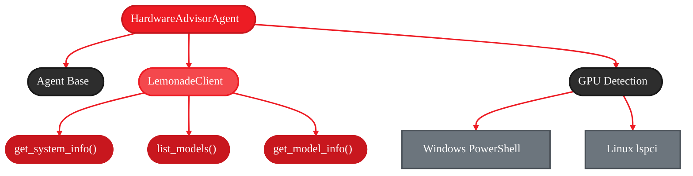

<Info>
  **Source Code:** [`examples/hardware_advisor_agent.py`](https://github.com/amd/gaia/blob/main/examples/hardware_advisor_agent.py)
</Info>

<Badge text="development" color="orange" />

**Time to complete:** 15-20 minutes
**What you'll build:** A hardware analysis agent that recommends which LLMs you can run
**What you'll learn:** LemonadeClient APIs, GPU/NPU detection, memory-based recommendations
**Platform:** Runs locally on AI PCs with Ryzen AI (NPU/iGPU acceleration)

---

## Why Build This Agent?

<Info>
**Privacy-First AI:** This agent runs entirely on your AI PC. Hardware detection and model recommendations happen locally—no data leaves your machine.
</Info>

When users ask "What size LLM can I run?", the answer depends on their actual hardware. Instead of guessing or looking up specifications manually, this agent:

1. Detects system RAM, GPU, and NPU via Lemonade Server
2. Queries the available model catalog with size estimates
3. Calculates which models fit in available memory
4. Provides personalized recommendations based on real hardware specs

**What you're building:**

A hardware advisor agent that combines:
- **LemonadeClient SDK** - System info and model catalog APIs
- **Platform-specific detection** - Windows PowerShell / Linux lspci for GPU info
- **Memory calculations** - 70% rule for safe model sizing
- **Interactive CLI** - Natural language queries about capabilities
- **Local execution** - Runs entirely on your AI PC using Ryzen AI acceleration

---

## The Architecture (What You're Building)



**Flow:**
1. User query → HardwareAdvisorAgent (orchestrator)
2. Agent selects tool → get_hardware_info / list_available_models / recommend_models
3. Tools call → LemonadeClient SDK + OS-specific detection
4. Results aggregated → Agent synthesizes recommendation
5. User receives personalized advice

---

## Quick Start (5 Minutes)

Get a working agent running to understand the basic flow.

<Steps>
  <Step title="Install GAIA">
    ```bash
    uv pip install amd-gaia
    ```
  </Step>

  <Step title="Start Lemonade Server">
    ```bash
    # Start local LLM server with AMD NPU/iGPU acceleration
    lemonade-server serve
    ```

    <Info>
    Lemonade Server provides AMD-optimized inference for AI PCs with Ryzen AI. It also exposes system info and model catalog APIs that this agent uses.
    </Info>
  </Step>

  <Step title="Run the Hardware Advisor">
    ```bash
    python examples/hardware_advisor_agent.py
    ```

    **Try asking:**
    - "What size LLM can I run?"
    - "Show me my system specs"
    - "What models are available?"
    - "Can I run a 30B model?"
  </Step>

  <Step title="See it in action">
    **Example interaction:**
    ```
    You: What size LLM can I run?

    Agent: Let me check your hardware specs...

    [Tool: get_hardware_info]
    RAM: 32 GB, GPU: AMD Radeon RX 7900 XTX (24 GB), NPU: Available

    [Tool: recommend_models]
    Based on your 32 GB RAM, you can safely run models up to ~22 GB.

    Agent: Great news! With 32 GB RAM and a 24 GB GPU, you can run:
    - 30B parameter models (like Qwen3-Coder-30B)
    - Most 7B-14B models comfortably
    - NPU acceleration available for smaller models
    ```
  </Step>
</Steps>

<Note>
The agent requires Lemonade Server to be running for hardware detection and model catalog queries. GAIA auto-starts it on first use if not running.
</Note>

---

## Understanding the Components

Before we build step-by-step, let's understand what each piece does **under the hood**.

### 1. LemonadeClient SDK

<Tabs>
  <Tab title="Import">
    ```python
    from gaia.llm.lemonade_client import LemonadeClient

    client = LemonadeClient(keep_alive=True)
    ```
  </Tab>

  <Tab title="get_system_info()">
    ```python
    info = client.get_system_info()

    # Returns:
    {
        "OS Version": "Windows 11 Pro",
        "Processor": "AMD Ryzen 9 7950X",
        "Physical Memory": "32.0 GB",
        "devices": {
            "cpu": {"name": "...", "available": True},
            "gpu": {"name": "...", "memory": 8192, "available": True},
            "npu": {"name": "Ryzen AI NPU", "available": True}
        }
    }
    ```
  </Tab>

  <Tab title="list_models()">
    ```python
    response = client.list_models(show_all=True)

    # Returns:
    {
        "data": [
            {
                "id": "Qwen2.5-0.5B-Instruct-CPU",
                "name": "Qwen 2.5 0.5B (CPU)",
                "downloaded": True,
                "labels": ["hot", "cpu", "small"]
            },
            # ... more models
        ]
    }
    ```
  </Tab>

  <Tab title="get_model_info()">
    ```python
    model_info = client.get_model_info("Qwen3-Coder-30B-A3B-Instruct-GGUF")

    # Returns:
    {
        "id": "Qwen3-Coder-30B-A3B-Instruct-GGUF",
        "name": "Qwen3 Coder 30B",
        "size_gb": 18.5,
        "downloaded": False
    }
    ```
  </Tab>
</Tabs>

**Why LemonadeClient?**
- Provides unified API for system detection
- Returns NPU/GPU availability from Lemonade Server
- Model catalog with size estimates for recommendations

---

### 2. Platform-Specific GPU Detection

<Tabs>
  <Tab title="Windows">
    ```python
    # PowerShell query (wmic deprecated on Windows 11)
    ps_command = (
        "Get-WmiObject Win32_VideoController | "
        "Select-Object Name,AdapterRAM | "
        "ConvertTo-Csv -NoTypeInformation"
    )
    result = subprocess.run(
        ["powershell", "-Command", ps_command],
        capture_output=True, text=True, timeout=5
    )
    # Parse CSV output for GPU name and VRAM
    ```
  </Tab>

  <Tab title="Linux">
    ```python
    # lspci for VGA devices
    result = subprocess.run(
        ["lspci"], capture_output=True, text=True, timeout=5
    )
    # Parse output for "VGA compatible controller" lines
    # Note: Memory not available via lspci
    ```
  </Tab>

  <Tab title="Why Not PyTorch?">
    **Benefits of OS-native detection:**
    - Works without GPU drivers installed
    - Detects GPUs even if not CUDA-capable
    - Faster (no heavy library imports)
    - Cross-platform (Windows/Linux)

    **Limitation:** Linux lspci doesn't report VRAM
  </Tab>
</Tabs>

---

### 3. The 70% Memory Rule

<Info>
**Rule:** Model size should be less than 70% of available RAM to leave 30% overhead for inference operations.
</Info>

**Why 30% overhead?**
- KV cache for context window
- Batch processing buffers
- Runtime memory spikes during generation

**Example calculation:**
```
System: 32 GB RAM
Max safe model size: 32 × 0.7 = 22.4 GB
30B model (~18.5 GB): ✓ Fits safely
70B model (~42 GB): ✗ Too large
```

---

## Building It: The Step-by-Step Journey

Now let's build this agent incrementally using **a single file** that grows with each step. We'll build **exactly** what's in `examples/hardware_advisor_agent.py` by adding functionality progressively.

<Note>
**Building Strategy:** You'll create ONE file called `hardware_advisor.py` and progressively add features to it. Each step builds on the previous one, and by Step 6 you'll have code that matches the example exactly.
</Note>

---

### Step 1: Agent Skeleton

Start by creating the file with a minimal agent structure—just the class and a basic system prompt. This creates the foundation, but the agent has no tools yet and cannot answer queries.

#### Implementation

```python title="hardware_advisor.py"
from gaia import Agent
from gaia.llm.lemonade_client import LemonadeClient


class HardwareAdvisorAgent(Agent):
    """Agent that advises on LLM capabilities based on your hardware."""

    def __init__(self, **kwargs):
        self.client = LemonadeClient(keep_alive=True)
        super().__init__(**kwargs)

    def _get_system_prompt(self) -> str:
        return "You are a hardware advisor for running local LLMs on AMD systems."

    def _register_tools(self):
        # Tools will be added in the next steps
        pass


if __name__ == "__main__":
    agent = HardwareAdvisorAgent()
    print("Agent created successfully!")
```

<Warning>
**Formatting Note:** When pasting code, ensure proper Python indentation (4 spaces for class/function bodies). Use an IDE with Python support to avoid alignment issues.
</Warning>

#### Running It

```bash
python hardware_advisor.py
```

**Expected output:**
```
Agent created successfully!
```

#### Progress Check

<Check>
- ✓ Basic agent structure
- ✓ LemonadeClient connection
- ✓ Minimal system prompt
- ✗ GPU detection helper (`_get_gpu_info()`)
- ✗ Hardware detection tool (`get_hardware_info()`)
- ✗ Model catalog tool (`list_available_models()`)
- ✗ Smart recommendations tool (`recommend_models()`)
- ✗ Interactive CLI
</Check>

<Warning>
**Don't try to query this agent yet!** It has no tools, so it cannot check hardware or recommend models. Continue to Step 2 to add GPU detection and hardware tools.
</Warning>

---

### Step 2: GPU & Hardware Detection

Add the `_get_gpu_info()` helper method and the full `get_hardware_info()` tool with GPU object, NPU object, and OS field. This makes the agent interactive—you can now query it about system specs!

#### Implementation

**First, update the imports** at the top of the file:

```python
from typing import Any, Dict

from gaia import Agent, tool
from gaia.llm.lemonade_client import LemonadeClient
```

**Add the `_get_gpu_info()` helper** after the `_get_system_prompt()` method:

```python
def _get_gpu_info(self) -> Dict[str, Any]:
    """Detect GPU using OS-native commands."""
    import platform
    import subprocess

    system = platform.system()

    try:
        if system == "Windows":
            # Use PowerShell Get-WmiObject (wmic is deprecated on Windows 11)
            ps_command = (
                "Get-WmiObject Win32_VideoController | "
                "Select-Object Name,AdapterRAM | "
                "ConvertTo-Csv -NoTypeInformation"
            )
            result = subprocess.run(
                ["powershell", "-Command", ps_command],
                capture_output=True,
                text=True,
                timeout=5,
            )
            if result.returncode == 0:
                lines = [
                    l.strip()
                    for l in result.stdout.strip().split("\n")
                    if l.strip()
                ]
                # CSV format: "Name","AdapterRAM"
                for line in lines[1:]:  # Skip header
                    # Remove quotes and split
                    line = line.replace('"', "")
                    parts = line.split(",")
                    if len(parts) >= 2:
                        try:
                            name = parts[0].strip()
                            adapter_ram = (
                                int(parts[1]) if parts[1].strip().isdigit() else 0
                            )
                            if name and len(name) > 0:
                                return {
                                    "name": name,
                                    "memory_mb": (
                                        adapter_ram // (1024 * 1024)
                                        if adapter_ram > 0
                                        else 0
                                    ),
                                }
                        except (ValueError, IndexError):
                            continue

        elif system == "Linux":
            # Use lspci to find VGA devices
            result = subprocess.run(
                ["lspci"], capture_output=True, text=True, timeout=5
            )
            if result.returncode == 0:
                for line in result.stdout.split("\n"):
                    if "VGA compatible controller" in line:
                        # Extract GPU name after the colon
                        parts = line.split(":", 2)
                        if len(parts) >= 3:
                            return {
                                "name": parts[2].strip(),
                                "memory_mb": 0,  # Memory not available via lspci
                            }

    except Exception as e:
        # Debug output
        print(f"GPU detection error: {e}")

    return {"name": "Not detected", "memory_mb": 0}
```

**Replace the `_register_tools()` method** with:

```python
def _register_tools(self):
    client = self.client
    agent = self

    @tool
    def get_hardware_info() -> Dict[str, Any]:
        """Get detailed system hardware information including RAM, GPU, and NPU."""
        try:
            # Use Lemonade Server's system info API for basic info
            info = client.get_system_info()

            # Parse RAM (format: "32.0 GB")
            ram_str = info.get("Physical Memory", "0 GB")
            ram_gb = float(ram_str.split()[0]) if ram_str else 0

            # Detect GPU
            gpu_info = agent._get_gpu_info()
            gpu_name = gpu_info.get("name", "Not detected")
            gpu_available = gpu_name != "Not detected"
            gpu_memory_mb = gpu_info.get("memory_mb", 0)
            gpu_memory_gb = (
                round(gpu_memory_mb / 1024, 2) if gpu_memory_mb > 0 else 0
            )

            # Get NPU information from Lemonade
            devices = info.get("devices", {})
            npu_info = devices.get("npu", {})
            npu_available = npu_info.get("available", False)
            npu_name = (
                npu_info.get("name", "Not detected")
                if npu_available
                else "Not detected"
            )

            return {
                "success": True,
                "os": info.get("OS Version", "Unknown"),
                "processor": info.get("Processor", "Unknown"),
                "ram_gb": ram_gb,
                "gpu": {
                    "name": gpu_name,
                    "memory_mb": gpu_memory_mb,
                    "memory_gb": gpu_memory_gb,
                    "available": gpu_available,
                },
                "npu": {"name": npu_name, "available": npu_available},
            }
        except Exception as e:
            return {
                "success": False,
                "error": str(e),
                "message": "Failed to get hardware information from Lemonade Server",
            }
```

**Update the `__main__` block** to enable interactive testing:

```python
if __name__ == "__main__":
    agent = HardwareAdvisorAgent()
    print("Hardware Advisor Agent (Ctrl+C to exit)")
    print("Try: 'Show me my system specs'\n")

    while True:
        try:
            query = input("You: ").strip()
            if query:
                agent.process_query(query)
                print()
        except KeyboardInterrupt:
            print("\nGoodbye!")
            break
```

<Warning>
**Formatting Note:** When pasting code, ensure proper Python indentation. Method bodies should be indented 4 spaces from the class level, and nested blocks should maintain consistent 4-space indentation.
</Warning>

#### Running It

```bash
python hardware_advisor.py
```

**Try asking:** "Show me my system specs"

**Example output:**
```
Hardware Advisor Agent (Ctrl+C to exit)
Try: 'Show me my system specs'

You: Show me my system specs

[Tool: get_hardware_info]
{
  "success": true,
  "os": "Windows 11 Pro",
  "processor": "AMD Ryzen 9 7950X",
  "ram_gb": 32.0,
  "gpu": {
    "name": "AMD Radeon RX 7900 XTX",
    "memory_mb": 24576,
    "memory_gb": 24.0,
    "available": true
  },
  "npu": {
    "name": "Ryzen AI NPU",
    "available": true
  }
}

Agent: Your system has excellent specs for running LLMs locally!
- 32 GB RAM
- AMD Radeon RX 7900 XTX with 24 GB VRAM
- Ryzen AI NPU for accelerated inference
```

#### Progress Check

<Check>
- ✓ Basic agent structure
- ✓ LemonadeClient connection
- ✓ Minimal system prompt
- ✓ GPU detection helper (`_get_gpu_info()`)
- ✓ Hardware detection tool (`get_hardware_info()`)
- ✗ Model catalog tool (`list_available_models()`)
- ✗ Smart recommendations tool (`recommend_models()`)
- ✓ Interactive CLI
</Check>


---

### Step 3: Model Catalog

Add the `list_available_models()` tool with `labels` field and `message` in the response. Now the agent can tell you what models are available in the Lemonade catalog.

#### Implementation

**Add this tool** inside the `_register_tools()` method (after the `get_hardware_info` function):

```python
@tool
def list_available_models() -> Dict[str, Any]:
    """List all models available in the catalog with their sizes and download status."""
    try:
        # Fetch model catalog from Lemonade Server
        response = client.list_models(show_all=True)
        models_data = response.get("data", [])

        # Enrich each model with size information
        enriched_models = []
        for model in models_data:
            model_id = model.get("id", "")

            # Get size estimate for this model
            model_info = client.get_model_info(model_id)
            size_gb = model_info.get("size_gb", 0)

            enriched_models.append(
                {
                    "id": model_id,
                    "name": model.get("name", model_id),
                    "size_gb": size_gb,
                    "downloaded": model.get("downloaded", False),
                    "labels": model.get("labels", []),
                }
            )

        # Sort by size (largest first)
        enriched_models.sort(key=lambda m: m["size_gb"], reverse=True)

        return {
            "success": True,
            "models": enriched_models,
            "count": len(enriched_models),
            "message": f"Found {len(enriched_models)} models in catalog",
        }
    except Exception as e:
        return {
            "success": False,
            "error": str(e),
            "message": "Failed to fetch models from Lemonade Server",
        }
```

**The `__main__` block stays the same** (already interactive from Step 2)

<Warning>
**Formatting Note:** When pasting the tool code inside `_register_tools()`, maintain proper indentation. The `@tool` decorator and function definition should be indented 4 spaces, with the function body indented 8 spaces.
</Warning>

#### Running It

```bash
python hardware_advisor.py
```

**Try asking:** "What models are available?"

**Example output:**
```
Hardware Advisor Agent (Ctrl+C to exit)
Try: 'Show me my system specs'

You: What models are available?

[Tool: list_available_models]
{
  "success": true,
  "models": [...],
  "count": 15,
  "message": "Found 15 models in catalog"
}

Agent: I found 15 models in the catalog:

Large models:
- Qwen3-Coder-30B (18.5 GB) [hot, coding] - Not downloaded
- Llama-3.1-8B (4.7 GB) [general] - Downloaded ✓

Small models:
- Qwen2.5-0.5B (0.3 GB) [hot, cpu, small] - Downloaded ✓
```

#### Progress Check

<Check>
- ✓ Basic agent structure
- ✓ LemonadeClient connection
- ✓ Minimal system prompt
- ✓ GPU detection helper (`_get_gpu_info()`)
- ✓ Hardware detection tool (`get_hardware_info()`)
- ✓ Model catalog tool (`list_available_models()`)
- ✗ Smart recommendations tool (`recommend_models()`)
- ✓ Interactive CLI
</Check>


---

### Step 4: Smart Recommendations

Add the complete `recommend_models()` tool with `estimated_runtime_gb`, `fits_in_ram`, `fits_in_gpu`, and `constraints` object. The agent can now calculate which models fit in your system's memory!
#### Implementation

**Add this tool** inside the `_register_tools()` method (after the `list_available_models` function):

```python
@tool
def recommend_models(ram_gb: float, gpu_memory_mb: int = 0) -> Dict[str, Any]:
    """Recommend models based on available system memory.

    Args:
        ram_gb: Available system RAM in GB
        gpu_memory_mb: Available GPU memory in MB (0 if no GPU)

    Returns:
        Dictionary with model recommendations that fit in available memory
    """
    try:
        # Get all available models
        models_result = list_available_models()
        if not models_result.get("success"):
            return models_result  # Propagate error

        all_models = models_result.get("models", [])

        # Calculate maximum safe model size
        # Rule: Model size should be < 70% of available RAM (30% overhead for inference)
        max_model_size_gb = ram_gb * 0.7

        # Filter models that fit in memory
        fitting_models = [
            model
            for model in all_models
            if model["size_gb"] <= max_model_size_gb and model["size_gb"] > 0
        ]

        # Add recommendation metadata
        for model in fitting_models:
            # Estimate actual runtime memory needed (model size + ~30% overhead)
            model["estimated_runtime_gb"] = round(model["size_gb"] * 1.3, 2)
            model["fits_in_ram"] = model["estimated_runtime_gb"] <= ram_gb

            # Check GPU fit if GPU available
            if gpu_memory_mb > 0:
                gpu_memory_gb = gpu_memory_mb / 1024
                model["fits_in_gpu"] = model["size_gb"] <= (gpu_memory_gb * 0.9)

        # Sort by size (largest = most capable)
        fitting_models.sort(key=lambda m: m["size_gb"], reverse=True)

        return {
            "success": True,
            "recommendations": fitting_models,
            "total_fitting_models": len(fitting_models),
            "constraints": {
                "available_ram_gb": ram_gb,
                "available_gpu_mb": gpu_memory_mb,
                "max_model_size_gb": round(max_model_size_gb, 2),
                "safety_margin_percent": 30,
            },
        }
    except Exception as e:
        return {
            "success": False,
            "error": str(e),
            "message": "Failed to generate model recommendations",
        }
```

**The `__main__` block stays the same** (already interactive from Step 2)

<Warning>
**Formatting Note:** When pasting the tool code inside `_register_tools()`, maintain proper indentation. The `@tool` decorator and function definition should be indented 4 spaces, with the function body indented 8 spaces.
</Warning>

#### Running It

```bash
python hardware_advisor.py
```

**Try asking:** "What size LLM can I run?"

**Example output:**
```
Hardware Advisor Agent (Ctrl+C to exit)
Try: 'Show me my system specs'

You: What size LLM can I run?

[Tool: get_hardware_info]
{"ram_gb": 32.0, "gpu": {"memory_mb": 24576, "available": true}}

[Tool: recommend_models]
{
  "recommendations": [...],
  "total_fitting_models": 12,
  "constraints": {
    "available_ram_gb": 32.0,
    "available_gpu_mb": 24576,
    "max_model_size_gb": 22.4,
    "safety_margin_percent": 30
  }
}

Agent: With 32 GB RAM and 24 GB GPU, you can safely run models up to 22.4 GB!

Top recommendations:
1. Qwen3-Coder-30B (18.5 GB)
   - Estimated runtime: 24.1 GB
   - Fits in RAM: ✓
   - Fits in GPU: ✓ (21.6 GB available)

2. Llama-3.1-8B (4.7 GB)
   - Estimated runtime: 6.1 GB
   - Fits in RAM: ✓
   - Fits in GPU: ✓
```
#### Progress Check

<Check>
- ✓ Basic agent structure
- ✓ LemonadeClient connection
- ✓ Minimal system prompt
- ✓ GPU detection helper (`_get_gpu_info()`)
- ✓ Hardware detection tool (`get_hardware_info()`)
- ✓ Model catalog tool (`list_available_models()`)
- ✓ Smart recommendations tool (`recommend_models()`)
- ✓ Interactive CLI
</Check>

---


---

### Step 5: Production CLI

Replace the simple `__main__` block with a full interactive CLI function. This adds a professional banner, better error handling, and graceful exit options.
#### Implementation

**Replace the entire `if __name__ == "__main__":` block** at the end of the file with:

```python
def main():
    """Run the Hardware Advisor Agent interactively."""
    print("=" * 60)
    print("Hardware Advisor Agent")
    print("=" * 60)
    print("\nHi! I can help you figure out what size LLM your system can run.")
    print("\nTry asking:")
    print("  - 'What size LLM can I run?'")
    print("  - 'Show me my system specs'")
    print("  - 'What models are available?'")
    print("  - 'Can I run a 30B model?'")
    print("\nType 'quit', 'exit', or 'q' to stop.\n")

    # Create agent (uses local Lemonade server by default)
    try:
        agent = HardwareAdvisorAgent()
        print("Agent ready!\n")
    except Exception as e:
        print(f"Error initializing agent: {e}")
        print("\nMake sure Lemonade server is running.")
        print("GAIA will start it automatically on first use.")
        return

    # Interactive loop
    while True:
        try:
            user_input = input("You: ").strip()

            if not user_input:
                continue

            if user_input.lower() in ("quit", "exit", "q"):
                print("Goodbye!")
                break

            # Process the query (agent prints the output)
            agent.process_query(user_input)
            print()  # Add spacing

        except KeyboardInterrupt:
            print("\nGoodbye!")
            break
        except Exception as e:
            print(f"\nError: {e}\n")


if __name__ == "__main__":
    main()
```

<Warning>
**Formatting Note:** When pasting the `main()` function, ensure the function body is indented 4 spaces, and nested blocks (try/except/while) maintain consistent 4-space indentation increments.
</Warning>

#### Running It

```bash
python hardware_advisor.py
```

**You'll now get a full interactive session!**

**Expected output:**
```
============================================================
Hardware Advisor Agent
============================================================

Hi! I can help you figure out what size LLM your system can run.

Try asking:
  - 'What size LLM can I run?'
  - 'Show me my system specs'
  - 'What models are available?'
  - 'Can I run a 30B model?'

Type 'quit', 'exit', or 'q' to stop.

Agent ready!

You: What size LLM can I run?
[Agent processes and responds...]

You: quit
Goodbye!
```
#### Progress Check

<Check>
- ✓ Basic agent structure
- ✓ LemonadeClient connection
- ✓ Minimal system prompt
- ✓ GPU detection helper (`_get_gpu_info()`)
- ✓ Hardware detection tool (`get_hardware_info()`)
- ✓ Model catalog tool (`list_available_models()`)
- ✓ Smart recommendations tool (`recommend_models()`)
- ✓ Interactive CLI
</Check>

---


---

### Step 6: Final Verification

Verify that your `hardware_advisor.py` has all the components working together correctly.

#### Verify Structure

**Your file should have:**
1. ✓ Imports: `from typing import Any, Dict` and `from gaia import Agent, tool`
2. ✓ LemonadeClient import: `from gaia.llm.lemonade_client import LemonadeClient`
3. ✓ `HardwareAdvisorAgent` class with minimal `__init__` and one-line system prompt
4. ✓ `_get_gpu_info()` helper method (Windows and Linux GPU detection)
5. ✓ `_register_tools()` method with `client = self.client` and `agent = self`
6. ✓ `get_hardware_info()` tool with GPU object, NPU object, and OS field
7. ✓ `list_available_models()` tool with `labels` and `message` fields
8. ✓ `recommend_models()` tool with `estimated_runtime_gb`, `fits_in_ram`, `fits_in_gpu`, `constraints`
9. ✓ `main()` function with interactive CLI (banner, loop, quit handling)
10. ✓ `if __name__ == "__main__": main()`
#### Test Your Implementation

**Run your agent:**
```bash
python hardware_advisor.py
```

**Try these queries:**
- "What size LLM can I run?"
- "Show me my system specs"
- "What models are available?"
- "Can I run a 30B model?"

**Expected behavior:**
- Agent starts with interactive banner
- Hardware detection returns system specs
- Model catalog lists available models
- Recommendations calculate safe model sizes based on your RAM
#### Complete!

<Check>
- ✓ Basic agent structure
- ✓ LemonadeClient connection
- ✓ Minimal system prompt
- ✓ GPU detection helper (`_get_gpu_info()`)
- ✓ Hardware detection tool (`get_hardware_info()`)
- ✓ Model catalog tool (`list_available_models()`)
- ✓ Smart recommendations tool (`recommend_models()`)
- ✓ Interactive CLI
</Check>

<Info>
**Congratulations!** You've built a fully functional hardware advisor agent! Your implementation includes OS-native GPU detection, smart memory-based recommendations, and an interactive CLI—all running locally on AMD hardware with Ryzen AI acceleration.
</Info>

---


---

## Under the Hood

<Accordion title="Under the Hood: Hardware Detection Flow">
**Detection sequence:**

```python
get_hardware_info()
  → LemonadeClient.get_system_info()
      → Query Lemonade Server /api/system endpoint
      → Returns: OS, CPU, RAM, devices dict

  → Parse RAM string
      → Input: "32.0 GB"
      → Extract: 32.0 (float)

  → Detect GPU (OS-specific)
      → Windows: PowerShell Get-WmiObject Win32_VideoController
      → Linux: lspci | grep "VGA compatible controller"
      → Returns: {"name": "AMD Radeon...", "memory_mb": 24576}

  → Detect NPU
      → Query devices.npu from Lemonade response
      → Check availability flag
      → Returns: {"name": "Ryzen AI NPU", "available": True}
```

**Platform-specific notes:**
- **Windows**: Uses WMI queries via PowerShell (wmic deprecated on Windows 11)
- **Linux**: Uses lspci for GPU detection (memory not available via this method)
- **NPU**: Only available on Ryzen AI processors (8000/9000 series)

**Performance:**
- System info query: ~50ms
- GPU detection: ~200ms (subprocess overhead)
- NPU detection: ~10ms (cached in Lemonade Server)
</Accordion>

<Accordion title="Under the Hood: Recommendation Algorithm">
**Memory calculation logic:**

```python
recommend_models(ram_gb=32, gpu_memory_mb=8192)

  1. Calculate max safe model size:
      → max_model_size_gb = ram_gb * 0.7
      → Reason: 30% overhead for inference context/KV cache
      → For 32 GB RAM: max = 22.4 GB

  2. Fetch model catalog:
      → list_models(show_all=True)
      → Enrich with size estimates via get_model_info()

  3. Filter models:
      → Keep models where: size_gb <= 22.4 GB AND size_gb > 0
      → Example: 30B model (~18.5 GB) ✓ fits
      →          70B model (~42 GB) × too large

  4. Add runtime metadata:
      → estimated_runtime_gb = size_gb * 1.3 (30% overhead)
      → fits_in_ram = estimated_runtime_gb <= ram_gb
      → fits_in_gpu = size_gb <= (gpu_memory_gb * 0.9)

  5. Sort by capability:
      → Largest models first (more parameters = better quality)
      → Return top recommendations
```

**Safety margins explained:**
- **70% rule**: Prevents OOM errors during inference peaks
- **30% overhead**: Accounts for KV cache, context window, batch processing
- **GPU 90% rule**: Reserves 10% VRAM for driver overhead
</Accordion>

<Accordion title="Under the Hood: Error Handling Pattern">
**Consistent response structure:**

All tools return dictionaries with this pattern:
```python
# Success case
{
    "success": True,
    "data": ...,
    "message": "Optional status message"
}

# Error case
{
    "success": False,
    "error": "Error description",
    "message": "User-friendly explanation"
}
```

**Benefits:**
- LLM can check `success` field before using data
- Error messages help LLM explain issues to users
- Consistent pattern across all tools
</Accordion>

---

## The Complete Implementation

The full implementation is available at:

```bash
examples/hardware_advisor_agent.py
```

**Key additions in the complete version:**
- GPU detection for both Windows and Linux
- Interactive CLI with suggested questions
- Timeout handling for subprocess calls
- Graceful error recovery

<Card title="View Source" icon="code" href="https://github.com/amd/gaia/blob/main/examples/hardware_advisor_agent.py">
  See the complete Hardware Advisor Agent implementation on GitHub
</Card>

---

## Try It Out

Run the agent and try these queries:

```bash
python examples/hardware_advisor_agent.py
```

**Example questions:**
- "What size LLM can I run?"
- "Show me my system specs"
- "What models are available?"
- "Can I run a 30B model?"
- "Which models are already downloaded?"

---

## Next Steps

You've built a hardware advisor agent! Here are ways to extend it:

<CardGroup cols={2}>
  <Card title="LemonadeClient SDK" icon="lemon" href="/sdk/lemonade-client">
    Explore more LemonadeClient APIs for model management
  </Card>

  <Card title="Voice Integration" icon="microphone" href="/guides/talk">
    Add speech recognition and text-to-speech to your agent
  </Card>
</CardGroup>

---

<small style="color: #666;">

**License**

Copyright(C) 2024-2025 Advanced Micro Devices, Inc. All rights reserved.

SPDX-License-Identifier: MIT

</small>
