<Info>
  **Time to complete:** 20 minutes
  **Part 2 of 3** - [Overview](/playbooks/sd-agent) • [← Part 1](/playbooks/sd-agent/part-1-building-agent) • Part 3 →
</Info>

## Introduction

In Part 1, you built a working multi-modal agent. Now let's understand *how* it works under the hood. This part covers:

- How the agent reasoning loop works
- What "multi-modal" really means
- How Python's MRO enables mixin composition
- Tool composition patterns
- How tools get registered and called

---

## The Agent Loop

Every GAIA agent follows this pattern:

1. **User input** → Agent receives text query or task
2. **LLM reasoning** → Agent's LLM decides what to do (which tools to call, what parameters to use)
3. **Tool execution** → Tools run (generate image, analyze image, etc.)
4. **Tool results** → Results fed back to LLM
5. **LLM response** → Agent synthesizes final answer

**The LLM acts as the "brain" that orchestrates everything.** Tools are registered capabilities that the LLM can invoke.

### Example Flow

```
User: "create a robot exploring ancient ruins"

↓ Step 1: Agent receives query

↓ Step 2: LLM reasons
  "I need to generate an image first"
  Tool call: generate_image(prompt="robot exploring ancient ruins", ...)

↓ Step 3: Execute generate_image
  Tool calls Lemonade Server SD endpoint
  Returns: {"image_path": "./generated_images/robot_ruins_SDXL-Turbo_20260203.png"}

↓ Step 4: LLM sees result and reasons
  "Good, image created at ./generated_images/robot_ruins_SDXL-Turbo_20260203.png"
  "Now I'll create a story using the ACTUAL path"
  Tool call: create_story_from_image(image_path="./generated_images/robot_ruins_SDXL-Turbo_20260203.png", ...)

↓ Step 5: Execute create_story_from_image
  Tool calls Lemonade Server VLM endpoint
  Returns: {"story": "In the heart of a forgotten civilization..."}

↓ Step 6: LLM synthesizes
  "I've created your image and here's a story about it..."

→ User receives final answer
```

This loop can run up to `max_steps` times (default: 20 for base Agent, 10 for SDAgent) before stopping.

---

## Multi-Step Planning with Dynamic Parameters

For workflows with dependent steps (like "generate image THEN create story"), GAIA supports **multi-step planning** with **dynamic parameter substitution**.

### The Problem

When step 2 needs data from step 1's result:
```python
# Step 1 generates image → returns {"image_path": "./generated_images/robot_123.png"}
# Step 2 needs to use that path → create_story_from_image(image_path=???)
```

The path isn't known when creating the plan!

### The Solution: Placeholder Syntax

Use `$PREV.field` or `$STEP_N.field` to reference previous results:

```python
{
  "thought": "Creating 2-step plan",
  "plan": [
    {
      "tool": "generate_image",
      "tool_args": {
        "prompt": "robot kitten",
        "model": "SDXL-Turbo",
        "size": "512x512",
        "steps": 4
      }
    },
    {
      "tool": "create_story_from_image",
      "tool_args": {
        "image_path": "$PREV.image_path",  // Placeholder!
        "story_style": "whimsical"
      }
    }
  ]
}
```

### How It Works

1. **LLM creates plan** - Placeholders remain as strings
2. **Step 1 executes** - Returns `{"image_path": "./generated_images/robot_123.png", ...}`
3. **System resolves placeholders** - Before executing step 2:
   - Finds `$PREV.image_path` in tool_args
   - Looks up `image_path` field in step 1's result
   - Substitutes: `"$PREV.image_path"` → `"./generated_images/robot_123.png"`
4. **Step 2 executes** - With the actual path

### Placeholder Reference

| Placeholder | Meaning | Example |
|-------------|---------|---------|
| `$PREV.field` | Get field from previous step | `$PREV.image_path` |
| `$STEP_0.field` | Get field from specific step (0-indexed) | `$STEP_0.model` |

### Advanced Example

```python
{
  "plan": [
    {"tool": "generate_image", "tool_args": {"prompt": "robot"}},  # Step 0
    {"tool": "generate_image", "tool_args": {"prompt": "kitten"}},  # Step 1
    {
      "tool": "combine_images",
      "tool_args": {
        "image1": "$STEP_0.image_path",  # First image
        "image2": "$STEP_1.image_path",  # Second image
        "output": "combined.png"
      }
    }
  ]
}
```

### Error Handling

- **Missing field:** Placeholder stays unchanged (e.g., `$PREV.nonexistent` → `"$PREV.nonexistent"`)
- **Invalid step:** Warning logged, placeholder unchanged
- **No previous steps:** Placeholder ignored for step 0

This enables complex workflows while keeping the planning simple!

---

## Multi-Modal = Multiple Tool Types

"Multi-modal" means your agent can work with different data modalities:

- **Text** - LLM reads/writes text naturally
- **Images (generation)** - `SDToolsMixin` provides image generation tools
- **Images (vision)** - `VLMToolsMixin` provides image analysis tools

**Important:** The agent doesn't "think" in images. It uses tools to generate and analyze them, then reasons about the results as text.

### Architecture Diagram

```mermaid
%%{init: {'theme':'base', 'themeVariables': { 'primaryColor':'#ED1C24', 'fontSize':'18px', 'lineColor':'#ED1C24', 'primaryTextColor':'#fff', 'edgeLabelBackground':'#1a1a1a'}, 'flowchart': {'curve': 'basis'}}}%%
graph TB
    User("👤 User: 'robot kitten + story'")
    Agent("ImageStoryAgent<br/>(Agent + SDToolsMixin + VLMToolsMixin)")
    LLM("🧠 LLM Reasoning<br/>(Qwen3-8B)")

    User --> Agent
    Agent --> LLM

    LLM --> SDMixin("SDToolsMixin")
    SDMixin --> GenImg("generate_image()<br/>→ SDXL-Turbo via Lemonade")
    GenImg --> ImgSaved("🖼️ Image saved to disk")

    LLM --> VLMMixin("VLMToolsMixin")
    VLMMixin --> CreateStory("create_story_from_image()<br/>→ Qwen3-VL-4B via Lemonade")
    CreateStory --> StoryResult("📖 Story generated")

    ImgSaved --> Result("✅ Final Result")
    StoryResult --> Result
    Result --> User

    style User fill:#2d2d2d,stroke:#ED1C24,stroke-width:2px,color:#fff
    style Agent fill:#ED1C24,stroke:#F4484D,stroke-width:3px,color:#fff
    style LLM fill:#C8171E,stroke:#ED1C24,stroke-width:2px,color:#fff
    style SDMixin fill:#F4484D,stroke:#ED1C24,stroke-width:2px,color:#fff
    style VLMMixin fill:#F4484D,stroke:#ED1C24,stroke-width:2px,color:#fff
    style GenImg fill:#2d2d2d,stroke:#ED1C24,stroke-width:2px,color:#fff
    style CreateStory fill:#2d2d2d,stroke:#ED1C24,stroke-width:2px,color:#fff
    style ImgSaved fill:#2d2d2d,stroke:#ED1C24,stroke-width:2px,color:#fff
    style StoryResult fill:#2d2d2d,stroke:#ED1C24,stroke-width:2px,color:#fff
    style Result fill:#28a745,stroke:#1e7e34,stroke-width:2px,color:#fff

    linkStyle default stroke:#ED1C24,stroke-width:2px
```



---

## Python Multiple Inheritance

GAIA uses Python's multiple inheritance to compose capabilities:

```python
class ImageStoryAgent(Agent, SDToolsMixin, VLMToolsMixin):
    pass
```

### Method Resolution Order (MRO)

Python determines the order to search for methods using MRO:

```python
>>> ImageStoryAgent.__mro__
(<class 'ImageStoryAgent'>,
 <class 'Agent'>,
 <class 'SDToolsMixin'>,
 <class 'VLMToolsMixin'>,
 <class 'object'>)
```

When you call `super().__init__()`, Python follows this order to initialize each parent.

### What Each Parent Provides

**`Agent` (from `gaia.agents.base`)**
- `process_query()` - Main reasoning loop
- Tool registry - Dict storing all registered tools
- LLM client - Interface to Lemonade Server
- Conversation state management
- Error recovery and retry logic

**`SDToolsMixin` (from `gaia.sd`)**
- `init_sd()` - Initialize SD capabilities
- `get_sd_system_prompt()` - Returns SD prompt engineering guidelines
- `self.sd_client` - LemonadeClient for SD API calls
- `self.sd_generations` - List tracking generated images
- Auto-registered tools:
  - `generate_image()`
  - `list_sd_models()`
  - `get_generation_history()`

**`VLMToolsMixin` (from `gaia.vlm`)**
- `init_vlm()` - Initialize VLM capabilities
- `get_vlm_system_prompt()` - Returns VLM usage guidelines (minimal - tools are self-documenting)
- `self.vlm_client` - VLMClient for vision analysis
- Auto-registered tools:
  - `analyze_image()` - Detailed image descriptions
  - `answer_question_about_image()` - Image Q&A

VLM prompts are minimal since the tools are self-documenting via their schemas.

---

## Deep Dive: Tool Composition Pattern

One of GAIA's key patterns is **domain-specific tools wrapping generic ones**. This keeps mixins reusable while allowing agents to provide specialized convenience methods.

### Example: The Real SD Agent

The actual `SDAgent` in GAIA (see `src/gaia/agents/sd/agent.py`) demonstrates this pattern. It defines a custom `create_story_from_image()` tool in `_register_tools()`:

```python
class SDAgent(Agent, SDToolsMixin, VLMToolsMixin):
    def _register_tools(self):
        """Register custom SD-specific tools."""
        from gaia.agents.base.tools import tool
        from pathlib import Path
        import os

        @tool(atomic=True)
        def create_story_from_image(image_path: str, story_style: str = "any") -> dict:
            """Generate a creative short story (2-3 paragraphs) based on an image."""
            path = Path(image_path)
            if not path.exists():
                return {"status": "error", "error": f"Image not found: {image_path}"}

            # Read image bytes
            image_bytes = path.read_bytes()

            # Build story prompt based on style
            style_map = {
                "whimsical": "playful and lighthearted",
                "dramatic": "intense and emotionally charged",
                "adventure": "exciting with action and discovery",
                "educational": "informative and teaches something",
                "any": "engaging and imaginative"
            }
            style_desc = style_map.get(story_style, "engaging and imaginative")

            # Call VLM to generate story
            prompt = f"Create a short creative story (2-3 paragraphs) that is {style_desc}. Bring the image to life with narrative. Include sensory details and character."
            story = self.vlm_client.extract_from_image(image_bytes, prompt=prompt)

            # Save story to text file alongside image (SD-specific enhancement)
            base_path, _ = os.path.splitext(str(path))
            story_path = f"{base_path}_story.txt"

            with open(story_path, "w", encoding="utf-8") as f:
                f.write("=" * 80 + "\n")
                f.write("STORY\n")
                f.write("=" * 80 + "\n\n")
                f.write(story + "\n")

            return {
                "status": "success",
                "story": story,
                "story_style": story_style,
                "image_path": str(path),
                "story_file": story_path  # SD-specific: saves to file
            }
```

### Why This Pattern Matters

1. **Custom enhancement:** The SDAgent takes the generic VLM capabilities and adds SD-specific features like saving stories to files alongside generated images.
2. **Reusability:** The VLMToolsMixin provides basic vision analysis. Each agent can build custom tools on top using `self.vlm_client`.
3. **Composability:** You can mix and match mixins, adding custom tools as needed.
4. **Pythonic:** Uses decorators, inheritance, and closures naturally.

---

## The Tool Registration Flow

Here's how tools get registered when you initialize your agent:

```
Agent.__init__()
└── Initializes tool registry (empty dict)

init_sd() (SDToolsMixin)
├── Creates LemonadeClient
├── Defines generate_image() with @tool decorator
├── Defines list_sd_models() with @tool decorator
├── Defines get_generation_history() with @tool decorator
└── Tools auto-registered via @tool decorator

init_vlm() (VLMToolsMixin)
├── Creates VLMClient
├── Defines analyze_image() with @tool decorator
├── Defines answer_question_about_image() with @tool decorator
└── Tools auto-registered via @tool decorator

_register_tools() (Your agent)
└── Define custom tools with @tool (e.g., create_story_from_image)

Agent.process_query()
└── LLM sees all registered tools and calls them as needed
```

### Tool Registry State

After initialization (with mixins only), your agent has 5 tools registered:

```python
_TOOL_REGISTRY = {
    "generate_image": {
        "name": "generate_image",
        "description": "Generate an image from a text prompt...",
        "parameters": {...},
        "function": <function generate_image>,
    },
    "list_sd_models": {...},
    "get_generation_history": {...},
    "analyze_image": {...},
    "answer_question_about_image": {...},
    # Custom tools added by _register_tools() would appear here
    # e.g., "create_story_from_image": {...}
}
```

The LLM receives this schema in its system prompt and decides which tools to call.

---

## Available Tools Reference

Your `ImageStoryAgent` has access to these tools:

### From SDToolsMixin (3 tools)

**`generate_image(prompt, model, size, steps, cfg_scale, seed)`**
- Generates images with Stable Diffusion
- **Seed:** Randomized by default for variety. Specify a seed for reproducible results.
- Returns: `{"status": "success", "image_path": "...", "model": "...", "seed": 123456, "generation_time_s": 17.0}`

**`list_sd_models()`**
- Shows available SD models and their characteristics
- Returns: `{"models": [...], "default_model": "SDXL-Turbo"}`

**`get_generation_history(limit)`**
- Gets recent image generations from this session
- Returns: `{"total_generations": 5, "showing": 5, "generations": [...]}`

### From VLMToolsMixin (2 tools)

**`analyze_image(image_path, focus)`**
- Gets detailed image description (composition, colors, mood, etc.)
- Returns: `{"status": "success", "description": "...", "focus_analysis": "..."}`

**`answer_question_about_image(image_path, question)`**
- Answers specific questions about images
- Returns: `{"status": "success", "answer": "...", "confidence": "high"}`

### Custom Tools (1 tool)

**`create_story_from_image(image_path, story_style)`**
- Generates creative narrative from an image (defined in your `_register_tools()`)
- Returns: `{"status": "success", "story": "...", "story_style": "...", "image_path": "..."}`

**Total:** 6 tools (5 from mixins + 1 custom)

---

## Under the Hood: What Happens When You Call `init_sd()`

Let's trace what happens when you call `self.init_sd()`:

```python
# From gaia/sd/mixin.py

def init_sd(self, base_url="http://localhost:8000", output_dir=None, default_model="SDXL-Turbo"):
    # 1. Create Lemonade Client
    self.sd_client = LemonadeClient(base_url=base_url, verbose=False)

    # 2. Set up output directory
    self.sd_output_dir = Path(output_dir) if output_dir else Path(".gaia/cache/sd/images")
    self.sd_output_dir.mkdir(parents=True, exist_ok=True)

    # 3. Store configuration
    self.sd_default_model = default_model
    self.sd_generations = []  # Track session history

    # 4. Register tools via @tool decorator
    @tool(atomic=True, name="generate_image", description="...", parameters={...})
    def generate_image(prompt, model=None, size=None, steps=None, cfg_scale=None, seed=None):
        return self._generate_image(prompt, model, size, steps, cfg_scale, seed)

    # The @tool decorator automatically adds this to the global tool registry
    # No manual registration needed!
```

The `@tool` decorator does the heavy lifting:
1. Wraps the function
2. Adds it to the global `_TOOL_REGISTRY`
3. Makes it available to the LLM

---

## Composable System Prompts

GAIA uses **composable system prompts** - mixins provide domain knowledge that automatically composes based on inheritance.

### The Pattern

**Mixins provide prompt fragments:**
```python
# In SDToolsMixin (src/gaia/sd/mixin.py)
def get_sd_system_prompt(self) -> str:
    """Return SD-specific prompt engineering guidelines."""
    from gaia.sd.prompts import BASE_GUIDELINES, MODEL_SPECIFIC_PROMPTS, WORKFLOW_INSTRUCTIONS

    model_specific = MODEL_SPECIFIC_PROMPTS.get(self.sd_default_model)
    return BASE_GUIDELINES + model_specific + WORKFLOW_INSTRUCTIONS
```

**Agent base class auto-composes:**
```python
# In Agent base class (src/gaia/agents/base/agent.py)
def _compose_system_prompt(self) -> str:
    """Automatically compose from mixins + agent custom."""
    parts = []

    # Collect from mixins
    parts.extend(self._get_mixin_prompts())  # Checks for get_*_system_prompt()

    # Add agent custom
    custom = self._get_system_prompt()
    if custom:
        parts.append(custom)

    return "\n\n".join(p for p in parts if p)
```

### Usage Patterns

**Pattern 1: Use mixin prompts as-is**
```python
class ImageStoryAgent(Agent, SDToolsMixin, VLMToolsMixin):
    def _get_system_prompt(self) -> str:
        return ""  # Empty = use only mixin prompts (fully automatic)
```
Result: `sd_prompt + vlm_prompt` (auto-composed)

**Pattern 2: Return mixin prompt explicitly**
```python
def _get_system_prompt(self) -> str:
    return self.get_sd_system_prompt()  # Explicit but same result
```
Result: Same as Pattern 1 (automatic composition still happens)

**Pattern 3: Extend mixin prompts**
```python
def _get_system_prompt(self) -> str:
    return "Additional: Save all images to database"  # Appended after mixin prompts
```
Result: `sd_prompt + vlm_prompt + custom`

**Pattern 4: Modify mixin prompts**
```python
def _get_mixin_prompts(self) -> list[str]:
    prompts = super()._get_mixin_prompts()  # Get [sd_prompt, vlm_prompt]

    # Modify SD prompt for professional use case
    if prompts and len(prompts) > 0:
        # Change story style from whimsical to professional
        prompts[0] = prompts[0].replace("whimsical", "professional")
        prompts[0] = prompts[0].replace("adventure", "technical documentation")

    return prompts

def _get_system_prompt(self) -> str:
    return ""  # Use modified mixin prompts
```
Result: `modified_sd_prompt + vlm_prompt`

**Real-world example:**
```python
class TechnicalDocAgent(Agent, SDToolsMixin, VLMToolsMixin):
    """Generates technical diagrams with professional documentation."""

    def __init__(self):
        super().__init__(model_id="Qwen3-8B-GGUF")
        self.init_sd(default_model="SDXL-Base-1.0")  # Photorealistic
        self.init_vlm()

    def _get_mixin_prompts(self) -> list[str]:
        prompts = super()._get_mixin_prompts()

        # Customize for technical documentation
        if prompts:
            # Change SD prompt to emphasize technical accuracy
            prompts[0] = prompts[0].replace(
                "creative story",
                "technical description with specifications"
            )

        return prompts

    def _register_tools(self):
        pass

    def _get_system_prompt(self) -> str:
        return "Focus on technical accuracy and professional tone."
```

**Pattern 5: Custom composition order**
```python
def _compose_system_prompt(self) -> str:
    # Put custom instructions FIRST, then mixin prompts
    parts = [
        self._get_system_prompt(),   # Agent custom first
        *self._get_mixin_prompts(),  # Mixins after
    ]
    return "\n\n".join(p for p in parts if p)
```
Result: `custom + sd_prompt + vlm_prompt`

### Debugging and Observing System Prompts

**Method 1: Print final composed prompt**
```python
agent = ImageStoryAgent()
print(agent.system_prompt)  # Full prompt sent to LLM
print(f"Length: {len(agent.system_prompt)} chars")
```

**Method 2: View prompt components separately**
```python
# View base SD guidelines (static)
print(SDToolsMixin.get_base_sd_guidelines())

# View full SD prompt (base + model-specific)
print(agent.get_sd_system_prompt())

# View VLM guidelines
print(agent.get_vlm_system_prompt())

# View mixin prompts as list
print(agent._get_mixin_prompts())  # [sd_prompt, vlm_prompt]

# View agent custom additions
print(agent._get_system_prompt())
```

**Method 3: Enable automatic prompt display**
```python
# Show prompt during initialization
agent = ImageStoryAgent()
agent.show_prompts = True
# Restart agent to see prompt printed to console

# Or pass in config (if agent supports)
config = SDAgentConfig()
config.show_prompts = True
agent = SDAgent(config)
```

**Method 4: Save prompt to file for review**
```python
with open("system_prompt_debug.txt", "w") as f:
    f.write(agent.system_prompt)

# Review in editor to see:
# - Mixin prompts
# - Custom instructions
# - Tool schemas
# - Response format
```

**Method 5: Use logging**
```python
import logging
logging.basicConfig(level=logging.DEBUG)

agent = ImageStoryAgent()
# Logs will show prompt composition details
```

### Why Composable Prompts Matter

1. **Mixins own domain knowledge** - SD mixin knows SD prompt engineering
2. **Agents inherit automatically** - No manual prompt assembly
3. **Easy to extend** - Just return custom additions
4. **Easy to modify** - Override `_get_mixin_prompts()` to tweak
5. **Debuggable** - Call methods separately to inspect
6. **Backwards compatible** - Old agents without mixins work unchanged

---

## Key Takeaways

<Steps>
  <Step title="LLM is the orchestrator">
    The agent has ONE LLM that decides which tools to call. SD and VLM are tools, not peers to the LLM.
  </Step>

  <Step title="Mixins provide tools through initialization">
    Each mixin's `init_*()` method sets up state and auto-registers tools via the `@tool` decorator.
  </Step>

  <Step title="Tool composition through custom tools">
    Domain-specific tools use mixin clients directly (`self.vlm_client`) to build specialized features on top of generic capabilities.
  </Step>

  <Step title="Python MRO enables cooperative inheritance">
    Multiple inheritance with `super().__init__()` calls allows mixins to initialize cooperatively.
  </Step>

  <Step title="Everything runs locally">
    Lemonade Server hosts all model endpoints: `/v1/chat/completions` (LLM), `/images/generations` (SD), `/v1/chat/completions` with images (VLM).
  </Step>
</Steps>

---

## What's Next?

Now that you understand how multi-modal agents work, let's explore real-world variations.

<Card title="Part 3: Advanced Patterns & Variations →" icon="wand-magic-sparkles" href="/playbooks/sd-agent/part-3-variations">
  Learn how to build specialized agents for different use cases: rapid prototyping, content moderation, asset management, and more.
</Card>
