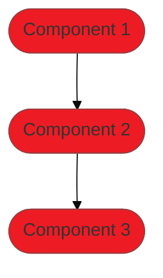
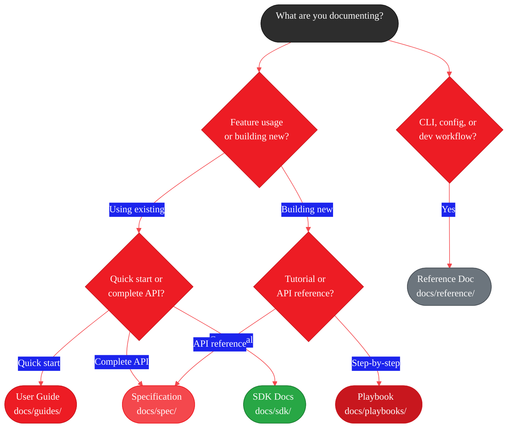

<Info>
  **Source Code:** [`docs/`](https://github.com/amd/gaia/tree/main/docs) | [`docs/docs.json`](https://github.com/amd/gaia/blob/main/docs/docs.json)
</Info>

This guide explains how to contribute documentation to GAIA. It covers the different documentation types, when to use each, style guidelines, and the submission process.

---

## Documentation Types

GAIA uses four main documentation types, each serving a distinct purpose:

<CardGroup cols={2}>
  <Card title="User Guides" icon="book" href="#user-guides">
    How to **use** pre-built features
  </Card>

  <Card title="Playbooks" icon="book-atlas" href="#playbooks">
    How to **build** from scratch
  </Card>

  <Card title="Specifications" icon="file-code" href="#specifications">
    Complete **API reference**
  </Card>

  <Card title="Reference" icon="terminal" href="#reference-docs">
    CLI, API, and configuration **details**
  </Card>
</CardGroup>

---

### User Guides

**Location:** `docs/guides/`

**Purpose:** Teach users how to **use** pre-built GAIA agents and SDKs. Guides focus on getting users productive quickly with existing functionality.

**When to create a Guide:**
- Documenting a new pre-built agent (ChatAgent, JiraAgent, etc.)
- Explaining how to use an SDK (Chat SDK, RAG SDK, etc.)
- Covering CLI usage for a feature
- Adding configuration options and common patterns

**Characteristics:**
- Task-oriented ("How do I chat with documents?")
- Quick start sections to get users running in minutes
- CLI examples alongside Python SDK usage
- Configuration options and troubleshooting
- Links to deeper Playbooks and Specifications

<Accordion title="Guide Template">
```mdx
---
title: "Feature Name"
description: "One-line description of what this guide covers"
---

<Note>
📖 **You are viewing:** User Guide - Learn how to use [feature]

**See also:** [SDK Reference](/sdk/...) · [API Specification](/spec/...)
</Note>

<Info>
  **Source Code:** [`src/gaia/path/to/source.py`](https://github.com/amd/gaia/blob/main/src/gaia/path/to/source.py)
</Info>

Brief introduction explaining what this feature does and why it's useful.

<Info>
  **First time here?** Complete the [Setup](/setup) guide first.
</Info>

## Quick Start

<Steps>
  <Step title="Install dependencies">
    ```bash
    uv pip install -e ".[extra]"
    ```
  </Step>

  <Step title="Basic usage">
    ```python title="example.py"
    from gaia.module import Class

    instance = Class()
    result = instance.method("input")
    print(result)
    ```
  </Step>
</Steps>

## CLI Usage

```bash
gaia command --option value
```

## Python SDK

### Core Classes

Explain main classes and their methods.

### Examples

Show progressively complex examples.

## Configuration

Document configuration options.

## Troubleshooting

<AccordionGroup>
  <Accordion title="Common Issue 1">
    Solution for issue 1.
  </Accordion>
</AccordionGroup>

## Next Steps

<CardGroup cols={2}>
  <Card title="Related Feature" icon="icon" href="/path">
    Description
  </Card>
</CardGroup>
```
</Accordion>

**Example Guides:**
- [`docs/guides/chat.mdx`](https://github.com/amd/gaia/blob/main/docs/guides/chat.mdx) - Chat SDK usage
- [`docs/guides/talk.mdx`](https://github.com/amd/gaia/blob/main/docs/guides/talk.mdx) - Voice interaction

---

### Playbooks

**Location:** `docs/playbooks/`

**Purpose:** Step-by-step tutorials that teach users how to **build** agents from scratch. Playbooks explain implementation details, architecture decisions, and provide working code users can extend.

**When to create a Playbook:**
- Teaching how to build a new type of agent
- Explaining architectural patterns (mixins, tool registration, etc.)
- Demonstrating integration of multiple GAIA components
- Providing production-ready implementation patterns

**Characteristics:**
- Journey-based (follow a path from start to finish)
- Build complexity incrementally (start simple, add features)
- "Under the Hood" sections explaining internals
- Working code that can be copy-pasted and extended
- Often multi-part for complex topics
- Include architecture diagrams (Mermaid)

<Accordion title="Playbook Template">
```mdx
---
title: "Part N: Building [Feature]"
description: "What you'll build in this part"
icon: "icon-name"
---

<Info>
  **Source Code:** [`src/gaia/path/`](https://github.com/amd/gaia/blob/main/src/gaia/path/)
</Info>

<Badge text="development" color="orange" />

- **Time to complete:** 15-20 minutes
- **What you'll build:** Description of the end result
- **What you'll learn:** Key concepts covered
- **Prerequisites:** What users need before starting

---

## Why Build This?

Context setting - what problem does this solve?

<Info>
**Key Benefit:** Highlight the main value proposition.
</Info>

---

## The Architecture



Explain how the components work together.

---

## Quick Start (5 Minutes)

Minimal working example to verify setup.

<Steps>
  <Step title="Install">
    ```bash
    uv pip install -e ".[extra]"
    ```
  </Step>

  <Step title="Create minimal implementation">
    ```python title="minimal_example.py"
    # Working code
    ```
  </Step>

  <Step title="Run it">
    ```bash
    python minimal_example.py
    ```
  </Step>
</Steps>

---

## Understanding the Components

### Component 1

<Tabs>
  <Tab title="Code">
    ```python
    from gaia.module import Component
    ```
  </Tab>

  <Tab title="Purpose">
    Explanation of what this component does.
  </Tab>
</Tabs>

<Accordion title="Under the Hood">
Deep technical explanation of how this works internally.
</Accordion>

---

## Building Step by Step

### Step 1: The Foundation

Explain and implement the first piece.

```python title="step1.py"
# Implementation
```

<Check>
**What you have:** Summary of capabilities after this step.
</Check>

### Step 2: Adding Feature X

Build on the previous step.

```python title="step2.py"
# Extended implementation
```

---

## Next Steps

<Card title="Part N+1: Next Topic" icon="arrow-right" href="./part-n+1">
  Continue to the next part.
</Card>
```
</Accordion>

**Playbook Structure:**
1. **Context** - Why build this? What problem does it solve?
2. **Quick Start** (5 min) - Minimal working example
3. **Architecture** - Visual diagram of components
4. **Understanding Components** - Deep dives with "Under the Hood" sections
5. **Step-by-Step Build** - Incremental construction
6. **Making It Your Own** - Customization patterns
7. **Deployment** - Production patterns
8. **Real-World Examples** - Complete, copy-paste ready code

**Example Playbooks:**
- [`docs/playbooks/chat-agent/`](https://github.com/amd/gaia/tree/main/docs/playbooks/chat-agent) - Document Q&A agent (3 parts)
- [`docs/playbooks/emr-agent/`](https://github.com/amd/gaia/tree/main/docs/playbooks/emr-agent) - Medical intake agent (3 parts)

---

### Specifications

**Location:** `docs/spec/`

**Purpose:** Complete API reference documentation for GAIA components. Specifications document every class, method, parameter, and return type.

**When to create a Specification:**
- Documenting a new base class or mixin
- Adding a new SDK or client
- Creating new infrastructure components (servers, protocols)
- Documenting tool mixins

**Characteristics:**
- Complete API documentation (all methods, parameters, types)
- Code examples for each major method
- Testing requirements
- Dependencies and imports
- Performance considerations
- Migration notes

<Accordion title="Specification Template">
```mdx
---
title: "Component Name"
description: "One-line purpose of this component"
icon: "icon-name"
---

<Note>
🔧 **You are viewing:** API Specification - Complete technical reference

**See also:** [Conceptual Guide](/sdk/...) · [User Guide](/guides/...)
</Note>

<Note>
- **Component:** Component Name
- **Module:** `gaia.path.module`
- **Import:** `from gaia.path.module import Class`
- **Source:** [`src/gaia/path/module.py`](https://github.com/amd/gaia/blob/main/src/gaia/path/module.py)
</Note>

---

## Overview

What this component does, why you'd use it, and when NOT to use it.

**What it does:**
- Capability 1
- Capability 2

**Why use it:**
- Use case 1
- Use case 2

---

## API Specification

### Class Definition

```python
class ComponentName:
    """Class docstring."""
    pass
```

### Constructor

```python
def __init__(
    self,
    param1: str,
    param2: int = 10,
) -> None:
    """
    Initialize the component.

    Args:
        param1: Description of param1
        param2: Description of param2 (default: 10)
    """
```

### Methods

```python
def method_name(self, arg: str) -> dict:
    """
    Method description.

    Args:
        arg: Description

    Returns:
        dict: Description of return value

    Raises:
        ValueError: When invalid input
    """
```

---

## Code Examples

### Example 1: Basic Usage

```python
from gaia.path import Component

component = Component()
result = component.method("input")
```

### Example 2: Advanced Usage

```python
# More complex example
```

---

## Testing Requirements

### Unit Tests

**File:** `tests/path/test_component.py`

```python
def test_basic_functionality():
    """Test description."""
    pass
```

---

## Dependencies

```python
# Required imports
from typing import Any, Dict, List
```

---

## Performance Considerations

Document memory usage, latency, token usage, etc.

---

**Status:** ✅ Implemented and tested
**Last Updated:** Month Day, Year
**Specification Version:** 1.0.0
```
</Accordion>

**Example Specifications:**
- [`docs/spec/agent-base.mdx`](https://github.com/amd/gaia/blob/main/docs/spec/agent-base.mdx) - Agent base class
- [`docs/spec/tool-decorator.mdx`](https://github.com/amd/gaia/blob/main/docs/spec/tool-decorator.mdx) - @tool decorator

---

### Reference Docs

**Location:** `docs/reference/`

**Purpose:** Factual reference information for CLI commands, API endpoints, configuration options, and development workflows.

**When to create Reference docs:**
- Documenting CLI commands and options
- API endpoint specifications
- Configuration file formats
- Development environment setup
- Troubleshooting guides

**Characteristics:**
- Factual, not tutorial-based
- Complete option/flag documentation
- Tables for quick scanning
- Copy-paste commands

<Accordion title="Reference Doc Template">
```mdx
---
title: "Feature Reference"
description: "Complete reference for [feature]"
---

<Info>
  **Source Code:** [`src/gaia/path/`](https://github.com/amd/gaia/blob/main/src/gaia/path/)
</Info>

Brief description of what this reference covers.

---

## Commands / Options / Endpoints

### command-name

Description of the command.

```bash
gaia command [options]
```

**Options:**

| Flag | Description | Default |
|------|-------------|---------|
| `--option` | What it does | `value` |
| `-v, --verbose` | Enable verbose output | `false` |

**Examples:**

```bash
# Basic usage
gaia command

# With options
gaia command --option value
```

---

## Configuration

### config-file.yaml

```yaml
setting: value
nested:
  option: value
```

| Setting | Type | Description |
|---------|------|-------------|
| `setting` | string | Description |

---

## Troubleshooting

### Common Issue

**Symptom:** What the user sees

**Solution:** How to fix it

```bash
# Fix command
```
```
</Accordion>

**Example Reference docs:**
- [`docs/reference/cli.mdx`](https://github.com/amd/gaia/blob/main/docs/reference/cli.mdx) - CLI reference
- [`docs/reference/dev.mdx`](https://github.com/amd/gaia/blob/main/docs/reference/dev.mdx) - Development guide
- [`docs/reference/api.mdx`](https://github.com/amd/gaia/blob/main/docs/reference/api.mdx) - API reference

---

### SDK Documentation

**Location:** `docs/sdk/`

**Purpose:** Conceptual documentation that bridges User Guides and Specifications. SDK docs explain how components work together, best practices, and architectural patterns.

**When to create SDK docs:**
- Explaining core concepts (agent system, tool decorator, console)
- Documenting SDK packages (Chat SDK, RAG SDK, LLM clients)
- Covering infrastructure patterns (API server, MCP)
- Writing best practices and advanced patterns

**Characteristics:**
- Conceptual explanations with code examples
- Bridges "how to use" (Guides) and "API reference" (Specs)
- Organized by topic (core, sdks, infrastructure, mixins)
- Links to both Guides and Specifications

**Example SDK docs:**
- [`docs/sdk/core/agent-system.mdx`](https://github.com/amd/gaia/blob/main/docs/sdk/core/agent-system.mdx) - Agent system concepts
- [`docs/sdk/sdks/chat.mdx`](https://github.com/amd/gaia/blob/main/docs/sdk/sdks/chat.mdx) - Chat SDK reference
- [`docs/sdk/best-practices.mdx`](https://github.com/amd/gaia/blob/main/docs/sdk/best-practices.mdx) - Best practices guide

---

### Other Documentation Types

GAIA also has specialized documentation sections:

| Section | Location | Purpose |
|---------|----------|---------|
| **Integrations** | `docs/integrations/` | Third-party integrations (VSCode, MCP, n8n) |
| **Deployment** | `docs/deployment/` | Packaging and distribution |
| **Releases** | `docs/releases/` | Version release notes |
| **Plans** | `docs/plans/` | Future roadmap items |

These follow similar patterns to Reference docs but are organized by their specific purpose.

---

## Choosing the Right Documentation Type

Use this decision tree to determine which documentation type to create:



| If you want to... | Create a... | Location |
|-------------------|-------------|----------|
| Show how to use a pre-built agent | User Guide | `docs/guides/` |
| Teach how to build something from scratch | Playbook | `docs/playbooks/` |
| Document every method and parameter | Specification | `docs/spec/` |
| List CLI commands or API endpoints | Reference | `docs/reference/` |
| Document configuration options | Reference | `docs/reference/` |

---

## Style Guidelines

### General Principles

<CardGroup cols={3}>
  <Card title="Be Concise" icon="compress">
    Say more with less. Avoid unnecessary words.
  </Card>

  <Card title="Be Practical" icon="hammer">
    Include working code examples that users can copy.
  </Card>

  <Card title="Be Consistent" icon="equals">
    Follow existing patterns in similar docs.
  </Card>
</CardGroup>

### Writing Style

1. **Use active voice**
   - Good: "The agent processes your query"
   - Avoid: "Your query is processed by the agent"

2. **Use second person ("you")**
   - Good: "You can configure the agent..."
   - Avoid: "Users can configure the agent..."

3. **Use present tense**
   - Good: "This method returns a dictionary"
   - Avoid: "This method will return a dictionary"

4. **Be direct**
   - Good: "Run this command"
   - Avoid: "You might want to consider running this command"

### Code Examples

1. **Always include working examples**
   ```python title="example.py"
   # Include a title for code blocks
   from gaia.agents.chat.agent import ChatAgent

   agent = ChatAgent()
   result = agent.process_query("Hello")
   ```

2. **Use descriptive file names in titles**
   - Good: `title="my_agent.py"`
   - Avoid: `title="example.py"` (when not appropriate)

3. **Show complete imports**
   - Good: `from gaia.agents.base.agent import Agent`
   - Avoid: `from gaia import Agent`

4. **Include expected output when helpful**
   ```python
   print(result)  # {"answer": "Hello!", "steps": 1}
   ```

### Formatting

1. **Use MDX components from Mintlify**
   - `<Info>`, `<Note>`, `<Warning>`, `<Tip>` for callouts
   - `<Steps>` for sequential instructions
   - `<Tabs>` for alternative approaches
   - `<Accordion>` for expandable details
   - `<CardGroup>` for linked content
   - `<CodeGroup>` for multiple code examples

2. **Use tables for comparisons**
   | Feature | Option A | Option B |
   |---------|----------|----------|
   | Speed   | Fast     | Slow     |

3. **Use Mermaid for diagrams**
   - Architecture diagrams
   - Flow charts
   - Sequence diagrams

### Cross-Linking

Always link to related documentation:

```mdx
<Note>
📖 **You are viewing:** User Guide - Learn how to use Chat

**See also:** [SDK Reference](/sdk/sdks/chat) · [API Specification](/spec/chat-sdk)
</Note>
```

---

## Contribution Process

### Step 1: Identify the Need

Before writing documentation:

1. Check if documentation already exists
2. Determine the appropriate documentation type
3. Review similar existing docs for patterns

### Step 2: Create Your Documentation

<Steps>
  <Step title="Fork and clone the repository">
    ```bash
    git clone https://github.com/YOUR_USERNAME/gaia.git
    cd gaia
    ```
  </Step>

  <Step title="Create a new branch">
    ```bash
    git checkout -b docs/your-documentation-name
    ```
  </Step>

  <Step title="Create your documentation file">
    Create a new `.mdx` file in the appropriate directory:
    - `docs/guides/` for user guides
    - `docs/playbooks/` for playbooks
    - `docs/spec/` for specifications
    - `docs/reference/` for reference docs
  </Step>

  <Step title="Update docs.json">
    Add your new page to `docs/docs.json` in the appropriate navigation section.

    ```json
    {
      "group": "User Guides",
      "pages": [
        "guides/existing-guide",
        "guides/your-new-guide"  // Add here
      ]
    }
    ```
  </Step>

  <Step title="Preview locally (optional)">
    If you have the Mintlify CLI installed:
    ```bash
    mintlify dev
    ```
  </Step>
</Steps>

### Step 3: Submit a Pull Request

1. **Commit your changes**
   ```bash
   git add docs/
   git commit -m "docs: add guide for [feature]"
   ```

2. **Push to your fork**
   ```bash
   git push origin docs/your-documentation-name
   ```

3. **Open a Pull Request**
   - Title: `docs: [type] description` (e.g., `docs: add Chat SDK guide`)
   - Description: Explain what documentation you're adding and why

### Review Checklist

Before submitting, verify:

- [ ] File is in the correct directory
- [ ] Frontmatter includes `title` and `description`
- [ ] Page is added to `docs/docs.json`
- [ ] Code examples are complete and working
- [ ] Links to related docs are included
- [ ] No spelling or grammar errors
- [ ] Follows the appropriate template structure
- [ ] License footer is included

---

## Documentation Structure

### File Organization

```
docs/
├── docs.json              # Navigation configuration
├── index.mdx              # Home page
├── setup.mdx              # Installation
├── quickstart.mdx         # Getting started
│
├── guides/                # User guides
│   ├── index.mdx          # Guide index
│   ├── chat.mdx           # Chat SDK guide
│   └── ...
│
├── playbooks/             # Step-by-step tutorials
│   ├── index.mdx          # Playbook index
│   └── chat-agent/        # Multi-part playbooks
│       ├── part-1-getting-started.mdx
│       ├── part-2-advanced-features.mdx
│       └── part-3-deployment.mdx
│
├── spec/                  # API specifications
│   ├── agent-base.mdx
│   └── ...
│
├── reference/             # Reference documentation
│   ├── cli.mdx
│   ├── api.mdx
│   └── dev.mdx
│
├── sdk/                   # SDK documentation
│   ├── index.mdx
│   ├── core/              # Core concepts
│   └── sdks/              # Individual SDKs
│
└── deployment/            # Deployment guides
    └── ...
```

### Navigation (docs.json)

The `docs.json` file controls the site navigation:

```json
{
  "navigation": {
    "tabs": [
      {
        "tab": "Documentation",
        "groups": [
          {
            "group": "Getting Started",
            "pages": ["index", "setup", "quickstart"]
          },
          {
            "group": "User Guides",
            "pages": ["guides/index", "guides/chat", "guides/talk"]
          }
        ]
      },
      {
        "tab": "Specifications",
        "groups": [
          {
            "group": "Core Framework",
            "pages": ["spec/agent-base", "spec/tool-decorator"]
          }
        ]
      }
    ]
  }
}
```

---

## Common MDX Components

### Callouts

```mdx
<Info>Informational message</Info>
<Note>Important note</Note>
<Warning>Warning message</Warning>
<Tip>Helpful tip</Tip>
```

### Steps

```mdx
<Steps>
  <Step title="First step">
    Content for step 1
  </Step>
  <Step title="Second step">
    Content for step 2
  </Step>
</Steps>
```

### Tabs

```mdx
<Tabs>
  <Tab title="Python">
    ```python
    print("Hello")
    ```
  </Tab>
  <Tab title="CLI">
    ```bash
    echo "Hello"
    ```
  </Tab>
</Tabs>
```

### Code Groups

```mdx
<CodeGroup>
```python Basic
from gaia import Agent
agent = Agent()
```

```python Advanced
from gaia import Agent, Config
config = Config(debug=True)
agent = Agent(config)
```
</CodeGroup>
```

### Cards

```mdx
<CardGroup cols={2}>
  <Card title="Card 1" icon="icon-name" href="/path">
    Description
  </Card>
  <Card title="Card 2" icon="icon-name" href="/path">
    Description
  </Card>
</CardGroup>
```

### Accordions

```mdx
<AccordionGroup>
  <Accordion title="Expandable Section 1">
    Content that can be expanded
  </Accordion>
  <Accordion title="Expandable Section 2">
    More expandable content
  </Accordion>
</AccordionGroup>
```

---

## Getting Help

<CardGroup cols={2}>
  <Card title="GitHub Issues" icon="github" href="https://github.com/amd/gaia/issues">
    Report documentation issues or request new docs
  </Card>

  <Card title="Discord" icon="discord" href="https://discord.com/channels/1392562559122407535/1402013282495102997">
    Ask questions and get help from the community
  </Card>
</CardGroup>

---

<small style="color: #666;">

**License**

Copyright(C) 2024-2025 Advanced Micro Devices, Inc. All rights reserved.

SPDX-License-Identifier: MIT

</small>
