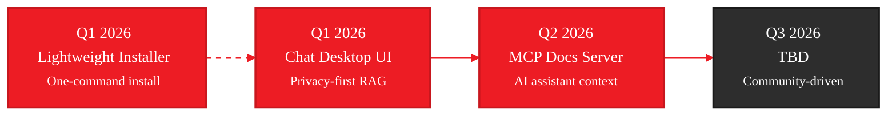

# Roadmap

<Warning>
**Work in Progress** - This roadmap is actively being refined and may change.
</Warning>

Our focus for the next few quarters, driven by community feedback and usage analytics.

<Info>
**Vote on Features** - React with 👍 on the GitHub issue for each plan to show your interest and help us prioritize.
</Info>

<Note>
Timelines are estimates and may shift based on community feedback and technical constraints.
</Note>

---

## What's Next

### Timeline



### Q1 2026: Lightweight Installer

**One-command installation for GAIA**

<CodeGroup>
```powershell Windows
irm https://amd-gaia.ai/install.ps1 | iex
```

```bash Linux/macOS
curl -fsSL https://amd-gaia.ai/install.sh | sh
```
</CodeGroup>

Fast onboarding (< 2 minutes from install to first chat) with automatic updates via `gaia update`.

→ [View detailed plan](/plans/installer) • [Vote with 👍 on GitHub](https://github.com/amd/gaia/issues/168)

### Q1 2026: Chat Desktop UI

**Privacy-first desktop chat with document Q&A**

A lightweight replacement for the previous RAUX desktop UI, focused on chat and document Q&A.

Drop PDFs, code files, and documents into a local chat interface. Your data never leaves your device.

Key capabilities:
- 50+ file format support (PDF, TXT, MD, code files, etc.)
- Streaming responses with source citations
- Session management and export
- Shared state between CLI and desktop app
- Lighter and faster than RAUX

→ [View detailed plan](/plans/chat-ui) • [Vote with 👍 on GitHub](https://github.com/amd/gaia/issues/167)

### Q2 2026: MCP Docs Server

**AI assistant context for GAIA development**

An MCP server that gives AI coding assistants (Claude Code, Cursor, GitHub Copilot) intelligent access to GAIA SDK documentation:

```bash
gaia mcp docs start
```

Key capabilities:
- Semantic search across all GAIA documentation
- Working code examples on demand
- Version-aware API information
- Works with Claude Code, VSCode, Cursor, and any MCP-compatible client

Make AI assistants expert GAIA developers out of the box.

→ [View detailed plan](/plans/mcp-docs) • [Vote with 👍 on GitHub](https://github.com/amd/gaia/issues/201)

---

## Recently Shipped

### v0.15 - Framework Evolution
<Check>January 2026</Check>

Repositioned as pure SDK/framework for AI PC agents. Added Linux support, 20+ components, and expanded documentation.

### v0.14 - Agent Expansion
<Check>December 2025</Check>

EMR agent with desktop UI, Blender automation, enhanced Code agent.

### v0.13 - MCP Integration
<Check>November 2025</Check>

Model Context Protocol support for external integrations.

---

## How We Prioritize

Based on usage data from [amd-gaia.ai](https://amd-gaia.ai):

| Signal | Action |
|--------|--------|
| `/quickstart` is #1 page | → Lightweight installer |
| Chat agent playbook #2 | → Desktop chat UI |
| AI coding assistants popular | → MCP Docs Server |
| 60%+ Linux traffic | → Cross-platform focus |
| Phoronix coverage | → Privacy-first messaging |

---

## Get Involved

<CardGroup cols={3}>
  <Card title="Report Issues" icon="bug" href="https://github.com/amd/gaia/issues">
    Found a bug or have a feature request?
  </Card>
  <Card title="Contribute" icon="code-pull-request" href="https://github.com/amd/gaia/blob/main/CONTRIBUTING.md">
    Help build GAIA
  </Card>
  <Card title="Share Your Use Case" icon="envelope" href="mailto:gaia@amd.com">
    Tell us how you're using GAIA
  </Card>
</CardGroup>

---

*Updated: January 18, 2026*
