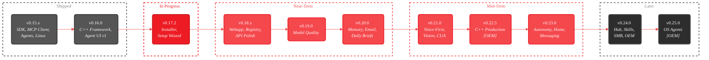

# Roadmap

Our focus for the next several releases, building GAIA as
the secure, local-first AI agent platform for AMD hardware.

<Info>
**Vote on Features** — React with a thumbs-up on the GitHub issue for each item to help us prioritize.
</Info>

---

## Timeline

```mermaid
%%{init: {'theme':'base', 'themeVariables': { 'primaryColor':'#ED1C24', 'primaryTextColor':'#fff', 'primaryBorderColor':'#C8171E', 'lineColor':'#F4484D', 'secondaryColor':'#2d2d2d', 'tertiaryColor':'#f5f5f5', 'fontSize':'13px', 'fontFamily': 'system-ui, -apple-system, sans-serif'}}}%%
graph LR
    subgraph Shipped["Shipped"]
        V15("v0.15.x<br/><i>SDK, MCP Client,<br/>Agents, Linux</i>")
        V16("v0.16.0<br/><i>C++ Framework,<br/>Agent UI v1</i>")
    end

    subgraph Current["In Progress"]
        V17("v0.17.2<br/><i>Installer,<br/>Setup Wizard</i>")
    end

    subgraph Near["Near-Term"]
        V18("v0.18.x<br/><i>Webapp, Registry,<br/>API Polish</i>")
        V19("v0.19.0<br/><i>Model Quality</i>")
        V20("v0.20.0<br/><i>Memory, Email,<br/>Daily Briefs</i>")
    end

    subgraph Mid["Mid-Term"]
        V21("v0.21.0<br/><i>Voice-First,<br/>Vision, CUA</i>")
        V22("v0.22.5<br/><i>C++ Production<br/>[OEM]</i>")
        V23("v0.23.0<br/><i>Autonomy, Home,<br/>Messaging</i>")
    end

    subgraph Later["Later"]
        V24("v0.24.0<br/><i>Hub, Skills,<br/>SMB, OEM</i>")
        V25("v0.25.0<br/><i>OS Agents<br/>[OEM]</i>")
    end

    V15 --> V16 --> V17 --> V18 --> V19 --> V20 --> V21 --> V22 --> V23 --> V24 --> V25

    style V15 fill:#555,stroke:#333,stroke-width:2px,color:#fff
    style V16 fill:#555,stroke:#333,stroke-width:2px,color:#fff
    style V17 fill:#ED1C24,stroke:#C8171E,stroke-width:2px,color:#fff
    style V18 fill:#F4484D,stroke:#ED1C24,stroke-width:2px,color:#fff
    style V19 fill:#F4484D,stroke:#ED1C24,stroke-width:2px,color:#fff
    style V20 fill:#F4484D,stroke:#ED1C24,stroke-width:2px,color:#fff
    style V21 fill:#F4484D,stroke:#ED1C24,stroke-width:2px,color:#fff
    style V22 fill:#F4484D,stroke:#ED1C24,stroke-width:2px,color:#fff
    style V23 fill:#F4484D,stroke:#ED1C24,stroke-width:2px,color:#fff
    style V24 fill:#2d2d2d,stroke:#555,stroke-width:2px,color:#fff
    style V25 fill:#2d2d2d,stroke:#555,stroke-width:2px,color:#fff

    style Shipped fill:transparent,stroke:#555,stroke-width:2px,stroke-dasharray: 5 5,color:#888
    style Current fill:transparent,stroke:#ED1C24,stroke-width:2px,stroke-dasharray: 5 5,color:#ED1C24
    style Near fill:transparent,stroke:#F4484D,stroke-width:2px,stroke-dasharray: 5 5,color:#F4484D
    style Mid fill:transparent,stroke:#F4484D,stroke-width:2px,stroke-dasharray: 5 5,color:#F4484D
    style Later fill:transparent,stroke:#555,stroke-width:2px,stroke-dasharray: 5 5,color:#888
```

---

## Shipped

### v0.16.0
<Check>March 2026</Check>

C++ agent framework with docs, CI integration tests, and health agent. Agent UI v1 with chat, file browser, document indexing, and tool execution streaming. Lemonade install fixes.

### v0.15.4
<Check>February 2026</Check>

**MCPClientMixin** — connect any agent to MCP servers with auto-registered tools. JSON config deployment (`mcp_servers.json`). `gaia init --profile mcp` for one-command setup. VLM profile and structured extraction API.

### v0.15.3
<Check>February 2026</Check>

One-command installer scripts for Windows and Linux. MCP Client architecture refinements. Talk mode mic sensitivity and Lemonade URL fixes.

### v0.15.2
<Check>January 2026</Check>

SD Agent with terminal image preview. EMR dashboard improvements. Evaluation framework enhancements.

### v0.15.0
<Check>January 2026</Check>

SDK v1.0.0 — `Agent` base class, `@tool` decorator, `DatabaseMixin`, `OutputHandler` abstraction. Build any agent in ~50 lines. Medical Intake Agent as reference implementation. Linux support. Mintlify docs site.

### v0.14
<Check>December 2025</Check>

EMR agent with Electron dashboard. Blender agent (MCP-based 3D automation). Code agent gained 12 tool mixins and a multi-step orchestrator with plan/execute/replan loop.

### v0.13
<Check>November 2025</Check>

`MCPAgent` mixin and MCP bridge server — any agent can expose tools via JSON-RPC, any agent can consume external MCP servers. Docker agent shipped as first MCP-native agent.

### v0.12
<Check>October 2025</Check>

Jira agent with JQL template system. Docker agent. Refactored `Agent` into composable mixin architecture — `RAGToolsMixin`, `ShellToolsMixin`, `FileSearchToolsMixin`. This is the foundation all agents build on.

### v0.9–v0.11
<Check>July – September 2025</Check>

Chat agent with RAG pipeline (PDF chunking, FAISS vector search, 50+ file formats). Code agent with `FileIOToolsMixin`. Eval framework with batch experiments and ground-truth comparison. `LLMClientFactory` for multi-provider support (Lemonade, Claude, OpenAI).

### v0.1–v0.8
<Check>April 2024 – March 2025</Check>

Core platform: `LemonadeClient` for NPU/iGPU inference on Ryzen AI, `ChatSDK` with model-aware prompt formatting (10+ model families), `WhisperASR` + `KokoroTTS` for voice, NSIS installer, `gaia` CLI entry point.

---

## v0.17.2 — Website, Desktop Installer & Setup Wizard

**Status:** In progress

Ship the one-click install experience. Users should go from zero to first chat in under 5 minutes.

| Deliverable | Description | Issue |
|-------------|-------------|-------|
| Desktop installer | NSIS (Windows), DMG (macOS), AppImage (Linux) with auto-update | [#530](https://github.com/amd/gaia/issues/530) |
| First-run setup wizard | Guided onboarding: system scan, model download, first chat | [#597](https://github.com/amd/gaia/issues/597) |
| GAIA website | Public site at amd-gaia.ai | [#169](https://github.com/amd/gaia/issues/169) |
| RAG reliability fixes | Fix silent indexing failures and progress feedback | [#590](https://github.com/amd/gaia/issues/590), [#591](https://github.com/amd/gaia/issues/591) |

Detailed plan: [Installer](/plans/installer) | [Setup Wizard](/plans/setup-wizard)

---

## v0.18.x — Webapp Integration & Agent Registry

**Status:** Up next

Make GAIA embeddable in web applications and polish the Agent UI.

### v0.18.0 — Agent Eval Benchmark

| Deliverable | Description | Issue |
|-------------|-------------|-------|
| Document processing tests | Comprehensive test suite for RAG pipeline | [#456](https://github.com/amd/gaia/issues/456) |
| Thread-safe RAG operations | Fix concurrent index access | [#455](https://github.com/amd/gaia/issues/455) |
| Web search tool | DuckDuckGo + Perplexity for research | [#669](https://github.com/amd/gaia/issues/669) |

### v0.18.1 — Webapp Integration Support

| Deliverable | Description | Issue |
|-------------|-------------|-------|
| System prompt passthrough | Honor custom system prompts from API clients | [#650](https://github.com/amd/gaia/issues/650) |
| Document indexing API | Index documents via OpenAI-compatible endpoint | [#651](https://github.com/amd/gaia/issues/651) |
| API key authentication | Optional auth for the API server | [#630](https://github.com/amd/gaia/issues/630) |
| JS chat client library | `@amd-gaia/chat-client` npm package | [#652](https://github.com/amd/gaia/issues/652) |
| Drop-in chat widget | Single `<script>` tag embeddable widget | [#653](https://github.com/amd/gaia/issues/653) |

### v0.18.2 — Agent Registry, API Readiness & UI Polish

| Deliverable | Description | Issue |
|-------------|-------------|-------|
| Agent registry and selection | Switch between agents in the UI | [#612](https://github.com/amd/gaia/issues/612) |
| Tool execution guardrails | Confirm-first popup for write operations | [#438](https://github.com/amd/gaia/issues/438) |
| Multi-session concurrency | Support concurrent API clients | [#654](https://github.com/amd/gaia/issues/654) |
| MCP security hardening | Address MCP protocol vulnerabilities | [#94](https://github.com/amd/gaia/issues/94) |

Detailed plan: [Agent UI](/plans/agent-ui) | [Security Model](/plans/security-model)

---

## v0.19.0 — Model Fine-Tuning & Agent Quality

**Status:** Planned

Improve agent response quality through model optimization and prompt engineering.

---

## v0.20.0 — Agent Memory & Bootstrap

**Status:** Planned

The agent remembers you across sessions, learns your preferences, and gets smarter over time.

| Deliverable | Description | Issue |
|-------------|-------------|-------|
| Rename ChatAgent to GaiaAgent | Core agent rename across codebase | [#696](https://github.com/amd/gaia/issues/696) |
| MemoryStore + MemoryMixin | Persistent memory with long conversation handling (no compaction) | [#542](https://github.com/amd/gaia/issues/542), [#543](https://github.com/amd/gaia/issues/543), [#686](https://github.com/amd/gaia/issues/686) |
| Configuration dashboard | Personality recipes, skills, MCP servers, tool management | [#701](https://github.com/amd/gaia/issues/701), [#687](https://github.com/amd/gaia/issues/687) |
| Observability dashboard | Audit trail, activity timeline, memory browser | [#697](https://github.com/amd/gaia/issues/697) |
| Dynamic tool loading | Load tools based on conversation context via memory | [#688](https://github.com/amd/gaia/issues/688) |
| Merge CodeAgent views | File diff and tree views from CodeAgent to GaiaAgent | [#695](https://github.com/amd/gaia/issues/695) |
| Bootstrap onboarding | Conversational persona interview + system discovery | [#556](https://github.com/amd/gaia/issues/556), [#470](https://github.com/amd/gaia/issues/470) |
| Email + Calendar (MCP) | Gmail and Google Calendar via MCP servers | [#660](https://github.com/amd/gaia/issues/660) |
| Daily briefs | Morning digest of email, calendar, news, tasks | [#663](https://github.com/amd/gaia/issues/663) |
| Hybrid model routing | Route simple tasks to local, complex to cloud | [#632](https://github.com/amd/gaia/issues/632) |
| BrowserToolsMixin | Web browsing via Playwright (fallback for email/calendar) | [#458](https://github.com/amd/gaia/issues/458) |

Detailed plan: [Agent UI](/plans/agent-ui) | [Email & Calendar](/plans/email-calendar-integration) | [Setup Wizard](/plans/setup-wizard)

---

## v0.21.0 — Multimodal, Voice & Desktop Vision

**Status:** Planned

Voice-first interaction, vision, and desktop control powered by AMD NPU acceleration.

**Two target demographics:** Consumers (free, buying Ryzen AI hardware) and small businesses (privacy-first operations on Strix Halo).

| Deliverable | Description | Issue |
|-------------|-------------|-------|
| **Voice-first interaction (P0)** | Voice/text parity — mic in Agent UI, streaming ASR, TTS playback | [#702](https://github.com/amd/gaia/issues/702) |
| DesktopToolsMixin (CUA) | Screenshot, mouse, keyboard control | [#460](https://github.com/amd/gaia/issues/460) |
| ComputerUseMixin | Workflow learning and replay | [#544](https://github.com/amd/gaia/issues/544) |
| Multi-modal rendering | Display images, audio, rich content inline in chat | [#540](https://github.com/amd/gaia/issues/540) |
| Lemonade v10 integration | Image, voice, and system tools via Lemonade | [#539](https://github.com/amd/gaia/issues/539) |
| Vision SDK document pipeline | Multi-page document processing with VLM | [#325](https://github.com/amd/gaia/issues/325) |
| Voice agent demo | Memos, transcription, voice queries (ASR + TTS) | [#389](https://github.com/amd/gaia/issues/389) |
| Meeting notes capture | Live transcription with speaker diarization, structured minutes | [#700](https://github.com/amd/gaia/issues/700) |
| Financial tracking agent | Budget monitoring, receipt processing | [#664](https://github.com/amd/gaia/issues/664) |

Detailed plan: [CUA](/plans/cua) | [Vision SDK](/plans/vision-sdk) | [Image Agent](/plans/image-agent) | [Email & Calendar (meetings)](/plans/email-calendar-integration)

---

## v0.22.5 — C++ Framework: Production Readiness [OEM]

**Status:** Planned

Make the native C++17 agent framework ready for OEM integration. Cancellation, event
callbacks, tool security policies, streaming, runtime configuration.

Detailed plan: [C++ Framework Docs](/cpp)

---

## v0.23.0 — Autonomous Agent Infrastructure

**Status:** Planned

GAIA becomes an always-on background agent that monitors, schedules, and acts proactively.

| Deliverable | Description | Issue |
|-------------|-------------|-------|
| Always-on agent (autonomy engine) | Heartbeat scheduler, event hooks, background service | [#634](https://github.com/amd/gaia/issues/634) |
| System tray app | Process manager, status indicator, quick actions | [#643](https://github.com/amd/gaia/issues/643) |
| **Home Assistant (P0)** | Voice-controlled smart home, 24/7 device management, automations | [#705](https://github.com/amd/gaia/issues/705) |
| **Unified communication hub** | SMS + email + messaging in single prioritized feed in Agent UI | [#703](https://github.com/amd/gaia/issues/703) |
| Messaging adapters | Signal (privacy-first priority), Telegram, Discord, Slack | [#635](https://github.com/amd/gaia/issues/635), [#693](https://github.com/amd/gaia/issues/693) |
| Messaging security | Restricted default tool set, input sanitization, rate limiting | [#689](https://github.com/amd/gaia/issues/689), [#690](https://github.com/amd/gaia/issues/690) |
| Encrypted credential vault | Secure storage for API keys and OAuth tokens | [#698](https://github.com/amd/gaia/issues/698) |
| Email Triage Agent | AI-powered inbox management (Tier 1 use case) | [#645](https://github.com/amd/gaia/issues/645) |
| Calendar Agent | AI-powered schedule management (Tier 2) | [#662](https://github.com/amd/gaia/issues/662) |
| Personal finance agent | Bank aggregation, spending analysis — platform-enabled | [#707](https://github.com/amd/gaia/issues/707) |
| Autonomous mode | Agent schedules follow-ups and acts proactively | [#555](https://github.com/amd/gaia/issues/555), [#550](https://github.com/amd/gaia/issues/550) |

Detailed plan: [Autonomy Engine](/plans/autonomy-engine) | [Messaging](/plans/messaging-integrations-plan) | [Email & Calendar](/plans/email-calendar-integration) | [Security Model](/plans/security-model)

---

## v0.24.0 — Agent Hub, Service Integration & Onboarding

**Status:** Planned

The ecosystem layer: discover agents, install skills, manage models, bundle for OEMs.

| Deliverable | Description | Issue |
|-------------|-------------|-------|
| SKILL.md format specification | Skill definition with dashboard integration | [#691](https://github.com/amd/gaia/issues/691) |
| Agent Manifest system | Declarative metadata for agent capabilities | [#462](https://github.com/amd/gaia/issues/462) |
| Dynamic Agent Registry | Plugin discovery, replace hardcoded wiring | [#463](https://github.com/amd/gaia/issues/463) |
| Skill marketplace | Security tiers, AMD Verified seeding | [#647](https://github.com/amd/gaia/issues/647) |
| OpenClaw skill compatibility | Migration tool for OpenClaw SKILL.md files | [#692](https://github.com/amd/gaia/issues/692) |
| Model Manager UI | Download, switch, update models from desktop app | [#644](https://github.com/amd/gaia/issues/644) |
| OEM bundling framework | Pre-configuration for hardware SKUs | [#648](https://github.com/amd/gaia/issues/648) |
| Cost savings telemetry | Show users what they save running locally | [#649](https://github.com/amd/gaia/issues/649) |
| Personal CRM | AI-managed contact profiles with per-person tone matching | [#704](https://github.com/amd/gaia/issues/704) |
| **Small business features** | Invoicing, customer management, compliance on Strix Halo | [#708](https://github.com/amd/gaia/issues/708) |
| Teams messaging adapter | Microsoft Teams for enterprise users | [#694](https://github.com/amd/gaia/issues/694) |
| Legal research agent | Document analysis with RAG (Tier 2) | [#699](https://github.com/amd/gaia/issues/699) |
| Auto-install MCP servers | Detect tools and install MCP servers during onboarding | [#474](https://github.com/amd/gaia/issues/474) |

Detailed plan: [Agent Hub](/plans/agent-hub) | [Skill Format](/plans/skill-format) | [OEM Bundling](/plans/oem-bundling) | [Setup Wizard](/plans/setup-wizard)

---

## v0.25.0 — OS Agents: MCP Servers [OEM]

**Status:** Planned

OS-level intelligence via native MCP servers for process, network, storage, power,
security, gaming, productivity, and backup management.

---

## How We Prioritize

| How You Can Influence | What It Affects |
|----------------------|-----------------|
| Vote on [GitHub issues](https://github.com/amd/gaia/issues) | Feature priority |
| Share your use case | What we build next |
| Report bugs | What we fix first |
| Contribute PRs | Faster delivery |

---

## Get Involved

<CardGroup cols={3}>
  <Card title="Report Issues" icon="bug" href="https://github.com/amd/gaia/issues">
    Found a bug or have a feature request?
  </Card>
  <Card title="Contribute" icon="code-pull-request" href="https://github.com/amd/gaia/blob/main/CONTRIBUTING.md">
    Help build GAIA
  </Card>
  <Card title="Share Your Use Case" icon="envelope" href="mailto:gaia@amd.com">
    Tell us how you're using GAIA
  </Card>
</CardGroup>

---

*Updated: April 1, 2026*
