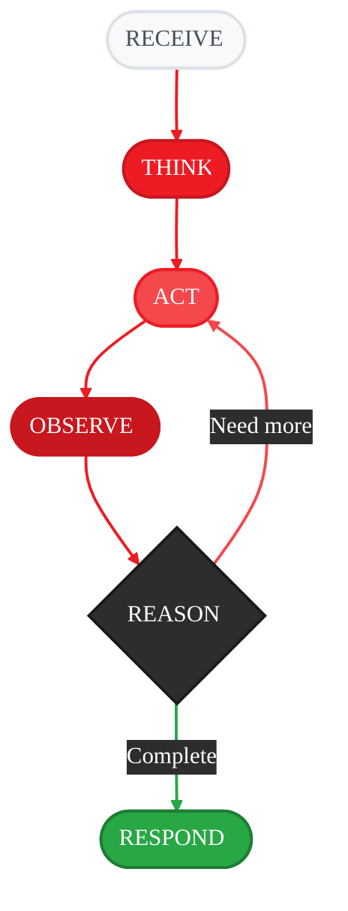

<Note>
📖 **You are viewing:** Conceptual Guide - Learn how agents work and build your first agent

**See also:** [API Specification](/spec/agent-base) · [Quickstart Tutorial](/quickstart)
</Note>

<Info>
  **Source Code:** [`src/gaia/agents/base/agent.py`](https://github.com/amd/gaia/blob/main/src/gaia/agents/base/agent.py)
</Info>

<Badge text="development" color="orange" />

<Info>
**What You'll Learn**
- What an agent is and why it's more powerful than calling an LLM directly
- How the agent reasoning loop works under the hood
- How to build your first agent from scratch
- How to configure agents for different use cases
- Common pitfalls and how to avoid them
</Info>

---

## What is an Agent?

An **agent** is more than just an LLM. Think of the difference like this:

| LLM Alone | Agent |
|-----------|-------|
| Can only generate text | Can take actions in the world |
| No memory between calls | Remembers conversation context |
| Can't use external tools | Has access to your tools |
| Single response | Can plan multi-step workflows |
| Fails silently on errors | Recovers and retries automatically |

**Real-world analogy:** An LLM is like a brilliant consultant who can only give advice. An agent is that same consultant, but now they have a phone, a computer, and access to your company's systems—they can actually *do* the work.

### Why Use Agents?

<Tabs>
<Tab title="Without Agent">
```python
# Direct LLM call - limited to text generation
from gaia.llm import LLMClient

llm = LLMClient()
response = llm.generate("What's the weather in Seattle?")
# Response: "I don't have access to weather data..."
```
The LLM can only tell you it doesn't know.
</Tab>
<Tab title="With Agent">
```python
# Agent with weather tool - can take action
from gaia.agents import Agent

class WeatherAgent(Agent):
    # ... (with weather tool)

agent = WeatherAgent()
response = agent.process_query("What's the weather in Seattle?")
# Response: "It's currently 55°F and rainy in Seattle."
```
The agent calls a weather API and returns real data.
</Tab>
</Tabs>

---

## How Agents Work: The Reasoning Loop

When you send a message to an agent, it doesn't just generate a response. It enters a **reasoning loop**:



<Note>
**Key Insight:** The loop can repeat! If the LLM decides it needs more information after step 5, it goes back to step 3 and executes another tool. This enables complex multi-step reasoning.
</Note>

### Agent States

During processing, agents transition through different states:

| State | What's Happening | When It Occurs |
|-------|------------------|----------------|
| `STATE_PLANNING` | Agent is analyzing the request and deciding approach | Complex queries requiring multiple steps |
| `STATE_EXECUTING_PLAN` | Agent is executing a multi-step plan | Following a planned sequence |
| `STATE_DIRECT_EXECUTION` | Agent executes tools immediately | Simple, clear requests |
| `STATE_ERROR_RECOVERY` | Agent is handling a tool failure | When a tool throws an error |
| `STATE_COMPLETION` | Agent has finished and is generating response | Final step before returning |

You can check the current state in your tools if you need conditional behavior:

```python
from gaia.agents.base.agent import STATE_PLANNING, STATE_ERROR_RECOVERY

@tool
def my_tool() -> dict:
    """A tool that behaves differently during error recovery."""
    if self.current_state == STATE_ERROR_RECOVERY:
        # Be more conservative during error recovery
        return {"status": "skipped", "reason": "In recovery mode"}
    # Normal execution
    return {"status": "success", "data": "..."}
```

---

## Building Your First Agent

Let's build an agent step by step, starting simple and adding features progressively.

### Step 1: The Minimal Agent

Every agent needs three things:
1. **A system prompt** - Tells the LLM who it is
2. **A console** - Handles output display
3. **Tools** - What the agent can do

```python
from gaia.agents.base.agent import Agent
from gaia.agents.base.console import AgentConsole

class MinimalAgent(Agent):
    """The simplest possible GAIA agent."""

    def _get_system_prompt(self) -> str:
        # This is what the LLM "believes" about itself
        return "You are a helpful assistant."

    def _create_console(self):
        # AgentConsole provides colorful CLI output
        return AgentConsole()

    def _register_tools(self):
        # No tools yet - agent can only chat
        pass

# Create and use
agent = MinimalAgent()
result = agent.process_query("Hello! What can you help me with?")
print(result["answer"])
```

**What happens when you run this:**
1. Agent receives "Hello! What can you help me with?"
2. LLM sees: System prompt + User message
3. LLM generates a conversational response
4. Agent returns the response

<Warning>
Without tools, this agent is essentially just an LLM wrapper. The power of agents comes from giving them tools to use.
</Warning>

### Step 2: Adding Your First Tool

Let's give the agent the ability to tell time:

```python
from gaia.agents.base.agent import Agent
from gaia.agents.base.tools import tool
from gaia.agents.base.console import AgentConsole
from datetime import datetime

class TimeAgent(Agent):
    """Agent that can tell you the current time."""

    def _get_system_prompt(self) -> str:
        return """You are a helpful assistant that can tell the time.
        When users ask about time, use the get_current_time tool."""

    def _create_console(self):
        return AgentConsole()

    def _register_tools(self):
        @tool
        def get_current_time() -> dict:
            """Get the current date and time.

            Use this tool when the user asks:
            - What time is it?
            - What's the date?
            - What day is it?

            Returns:
                Dictionary with time, date, and day of week
            """
            now = datetime.now()
            return {
                "time": now.strftime("%I:%M %p"),
                "date": now.strftime("%B %d, %Y"),
                "day": now.strftime("%A")
            }

# Test it
agent = TimeAgent()
result = agent.process_query("What time is it?")
print(result["answer"])  # "It's 2:30 PM on Thursday, January 9, 2025"
```

**What happens now:**
1. User asks "What time is it?"
2. LLM sees the `get_current_time` tool and its description
3. LLM decides: "This matches 'What time is it?' - I should use this tool"
4. Agent executes `get_current_time()`, gets `{"time": "2:30 PM", ...}`
5. LLM receives the result and generates a natural response

<Tip>
**The docstring is crucial!** The LLM reads the docstring to decide when to use a tool. "Use this tool when..." patterns are especially effective.
</Tip>

### Step 3: Adding External Capabilities

Now let's build something more practical—an agent that can fetch weather data:

```python
from gaia.agents.base.agent import Agent
from gaia.agents.base.tools import tool
from gaia.agents.base.console import AgentConsole
import requests
import os

class WeatherAgent(Agent):
    """Agent that provides real weather information."""

    def __init__(self, **kwargs):
        # Store API key before calling super().__init__
        # (super().__init__ calls _register_tools, which needs api_key)
        self.api_key = os.getenv("WEATHER_API_KEY")
        super().__init__(**kwargs)

    def _get_system_prompt(self) -> str:
        return """You are a weather assistant.

        When users ask about weather:
        1. Use get_weather to fetch current conditions
        2. Present the information in a friendly, conversational way
        3. Include temperature, conditions, and any relevant warnings

        Be helpful and proactive - if someone asks about weather for travel,
        mention if they should bring an umbrella or jacket."""

    def _create_console(self):
        return AgentConsole()

    def _register_tools(self):
        @tool
        def get_weather(city: str, country_code: str = "US") -> dict:
            """Get current weather for a city.

            Args:
                city: Name of the city (e.g., "Seattle", "London")
                country_code: Two-letter country code (default: US)

            Use this tool when users ask about:
            - Current weather conditions
            - Temperature
            - Whether they need an umbrella/jacket

            Returns:
                Dictionary with temperature, conditions, humidity, wind
            """
            try:
                url = f"https://api.openweathermap.org/data/2.5/weather"
                params = {
                    "q": f"{city},{country_code}",
                    "appid": self.api_key,
                    "units": "imperial"
                }
                response = requests.get(url, params=params, timeout=10)
                data = response.json()

                if response.status_code != 200:
                    return {
                        "status": "error",
                        "error": data.get("message", "Unknown error"),
                        "suggestion": "Check the city name spelling"
                    }

                return {
                    "status": "success",
                    "city": city,
                    "temperature_f": round(data["main"]["temp"]),
                    "feels_like_f": round(data["main"]["feels_like"]),
                    "conditions": data["weather"][0]["description"],
                    "humidity": data["main"]["humidity"],
                    "wind_mph": round(data["wind"]["speed"])
                }

            except requests.Timeout:
                return {
                    "status": "error",
                    "error": "Weather service timed out",
                    "suggestion": "Try again in a moment"
                }
            except Exception as e:
                return {
                    "status": "error",
                    "error": str(e),
                    "suggestion": "Check your internet connection"
                }

# Usage
agent = WeatherAgent()
result = agent.process_query("What's the weather like in Seattle?")
print(result["answer"])

# Multi-turn conversation works too
result = agent.process_query("How about in Miami?")
print(result["answer"])
```

**Key patterns demonstrated:**
1. **Instance variables** (`self.api_key`) - Store configuration in `__init__`
2. **Tool parameters with defaults** (`country_code="US"`) - LLM learns optional params
3. **Error handling** - Return error info, don't raise exceptions
4. **Timeout handling** - External APIs can be slow
5. **Rich system prompt** - Guides LLM behavior beyond just tool selection

---

## Simple Tools (Direct Execution)

Sometimes your agent has tools that are so straightforward they don't need a multi-step plan. For these **simple tools**, you can tell the agent to execute them directly without requiring the overhead of plan creation.

### What Are Simple Tools?

**Simple tools** are operations that:
- Return results immediately (no multi-step logic)
- Don't depend on other tool calls
- Don't require complex decision-making

Examples:
- ✅ `get_system_info()` - Returns hardware specs
- ✅ `list_documents()` - Lists indexed files
- ✅ `rag_status()` - Shows RAG system status
- ❌ `analyze_and_optimize()` - Complex multi-step process
- ❌ `deploy_application()` - Requires planning and validation

### Why Use SIMPLE_TOOLS?

Without marking a tool as "simple," the agent treats *all* tool calls as potentially complex operations requiring a plan. For quick information retrieval, this adds unnecessary overhead:

<Tabs>
<Tab title="Without SIMPLE_TOOLS">
```python
# User asks a simple question
user: "Show me my system specs"

# Agent unnecessarily creates a plan:
# Step 1: Analyze hardware detection methods
# Step 2: Execute get_hardware_info tool
# Step 3: Format and present results
# ⚠️ Warning: No plan found in step 1 response
```
The warning appears because the agent is treating a simple operation as complex.
</Tab>
<Tab title="With SIMPLE_TOOLS">
```python
class HardwareAgent(Agent):
    SIMPLE_TOOLS = ["get_hardware_info", "list_models"]

# User asks the same question
user: "Show me my system specs"

# Agent executes directly:
# → Calls get_hardware_info()
# → Returns results
# ✅ No warning, clean execution
```
Marking tools as simple eliminates unnecessary planning overhead.
</Tab>
</Tabs>

### How to Use SIMPLE_TOOLS

Define the `SIMPLE_TOOLS` class attribute with a list of tool names that can execute directly:

```python
from gaia.agents.base.agent import Agent
from gaia.agents.base.tools import tool

class QuickInfoAgent(Agent):
    """Agent with simple information retrieval tools."""

    # Define which tools can execute without a plan
    SIMPLE_TOOLS = ["get_system_info", "get_status", "list_files"]

    def _get_system_prompt(self) -> str:
        return """You provide quick system information.
        Use available tools to answer queries efficiently."""

    def _register_tools(self):
        @tool
        def get_system_info() -> dict:
            """Get current system information (CPU, RAM, disk)."""
            import platform
            return {
                "os": platform.system(),
                "cpu": platform.processor(),
                "architecture": platform.machine(),
            }

        @tool
        def get_status() -> dict:
            """Get service status."""
            return {"status": "operational", "uptime": "99.9%"}

        @tool
        def list_files() -> dict:
            """List available files."""
            return {"files": ["config.yaml", "data.json"], "count": 2}

# Usage
agent = QuickInfoAgent()
result = agent.process_query("What's my system info?")
# → Agent directly calls get_system_info() without creating a plan
```

### When NOT to Use SIMPLE_TOOLS

Don't mark tools as "simple" if they:
- **Require multi-step logic** - `analyze_codebase()` needs planning
- **Depend on other tools** - `fetch_then_process()` needs coordination
- **Have side effects** - `delete_all_files()` needs careful planning
- **Need validation** - `deploy_to_production()` requires safety checks

### Real-World Example: Hardware Advisor

The Hardware Advisor Agent (see `/examples/hardware_advisor_agent.py`) uses `SIMPLE_TOOLS` to provide instant hardware information:

```python
class HardwareAdvisorAgent(Agent):
    """Advises on LLM capabilities based on hardware."""

    SIMPLE_TOOLS = [
        "get_hardware_info",      # Quick system specs
        "list_available_models",  # Model catalog lookup
        "recommend_models"        # Memory-based filtering
    ]

    def _register_tools(self):
        @tool
        def get_hardware_info() -> dict:
            """Get RAM, GPU, NPU specifications."""
            # Returns immediately - no multi-step logic
            return {"ram_gb": 32, "gpu": "AMD Radeon", "npu": "Ryzen AI"}

        @tool
        def list_available_models() -> dict:
            """List models from catalog."""
            # Direct database lookup
            return {"models": [...], "count": 42}

        @tool
        def recommend_models(ram_gb: float) -> dict:
            """Filter models that fit in available RAM."""
            # Simple filtering logic
            return {"recommendations": [...]}
```

**User query:** "Show me my system specs"
- ✅ **With SIMPLE_TOOLS**: Direct execution, instant results
- ❌ **Without**: Unnecessary planning overhead + warning message

### Pattern: Mixing Simple and Complex Tools

Agents can have *both* simple and complex tools:

```python
class MixedAgent(Agent):
    # Only mark truly simple tools
    SIMPLE_TOOLS = ["quick_check", "get_info"]

    def _register_tools(self):
        @tool
        def quick_check() -> dict:
            """Quick status check - executes immediately."""
            return {"status": "ok"}

        @tool
        def complex_analysis(file: str) -> dict:
            """Complex multi-file analysis - requires planning."""
            # Agent will create a plan for this
            return {"analysis": "..."}
```

When the user asks:
- "What's the status?" → Calls `quick_check()` directly
- "Analyze this codebase" → Creates a plan, then calls `complex_analysis()`

### Technical Details

The base `Agent` class validates tool execution in `_validate_plan_required()` (see `src/gaia/agents/base/agent.py:2136-2166`):

```python
def _validate_plan_required(self, parsed: Dict[str, Any], step: int) -> None:
    """Validate that response includes a plan when required."""
    # Skip if we're already executing a plan
    if self.current_plan is not None:
        return

    # Allow simple tools to execute without a plan
    if "tool" in parsed and step == 1:
        tool_name = parsed.get("tool", "")
        if tool_name in self.SIMPLE_TOOLS:
            return  # ✅ Simple tool - no plan needed

    # Require plan for complex operations
    if "plan" not in parsed and "answer" not in parsed:
        # ⚠️ Warn that a plan should have been created
        parsed["needs_plan"] = True
```

**Default behavior:** `SIMPLE_TOOLS = []` - All tools require plans
**Subclass override:** Define `SIMPLE_TOOLS` to mark specific tools as simple

---

## Configuration Deep Dive

Agents accept many configuration parameters. Here's what each one does:

```python
agent = MyAgent(
    # === LLM Selection ===
    use_claude=False,              # Use Anthropic Claude API
    use_chatgpt=False,             # Use OpenAI ChatGPT API
    # If both are False, uses local Lemonade Server

    # === Local LLM Settings ===
    base_url="http://localhost:8000/api/v1",  # Lemonade server URL
    model_id="Qwen3-Coder-30B-A3B-Instruct-GGUF",  # Model to use

    # === Cloud LLM Settings ===
    claude_model="claude-sonnet-4-20250514",  # Claude model version
    # API keys are read from environment: ANTHROPIC_API_KEY, OPENAI_API_KEY

    # === Agent Behavior ===
    max_steps=10,                  # Max reasoning loop iterations
    streaming=True,                # Stream responses token-by-token
    silent_mode=False,             # Suppress console output

    # === Debugging ===
    debug_prompts=False,           # Print raw prompts to console
    show_prompts=False,            # Show prompts in output
)
```

### Choosing Your LLM Backend

<Accordion title="Option 1: Local LLM (Default) - Free, Private, Fast">

Uses AMD-optimized [Lemonade Server](https://lemonade-server.ai) running on your machine:

```python
# Default - uses local Lemonade Server
agent = MyAgent()

# Or explicitly configure
agent = MyAgent(
    base_url="http://localhost:8000/api/v1",
    model_id="Qwen3-Coder-30B-A3B-Instruct-GGUF"
)
```

**Pros:**
- Free (no API costs)
- Data stays on your machine (privacy)
- Fast inference on AMD hardware (NPU/iGPU acceleration)

**Cons:**
- Requires Lemonade Server running
- Smaller models than cloud options
- Local compute resources needed

**Best for:** Development, privacy-sensitive applications, offline use.
</Accordion>

<Accordion title="Option 2: Claude API - Best Reasoning">

Uses Anthropic's Claude models:

```bash
# Set your API key
export ANTHROPIC_API_KEY="your-key-here"
```

```python
agent = MyAgent(
    use_claude=True,
    claude_model="claude-sonnet-4-20250514"
)
```

**Pros:**
- Excellent reasoning and code understanding
- Large context window
- Most capable for complex tasks

**Cons:**
- API costs (pay per token)
- Requires internet connection
- Data sent to Anthropic

**Best for:** Complex reasoning, production applications, code analysis.
</Accordion>

<Accordion title="Option 3: ChatGPT API - Wide Compatibility">

Uses OpenAI's GPT models:

```bash
# Set your API key
export OPENAI_API_KEY="your-key-here"
```

```python
agent = MyAgent(
    use_chatgpt=True
)
```

**Pros:**
- Wide tool support
- Familiar API
- Good general performance

**Cons:**
- API costs
- Requires internet connection

**Best for:** Integration with existing OpenAI workflows.
</Accordion>

### Tuning Agent Behavior

| Parameter | Low Value | High Value | Trade-off |
|-----------|-----------|------------|-----------|
| `max_steps` | `3` - Quick tasks | `20` - Complex workflows | Speed vs. thoroughness |
| `streaming` | `False` - Wait for complete response | `True` - See tokens as generated | Latency vs. responsiveness |
| `silent_mode` | `False` - See all output | `True` - Only get results | Visibility vs. clean output |

---

## Common Pitfalls and Solutions

<AccordionGroup>
<Accordion title="Pitfall 1: Agent doesn't use my tools">

**Symptom:** Agent gives generic responses instead of using your tools.

**Cause:** Tool docstrings don't clearly explain when to use them.

```python
# ❌ Vague docstring
@tool
def search(query: str) -> str:
    """Search for things."""
    ...

# ✅ Clear docstring with triggers
@tool
def search_codebase(query: str) -> str:
    """Search for code in the project files.

    Use this tool when the user wants to:
    - Find functions, classes, or variables
    - Search for code patterns
    - Locate specific implementations

    Do NOT use for web searches - use search_web instead.
    """
    ...
```

</Accordion>

<Accordion title="Pitfall 2: Agent gets stuck in loops">

**Symptom:** Agent keeps calling tools repeatedly without making progress.

**Cause:** Usually means `max_steps` is too high, or tools return ambiguous results.

**Solutions:**
```python
# 1. Limit max steps
agent = MyAgent(max_steps=5)

# 2. Return clear success/failure status
@tool
def my_tool() -> dict:
    return {
        "status": "success",  # or "error" or "not_found"
        "data": result,
        "action_needed": None  # Tell LLM no more action needed
    }

# 3. Add completion hints in system prompt
def _get_system_prompt(self):
    return """...
    When you have answered the user's question, stop and respond.
    Don't keep searching for more information unless asked.
    """
```

</Accordion>

<Accordion title="Pitfall 3: Tool errors crash the agent">

**Symptom:** Agent stops working when a tool encounters an error.

**Cause:** Raising exceptions in tools instead of returning error information.

```python
# ❌ Raises exception - crashes agent
@tool
def fetch_data(url: str) -> dict:
    response = requests.get(url)
    response.raise_for_status()  # Raises on HTTP error!
    return response.json()

# ✅ Returns error info - agent can recover
@tool
def fetch_data(url: str) -> dict:
    """Fetch data from URL."""
    try:
        response = requests.get(url, timeout=10)
        response.raise_for_status()
        return {
            "status": "success",
            "data": response.json()
        }
    except requests.HTTPError as e:
        return {
            "status": "error",
            "error": f"HTTP {e.response.status_code}",
            "suggestion": "Check if the URL is correct"
        }
    except requests.Timeout:
        return {
            "status": "error",
            "error": "Request timed out",
            "suggestion": "Try again or check your connection"
        }
```

</Accordion>

<Accordion title="Pitfall 4: Context getting too long">

**Symptom:** Agent becomes slow or starts giving inconsistent responses.

**Cause:** Conversation history or tool results exceeding context limits.

**Solutions:**
```python
# 1. Truncate tool output
@tool
def read_file(path: str) -> dict:
    """Read a file (first 200 lines)."""
    with open(path) as f:
        lines = f.readlines()[:200]
    content = "".join(lines)
    if len(lines) == 200:
        content += "\n... (truncated)"
    return {"content": content}

# 2. Summarize large results
@tool
def search_all(query: str) -> dict:
    results = perform_search(query)
    if len(results) > 20:
        return {
            "total": len(results),
            "showing": 20,
            "results": results[:20],
            "note": f"Showing first 20 of {len(results)} results"
        }
    return {"results": results}
```

</Accordion>
</AccordionGroup>

---

## Practice Challenge

<Card title="Build a File Explorer Agent" icon="folder">
Create an agent that can:
1. List files in a directory
2. Read file contents
3. Search for text in files

**Requirements:**
- Handle errors gracefully (missing files, permission denied)
- Limit file content to prevent context overflow
- Clear tool docstrings that guide the LLM

<Accordion title="Hints">
- Use `os.listdir()` for listing files
- Use `os.path.isfile()` to check if path is a file
- Catch `FileNotFoundError` and `PermissionError`
- Return structured dicts with status fields
</Accordion>

<Accordion title="Solution">
```python
from gaia.agents.base.agent import Agent
from gaia.agents.base.tools import tool
from gaia.agents.base.console import AgentConsole
import os

class FileExplorerAgent(Agent):
    """Agent for exploring and reading files."""

    def __init__(self, allowed_path: str = ".", **kwargs):
        self.allowed_path = os.path.abspath(allowed_path)
        super().__init__(**kwargs)

    def _get_system_prompt(self) -> str:
        return f"""You are a file explorer assistant.
        You can list directories, read files, and search for text.
        You are restricted to: {self.allowed_path}

        When exploring:
        1. Start by listing the directory
        2. Read specific files when asked
        3. Search when looking for specific content"""

    def _create_console(self):
        return AgentConsole()

    def _register_tools(self):
        @tool
        def list_directory(path: str = ".") -> dict:
            """List files and folders in a directory.

            Args:
                path: Relative path from allowed directory

            Use when user wants to see what files exist.
            """
            full_path = os.path.join(self.allowed_path, path)
            if not full_path.startswith(self.allowed_path):
                return {"status": "error", "error": "Path outside allowed area"}

            try:
                items = os.listdir(full_path)
                files = [f for f in items if os.path.isfile(os.path.join(full_path, f))]
                dirs = [d for d in items if os.path.isdir(os.path.join(full_path, d))]
                return {
                    "status": "success",
                    "path": path,
                    "files": files[:50],  # Limit
                    "directories": dirs[:50]
                }
            except FileNotFoundError:
                return {"status": "error", "error": "Directory not found"}
            except PermissionError:
                return {"status": "error", "error": "Permission denied"}

        @tool
        def read_file(path: str, max_lines: int = 100) -> dict:
            """Read contents of a file.

            Args:
                path: Relative path to file
                max_lines: Maximum lines to return (default 100)

            Use when user wants to see file contents.
            """
            full_path = os.path.join(self.allowed_path, path)
            if not full_path.startswith(self.allowed_path):
                return {"status": "error", "error": "Path outside allowed area"}

            try:
                with open(full_path, 'r') as f:
                    lines = f.readlines()[:max_lines]
                truncated = len(lines) == max_lines
                return {
                    "status": "success",
                    "path": path,
                    "content": "".join(lines),
                    "truncated": truncated,
                    "lines_shown": len(lines)
                }
            except FileNotFoundError:
                return {"status": "error", "error": "File not found"}
            except PermissionError:
                return {"status": "error", "error": "Permission denied"}
            except UnicodeDecodeError:
                return {"status": "error", "error": "Binary file - cannot read as text"}

        @tool
        def search_in_files(query: str, file_pattern: str = "*") -> dict:
            """Search for text in files.

            Args:
                query: Text to search for
                file_pattern: Glob pattern (default: all files)

            Use when user wants to find specific text.
            """
            import glob
            matches = []
            pattern = os.path.join(self.allowed_path, "**", file_pattern)

            for filepath in glob.glob(pattern, recursive=True)[:100]:  # Limit files
                try:
                    with open(filepath, 'r') as f:
                        for i, line in enumerate(f, 1):
                            if query.lower() in line.lower():
                                rel_path = os.path.relpath(filepath, self.allowed_path)
                                matches.append({
                                    "file": rel_path,
                                    "line": i,
                                    "content": line.strip()[:200]
                                })
                                if len(matches) >= 20:  # Limit matches
                                    return {
                                        "status": "success",
                                        "matches": matches,
                                        "note": "Showing first 20 matches"
                                    }
                except (PermissionError, UnicodeDecodeError):
                    continue

            return {
                "status": "success",
                "matches": matches,
                "total": len(matches)
            }

# Usage
agent = FileExplorerAgent(allowed_path="./my_project")
result = agent.process_query("What Python files are in the src folder?")
print(result["answer"])
```

**Why this solution works:**
1. **Security:** Validates paths stay within allowed directory
2. **Error handling:** Returns informative error dicts instead of raising
3. **Context limits:** Truncates large results to prevent overflow
4. **Clear docstrings:** LLM knows exactly when to use each tool
5. **Configurable:** `allowed_path` restricts scope for safety
</Accordion>
</Card>

---

## Deep Dive: Under the Hood

<Accordion title="How process_query() Works Internally">

When you call `agent.process_query(user_input)`, here's the detailed flow:

```python
def process_query(self, user_input, max_steps=10):
    # 1. Add user message to conversation history
    self.conversation_history.append({
        "role": "user",
        "content": user_input
    })

    # 2. Build the full prompt for the LLM
    prompt = self._build_prompt()
    # Includes: system prompt + tool definitions + conversation history

    # 3. Enter the reasoning loop
    for step in range(max_steps):
        # 4. Call LLM
        response = self.llm.generate(prompt)

        # 5. Parse response - is it a tool call or final answer?
        if self._is_tool_call(response):
            # 6a. Execute the tool
            tool_name, tool_args = self._parse_tool_call(response)
            tool_result = self.execute_tool(tool_name, tool_args)

            # 7. Add tool result to history
            self.conversation_history.append({
                "role": "tool",
                "name": tool_name,
                "content": str(tool_result)
            })

            # 8. Rebuild prompt with new information
            prompt = self._build_prompt()
            # Loop continues...

        else:
            # 6b. It's a final answer
            self.conversation_history.append({
                "role": "assistant",
                "content": response
            })
            return {"answer": response, "steps": step + 1}

    # 9. Max steps reached
    return {"answer": "I couldn't complete the task", "steps": max_steps}
```

**Key insight:** The conversation history grows with each tool call, giving the LLM more context for its next decision.

</Accordion>

<Accordion title="How Tool Registration Works">

The `@tool` decorator does several things:

```python
def tool(func):
    # 1. Extract function signature
    sig = inspect.signature(func)

    # 2. Build JSON schema from type hints
    schema = {
        "name": func.__name__,
        "description": func.__doc__,
        "parameters": {
            "type": "object",
            "properties": {},
            "required": []
        }
    }

    for name, param in sig.parameters.items():
        if param.annotation != inspect.Parameter.empty:
            schema["parameters"]["properties"][name] = {
                "type": python_type_to_json_type(param.annotation),
                "description": extract_arg_description(func.__doc__, name)
            }
        if param.default == inspect.Parameter.empty:
            schema["parameters"]["required"].append(name)

    # 3. Register with the agent's tool registry
    func._tool_schema = schema
    return func
```

This schema is what the LLM sees, which is why type hints and docstrings are so important!

</Accordion>

---

## Key Takeaways

<CardGroup cols={2}>
<Card title="Agents = LLM + Tools + Memory" icon="brain">
Agents can plan, act, observe, and reason—not just generate text.
</Card>
<Card title="Three Required Methods" icon="code">
Every agent needs: `_get_system_prompt()`, `_create_console()`, `_register_tools()`
</Card>
<Card title="Docstrings Teach the LLM" icon="book">
The LLM only sees your docstring—make it clear when to use each tool.
</Card>
<Card title="Return Errors, Don't Raise" icon="shield">
Tools should return error info as data so the agent can recover gracefully.
</Card>
</CardGroup>

---

## Next Steps

<CardGroup cols={3}>
<Card title="Tool Decorator" icon="wrench" href="./tools">
Deep dive into creating effective tools
</Card>
<Card title="Console Output" icon="terminal" href="./console">
Customize how your agent displays output
</Card>
<Card title="Specialized Agents" icon="robot" href="../agents/specialized">
See pre-built agents for code, Jira, Blender
</Card>
</CardGroup>

---

<small style={{color: "#666"}}>
Copyright(C) 2024-2025 Advanced Micro Devices, Inc. All rights reserved.
SPDX-License-Identifier: MIT
</small>
