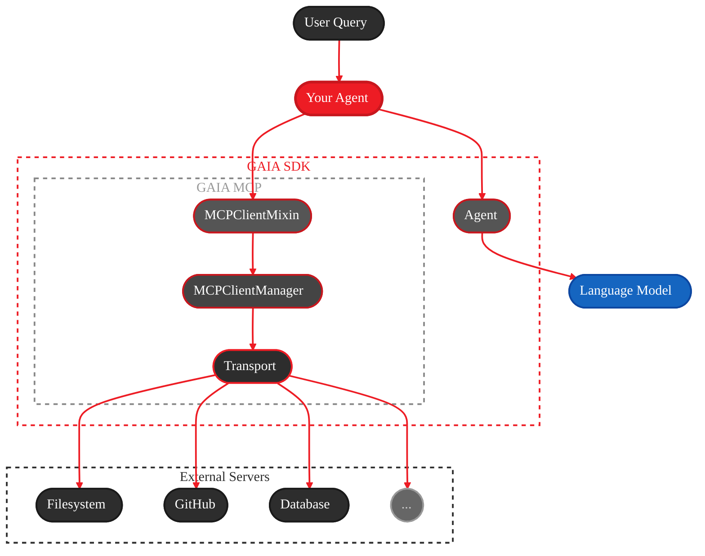

<Info>
  **Source Code:**
  - [`src/gaia/mcp/mixin.py`](https://github.com/amd/gaia/blob/main/src/gaia/mcp/mixin.py)
  - [`src/gaia/mcp/client/`](https://github.com/amd/gaia/blob/main/src/gaia/mcp/client)
</Info>

<Note>
**Import:** `from gaia.mcp import MCPClientMixin, MCPClient, MCPClientManager`
</Note>

**See also:** [API Specification](/spec/mcp-client) · [Windows System Health Agent](/guides/mcp/windows-system-health)

---

## What is MCP?

**MCP (Model Context Protocol)** is a universal connector that lets any AI application talk to any tool — a standard created by Anthropic. Instead of building custom integrations for each service, agents connect to MCP servers that expose tools like `read_file`, `create_issue`, or `query_database`.

```
Without MCP:  Agent → Custom Code → GitHub API
              Agent → Custom Code → Filesystem API
              Agent → Custom Code → Database API

With MCP:     Agent → MCP → Any Tool
```

GAIA agents act as **MCP clients** that connect to **MCP servers**. The `MCPClientMixin` adds this capability to any GAIA agent — mix it in, point it at a server, and that server's tools become available automatically.

<Tip>
**Learn More:** Visit [modelcontextprotocol.io](https://modelcontextprotocol.io/) for the full specification and ecosystem.
</Tip>

### Architecture



---

## Quick Start

<Steps>
  <Step title="Initialize MCP configuration">
    ```bash
    gaia init --profile mcp
    ```
    This creates `~/.gaia/mcp_servers.json` with an empty configuration.
  </Step>

  <Step title="Add an MCP server">
    ```bash
    gaia mcp add time "uvx mcp-server-time"
    ```
  </Step>

  <Step title="Use in your agent">
    ```python
    from gaia.agents.base.agent import Agent
    from gaia.mcp import MCPClientMixin

    class MyAgent(Agent, MCPClientMixin):
        def __init__(self, **kwargs):
            Agent.__init__(self, **kwargs)
            MCPClientMixin.__init__(self)  # Config auto-loaded

        def _get_system_prompt(self) -> str:
            return "You are a helpful assistant with access to MCP tools."

        def _register_tools(self) -> None:
            pass  # MCP tools are auto-registered by the mixin

    agent = MyAgent()
    result = agent.process_query("What time is it in Tokyo?")
    print(result.get("result", "No response"))
    ```
  </Step>

  <Step title="Test interactively">
    ```bash
    uv run examples/mcp_config_based_agent.py
    ```
    ```
    Connected to MCP servers: time
    Try: 'What time is it in Tokyo?' | Type 'quit' to exit.

    You: What time is it in Tokyo?
    Agent: The current time in Tokyo is 11:59 PM on Wednesday, January 28, 2026 (JST).
    ```
  </Step>
</Steps>

---

## Connect Multiple Servers

Connect to as many servers as needed. GAIA prefixes each tool with the server name (e.g., `mcp_filesystem_read_file`, `mcp_github_create_issue`) so tools from different servers never collide.

```python
class MultiToolAgent(Agent, MCPClientMixin):
    def __init__(self, **kwargs):
        super().__init__(**kwargs)
        self.connect_mcp_server("filesystem", {
            "command": "npx",
            "args": ["-y", "@modelcontextprotocol/server-filesystem", "/tmp"]
        })
        self.connect_mcp_server("github", {
            "command": "npx",
            "args": ["-y", "@modelcontextprotocol/server-github"],
            "env": {"GITHUB_TOKEN": "ghp_xxx"}
        })

agent = MultiToolAgent()
response = agent.process_query("List files in /tmp, then create a GitHub issue")
```

---

## Load from Config

A configuration file lets you manage MCP servers without changing agent code. On startup, GAIA automatically stacks two config files — one global default, one project-specific — so you never have to choose between them.

### Config stacking

GAIA loads configs in order of increasing priority:

| Priority | File | Purpose |
|----------|------|---------|
| 1 (base) | `~/.gaia/mcp_servers.json` | Global defaults — shared across all agents |
| 2 (override) | `./mcp_servers.json` | Project-specific — wins on any key conflict |

Both files are merged at startup. Servers defined in the local file override same-named entries from the global file. Servers defined only in one file are always included.

<Tip>
**Project config detection:** GAIA first checks the current working directory for `mcp_servers.json`. If not found there, it automatically checks the directory of the script being run (`__main__.__file__`). This means running `uv run examples/my_agent.py` from the repo root will pick up `examples/mcp_servers.json` without any extra configuration.
</Tip>

### Config file format

```json
{
  "mcpServers": {
    "filesystem": {
      "command": "npx",
      "args": ["-y", "@modelcontextprotocol/server-filesystem", "/tmp"]
    },
    "github": {
      "command": "npx",
      "args": ["-y", "@modelcontextprotocol/server-github"],
      "env": {
        "GITHUB_TOKEN": "ghp_xxx"
      }
    }
  }
}
```

<Tip>
The config format follows the [MCP client configuration](https://modelcontextprotocol.io/docs/develop/build-client#mcp-client-configuration) standard.
If you already have an MCP config from another client (e.g. Claude Desktop), you can copy it directly.
</Tip>

### Using config in your agent

By default, `MCPClientMixin.__init__()` auto-loads both config files:

```python
class ConfigAgent(Agent, MCPClientMixin):
    def __init__(self, **kwargs):
        Agent.__init__(self, **kwargs)
        MCPClientMixin.__init__(self)  # auto-loads global + local config

agent = ConfigAgent()
servers = agent.list_mcp_servers()
```

To load a specific config file instead (skips stacking):

```python
MCPClientMixin.__init__(self, config_file="/path/to/mcp_servers.json")
```

When `config_file` is provided, only that file is loaded — global and local stacking are disabled. Loading is always triggered when `config_file` is set, regardless of the `auto_load_config` flag.

### Popular Servers

<Tabs>
  <Tab title="Filesystem">
    ```python
    agent.connect_mcp_server("filesystem", {
        "command": "npx",
        "args": ["-y", "@modelcontextprotocol/server-filesystem", "/path/to/directory"]
    })
    ```
  </Tab>

  <Tab title="GitHub">
    ```python
    agent.connect_mcp_server("github", {
        "command": "npx",
        "args": ["-y", "@modelcontextprotocol/server-github"],
        "env": {"GITHUB_TOKEN": "ghp_your_token_here"}
    })
    ```
  </Tab>

  <Tab title="Python Servers">
    ```python
    agent.connect_mcp_server("time", {
        "command": "uvx",
        "args": ["mcp-server-time"]
    })
    ```
  </Tab>
</Tabs>

<Tip>
**Finding servers:** Browse the [MCP Server Hub on glama.ai](https://glama.ai/mcp/servers) or the [official MCP servers list](https://github.com/modelcontextprotocol/servers).
</Tip>

---

## Direct Client Usage

`MCPClient` is the lower-level building block for use outside of agents — in standalone scripts, test suites, or custom pipelines.

```python
from gaia.mcp.client import MCPClient

client = MCPClient.from_config("filesystem", {
    "command": "npx",
    "args": ["-y", "@modelcontextprotocol/server-filesystem", "/tmp"]
})

if client.connect():
    tools = client.list_tools()
    result = client.call_tool("read_file", {"path": "/tmp/example.txt"})
    client.disconnect()
```

<Note>
`MCPClient` only supports **stdio** transport (subprocess-based). HTTP and SSE transports are not supported at this time.
</Note>

---

## Error Handling

GAIA's MCP client uses a **return-value** error model rather than raising exceptions for expected failures.

```python
success = agent.connect_mcp_server("server", {
    "command": "npx",
    "args": ["-y", "@mcp/server"]
})
if not success:
    print("Connection failed")

client = agent.get_mcp_client("server")
result = client.call_tool("tool", {"arg": "value"})
if "error" in result:
    print(f"Tool failed: {result['error']}")
```

---

## API Reference

### MCPClientMixin

| Method | Description |
|--------|-------------|
| `connect_mcp_server(name, config)` | Connect and register tools. Returns `bool`. |
| `disconnect_mcp_server(name)` | Disconnect and unregister |
| `list_mcp_servers()` | List connected server names. Returns `list[str]`. |
| `get_mcp_client(name)` | Get client instance. Returns `MCPClient` or `None`. |
| `load_mcp_servers_from_config()` | Load from config file. Returns `int` (count). |

### MCPClient

| Method | Description |
|--------|-------------|
| `from_config(name, config)` | Create client from config dict |
| `from_command(name, command)` | Create client (legacy, shell string) |
| `connect()` | Connect to server. Returns `bool`. |
| `disconnect()` | Disconnect |
| `list_tools()` | List available tools (cached). Returns `list[MCPTool]`. |
| `call_tool(name, args)` | Execute a tool. Returns `dict`. |

---

## CLI Commands

```bash
gaia mcp add <name> "<command>"  # Add server
gaia mcp list                    # List servers
gaia mcp tools <name>            # List tools from server
gaia mcp test-client <name>      # Test connection
gaia mcp remove <name>           # Remove server
```

---

## Security

<Warning>
**Vet MCP servers before connecting.** Each server runs as a subprocess with access to your system.
</Warning>

1. **Review the source** — Only use servers from trusted sources with public repositories
2. **Check permissions** — Understand what system access the server requires
3. **Limit scope** — Restrict filesystem servers to specific directories rather than `/`
4. **Audit environment variables** — Never pass secrets to servers you haven't reviewed

---

## Troubleshooting

<AccordionGroup>
  <Accordion title="Connection fails with 'command not found'">
    The MCP server command (like `npx` or `uvx`) isn't in your PATH.

    ```bash
    # Check if npx is available
    which npx

    # If not, install Node.js via NVM
    # See Setup guide for instructions
    ```
  </Accordion>

  <Accordion title="Config file not found">
    `load_mcp_servers_from_config()` returns 0 servers. GAIA looks in three places:

    1. Current working directory (`./mcp_servers.json`)
    2. The script's own directory (e.g., `examples/mcp_servers.json` when running `uv run examples/agent.py`)
    3. Global config (`~/.gaia/mcp_servers.json`)

    Verify the files exist:
    ```bash
    cat ./mcp_servers.json        # Project config (CWD)
    cat ~/.gaia/mcp_servers.json  # Global config
    ```

    If running a script from a different directory (e.g., repo root), place `mcp_servers.json`
    in the same directory as the script — GAIA will find it automatically.
  </Accordion>

  <Accordion title="Tools not appearing in agent">
    1. Verify connection: `print(agent.list_mcp_servers())`
    2. List tools: `gaia mcp tools <server-name>`
    3. Enable debug: `import logging; logging.basicConfig(level=logging.DEBUG)`
  </Accordion>

  <Accordion title="Server process hangs or times out">
    Some servers need initialization time:
    ```python
    agent.connect_mcp_server("server", config, timeout=30)
    ```
    Test directly: `gaia mcp test-client <server-name>`
  </Accordion>
</AccordionGroup>

---

## Related

- [API Specification](/spec/mcp-client) — Complete API reference
- [Windows System Health Agent](/guides/mcp/windows-system-health) — Example MCP agent
- [CLI Reference](/reference/cli#mcp-client) — CLI commands

---

<small style="color: #666;">

Copyright(C) 2024-2026 Advanced Micro Devices, Inc. All rights reserved.

SPDX-License-Identifier: MIT

</small>
