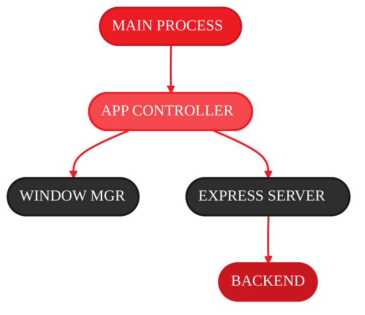
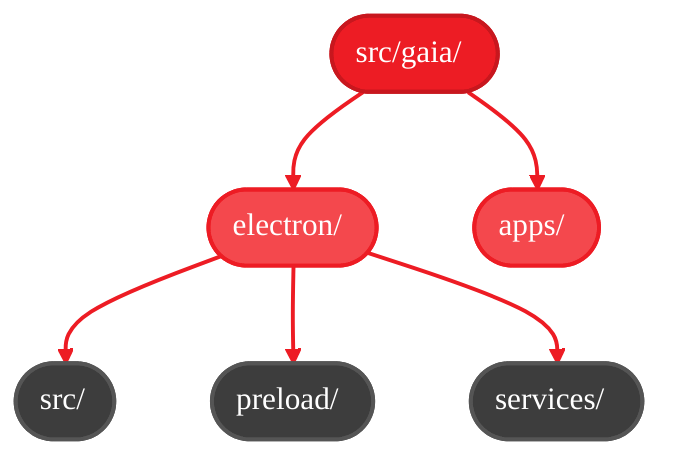

<Info>
  **Source Code:** [`src/gaia/electron/`](https://github.com/amd/gaia/blob/main/src/gaia/electron/)
</Info>

<Note>
**Component:** Electron Desktop App Framework
**Module:** `src/gaia/electron/`
</Note>
---

**Platform:** Cross-platform (Windows, Linux)
**Version:** Electron 31.0.0+

---

## Overview

The Electron Integration system provides a reusable framework for packaging GAIA web UI applications as standalone desktop apps. It abstracts Electron configuration, window management, and backend communication into a shared library that any GAIA app can use.

**Key Features:**
- Shared Electron framework (`@gaia/electron`)
- Multi-app support (Jira, Chat, Docker)
- Dynamic app loading via `app.config.json`
- Express backend integration
- MCP client communication
- Production/development modes

---

## Requirements

### Functional Requirements

1. **App Configuration System**
   - Load app metadata from `app.config.json`
   - Validate required fields (name, displayName, port)
   - Support custom window configurations
   - Environment-based configuration

2. **Window Management**
   - Create BrowserWindow with app-specific settings
   - Handle window lifecycle (ready, close, activate)
   - Support custom dimensions and behavior
   - Dev tools in development mode

3. **Backend Service**
   - Start Express server for static files
   - Proxy API requests to Python backend
   - CORS configuration
   - Health check endpoints

4. **IPC Communication**
   - Base IPC handlers (window control, navigation)
   - MCP client integration
   - Tool invocation from renderer
   - Result streaming

### Non-Functional Requirements

1. **Modularity**
   - Shared framework as npm package
   - App-specific customization
   - Clean separation of concerns

2. **Developer Experience**
   - Hot reload in dev mode
   - Clear error messages
   - Easy app creation workflow

3. **Production Readiness**
   - Optimized builds
   - Error handling
   - Logging and diagnostics

---

## System Architecture

### Component Diagram



| Component | File | Purpose |
|-----------|------|---------|
| **MAIN PROCESS** | `src/electron/src/main.js` | Electron entry point, app lifecycle |
| **APP CONTROLLER** | `app-controller.js` | Manages app initialization and cleanup |
| **WINDOW MGR** | `window-manager.js` | BrowserWindow creation and management |
| **EXPRESS SERVER** | Express.js | Serves static WebUI files, handles CORS |
| **BACKEND** | Services | MCP Client for tool invocation, IPC Handlers for renderer communication |

### Directory Structure



| Directory | Contents |
|-----------|----------|
| **electron/** | `package.json` (@gaia/electron metadata) |
| **electron/src/** | `main.js` (entry point), `app-controller.js` (lifecycle) |
| **electron/preload/** | `preload.js` (renderer context bridge) |
| **electron/services/** | `window-manager.js`, `base-ipc-handlers.js`, `mcp-client.js` |
| **apps/** | `jira/webui/`, `chat/webui/`, `docker/webui/` - each with `app.config.json` |

---

## API Specification

### app.config.json Schema

**Location:** `src/gaia/apps/{app_name}/webui/app.config.json`

```json
{
  "$schema": "http://json-schema.org/draft-07/schema#",
  "type": "object",
  "required": ["name", "displayName", "port"],
  "properties": {
    "name": {
      "type": "string",
      "description": "Internal app identifier (lowercase, no spaces)"
    },
    "displayName": {
      "type": "string",
      "description": "User-facing app name"
    },
    "port": {
      "type": "integer",
      "description": "Port for Express server (3000-9999)"
    },
    "window": {
      "type": "object",
      "properties": {
        "width": { "type": "integer", "default": 1200 },
        "height": { "type": "integer", "default": 800 },
        "minWidth": { "type": "integer" },
        "minHeight": { "type": "integer" },
        "resizable": { "type": "boolean", "default": true },
        "frame": { "type": "boolean", "default": true }
      }
    },
    "backend": {
      "type": "object",
      "properties": {
        "apiUrl": { "type": "string" },
        "mcpPort": { "type": "integer" },
        "healthCheck": { "type": "string" }
      }
    }
  }
}
```

**Example:** `src/gaia/apps/jira/webui/app.config.json`
```json
{
  "name": "jira",
  "displayName": "GAIA Jira Assistant",
  "port": 3001,
  "window": {
    "width": 1400,
    "height": 900,
    "minWidth": 1024,
    "minHeight": 768,
    "resizable": true
  },
  "backend": {
    "apiUrl": "http://localhost:8000/api/v1",
    "mcpPort": 8080,
    "healthCheck": "/health"
  }
}
```

### AppController API

**Class:** `AppController`

```javascript
class AppController {
  /**
   * Initialize app controller with configuration.
   *
   * @param {Object} config - App configuration from app.config.json
   * @param {string} appPath - Absolute path to app webui directory
   */
  constructor(config, appPath) {}

  /**
   * Initialize app services (window, server, IPC).
   * Called when Electron app is ready.
   *
   * @throws {Error} If initialization fails
   */
  initialize() {}

  /**
   * Clean up resources before app quit.
   * Stops servers, closes connections.
   */
  cleanup() {}

  /**
   * Get app configuration.
   *
   * @returns {Object} App config
   */
  getConfig() {}
}
```

### WindowManager API

**Class:** `WindowManager`

```javascript
class WindowManager {
  /**
   * Create main application window.
   *
   * @param {Object} config - Window configuration
   * @param {string} url - URL to load in window
   * @returns {BrowserWindow} Electron window instance
   */
  createMainWindow(config, url) {}

  /**
   * Get the main window instance.
   *
   * @returns {BrowserWindow|null}
   */
  getMainWindow() {}

  /**
   * Close all windows.
   */
  closeAll() {}
}
```

### IPC API (Renderer ↔ Main)

**Exposed to renderer via preload:**

```javascript
// In renderer (HTML/JS)
window.electronAPI = {
  // App info
  getAppInfo: () => Promise<{name, version, ...}>,

  // MCP communication
  invokeMCPTool: (toolName, args) => Promise<result>,

  // Window control
  minimizeWindow: () => void,
  maximizeWindow: () => void,
  closeWindow: () => void,

  // Navigation
  goBack: () => void,
  goForward: () => void,
  reload: () => void
};
```

### Environment Variables

```bash
# Required
GAIA_APP_NAME=jira|chat|docker  # App to launch

# Optional
GAIA_APP_MODE=production|development  # Run mode (default: production)
NODE_ENV=production|development  # Node environment
```

---

## Implementation Details

### App Loading Flow

```javascript
// src/electron/src/main.js

// 1. Get app name from environment
const APP_NAME = process.env.GAIA_APP_NAME || process.argv[2];

// 2. Find app directory
function findAppPath(appName) {
  const possiblePaths = [
    path.resolve(__dirname, '..', '..', 'apps', appName, 'webui'),
    path.resolve(process.cwd(), 'src', 'gaia', 'apps', appName, 'webui'),
  ];

  for (const appPath of possiblePaths) {
    if (fs.existsSync(path.join(appPath, 'app.config.json'))) {
      return appPath;
    }
  }
  return null;
}

// 3. Load app.config.json
const appConfig = JSON.parse(fs.readFileSync(appConfigPath, 'utf8'));

// 4. Initialize app controller
const appController = new AppController(appConfig, appPath);
app.whenReady().then(() => appController.initialize());
```

### Express Server Setup

```javascript
// app-controller.js

startExpressServer() {
  const express = require('express');
  const cors = require('cors');
  const app = express();

  // Middleware
  app.use(cors());
  app.use(express.json());
  app.use(express.static(this.appPath));

  // Health check
  app.get('/health', (req, res) => {
    res.json({ status: 'ok', app: this.config.name });
  });

  // Proxy to backend API
  app.all('/api/*', async (req, res) => {
    const backendUrl = this.config.backend.apiUrl + req.path;
    // Forward request...
  });

  // Start server
  this.server = app.listen(this.config.port, () => {
    console.log(`Server running on http://localhost:${this.config.port}`);
  });
}
```

### Window Creation

```javascript
// services/window-manager.js

createMainWindow(config, url) {
  const { width, height, minWidth, minHeight, resizable, frame } = config.window || {};

  this.mainWindow = new BrowserWindow({
    width: width || 1200,
    height: height || 800,
    minWidth: minWidth,
    minHeight: minHeight,
    resizable: resizable !== false,
    frame: frame !== false,
    webPreferences: {
      preload: path.join(__dirname, '..', 'preload', 'preload.js'),
      contextIsolation: true,
      nodeIntegration: false
    }
  });

  this.mainWindow.loadURL(url);

  if (process.env.GAIA_APP_MODE === 'development') {
    this.mainWindow.webContents.openDevTools();
  }

  return this.mainWindow;
}
```

### MCP Integration

```javascript
// services/mcp-client.js

class MCPClient {
  constructor(config) {
    this.apiUrl = config.backend.apiUrl;
    this.mcpPort = config.backend.mcpPort || 8080;
    this.baseUrl = `http://localhost:${this.mcpPort}/mcp`;
  }

  async invokeTool(toolName, args) {
    const response = await fetch(`${this.baseUrl}/tools/${toolName}`, {
      method: 'POST',
      headers: { 'Content-Type': 'application/json' },
      body: JSON.stringify(args)
    });

    if (!response.ok) {
      throw new Error(`MCP tool invocation failed: ${response.statusText}`);
    }

    return await response.json();
  }
}

// IPC handler
ipcMain.handle('mcp:invoke-tool', async (event, toolName, args) => {
  return await mcpClient.invokeTool(toolName, args);
});
```

---

## Testing Requirements

### Unit Tests

**File:** `tests/electron/test_app_config.js`

```javascript
const assert = require('assert');
const fs = require('fs');
const path = require('path');

describe('App Configuration', () => {
  it('should load valid app.config.json', () => {
    const configPath = path.join(__dirname, '../../src/gaia/apps/jira/webui/app.config.json');
    const config = JSON.parse(fs.readFileSync(configPath, 'utf8'));

    assert(config.name, 'name is required');
    assert(config.displayName, 'displayName is required');
    assert(config.port, 'port is required');
    assert(config.port >= 3000 && config.port < 10000, 'port must be 3000-9999');
  });

  it('should validate window configuration', () => {
    const config = {
      name: 'test',
      displayName: 'Test App',
      port: 3000,
      window: {
        width: 1200,
        height: 800,
        minWidth: 800
      }
    };

    assert(config.window.width >= config.window.minWidth, 'width must be >= minWidth');
  });
});
```

### Integration Tests

**File:** `tests/electron/test_app_launch.js`

```javascript
const { Application } = require('spectron');
const assert = require('assert');

describe('App Launch', function() {
  this.timeout(30000);

  let app;

  before(async () => {
    app = new Application({
      path: require('electron'),
      args: [path.join(__dirname, '../../src/gaia/electron/src/main.js')],
      env: { GAIA_APP_NAME: 'jira', GAIA_APP_MODE: 'development' }
    });

    await app.start();
  });

  after(async () => {
    if (app && app.isRunning()) {
      await app.stop();
    }
  });

  it('should open window', async () => {
    assert(await app.client.getWindowCount() === 1);
  });

  it('should load app URL', async () => {
    const url = await app.client.getUrl();
    assert(url.includes('localhost:3001'));
  });

  it('should have correct title', async () => {
    const title = await app.client.getTitle();
    assert(title.includes('GAIA Jira'));
  });
});
```

---

## Dependencies

```json
{
  "name": "@gaia/electron",
  "version": "1.0.0",
  "dependencies": {
    "cors": "^2.8.5",
    "dotenv": "^16.0.0",
    "electron-squirrel-startup": "^1.0.0",
    "express": "^4.18.2",
    "node-fetch": "^3.3.2"
  },
  "peerDependencies": {
    "electron": ">=28.0.0"
  },
  "devDependencies": {
    "electron": "^31.0.0",
    "spectron": "^19.0.0",
    "mocha": "^10.0.0"
  }
}
```

---

## Usage Examples

### Example 1: Create New Electron App

```bash
# 1. Create app directory structure
mkdir -p src/gaia/apps/myapp/webui

# 2. Create app.config.json
cat > src/gaia/apps/myapp/webui/app.config.json <<EOF
{
  "name": "myapp",
  "displayName": "My GAIA App",
  "port": 3005,
  "window": {
    "width": 1200,
    "height": 800
  },
  "backend": {
    "apiUrl": "http://localhost:8000/api/v1",
    "mcpPort": 8080
  }
}
EOF

# 3. Create index.html
cat > src/gaia/apps/myapp/webui/index.html <<EOF
<!DOCTYPE html>
<html>
<head>
  <title>My GAIA App</title>
</head>
<body>
  <h1>My GAIA App</h1>
  <script>
    window.electronAPI.getAppInfo().then(info => {
      console.log('App info:', info);
    });
  </script>
</body>
</html>
EOF

# 4. Launch app
cd src/gaia/electron
GAIA_APP_NAME=myapp npm start
```

### Example 2: Development Mode

```bash
# Run with dev tools
GAIA_APP_NAME=jira GAIA_APP_MODE=development npm start
```

### Example 3: Production Build

```bash
# Install electron-builder
npm install --save-dev electron-builder

# Build for Windows
npm run build:win

# Build for Linux
npm run build:linux
```

---

## Acceptance Criteria

- [ ] Shared Electron framework works across all apps
- [ ] Apps load configuration from `app.config.json`
- [ ] Express server serves static files
- [ ] Windows created with correct dimensions
- [ ] IPC communication functional
- [ ] MCP client can invoke tools
- [ ] Dev mode opens dev tools
- [ ] Production mode optimized
- [ ] Multiple apps supported (jira, chat, docker)
- [ ] Error handling graceful
- [ ] Cleanup on app quit
- [ ] Cross-platform compatibility

---

## Related Specifications

- [web-ui-packaging](/spec/web-ui-packaging) - Packaging system
- [mcp-server](/spec/mcp-server) - MCP server integration
- [jira-agent](/spec/jira-agent) - Example agent using Electron UI

---

*Electron Integration Technical Specification*

---

<small style="color: #666;">

**License**

Copyright(C) 2024-2025 Advanced Micro Devices, Inc. All rights reserved.

SPDX-License-Identifier: MIT

</small>