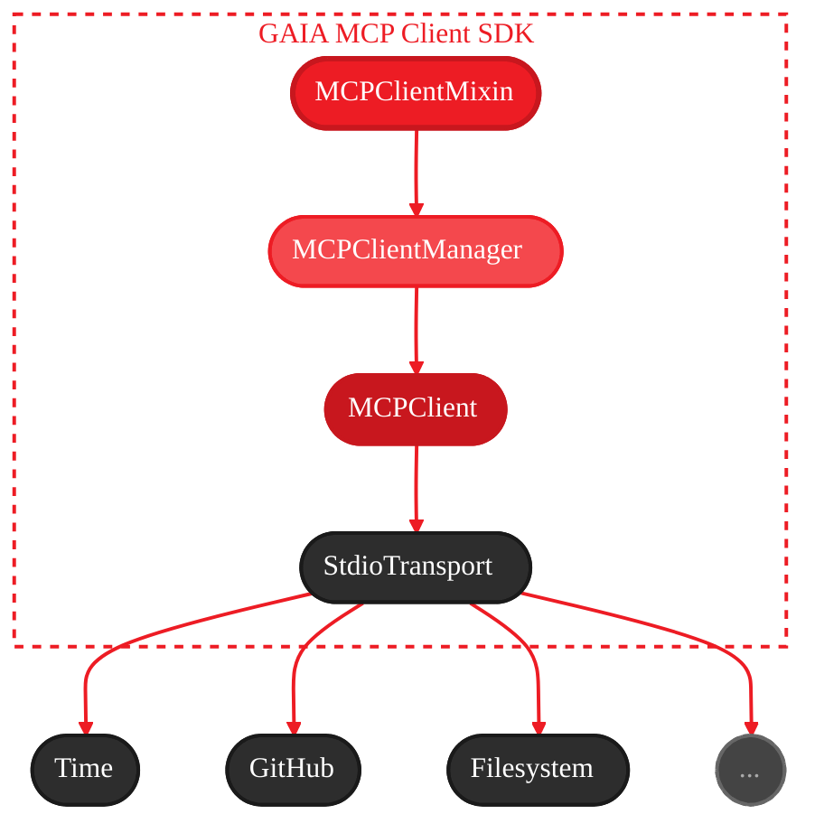
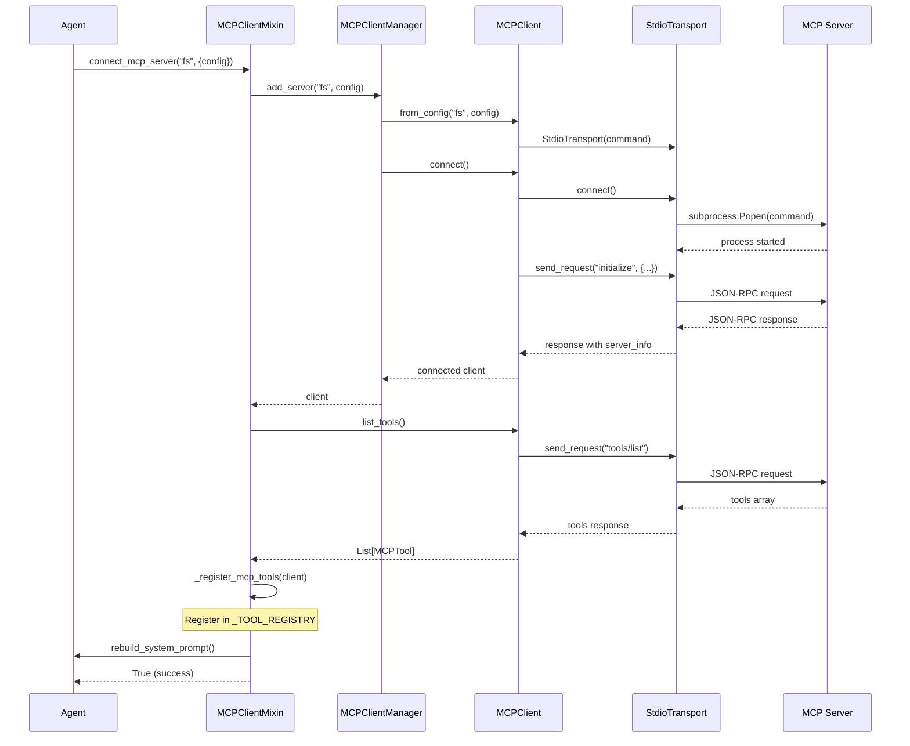

<Note>
🔧 **You are viewing:** API Specification - Complete technical reference

**See also:** [User Guide](/guides/mcp/client) · [Quick Reference](/sdk/sdks/mcp)
</Note>

<Info>
  **Source Code:**
  - [`src/gaia/mcp/mixin.py`](https://github.com/amd/gaia/blob/main/src/gaia/mcp/mixin.py) - Agent mixin
  - [`src/gaia/mcp/client/mcp_client.py`](https://github.com/amd/gaia/blob/main/src/gaia/mcp/client/mcp_client.py) - Core client
  - [`src/gaia/mcp/client/mcp_client_manager.py`](https://github.com/amd/gaia/blob/main/src/gaia/mcp/client/mcp_client_manager.py) - Connection manager
  - [`src/gaia/mcp/client/config.py`](https://github.com/amd/gaia/blob/main/src/gaia/mcp/client/config.py) - Configuration
  - [`src/gaia/mcp/client/transports/`](https://github.com/amd/gaia/blob/main/src/gaia/mcp/client/transports/) - Transport implementations
</Info>

<Note>
**Import:** `from gaia.mcp import MCPClientMixin, MCPClient, MCPClientManager`
</Note>

---

## Overview

The MCP Client enables GAIA agents to connect to and use tools from external MCP (Model Context Protocol) servers. This provides universal tool integration - any GAIA agent can use any MCP server's tools with zero code changes.

**Key Features:**

- **Universal Tool Access**: Connect to any stdio MCP server and use its tools
- **Automatic Tool Registration**: MCP tools automatically appear in agent's tool registry
- **Tool Namespacing**: Multiple servers with same tool names work without conflicts
- **Stdio Transport**: Support for subprocess-based MCP servers
- **Configuration Management**: Persistent server configurations
- **CLI Integration**: Simple command-line interface for managing connections
- **GAIA Response Wrapping**: Tool responses formatted with status/message/data fields

**Architecture Overview:**



---

## Requirements

### Functional Requirements

1. **Server Connection**
   - Connect to MCP servers via stdio (subprocess)
   - Initialize MCP protocol handshake (JSON-RPC 2.0)
   - Handle connection failures gracefully
   - Support configurable timeout (default: 30 seconds)

2. **Tool Discovery**
   - List all available tools from connected servers (`tools/list`)
   - Parse MCP tool schemas (JSON Schema format)
   - Convert MCP schemas to GAIA `_TOOL_REGISTRY` format
   - Cache tool schemas (refresh on demand)

3. **Tool Execution**
   - Call MCP tools with proper arguments (`tools/call`)
   - Handle tool responses and errors
   - Format validation errors with schema context
   - Wrap responses in GAIA-style format (status/message/data/instruction)

4. **Tool Registration**
   - Register MCP tools in agent's `_TOOL_REGISTRY`
   - Namespace tools by server name (prevent collisions)
   - Add server context to tool descriptions (`[MCP:servername]`)
   - Unregister tools when server disconnects

5. **Configuration Management**
   - Save server configurations to `~/.gaia/mcp_servers.json`
   - Load servers on startup
   - Support adding/removing servers via CLI and API

### Non-Functional Requirements

1. **Performance**
   - Minimal overhead for tool calls (`<50ms`)
   - Efficient subprocess management
   - Tool schema caching (avoid repeated `tools/list` calls)
   - Lazy loading of tools

2. **Reliability**
   - Process cleanup on disconnect (terminate, then kill after 5s)
   - Error recovery and logging
   - Graceful handling of dead processes
   - Connection state tracking

3. **Usability**
   - Simple mixin interface for agents
   - Clear CLI commands (`gaia mcp add/list/tools/remove`)
   - Helpful error messages with schema context
   - Debug mode for troubleshooting

---

## API Specification

### MCPClientMixin

The mixin class that adds MCP client capabilities to GAIA agents.

```python
class MCPClientMixin:
    """Mixin to add MCP client capabilities to agents.

    This mixin allows any agent to connect to MCP servers and use their tools.
    MCP tools are automatically registered in the agent's _TOOL_REGISTRY.

    The mixin initializes an MCPClientManager instance and provides convenience
    methods for server management and tool registration.

    Attributes:
        _mcp_manager (MCPClientManager): Internal manager for MCP connections

    Usage:
        class MyAgent(Agent, MCPClientMixin):
            def __init__(self, ...):
                super().__init__(...)
                self.connect_mcp_server("github", {
                    "command": "npx",
                    "args": ["-y", "@modelcontextprotocol/server-github"],
                    "env": {"GITHUB_TOKEN": "ghp_xxx"}
                })
    """
```

#### Constructor

```python
def __init__(self, *args, **kwargs):
    """Initialize the mixin.

    Creates an MCPClientManager instance. Inherits debug mode from agent if available.

    Args:
        *args: Passed to parent class
        **kwargs: Passed to parent class (debug: bool checked for manager)
    """
```

#### connect_mcp_server

```python
def connect_mcp_server(self, name: str, config: Dict) -> bool:
    """Connect to an MCP server and register its tools.

    This method:
    1. Adds the server via MCPClientManager
    2. Registers all tools from the server in _TOOL_REGISTRY
    3. Rebuilds the agent's system prompt (if rebuild_system_prompt exists)

    Args:
        name (str): Friendly name for the server. Used for namespacing tools
            (e.g., "filesystem" → tools become "mcp_filesystem_*")
        config (Dict): Server configuration dict with:
            - command (required): Base command to run (e.g., "npx", "uvx", "python")
            - args (optional): List of arguments to pass to the command
            - env (optional): Environment variables dict to pass to subprocess

    Returns:
        bool: True if connection and tool registration successful, False otherwise

    Raises:
        ValueError: If config is not a dict or missing 'command' field

    Example:
        >>> success = agent.connect_mcp_server("filesystem", {
        ...     "command": "npx",
        ...     "args": ["-y", "@modelcontextprotocol/server-filesystem", "/tmp"]
        ... })
        >>> if success:
        ...     print("Connected! Tools available.")

        # With environment variables:
        >>> agent.connect_mcp_server("github", {
        ...     "command": "npx",
        ...     "args": ["-y", "@modelcontextprotocol/server-github"],
        ...     "env": {"GITHUB_TOKEN": "ghp_xxx"}
        ... })
    """
```

#### load_mcp_servers_from_config

```python
def load_mcp_servers_from_config(self) -> int:
    """Load and register MCP servers from configuration file.

    This is a convenience method that:
    1. Loads servers from ~/.gaia/mcp_servers.json via the manager
    2. Registers all tools from loaded servers in _TOOL_REGISTRY
    3. Rebuilds system prompt once (after all servers loaded)

    Returns:
        int: Number of servers successfully loaded and registered

    Example:
        >>> agent = MyAgent()
        >>> count = agent.load_mcp_servers_from_config()
        >>> print(f"Loaded {count} MCP servers")
    """
```

#### disconnect_mcp_server

```python
def disconnect_mcp_server(self, name: str) -> None:
    """Disconnect from an MCP server and unregister its tools.

    This method:
    1. Unregisters all tools from the server from _TOOL_REGISTRY
    2. Disconnects and removes the server via MCPClientManager

    Args:
        name (str): Server name to disconnect

    Note:
        Logs a warning if server not found; does not raise an exception.
    """
```

#### list_mcp_servers

```python
def list_mcp_servers(self) -> List[str]:
    """List all connected MCP servers.

    Returns:
        List[str]: Server names currently connected
    """
```

#### get_mcp_client

```python
def get_mcp_client(self, name: str) -> MCPClient:
    """Get an MCP client by name.

    Args:
        name (str): Server name

    Returns:
        MCPClient: Client instance if exists, None otherwise
    """
```

#### _register_mcp_tools (Internal)

```python
def _register_mcp_tools(self, client: MCPClient) -> None:
    """Register all tools from an MCP server into _TOOL_REGISTRY.

    MCP tool responses are wrapped in GAIA-style format with
    status/message/data/instruction fields to help the LLM
    understand how to interpret and respond to the data.

    Response wrapping format:
    - Success: {"status": "success", "message": "...", "data": {...}, "instruction": "..."}
    - Error: {"status": "error", "error": "...", "data": {...}}
    - Non-dict responses: Passed through unchanged

    Args:
        client (MCPClient): MCPClient instance to register tools from
    """
```

#### _unregister_mcp_tools (Internal)

```python
def _unregister_mcp_tools(self, client: MCPClient) -> None:
    """Unregister all tools from an MCP server.

    Args:
        client (MCPClient): MCPClient instance to unregister tools from
    """
```

#### Quick Reference

| Method | Description | Returns |
|--------|-------------|---------|
| `connect_mcp_server(name, config)` | Connect to MCP server and register tools | `bool` |
| `disconnect_mcp_server(name)` | Disconnect and unregister tools | `None` |
| `list_mcp_servers()` | List connected servers | `List[str]` |
| `get_mcp_client(name)` | Get client by name | `MCPClient` |
| `load_mcp_servers_from_config()` | Load from config file | `int` |

---

### MCPClient

The client class for interacting with an MCP server.

```python
class MCPClient:
    """Client for interacting with an MCP server.

    Handles connection, tool discovery, and tool execution via the transport layer.

    Attributes:
        name (str): Friendly name for this server
        transport (MCPTransport): Transport implementation
        debug (bool): Debug logging enabled
        server_info (Dict[str, Any]): Server information from initialize response
    """
```

#### Constructor

```python
def __init__(self, name: str, transport: MCPTransport, debug: bool = False):
    """Create an MCP client with specified transport.

    Args:
        name (str): Friendly name for this server (used in tool namespacing)
        transport (MCPTransport): Transport implementation to use
        debug (bool): Enable debug logging (default: False)

    Attributes initialized:
        server_info: Empty dict (populated on connect)
        _tools: None (populated on list_tools)
    """
```

#### from_config (Class Method)

```python
@classmethod
def from_config(
    cls,
    name: str,
    config: Dict[str, Any],
    timeout: int = 30,
    debug: bool = False
) -> "MCPClient":
    """Create an MCP client from a config dict (Anthropic format).

    Factory method for the common case of subprocess-based MCP servers.
    Uses the same configuration format as Claude Desktop.

    Args:
        name (str): Friendly name for this server
        config (Dict[str, Any]): Server configuration dict with:
            - command (required): Base command to run (e.g., "npx", "uvx")
            - args (optional): List of arguments
            - env (optional): Environment variables dict
        timeout (int): Request timeout in seconds (default: 30)
        debug (bool): Enable debug logging (default: False)

    Returns:
        MCPClient: Configured client instance (not yet connected)

    Raises:
        ValueError: If config is missing required 'command' field

    Example:
        >>> client = MCPClient.from_config(
        ...     "filesystem",
        ...     {
        ...         "command": "npx",
        ...         "args": ["-y", "@modelcontextprotocol/server-filesystem", "/tmp"]
        ...     },
        ...     timeout=60,
        ...     debug=True
        ... )
        >>> client.connect()

        # With environment variables:
        >>> client = MCPClient.from_config(
        ...     "github",
        ...     {
        ...         "command": "npx",
        ...         "args": ["-y", "@modelcontextprotocol/server-github"],
        ...         "env": {"GITHUB_TOKEN": "ghp_xxx"}
        ...     }
        ... )
    """
```

#### from_command (Class Method - Legacy)

```python
@classmethod
def from_command(
    cls,
    name: str,
    command: str,
    timeout: int = 30,
    debug: bool = False
) -> "MCPClient":
    """Create an MCP client using stdio transport (legacy method).

    Note: Prefer from_config() for new code. This method uses shell string
    parsing which doesn't support environment variables or complex arguments.

    Args:
        name (str): Friendly name for this server
        command (str): Shell command to start the server
        timeout (int): Request timeout in seconds (default: 30)
        debug (bool): Enable debug logging (default: False)

    Returns:
        MCPClient: Configured client instance (not yet connected)
    """
```

#### connect

```python
def connect(self) -> bool:
    """Connect to the MCP server and initialize.

    This method:
    1. Establishes transport connection (starts subprocess)
    2. Sends MCP initialize request with client info
    3. Stores server_info from response

    Initialize request format:
        {
            "protocolVersion": "1.0.0",
            "clientInfo": {"name": "GAIA MCP Client", "version": "0.15.2"},
            "capabilities": {}
        }

    Returns:
        bool: True if connection and initialization successful

    Note:
        Disconnects automatically if initialization fails.
    """
```

#### disconnect

```python
def disconnect(self) -> None:
    """Disconnect from the MCP server.

    Disconnects transport and clears cached tools.
    """
```

#### is_connected

```python
def is_connected(self) -> bool:
    """Check if connected to server.

    Returns:
        bool: True if transport is connected
    """
```

#### list_tools

```python
def list_tools(self, refresh: bool = False) -> List[MCPTool]:
    """List all available tools from the server.

    Sends tools/list request and caches the result.

    Args:
        refresh (bool): Force refresh from server (default: False, uses cache)

    Returns:
        List[MCPTool]: Available tools (empty list on error)

    Note:
        First call fetches from server; subsequent calls return cached result
        unless refresh=True.
    """
```

#### call_tool

```python
def call_tool(self, tool_name: str, arguments: Dict[str, Any]) -> Dict[str, Any]:
    """Call a tool on the MCP server.

    Sends tools/call request and handles response.

    Args:
        tool_name (str): Name of the tool to call (original MCP name, not namespaced)
        arguments (Dict[str, Any]): Tool arguments

    Returns:
        Dict[str, Any]: Tool response. Format:
            - Success: {"content": [...], ...} (MCP result format)
            - Error: {"error": "error message"}

    Raises:
        RuntimeError: If not connected to server

    Note:
        Validation errors (code -32602) are enhanced with schema context.
    """
```

#### create_tool_wrapper

```python
def create_tool_wrapper(self, tool: MCPTool) -> Callable[..., Dict[str, Any]]:
    """Create a callable wrapper for an MCP tool.

    The wrapper accepts **kwargs to be compatible with GAIA's
    agent._execute_tool() which calls tool(**tool_args).

    Args:
        tool (MCPTool): MCPTool to wrap

    Returns:
        Callable[..., Dict[str, Any]]: Function that calls the MCP tool
            Signature: (**kwargs) -> Dict[str, Any]
    """
```

#### Quick Reference

| Method | Description | Returns |
|--------|-------------|---------|
| `from_config(name, config)` | Create client from config dict | `MCPClient` |
| `from_command(name, command)` | Create client (legacy, shell string) | `MCPClient` |
| `connect()` | Connect and initialize | `bool` |
| `disconnect()` | Disconnect | `None` |
| `is_connected()` | Check connection | `bool` |
| `list_tools(refresh=False)` | List available tools | `List[MCPTool]` |
| `call_tool(name, args)` | Execute tool | `Dict` |
| `create_tool_wrapper(tool)` | Create callable wrapper | `Callable` |

---

### MCPClientManager

The manager class for handling multiple MCP client connections.

```python
class MCPClientManager:
    """Manages multiple MCP client connections.

    Handles configuration loading/saving, connection management, and
    routing tool calls to the appropriate server.

    Attributes:
        config (MCPConfig): Configuration manager instance
        debug (bool): Debug logging enabled
        _clients (Dict[str, MCPClient]): Connected clients by name
    """
```

#### Constructor

```python
def __init__(self, config: Optional[MCPConfig] = None, debug: bool = False):
    """Create manager with optional configuration.

    Args:
        config (MCPConfig, optional): Configuration instance.
            Creates default MCPConfig if not provided.
        debug (bool): Enable debug logging (default: False)
    """
```

#### add_server

```python
def add_server(self, name: str, config: Dict) -> MCPClient:
    """Add and connect to an MCP server.

    This method:
    1. Creates an MCPClient from the config
    2. Connects to the server
    3. Stores the client
    4. Saves configuration to file

    Args:
        name (str): Friendly name for the server
        config (Dict): Server configuration dict with:
            - command (required): Base command to run
            - args (optional): List of arguments
            - env (optional): Environment variables dict

    Returns:
        MCPClient: Connected client instance

    Raises:
        ValueError: If server with this name already exists
        ValueError: If config is missing 'command' field
        RuntimeError: If connection fails

    Example:
        >>> client = manager.add_server("filesystem", {
        ...     "command": "npx",
        ...     "args": ["-y", "@modelcontextprotocol/server-filesystem", "/tmp"]
        ... })

        # With environment variables:
        >>> client = manager.add_server("github", {
        ...     "command": "npx",
        ...     "args": ["-y", "@modelcontextprotocol/server-github"],
        ...     "env": {"GITHUB_TOKEN": "ghp_xxx"}
        ... })
    """
```

#### remove_server

```python
def remove_server(self, name: str) -> None:
    """Remove and disconnect from an MCP server.

    This method:
    1. Disconnects the client
    2. Removes from internal storage
    3. Removes from configuration file

    Args:
        name (str): Name of the server to remove

    Note:
        Logs warning if server not found; does not raise exception.
    """
```

#### get_client

```python
def get_client(self, name: str) -> Optional[MCPClient]:
    """Get a client by name.

    Args:
        name (str): Server name

    Returns:
        MCPClient: Client instance if exists, None otherwise
    """
```

#### list_servers

```python
def list_servers(self) -> List[str]:
    """List all registered server names.

    Returns:
        List[str]: Server names (connected clients only)
    """
```

#### disconnect_all

```python
def disconnect_all(self) -> None:
    """Disconnect from all MCP servers.

    Iterates through all clients and disconnects. Logs errors but continues
    to disconnect remaining servers.
    """
```

#### load_from_config

```python
def load_from_config(self) -> None:
    """Load and connect to all servers from configuration.

    Reads servers from configuration file and attempts to connect to each.
    Skips servers that:
    - Are already connected
    - Have no command specified
    - Fail to connect (logs warning/error)

    Note:
        Does not raise exceptions; logs errors for individual failures.
    """
```

#### Quick Reference

| Method | Description | Returns |
|--------|-------------|---------|
| `add_server(name, config)` | Add and connect server | `MCPClient` |
| `remove_server(name)` | Remove and disconnect | `None` |
| `get_client(name)` | Get client | `Optional[MCPClient]` |
| `list_servers()` | List server names | `List[str]` |
| `load_from_config()` | Load from config file | `None` |
| `disconnect_all()` | Disconnect all servers | `None` |

---

### MCPConfig

Configuration manager for MCP servers.

```python
class MCPConfig:
    """Configuration manager for MCP servers.

    Stores server configurations in a JSON file for persistence.
    Auto-saves on modification.

    Attributes:
        config_file (Path): Path to configuration file
        _servers (Dict[str, Dict[str, Any]]): Server configurations

    File format (Anthropic-compatible):
        {
            "mcpServers": {
                "server_name": {
                    "command": "npx",
                    "args": ["-y", "@modelcontextprotocol/server-..."],
                    "env": {"TOKEN": "xxx"}  // optional
                }
            }
        }

    Note: Also supports legacy "servers" key for backwards compatibility.
    """
```

#### Constructor

```python
def __init__(self, config_file: str = None):
    """Create config manager.

    Args:
        config_file (str, optional): Path to configuration file.
            Default: ~/.gaia/mcp_servers.json

    Note:
        Creates ~/.gaia directory if it doesn't exist.
        Loads existing configuration on initialization.
    """
```

#### add_server

```python
def add_server(self, name: str, config: Dict[str, Any]) -> None:
    """Add or update a server configuration.

    Auto-saves to file after modification.

    Args:
        name (str): Server name
        config (Dict[str, Any]): Server configuration dictionary
            Required keys: "command" (str)
    """
```

#### remove_server

```python
def remove_server(self, name: str) -> None:
    """Remove a server configuration.

    Auto-saves to file after modification (if server existed).

    Args:
        name (str): Server name
    """
```

#### get_server

```python
def get_server(self, name: str) -> Dict[str, Any]:
    """Get a server configuration.

    Args:
        name (str): Server name

    Returns:
        Dict[str, Any]: Server configuration, or empty dict if not found
    """
```

#### get_servers

```python
def get_servers(self) -> Dict[str, Dict[str, Any]]:
    """Get all server configurations.

    Returns:
        Dict[str, Dict[str, Any]]: Copy of all server configurations
    """
```

#### server_exists

```python
def server_exists(self, name: str) -> bool:
    """Check if a server exists in configuration.

    Args:
        name (str): Server name

    Returns:
        bool: True if server exists
    """
```

#### Quick Reference

| Method | Description | Returns |
|--------|-------------|---------|
| `add_server(name, config)` | Add/update server config | `None` |
| `remove_server(name)` | Remove server config | `None` |
| `get_server(name)` | Get server config | `Dict` |
| `get_servers()` | Get all configs | `Dict` |
| `server_exists(name)` | Check if exists | `bool` |

---

### MCPTransport (Abstract Base Class)

Abstract base class for MCP transport implementations.

```python
class MCPTransport(ABC):
    """Abstract base class for MCP transport implementations.

    Transport layer handles the communication protocol between GAIA and MCP servers.
    Different implementations support different connection methods (stdio, HTTP, etc.).
    """
```

#### connect (Abstract)

```python
@abstractmethod
def connect(self) -> bool:
    """Establish connection to the MCP server.

    Returns:
        bool: True if connection successful, False otherwise
    """
```

#### disconnect (Abstract)

```python
@abstractmethod
def disconnect(self) -> None:
    """Close the connection to the MCP server."""
```

#### send_request (Abstract)

```python
@abstractmethod
def send_request(
    self, method: str, params: Dict[str, Any] = None
) -> Dict[str, Any]:
    """Send a JSON-RPC request to the server.

    Args:
        method (str): The JSON-RPC method name (e.g., "initialize", "tools/list")
        params (Dict[str, Any], optional): Parameters dictionary

    Returns:
        Dict[str, Any]: JSON-RPC response containing "result" or "error"

    Raises:
        RuntimeError: If connection is not established
        TimeoutError: If request times out
    """
```

#### is_connected (Abstract)

```python
@abstractmethod
def is_connected(self) -> bool:
    """Check if transport is currently connected.

    Returns:
        bool: True if connected, False otherwise
    """
```

---

### StdioTransport

Stdio-based transport using subprocess for MCP servers.

```python
class StdioTransport(MCPTransport):
    """Stdio-based transport using subprocess for MCP servers.

    This transport launches MCP servers as subprocesses and communicates
    via stdin/stdout using JSON-RPC messages.

    Attributes:
        command (str): Shell command to start server
        timeout (int): Request timeout in seconds
        debug (bool): Debug logging enabled
        _process (subprocess.Popen): Subprocess instance
        _request_id (int): Auto-incrementing request ID
    """
```

#### Constructor

```python
def __init__(self, command: str, timeout: int = 30, debug: bool = False):
    """Create stdio transport.

    Args:
        command (str): Shell command to start the MCP server
            Examples:
            - "npx @modelcontextprotocol/server-filesystem /tmp"
            - "python -m my_mcp_server"
        timeout (int): Request timeout in seconds (default: 30)
        debug (bool): Enable debug logging (default: False)
    """
```

#### connect

```python
def connect(self) -> bool:
    """Launch the MCP server subprocess.

    Uses subprocess.Popen with:
    - shell=True
    - stdin/stdout/stderr pipes
    - text mode with UTF-8 encoding
    - Line buffering (bufsize=1)

    Returns:
        bool: True if process started successfully

    Note:
        Returns True without starting new process if already connected.
    """
```

#### disconnect

```python
def disconnect(self) -> None:
    """Terminate the MCP server subprocess.

    Process cleanup sequence:
    1. Send SIGTERM
    2. Wait up to 5 seconds
    3. If still running, send SIGKILL
    4. Wait for process to exit

    Note:
        Safe to call multiple times; no-op if not connected.
    """
```

#### send_request

```python
def send_request(
    self, method: str, params: Dict[str, Any] = None
) -> Dict[str, Any]:
    """Send a JSON-RPC request via stdin and read response from stdout.

    Request format (JSON-RPC 2.0):
        {"jsonrpc": "2.0", "id": <int>, "method": <str>, "params": <dict>}

    Args:
        method (str): JSON-RPC method name
        params (Dict[str, Any], optional): Parameters dictionary

    Returns:
        Dict[str, Any]: JSON-RPC response

    Raises:
        RuntimeError: If not connected or process died
        ValueError: If response is invalid JSON
    """
```

#### is_connected

```python
def is_connected(self) -> bool:
    """Check if the subprocess is running.

    Returns:
        bool: True if process is alive (poll() returns None)
    """
```

---

### MCPTool

Data class representing an MCP tool with its schema.

```python
@dataclass
class MCPTool:
    """Represents an MCP tool with its schema.

    Attributes:
        name (str): Tool name from MCP server (e.g., "read_file")
        description (str): Tool description
        input_schema (Dict[str, Any]): MCP inputSchema (JSON Schema format)
    """

    name: str
    description: str
    input_schema: Dict[str, Any]
```

#### to_gaia_format

```python
def to_gaia_format(self, server_name: str) -> Dict[str, Any]:
    """Convert MCP tool schema to GAIA _TOOL_REGISTRY format.

    Conversion details:
    - Name: "mcp_{server_name}_{tool_name}"
    - Description: "[MCP:{server_name}] {description}"
    - Parameters: Converted from JSON Schema to GAIA format
    - Metadata: _mcp_server, _mcp_tool_name added

    Args:
        server_name (str): Name of the MCP server providing this tool

    Returns:
        Dict[str, Any]: GAIA tool registry entry (without function field)

    Example:
        MCP tool:
            {"name": "read_file", "description": "Read file", "inputSchema": {...}}

        GAIA format:
            {
                "name": "mcp_filesystem_read_file",
                "description": "[MCP:filesystem] Read file",
                "parameters": {...},
                "atomic": True,
                "_mcp_server": "filesystem",
                "_mcp_tool_name": "read_file"
            }
    """
```

---

## Implementation Details

### Connection Flow



### Tool Registration Pattern

MCP tools are converted from JSON Schema format to GAIA's tool registry format:

```python
# MCP tool format (from server)
{
    "name": "read_file",
    "description": "Read file contents",
    "inputSchema": {
        "type": "object",
        "properties": {
            "path": {"type": "string", "description": "File path"},
            "encoding": {"type": "string", "description": "Encoding"}
        },
        "required": ["path"]
    }
}

# GAIA tool format (in _TOOL_REGISTRY)
{
    "name": "mcp_filesystem_read_file",
    "description": "[MCP:filesystem] Read file contents",
    "parameters": {
        "path": {
            "type": "string",
            "required": True,
            "description": "File path"
        },
        "encoding": {
            "type": "string",
            "required": False,
            "description": "Encoding"
        }
    },
    "function": <wrapper_callable>,
    "atomic": True,
    "_mcp_server": "filesystem",
    "_mcp_tool_name": "read_file"
}
```

### Tool Namespacing

MCP tools are automatically namespaced to prevent collisions:

- **MCP Tool:** `read_file`
- **GAIA Tool:** `mcp_filesystem_read_file`
- **Description:** `[MCP:filesystem] Read file contents from disk`

This ensures multiple servers with the same tool name work correctly:

```python
# Both work without conflicts:
# - mcp_fs1_read_file → reads from filesystem
# - mcp_github_read_file → reads from GitHub
```

### GAIA Response Wrapping

Tool responses are wrapped in GAIA-style format to help the LLM interpret results:

```python
# Successful response
{
    "status": "success",
    "message": "Tool 'read_file' returned data",
    "data": {"content": [{"type": "text", "text": "file contents..."}]},
    "instruction": "Parse this JSON data and provide a human-readable summary. "
                   "Your answer must be a plain text string, not a JSON object."
}

# Error response
{
    "status": "error",
    "error": "File not found: /nonexistent",
    "data": {"error": "File not found: /nonexistent"}
}
```

### JSON-RPC Protocol

The MCP client uses JSON-RPC 2.0 for communication:

**Request format:**
```json
{
    "jsonrpc": "2.0",
    "id": 1,
    "method": "tools/call",
    "params": {
        "name": "read_file",
        "arguments": {"path": "/tmp/file.txt"}
    }
}
```

**Success response:**
```json
{
    "jsonrpc": "2.0",
    "id": 1,
    "result": {
        "content": [{"type": "text", "text": "file contents"}]
    }
}
```

**Error response:**
```json
{
    "jsonrpc": "2.0",
    "id": 1,
    "error": {
        "code": -32602,
        "message": "Invalid params: path is required"
    }
}
```

### Error Handling

Validation errors are enhanced with schema context:

```
MCP tool 'read_file' input validation failed.

Error details:
Invalid params: missing required parameter 'path'

Expected tool schema:
{
  "type": "object",
  "properties": {
    "path": {"type": "string", "description": "File path"},
    "encoding": {"type": "string", "description": "Encoding"}
  },
  "required": ["path"]
}

Your arguments:
{
  "encoding": "utf-8"
}
```

---

## Configuration

### Configuration File

Servers are saved to `~/.gaia/mcp_servers.json` using the Anthropic-compatible format:

```json
{
  "mcpServers": {
    "filesystem": {
      "command": "npx",
      "args": ["-y", "@modelcontextprotocol/server-filesystem", "/tmp"]
    },
    "github": {
      "command": "npx",
      "args": ["-y", "@modelcontextprotocol/server-github"],
      "env": {
        "GITHUB_TOKEN": "ghp_xxx"
      }
    },
    "time": {
      "command": "uvx",
      "args": ["mcp-server-time"]
    }
  }
}
```

This format is compatible with Claude Desktop and other Anthropic tools.

### Environment Variables

MCP servers may require environment variables. Pass them via the `env` field:

```python
agent.connect_mcp_server("github", {
    "command": "npx",
    "args": ["-y", "@modelcontextprotocol/server-github"],
    "env": {"GITHUB_TOKEN": "ghp_xxx"}
})
```

Or in the config file:

```json
{
  "mcpServers": {
    "github": {
      "command": "npx",
      "args": ["-y", "@modelcontextprotocol/server-github"],
      "env": {
        "GITHUB_TOKEN": "ghp_xxx"
      }
    }
  }
}
```

The `env` field passes variables directly to the subprocess without shell expansion, making it secure and portable.

---

## CLI Commands

```bash
# Add server (shell command string - converted to config format internally)
gaia mcp add <name> "<command>"

# Examples
gaia mcp add time "uvx mcp-server-time"
gaia mcp add filesystem "npx -y @modelcontextprotocol/server-filesystem /tmp"

# List servers
gaia mcp list

# List tools from a server
gaia mcp tools <name>

# Test connection
gaia mcp test-client <name>

# Remove server
gaia mcp remove <name>
```

The CLI accepts shell command strings for convenience and converts them to the config format internally.

See [CLI Reference](/reference/cli#mcp-client) for complete documentation.

---

## Testing Requirements

### Unit Tests

The MCP client has comprehensive unit tests in `tests/unit/mcp/client/`:

| Test File | Coverage |
|-----------|----------|
| `test_mcp_client.py` | MCPClient, MCPTool |
| `test_mcp_client_manager.py` | MCPClientManager |
| `test_transports.py` | StdioTransport, MCPTransport |
| `test_mcp_client_mixin.py` | MCPClientMixin |

### Running Tests

```bash
# Run all MCP client unit tests
python -m pytest tests/unit/mcp/client/ -v

# Run specific test file
python -m pytest tests/unit/mcp/client/test_mcp_client.py -v

# Run with coverage
python -m pytest tests/unit/mcp/client/ --cov=src/gaia/mcp/client
```

### Test Patterns

Tests use mocking to avoid requiring real MCP servers:

```python
@pytest.fixture
def mock_transport(mocker):
    """Create a mock transport."""
    transport = mocker.Mock(spec=MCPTransport)
    transport.connect.return_value = True
    transport.is_connected.return_value = True
    transport.send_request.return_value = {
        "result": {"tools": [{"name": "test_tool", "description": "Test", "inputSchema": {}}]}
    }
    return transport

def test_client_list_tools(mock_transport):
    client = MCPClient("test", mock_transport)
    client.connect()
    tools = client.list_tools()
    assert len(tools) == 1
    assert tools[0].name == "test_tool"
```

---

## Usage Examples

### Agent with Single MCP Server

```python
from gaia.agents.base.agent import Agent
from gaia.mcp import MCPClientMixin

class MyAgent(Agent, MCPClientMixin):
    def __init__(self, **kwargs):
        super().__init__(**kwargs)

        # Connect to filesystem MCP server
        self.connect_mcp_server("filesystem", {
            "command": "npx",
            "args": ["-y", "@modelcontextprotocol/server-filesystem", "/tmp"]
        })

# Use agent - MCP tools available immediately
agent = MyAgent()
result = agent.run("List all files in /tmp")
# LLM can now use: mcp_filesystem_read_file, mcp_filesystem_write_file, etc.
```

### Agent with Multiple MCP Servers

```python
from gaia.agents.base.agent import Agent
from gaia.mcp import MCPClientMixin

class MultiToolAgent(Agent, MCPClientMixin):
    def __init__(self, **kwargs):
        super().__init__(**kwargs)

        # Connect to multiple MCP servers
        self.connect_mcp_server("filesystem", {
            "command": "npx",
            "args": ["-y", "@modelcontextprotocol/server-filesystem", "/tmp"]
        })

        self.connect_mcp_server("github", {
            "command": "npx",
            "args": ["-y", "@modelcontextprotocol/server-github"],
            "env": {"GITHUB_TOKEN": "ghp_xxx"}
        })

# All tools from both servers are available
agent = MultiToolAgent()
response = agent.run("List files in /tmp, then create a GitHub issue about them")
```

### Loading Servers from Configuration

```python
from gaia.agents.base.agent import Agent
from gaia.mcp import MCPClientMixin

class ConfigAgent(Agent, MCPClientMixin):
    def __init__(self, **kwargs):
        super().__init__(**kwargs)

        # Load all servers from ~/.gaia/mcp_servers.json
        count = self.load_mcp_servers_from_config()
        print(f"Loaded {count} MCP servers")

agent = ConfigAgent()
servers = agent.list_mcp_servers()
print(f"Connected to: {', '.join(servers)}")
```

### Direct Client Usage (Without Agent)

```python
from gaia.mcp.client import MCPClient

# Create client from config
client = MCPClient.from_config(
    name="filesystem",
    config={
        "command": "npx",
        "args": ["-y", "@modelcontextprotocol/server-filesystem", "/tmp"]
    },
    timeout=30,
    debug=False
)

# Connect to server
if client.connect():
    # List available tools
    tools = client.list_tools()
    for tool in tools:
        print(f"- {tool.name}: {tool.description}")

    # Call tool directly
    result = client.call_tool("read_file", {"path": "/tmp/example.txt"})
    if "content" in result:
        print(result["content"][0]["text"])
    elif "error" in result:
        print(f"Error: {result['error']}")

    # Disconnect when done
    client.disconnect()
```

### Using MCPClientManager

```python
from gaia.mcp.client import MCPClientManager
from gaia.mcp.client.config import MCPConfig

# Create manager with config file
config = MCPConfig("~/.gaia/mcp_servers.json")
manager = MCPClientManager(config=config)

# Add servers programmatically
client = manager.add_server("filesystem", {
    "command": "npx",
    "args": ["-y", "@modelcontextprotocol/server-filesystem", "/tmp"]
})

# List all connected servers
servers = manager.list_servers()
print(f"Servers: {servers}")

# Get specific client
fs_client = manager.get_client("filesystem")
if fs_client and fs_client.is_connected():
    tools = fs_client.list_tools()
    print(f"Tools available: {len(tools)}")

# Load additional servers from config file
manager.load_from_config()

# Cleanup all connections
manager.disconnect_all()
```

### Error Handling

```python
from gaia.agents.base.agent import Agent
from gaia.mcp import MCPClientMixin

class SafeAgent(Agent, MCPClientMixin):
    def __init__(self, **kwargs):
        super().__init__(**kwargs)

        # Check connection success
        success = self.connect_mcp_server("filesystem", {
            "command": "npx",
            "args": ["-y", "@modelcontextprotocol/server-filesystem", "/tmp"]
        })

        if not success:
            print("Warning: Failed to connect to MCP server")
        else:
            print("Successfully connected to MCP server")

# Tool execution errors are returned in result
agent = SafeAgent()
client = agent.get_mcp_client("filesystem")
result = client.call_tool("read_file", {"path": "/nonexistent"})

if "error" in result:
    print(f"Tool failed: {result['error']}")
elif "content" in result:
    print(f"Success: {result['content']}")
```

### Debug Mode

Enable detailed logging:

```python
# Via MCPClient
client = MCPClient.from_config("server", {
    "command": "npx",
    "args": ["-y", "@mcp/server"]
}, debug=True)

# Via MCPClientManager
manager = MCPClientManager(debug=True)

# Via MCPClientMixin (in agent)
class DebugAgent(Agent, MCPClientMixin):
    def __init__(self, **kwargs):
        kwargs["debug"] = True  # Enables MCP debug logging
        super().__init__(**kwargs)
        self.connect_mcp_server("server", {
            "command": "npx",
            "args": ["-y", "@mcp/server"]
        })
```

---

## Related Documentation

- [MCP Client Guide](/guides/mcp/client) - User-facing guide for connecting to MCP servers
- [MCP SDK Quick Reference](/sdk/sdks/mcp) - Quick code snippets
- [MCP Server SDK](/sdk/infrastructure/mcp) - Build MCP servers
- [Agent System](/sdk/core/agent-system) - Agent framework
- [Tool Decorator](/sdk/core/tools) - GAIA tool system
- [CLI Reference](/reference/cli#mcp-client) - CLI commands

---

## Extension Points

### Custom Transport

To implement a custom transport (e.g., HTTP, WebSocket):

```python
from gaia.mcp.client.transports.base import MCPTransport

class HttpTransport(MCPTransport):
    def __init__(self, url: str, timeout: int = 30):
        self.url = url
        self.timeout = timeout
        self._connected = False

    def connect(self) -> bool:
        # Implement connection logic
        self._connected = True
        return True

    def disconnect(self) -> None:
        self._connected = False

    def send_request(self, method: str, params: Dict = None) -> Dict:
        # Implement HTTP request
        pass

    def is_connected(self) -> bool:
        return self._connected
```

### Custom Tool Wrapper

To customize how MCP tools are wrapped:

```python
# Override _register_mcp_tools in your agent
class CustomAgent(Agent, MCPClientMixin):
    def _register_mcp_tools(self, client: MCPClient) -> None:
        tools = client.list_tools()
        for tool in tools:
            gaia_tool = tool.to_gaia_format(client.name)

            # Custom wrapper with additional logic
            def custom_wrapper(tool=tool, **kwargs):
                result = client.call_tool(tool.name, kwargs)
                # Add custom processing
                return result

            gaia_tool["function"] = custom_wrapper
            _TOOL_REGISTRY[gaia_tool["name"]] = gaia_tool
```

---

<small style="color: #666;">

Copyright(C) 2024-2025 Advanced Micro Devices, Inc. All rights reserved.

SPDX-License-Identifier: MIT

</small>
