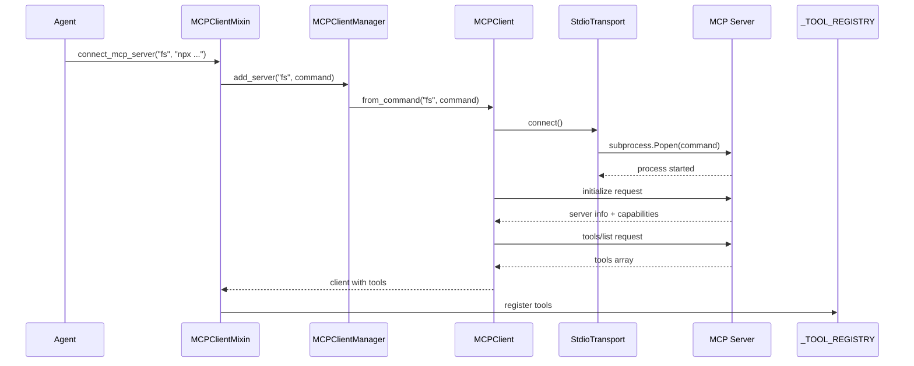

<Info>
**Source Code:** [`src/gaia/mcp/mixin.py`](https://github.com/amd/gaia/tree/main/src/gaia/mcp/mixin.py) · [`src/gaia/mcp/client/`](https://github.com/amd/gaia/tree/main/src/gaia/mcp/client)
</Info>

<Note>
- **Component:** MCP Client
- **Module:** `gaia.mcp.client`
- **Import:** `from gaia.mcp import MCPClient, MCPClientManager`
</Note>

## Overview

The MCP Client enables GAIA agents to connect to and use tools from external MCP (Model Context Protocol) servers. This provides universal tool integration - any GAIA agent can use any MCP server's tools with zero code changes.

### Key Features

- **Universal Tool Access**: Connect to any MCP server and use its tools
- **Automatic Tool Registration**: MCP tools automatically appear in agent's tool registry
- **Tool Namespacing**: Multiple servers with same tool names work without conflicts
- **Stdio Transport**: Support for subprocess-based MCP servers
- **Configuration Management**: Persistent server configurations
- **CLI Integration**: Simple command-line interface for managing connections

### Prerequisites

| Dependency | Required | Notes |
|------------|----------|-------|
| GAIA with MCP | Yes | `uv pip install -e ".[mcp]"` |
| Node.js 20.20.0 | Optional | Required for `npx`-based MCP servers (e.g., `npx -y @modelcontextprotocol/server-memory`). See [Setup Guide](/setup). |

## Requirements

### Functional Requirements

1. **Server Connection**
   - Connect to MCP servers via stdio (subprocess) or HTTP
   - Initialize MCP protocol handshake
   - Handle connection failures gracefully

2. **Tool Discovery**
   - List all available tools from connected servers
   - Parse MCP tool schemas (JSON Schema format)
   - Convert MCP schemas to GAIA format

3. **Tool Execution**
   - Call MCP tools with proper arguments
   - Handle tool responses and errors
   - Support both synchronous and streaming responses

4. **Tool Registration**
   - Register MCP tools in agent's `_TOOL_REGISTRY`
   - Namespace tools by server name (prevent collisions)
   - Add server context to tool descriptions

5. **Configuration Management**
   - Save server configurations persistently
   - Load servers on startup
   - Support adding/removing servers

### Non-Functional Requirements

1. **Performance**
   - Minimal overhead for tool calls (`<50ms`)
   - Efficient subprocess management
   - Tool schema caching

2. **Reliability**
   - Automatic reconnection on failure
   - Process cleanup on disconnect
   - Error recovery and logging

3. **Usability**
   - Simple mixin interface for agents
   - Clear CLI commands
   - Helpful error messages

## API Specification

### MCPClientMixin

```python
class MCPClientMixin:
    """Mixin to add MCP client capabilities to agents.

    Usage:
        class MyAgent(Agent, MCPClientMixin):
            def __init__(self, ...):
                super().__init__(...)
                self.connect_mcp_server("filesystem", "npx @modelcontextprotocol/server-filesystem")
    """

    def connect_mcp_server(
        self,
        name: str,
        command: str = None,
        config: Dict = None
    ) -> bool:
        """Connect to an MCP server and register its tools.

        Args:
            name: Friendly name for the server
            command: Shell command to start server (for stdio)
            config: Optional server configuration dict

        Returns:
            bool: True if connection and tool registration successful
        """

    def disconnect_mcp_server(self, name: str) -> None:
        """Disconnect from an MCP server and unregister its tools."""

    def list_mcp_servers(self) -> List[str]:
        """List all connected MCP servers."""

    def get_mcp_client(self, name: str) -> MCPClient:
        """Get an MCP client by name."""
```

### MCPClient

```python
class MCPClient:
    """Client for interacting with an MCP server."""

    def __init__(self, name: str, transport: MCPTransport, debug: bool = False):
        """Create an MCP client with specified transport."""

    @classmethod
    def from_command(
        cls,
        name: str,
        command: str,
        timeout: int = 30,
        debug: bool = False
    ) -> "MCPClient":
        """Create an MCP client using stdio transport."""

    def connect(self) -> bool:
        """Connect to the MCP server and initialize."""

    def disconnect(self) -> None:
        """Disconnect from the MCP server."""

    def is_connected(self) -> bool:
        """Check if connected to server."""

    def list_tools(self, refresh: bool = False) -> List[MCPTool]:
        """List all available tools from the server."""

    def call_tool(self, tool_name: str, arguments: Dict[str, Any]) -> Dict[str, Any]:
        """Call a tool on the MCP server."""

    def create_tool_wrapper(self, tool: MCPTool) -> Callable:
        """Create a callable wrapper for an MCP tool."""
```

### MCPClientManager

```python
class MCPClientManager:
    """Manages multiple MCP client connections."""

    def __init__(self, config: Optional[MCPConfig] = None, debug: bool = False):
        """Create manager with optional configuration."""

    def add_server(
        self,
        name: str,
        command: str = None,
        config: Dict = None
    ) -> MCPClient:
        """Add and connect to an MCP server."""

    def remove_server(self, name: str) -> None:
        """Remove and disconnect from an MCP server."""

    def get_client(self, name: str) -> Optional[MCPClient]:
        """Get a client by name."""

    def list_servers(self) -> List[str]:
        """List all registered server names."""

    def disconnect_all(self) -> None:
        """Disconnect from all MCP servers."""

    def load_from_config(self) -> None:
        """Load and connect to all servers from configuration."""
```

### MCPTool

```python
@dataclass
class MCPTool:
    """Represents an MCP tool with its schema."""

    name: str
    description: str
    input_schema: Dict[str, Any]

    def to_gaia_format(self, server_name: str) -> Dict[str, Any]:
        """Convert MCP tool schema to GAIA _TOOL_REGISTRY format."""
```

### Transport Layer

```python
class MCPTransport(ABC):
    """Abstract base class for MCP transport implementations."""

    @abstractmethod
    def connect(self) -> bool:
        """Establish connection to the MCP server."""

    @abstractmethod
    def disconnect(self) -> None:
        """Close the connection to the MCP server."""

    @abstractmethod
    def send_request(self, method: str, params: Dict = None) -> Dict:
        """Send a JSON-RPC request to the server."""

    @abstractmethod
    def is_connected(self) -> bool:
        """Check if transport is currently connected."""


class StdioTransport(MCPTransport):
    """Stdio-based transport using subprocess for MCP servers."""

    def __init__(self, command: str, timeout: int = 30, debug: bool = False):
        """Create stdio transport with command and timeout."""
```

### Configuration

```python
class MCPConfig:
    """Configuration manager for MCP servers."""

    def __init__(self, config_file: str = None):
        """Create config manager (default: ~/.gaia/mcp_servers.json)."""

    def add_server(self, name: str, config: Dict[str, Any]) -> None:
        """Add or update a server configuration."""

    def remove_server(self, name: str) -> None:
        """Remove a server configuration."""

    def get_server(self, name: str) -> Dict[str, Any]:
        """Get a server configuration."""

    def get_servers(self) -> Dict[str, Dict[str, Any]]:
        """Get all server configurations."""

    def server_exists(self, name: str) -> bool:
        """Check if a server exists in configuration."""
```

## Implementation Details

### Connection Flow



### Tool Registration Pattern

```python
# MCP tool format (from server)
{
    "name": "read_file",
    "description": "Read file contents",
    "inputSchema": {
        "type": "object",
        "properties": {
            "path": {"type": "string", "description": "File path"},
            "encoding": {"type": "string", "description": "Encoding"}
        },
        "required": ["path"]
    }
}

# GAIA tool format (in _TOOL_REGISTRY)
{
    "name": "mcp_filesystem_read_file",
    "description": "[MCP:filesystem] Read file contents",
    "parameters": {
        "path": {
            "type": "string",
            "required": True,
            "description": "File path"
        },
        "encoding": {
            "type": "string",
            "required": False,
            "description": "Encoding"
        }
    },
    "function": <wrapper_callable>,
    "atomic": True,
    "_mcp_server": "filesystem",
    "_mcp_tool_name": "read_file"
}
```

## Testing Requirements

### Unit Tests

```python
# Test tool conversion
def test_converts_mcp_to_gaia_format():
    tool = MCPTool(
        name="test",
        description="Test tool",
        input_schema={
            "type": "object",
            "properties": {"param": {"type": "string"}},
            "required": ["param"]
        }
    )

    gaia_format = tool.to_gaia_format("server")

    assert gaia_format["name"] == "mcp_server_test"
    assert gaia_format["parameters"]["param"]["required"] is True

# Test client connection
@patch("subprocess.Popen")
def test_client_connects_to_server(mock_popen):
    mock_process = Mock()
    mock_process.poll.return_value = None
    mock_popen.return_value = mock_process

    transport = StdioTransport("echo test")
    assert transport.connect() is True
    assert transport.is_connected() is True

# Test tool registration
def test_mixin_registers_tools_in_registry():
    agent = MockAgent()
    agent.connect_mcp_server("test", "python -m gaia.testing.mcp_test_server")

    assert "mcp_test_echo" in _TOOL_REGISTRY
    assert "[MCP:test]" in _TOOL_REGISTRY["mcp_test_echo"]["description"]
```

### Integration Tests

```python
# Test with real MCP test server
def test_end_to_end_tool_call(initialized_mcp_server):
    result = initialized_mcp_server.call_tool("echo", {"message": "hello"})
    assert "hello" in result["content"][0]["text"]

# Test multiple server connections
def test_multiple_servers_namespace_correctly():
    agent = MockAgent()
    agent.connect_mcp_server("server1", "python -m gaia.testing.mcp_test_server")
    agent.connect_mcp_server("server2", "python -m gaia.testing.mcp_test_server")

    assert "mcp_server1_echo" in _TOOL_REGISTRY
    assert "mcp_server2_echo" in _TOOL_REGISTRY
```

## Usage Examples

### Example 1: Basic Agent with MCP Client

```python
from gaia.agents.base.agent import Agent
from gaia.mcp import MCPClientMixin

class MyAgent(Agent, MCPClientMixin):
    def __init__(self, **kwargs):
        super().__init__(**kwargs)

        # Connect to filesystem MCP server
        self.connect_mcp_server(
            "filesystem",
            "npx @modelcontextprotocol/server-filesystem /tmp"
        )

# Create and use agent
agent = MyAgent()

# MCP tools are now available in the agent's tool registry
# The LLM can automatically use them
response = agent.run("Read the contents of /tmp/example.txt")
```

### Example 2: Multiple MCP Servers

```python
class MultiToolAgent(Agent, MCPClientMixin):
    def __init__(self, **kwargs):
        super().__init__(**kwargs)

        # Connect to multiple MCP servers
        self.connect_mcp_server(
            "filesystem",
            "npx @modelcontextprotocol/server-filesystem /tmp"
        )

        self.connect_mcp_server(
            "github",
            "npx @modelcontextprotocol/server-github"
        )

        self.connect_mcp_server(
            "slack",
            "npx @modelcontextprotocol/server-slack"
        )

# Agent now has tools from all three servers
agent = MultiToolAgent()
response = agent.run("List files in /tmp, then create a GitHub issue about them")
```

### Example 3: Manual Tool Discovery

```python
agent = MyAgent()

# List connected servers
servers = agent.list_mcp_servers()
print(f"Connected to: {servers}")

# Get specific client
fs_client = agent.get_mcp_client("filesystem")

# List available tools
tools = fs_client.list_tools()
for tool in tools:
    print(f"- {tool.name}: {tool.description}")

# Call tool directly
result = fs_client.call_tool("read_file", {"path": "/tmp/example.txt"})
print(result)
```

### Example 4: CLI Usage

```bash
# Add an MCP server
gaia mcp add filesystem "npx @modelcontextprotocol/server-filesystem /tmp"

# List configured servers
gaia mcp list

# List tools from a server
gaia mcp tools filesystem

# Test connection
gaia mcp test-client filesystem

# Remove a server
gaia mcp remove filesystem
```

---